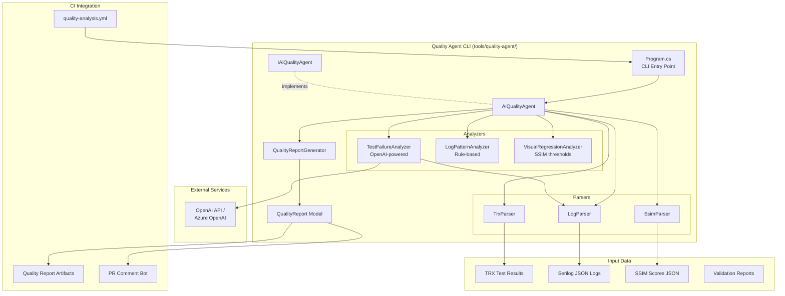

# Design Document

## Overview

The AI Quality Agent system provides intelligent, automated quality assessment by analyzing test results, logs, visual regressions, and validation reports. The design follows a pipeline architecture: data collection (parsers) → analysis (AI + pattern detection) → report generation. The system uses OpenAI/Azure OpenAI for root cause hypothesis generation and structured outputs via JSON Schema.

## Steering Document Alignment

### Technical Standards (tech.md)

**OpenAI API / Azure OpenAI**: LLM integration for quality analysis with structured outputs enforcing JSON Schema.

**Serilog Structured Logging**: Parse JSON logs for pattern detection and correlation ID tracking.

**FluentResults**: All operations return `Result<T>` for type-safe error handling.

**Dependency Injection**: All components registered in DI container for testability.

### Project Structure (structure.md)

**FluentPDF.QualityAgent**: New console application in `tools/quality-agent/`

**File Organization**:
- `tools/quality-agent/Program.cs` - CLI entry point
- `tools/quality-agent/Services/IAiQualityAgent.cs` - Main service interface
- `tools/quality-agent/Services/AiQualityAgent.cs` - Orchestration service
- `tools/quality-agent/Parsers/TrxParser.cs` - TRX file parser
- `tools/quality-agent/Parsers/LogParser.cs` - Serilog JSON parser
- `tools/quality-agent/Parsers/SsimParser.cs` - SSIM results parser
- `tools/quality-agent/Analyzers/TestFailureAnalyzer.cs` - AI-powered test analysis
- `tools/quality-agent/Analyzers/LogPatternAnalyzer.cs` - Log pattern detection
- `tools/quality-agent/Analyzers/VisualRegressionAnalyzer.cs` - SSIM analysis
- `tools/quality-agent/Reporting/QualityReportGenerator.cs` - Report generation
- `schemas/quality-report.schema.json` - JSON Schema for reports

## Code Reuse Analysis

### Existing Components to Leverage

- **Result<T> + PdfError**: Quality agent uses same error handling patterns
- **Serilog Configuration**: Parse logs in same JSON format as application logs
- **TRX Files from CI**: Quality agent analyzes test results from dotnet test
- **Validation Reports**: Integrate ValidationReport from PDF validation integration

### Integration Points

- **CI Workflows**: Quality agent runs in quality-analysis.yml workflow
- **Artifacts**: Quality reports uploaded alongside test results and validation reports
- **PR Comments**: Quality agent posts summary to PR via GitHub API

## Architecture



## Components and Interfaces

### Component 1: IAiQualityAgent (Service Interface)

- **Purpose:** Main service contract for quality analysis
- **Location:** `tools/quality-agent/Services/IAiQualityAgent.cs`
- **Methods:**
  ```csharp
  public interface IAiQualityAgent
  {
      Task<Result<QualityReport>> AnalyzeAsync(AnalysisInput input);
  }

  public class AnalysisInput
  {
      public string? TrxFilePath { get; init; }
      public string? LogDirectory { get; init; }
      public string? VisualResultsPath { get; init; }
      public string? ValidationResultsPath { get; init; }
  }
  ```

### Component 2: TrxParser

- **Purpose:** Parse xUnit/NUnit TRX test result files
- **Location:** `tools/quality-agent/Parsers/TrxParser.cs`
- **Implementation:**
  ```csharp
  public class TrxParser
  {
      public Result<TestResults> Parse(string trxFilePath)
      {
          var doc = XDocument.Load(trxFilePath);
          var ns = doc.Root.Name.Namespace;

          var results = new TestResults
          {
              Total = doc.Descendants(ns + "UnitTestResult").Count(),
              Passed = doc.Descendants(ns + "UnitTestResult")
                  .Count(r => r.Attribute("outcome")?.Value == "Passed"),
              Failed = doc.Descendants(ns + "UnitTestResult")
                  .Count(r => r.Attribute("outcome")?.Value == "Failed"),
              Failures = doc.Descendants(ns + "UnitTestResult")
                  .Where(r => r.Attribute("outcome")?.Value == "Failed")
                  .Select(r => new TestFailure
                  {
                      TestName = r.Attribute("testName")?.Value,
                      ErrorMessage = r.Element(ns + "Output")?.Element(ns + "ErrorInfo")
                          ?.Element(ns + "Message")?.Value,
                      StackTrace = r.Element(ns + "Output")?.Element(ns + "ErrorInfo")
                          ?.Element(ns + "StackTrace")?.Value
                  })
                  .ToList()
          };

          return Result.Ok(results);
      }
  }
  ```

### Component 3: LogParser

- **Purpose:** Parse Serilog structured JSON logs
- **Location:** `tools/quality-agent/Parsers/LogParser.cs`
- **Implementation:** Read JSON log files line-by-line, deserialize to LogEntry, group by correlation ID

### Component 4: TestFailureAnalyzer

- **Purpose:** AI-powered test failure root cause analysis
- **Location:** `tools/quality-agent/Analyzers/TestFailureAnalyzer.cs`
- **Implementation:**
  ```csharp
  public class TestFailureAnalyzer
  {
      private readonly OpenAIClient _openAiClient;

      public async Task<Result<RootCauseHypothesis>> AnalyzeFailureAsync(
          TestFailure failure, List<LogEntry> relatedLogs)
      {
          var prompt = BuildPrompt(failure, relatedLogs);

          var response = await _openAiClient.GetChatCompletionsAsync(
              new ChatCompletionsOptions
              {
                  Messages = {
                      new ChatMessage(ChatRole.System, "You are a quality analyst..."),
                      new ChatMessage(ChatRole.User, prompt)
                  },
                  ResponseFormat = new ResponseFormat
                  {
                      Type = "json_schema",
                      JsonSchema = RootCauseSchema
                  }
              });

          var hypothesis = JsonSerializer.Deserialize<RootCauseHypothesis>(
              response.Choices[0].Message.Content);

          return Result.Ok(hypothesis);
      }
  }
  ```

### Component 5: LogPatternAnalyzer

- **Purpose:** Detect patterns and anomalies in application logs
- **Location:** `tools/quality-agent/Analyzers/LogPatternAnalyzer.cs`
- **Analysis:**
  - Error rate spikes (compare to baseline)
  - Repeated exceptions (group by stack trace hash)
  - Performance warnings (operations exceeding thresholds)
  - Missing correlation IDs

### Component 6: VisualRegressionAnalyzer

- **Purpose:** Analyze SSIM scores and detect visual regressions
- **Location:** `tools/quality-agent/Analyzers/VisualRegressionAnalyzer.cs`
- **Thresholds:**
  - SSIM < 0.99: Minor regression
  - SSIM < 0.97: Major regression
  - SSIM < 0.95: Critical regression

### Component 7: QualityReportGenerator

- **Purpose:** Generate JSON quality reports from analysis results
- **Location:** `tools/quality-agent/Reporting/QualityReportGenerator.cs`
- **Report Structure:**
  ```csharp
  public class QualityReport
  {
      public string Summary { get; init; }
      public int OverallScore { get; init; } // 0-100
      public string Status { get; init; } // Pass, Warn, Fail
      public BuildInfo BuildInfo { get; init; }
      public AnalysisDetails Analysis { get; init; }
      public List<RootCauseHypothesis> RootCauseHypotheses { get; init; }
      public List<string> Recommendations { get; init; }
  }
  ```

### Component 8: CLI Program

- **Purpose:** Command-line interface for quality agent
- **Location:** `tools/quality-agent/Program.cs`
- **Arguments:** --trx-file, --log-dir, --visual-results, --validation-results, --output
- **Exit Codes:** 0 (Pass), 1 (Warn), 2 (Fail)

## Error Handling

### Error Scenarios

1. **OpenAI API Failure**
   - **Handling:** Retry with exponential backoff (3 attempts), fallback to rule-based analysis
   - **User Impact:** Report includes "[Rule-based]" prefix, lower confidence scores

2. **TRX Parsing Error**
   - **Handling:** Return Result.Fail with XML parsing error details
   - **User Impact:** CLI shows clear error: "Failed to parse TRX file: {error}"

3. **Log File Not Found**
   - **Handling:** Skip log analysis, continue with other inputs
   - **User Impact:** Report includes warning: "Log analysis skipped (files not found)"

4. **JSON Schema Validation Failure**
   - **Handling:** Log schema validation errors, include in report metadata
   - **User Impact:** Report still generated, validation errors logged

## Testing Strategy

### Unit Testing

**QualityAgent.Tests/Parsers/TrxParserTests.cs**: Test TRX parsing with sample files (passed tests, failed tests, skipped tests)

**QualityAgent.Tests/Analyzers/LogPatternAnalyzerTests.cs**: Test pattern detection with mock log entries

### Integration Testing

**QualityAgent.Tests/Integration/E2EAnalysisTests.cs**: End-to-end test with real TRX, logs, SSIM results

## Future Enhancements

- **Quality Dashboard**: Web UI showing quality trends over time
- **Custom Rules**: User-defined quality checks and thresholds
- **Slack/Teams Integration**: Post quality reports to team channels
- **Historical Trending**: Track quality metrics across commits
