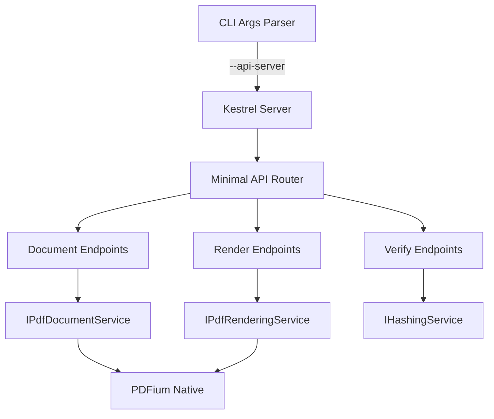

# Design Document: Autonomous Verification API

## Overview

This design adds a lightweight REST API server embedded within FluentPDF.App that exposes PDF rendering capabilities for autonomous verification. The server uses ASP.NET Core minimal APIs, runs headlessly when invoked via CLI, and reuses existing rendering services without code duplication.

## Steering Document Alignment

### Technical Standards (tech.md)
- **Layered Architecture**: API layer sits above existing Application Layer, calls services via DI
- **Result Pattern**: All service calls use FluentResults, API translates to HTTP status codes
- **Dependency Injection**: Uses Microsoft.Extensions.DependencyInjection (already configured)
- **Structured Logging**: Uses Serilog with correlation IDs for all API requests
- **OpenTelemetry**: API endpoints instrumented for distributed tracing

### Project Structure (structure.md)
- New files in `src/FluentPDF.App/Api/` directory
- Controllers follow naming: `DocumentApiController.cs`, `RenderApiController.cs`
- Models in `src/FluentPDF.App/Api/Models/`
- Follows existing pattern: interface + implementation

## Code Reuse Analysis

### Existing Components to Leverage
- **IPdfDocumentService**: Document loading, page count, metadata (no changes needed)
- **IPdfRenderingService**: Page rendering to PNG stream (no changes needed)
- **RenderingCoordinator**: Fallback strategy orchestration (reuse for API)
- **PdfError**: Structured error codes (map to HTTP responses)
- **Serilog Logger**: Existing logging infrastructure

### Integration Points
- **App.xaml.cs DI Container**: Register API services alongside existing services
- **CLI Argument Parser**: Add `--api-server`, `--port`, `--headless` flags
- **Existing RenderingService**: Direct injection, no wrapper needed

## Architecture

The API server is an optional component that can be activated via CLI flag. It runs in-process with WinUI app (or headlessly) and shares the same DI container.



## Components and Interfaces

### Component 1: VerificationApiServer
- **Purpose:** Bootstrap and manage Kestrel server lifecycle
- **Interfaces:**
  ```csharp
  public interface IVerificationApiServer
  {
      Task StartAsync(int port, CancellationToken ct);
      Task StopAsync();
      bool IsRunning { get; }
      string BaseUrl { get; }
  }
  ```
- **Dependencies:** IServiceProvider (for DI scope creation)
- **Reuses:** Microsoft.AspNetCore.Builder minimal APIs

### Component 2: DocumentApiEndpoints
- **Purpose:** Handle document loading/closing/info requests
- **Interfaces:**
  ```csharp
  // Minimal API endpoint definitions
  POST /api/document/load -> LoadDocumentRequest -> LoadDocumentResponse
  GET /api/document/{id} -> DocumentInfoResponse
  DELETE /api/document/{id} -> CloseDocumentResponse
  ```
- **Dependencies:** IPdfDocumentService
- **Reuses:** Existing PdfDocumentService implementation

### Component 3: RenderApiEndpoints
- **Purpose:** Handle page rendering requests
- **Interfaces:**
  ```csharp
  POST /api/render -> RenderRequest -> PNG binary
  GET /api/render/{documentId}/{pageIndex} -> PNG binary
  ```
- **Dependencies:** IPdfRenderingService
- **Reuses:** Existing PdfRenderingService, RenderingCoordinator

### Component 4: VerifyApiEndpoints
- **Purpose:** Handle render verification and comparison
- **Interfaces:**
  ```csharp
  POST /api/verify/render -> VerifyRequest -> VerifyResponse
  POST /api/verify/batch -> BatchVerifyRequest -> BatchVerifyResponse
  ```
- **Dependencies:** IPdfRenderingService, IHashingService
- **Reuses:** SHA256 hashing, optional SSIM comparison

### Component 5: DocumentSessionManager
- **Purpose:** Track loaded documents with session IDs
- **Interfaces:**
  ```csharp
  public interface IDocumentSessionManager
  {
      string CreateSession(PdfDocument document);
      PdfDocument? GetDocument(string sessionId);
      bool CloseSession(string sessionId);
      void CloseAllSessions();
  }
  ```
- **Dependencies:** ConcurrentDictionary for thread-safe storage
- **Reuses:** Existing PdfDocument model

## Data Models

### LoadDocumentRequest
```csharp
public record LoadDocumentRequest(
    string Path,
    string? Password = null
);
```

### LoadDocumentResponse
```csharp
public record LoadDocumentResponse(
    string DocumentId,
    int PageCount,
    DocumentMetadata Metadata
);

public record DocumentMetadata(
    string? Title,
    string? Author,
    double Width,
    double Height
);
```

### RenderRequest
```csharp
public record RenderRequest(
    string DocumentId,
    int PageIndex,
    int Dpi = 96,
    double Zoom = 1.0
);
```

### VerifyRequest
```csharp
public record VerifyRequest(
    string DocumentId,
    int PageIndex,
    string? BaselineHash = null,
    int Dpi = 96
);
```

### VerifyResponse
```csharp
public record VerifyResponse(
    bool Match,
    string Hash,
    double? Ssim,
    string? DiffUrl
);
```

### ErrorResponse
```csharp
public record ErrorResponse(
    string Error,
    string Message,
    string? CorrelationId,
    Dictionary<string, object>? Details = null
);
```

## Error Handling

### Error Scenarios
1. **Document Not Found (404)**
   - **Handling:** Check file existence before PDFium load
   - **User Impact:** `{"error": "PDF_FILE_NOT_FOUND", "message": "File not found: /path"}`

2. **Invalid Document ID (404)**
   - **Handling:** Session manager returns null
   - **User Impact:** `{"error": "DOCUMENT_NOT_FOUND", "message": "No document with ID: xxx"}`

3. **Page Out of Range (400)**
   - **Handling:** Validate pageIndex < pageCount
   - **User Impact:** `{"error": "PAGE_OUT_OF_RANGE", "maxPage": 10}`

4. **Rendering Failed (500)**
   - **Handling:** PdfRenderingService returns Result.Fail
   - **User Impact:** `{"error": "RENDERING_FAILED", "message": "...", "correlationId": "..."}`

5. **Password Required (401)**
   - **Handling:** PDFium returns password error
   - **User Impact:** `{"error": "PDF_REQUIRES_PASSWORD"}`

### Error Code Mapping
| FluentResults Error | HTTP Status | API Error Code |
|---------------------|-------------|----------------|
| PDF_FILE_NOT_FOUND | 404 | PDF_FILE_NOT_FOUND |
| PDF_CORRUPTED | 422 | PDF_CORRUPTED |
| PDF_REQUIRES_PASSWORD | 401 | PDF_REQUIRES_PASSWORD |
| PDF_PAGE_INVALID | 400 | PAGE_OUT_OF_RANGE |
| PDF_RENDERING_FAILED | 500 | RENDERING_FAILED |
| PDF_OUT_OF_MEMORY | 503 | OUT_OF_MEMORY |

## Testing Strategy

### Unit Testing
- Mock IPdfDocumentService, IPdfRenderingService
- Test endpoint routing and parameter binding
- Test error code mapping
- Test session manager concurrency

### Integration Testing
- Start API server on random port
- Load real PDF via API
- Render page and verify PNG output
- Test hash verification with known baselines

### End-to-End Testing
- CLI: `FluentPDF.App.exe --api-server --headless --port 5000`
- HTTP client calls all endpoints
- Verify response times meet requirements
- Test graceful shutdown

## File Structure

```
src/FluentPDF.App/
├── Api/
│   ├── VerificationApiServer.cs      # Server bootstrap
│   ├── Endpoints/
│   │   ├── HealthEndpoints.cs        # GET /api/health
│   │   ├── DocumentEndpoints.cs      # Document CRUD
│   │   ├── RenderEndpoints.cs        # Page rendering
│   │   └── VerifyEndpoints.cs        # Verification
│   ├── Models/
│   │   ├── Requests.cs               # Request DTOs
│   │   ├── Responses.cs              # Response DTOs
│   │   └── ErrorResponse.cs          # Error format
│   ├── Services/
│   │   ├── DocumentSessionManager.cs # Session tracking
│   │   └── HashingService.cs         # SHA256/SSIM
│   └── Middleware/
│       ├── CorrelationIdMiddleware.cs
│       └── ErrorHandlingMiddleware.cs
```

## CLI Integration

```bash
# Start API server on default port (5000)
FluentPDF.App.exe --api-server

# Start on custom port, headless mode
FluentPDF.App.exe --api-server --port 8080 --headless

# Start with verbose logging
FluentPDF.App.exe --api-server --verbose

# Health check via curl
curl http://localhost:5000/api/health
```

## Performance Considerations

1. **Document Caching**: DocumentSessionManager holds documents in memory
2. **Parallel Batch Processing**: Task.WhenAll for batch verification
3. **Response Streaming**: PNG rendered directly to response stream
4. **Connection Keep-Alive**: HTTP/1.1 persistent connections
5. **Minimal Serialization**: System.Text.Json source generators
