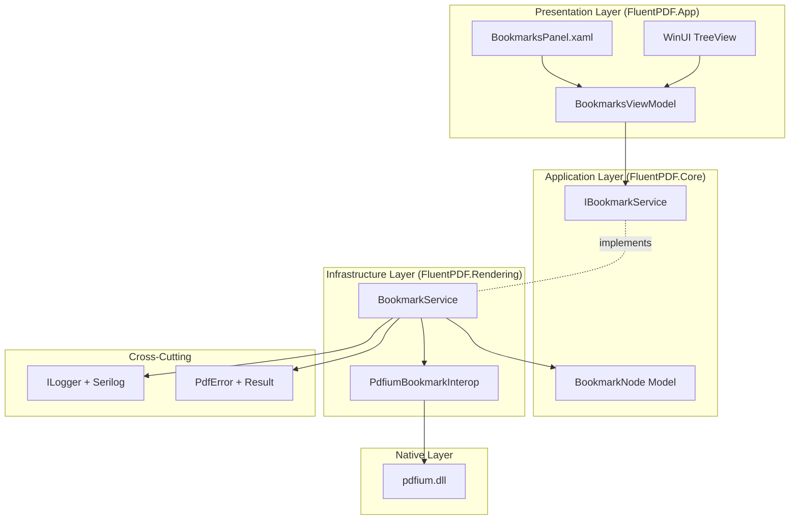

# Design Document

## Overview

The Bookmarks Panel implements PDF outline navigation using PDFium's bookmark API. The design follows clean architecture with layer separation: bookmark extraction service (using PDFium), domain model (hierarchical BookmarkNode), and presentation layer (TreeView UI in WinUI 3). All components integrate with existing infrastructure (DI, logging, error handling).

## Steering Document Alignment

### Technical Standards (tech.md)

**WinUI 3 + MVVM**: BookmarksPanel uses TreeView with BookmarksViewModel managing state.

**FluentResults**: Bookmark extraction returns `Result<BookmarkNode>` with PdfError for failures.

**Serilog + OpenTelemetry**: All bookmark operations logged with structured data (bookmark count, depth, extraction time).

**Dependency Injection**: IBookmarkService registered in IHost container, injected into ViewModels.

**ArchUnitNET**: Extended with rules for bookmark services (must be in Core/Rendering, must use interfaces).

### Project Structure (structure.md)

**FluentPDF.Rendering**: Contains PDFium bookmark P/Invoke and extraction service.

**FluentPDF.Core**: Contains BookmarkNode domain model and IBookmarkService interface.

**FluentPDF.App**: Contains BookmarksPanel control, BookmarksViewModel.

**File Organization**:
- `src/FluentPDF.Rendering/Interop/PdfiumBookmarkInterop.cs` - Bookmark P/Invoke
- `src/FluentPDF.Rendering/Services/BookmarkService.cs` - Bookmark extraction
- `src/FluentPDF.Core/Models/BookmarkNode.cs` - Bookmark domain model
- `src/FluentPDF.App/ViewModels/BookmarksViewModel.cs` - Presentation logic
- `src/FluentPDF.App/Controls/BookmarksPanel.xaml` - UI control

## Code Reuse Analysis

### Existing Components to Leverage

- **PdfiumInterop**: Extend with bookmark-specific P/Invoke declarations (FPDF_GetFirstChild, FPDF_GetNextSibling)
- **PdfError + FluentResults**: Extend with error codes (BOOKMARK_EXTRACTION_FAILED, BOOKMARK_INVALID)
- **SerilogConfiguration**: Use existing structured logging for bookmark extraction metrics
- **PdfViewerViewModel**: Integrate bookmark navigation with existing GoToPageAsync command
- **ApplicationData.LocalSettings**: Store panel state (visibility, width)

### Integration Points

- **PdfDocument**: Add Bookmarks property to store extracted bookmark tree
- **PdfViewerViewModel**: Add NavigateToBookmarkCommand for bookmark click handling
- **PdfViewerPage**: Add BookmarksPanel control to left sidebar with SplitView
- **Dependency Injection**: Register IBookmarkService in existing IHost container
- **Settings Service**: Store panel state alongside other user preferences

## Architecture

The Bookmarks Panel follows a layered architecture:



### Modular Design Principles

- **Single File Responsibility**: BookmarkService handles extraction, BookmarkNode represents data, BookmarksPanel handles UI
- **Component Isolation**: Service, model, and UI are independently testable
- **Service Layer Separation**: Business logic in service, presentation logic in ViewModel
- **Interface Abstraction**: IBookmarkService for mocking in tests

## Components and Interfaces

### Component 1: PdfiumBookmarkInterop (P/Invoke Extension)

- **Purpose:** PDFium bookmark API bindings
- **Location:** `src/FluentPDF.Rendering/Interop/PdfiumBookmarkInterop.cs` (static class, add to existing PdfiumInterop)
- **Interfaces:**
  - `IntPtr FPDFBookmark_GetFirstChild(SafePdfDocumentHandle document, IntPtr parentBookmark)` - Get first child bookmark (null for root level)
  - `IntPtr FPDFBookmark_GetNextSibling(SafePdfDocumentHandle document, IntPtr bookmark)` - Get next sibling bookmark
  - `int FPDFBookmark_GetTitle(IntPtr bookmark, byte[] buffer, int bufferLength)` - Get bookmark title (UTF-16LE)
  - `IntPtr FPDFBookmark_GetDest(SafePdfDocumentHandle document, IntPtr bookmark)` - Get bookmark destination
  - `int FPDFDest_GetDestPageIndex(SafePdfDocumentHandle document, IntPtr dest)` - Get destination page index
  - `bool FPDFDest_GetLocationInPage(IntPtr dest, out bool hasX, out bool hasY, out bool hasZoom, out float x, out float y, out float zoom)` - Get destination coordinates
- **Dependencies:** pdfium.dll (native library)
- **Reuses:** Existing PdfiumInterop patterns

### Component 2: BookmarkNode Model

- **Purpose:** Domain model representing a single bookmark with children
- **Location:** `src/FluentPDF.Core/Models/BookmarkNode.cs`
- **Properties:**
  ```csharp
  public class BookmarkNode
  {
      public required string Title { get; init; }
      public int? PageNumber { get; init; }  // 1-based, null if no destination
      public float? X { get; init; }         // Optional destination coordinates
      public float? Y { get; init; }
      public List<BookmarkNode> Children { get; init; } = new();
      public int Depth => CalculateDepth();  // Calculated property
  }
  ```
- **Methods:**
  - `int CalculateDepth()` - Recursively calculate depth from root
  - `int GetTotalNodeCount()` - Count all nodes in subtree
- **Reuses:** None (new model)

### Component 3: IBookmarkService (Service Interface)

- **Purpose:** Contract for bookmark extraction operations
- **Location:** `src/FluentPDF.Core/Services/IBookmarkService.cs`
- **Methods:**
  ```csharp
  public interface IBookmarkService
  {
      Task<Result<List<BookmarkNode>>> ExtractBookmarksAsync(PdfDocument document);
  }
  ```
- **Reuses:** `Result<T>` pattern from foundation

### Component 4: BookmarkService (Service Implementation)

- **Purpose:** Implements bookmark extraction using PDFium
- **Location:** `src/FluentPDF.Rendering/Services/BookmarkService.cs`
- **Dependencies:** `PdfiumBookmarkInterop`, `ILogger<BookmarkService>`
- **Extraction Algorithm:**
  1. Start with root: `FPDFBookmark_GetFirstChild(document, null)`
  2. For each bookmark:
     - Get title: `FPDFBookmark_GetTitle(bookmark)`
     - Get destination: `FPDFBookmark_GetDest(document, bookmark)`
     - Get page index: `FPDFDest_GetDestPageIndex(document, dest)` (convert to 1-based)
     - Get coordinates: `FPDFDest_GetLocationInPage(dest)` (optional)
     - Recursively extract children: `FPDFBookmark_GetFirstChild(document, bookmark)`
     - Get next sibling: `FPDFBookmark_GetNextSibling(document, bookmark)`
  3. Return Result.Ok with root BookmarkNode list
- **Error Codes:**
  - `BOOKMARK_EXTRACTION_FAILED` - Generic extraction failure
  - `BOOKMARK_INVALID` - Invalid bookmark handle
- **Reuses:** PdfError, Result<T>, Serilog logging

### Component 5: BookmarksViewModel

- **Purpose:** Presentation logic for bookmarks panel
- **Location:** `src/FluentPDF.App/ViewModels/BookmarksViewModel.cs`
- **Observable Properties:**
  ```csharp
  [ObservableProperty] private List<BookmarkNode>? _bookmarks;
  [ObservableProperty] private bool _isPanelVisible = true;
  [ObservableProperty] private double _panelWidth = 250;
  [ObservableProperty] private bool _isLoading;
  [ObservableProperty] private string _emptyMessage = "No bookmarks in this document";
  [ObservableProperty] private BookmarkNode? _selectedBookmark;
  ```
- **Commands:**
  ```csharp
  [RelayCommand]
  private async Task LoadBookmarksAsync(PdfDocument document)
  {
      IsLoading = true;
      var result = await _bookmarkService.ExtractBookmarksAsync(document);
      if (result.IsSuccess)
      {
          Bookmarks = result.Value;
          _logger.LogInformation("Loaded {Count} bookmarks", Bookmarks.Count);
      }
      else
      {
          _logger.LogWarning("Failed to load bookmarks: {Error}", result.Errors);
          Bookmarks = new List<BookmarkNode>();
      }
      IsLoading = false;
  }

  [RelayCommand]
  private void TogglePanel()
  {
      IsPanelVisible = !IsPanelVisible;
      SavePanelState();
  }

  [RelayCommand]
  private async Task NavigateToBookmarkAsync(BookmarkNode bookmark)
  {
      if (bookmark.PageNumber.HasValue)
      {
          _logger.LogInformation("Navigating to bookmark: {Title} (Page {Page})", bookmark.Title, bookmark.PageNumber);
          await _pdfViewerViewModel.GoToPageAsync(bookmark.PageNumber.Value);
          SelectedBookmark = bookmark;
      }
  }
  ```
- **Private Methods:**
  - `void SavePanelState()` - Persist panel state to ApplicationData.LocalSettings
  - `void LoadPanelState()` - Restore panel state from settings
- **Dependencies:** `IBookmarkService`, `PdfViewerViewModel`, `ILogger<BookmarksViewModel>`
- **Reuses:** ObservableObject, RelayCommand from CommunityToolkit.Mvvm

### Component 6: BookmarksPanel (UI Control)

- **Purpose:** WinUI TreeView-based bookmarks sidebar
- **Location:** `src/FluentPDF.App/Controls/BookmarksPanel.xaml`
- **UI Structure:**
  ```xml
  <UserControl>
      <Grid>
          <!-- Empty state -->
          <TextBlock Text="{Binding EmptyMessage}"
                     Visibility="{Binding Bookmarks.Count, Converter={StaticResource CountToVisibilityConverter}}"
                     HorizontalAlignment="Center"
                     VerticalAlignment="Center"/>

          <!-- Loading indicator -->
          <ProgressRing IsActive="{Binding IsLoading}"/>

          <!-- TreeView -->
          <TreeView ItemsSource="{Binding Bookmarks}"
                    SelectedItem="{Binding SelectedBookmark, Mode=TwoWay}"
                    Visibility="{Binding Bookmarks.Count, Converter={StaticResource InverseCountToVisibilityConverter}}">
              <TreeView.ItemTemplate>
                  <DataTemplate>
                      <TreeViewItem ItemsSource="{Binding Children}">
                          <StackPanel Orientation="Horizontal">
                              <FontIcon Glyph="&#xE8A5;" FontSize="14" Margin="0,0,8,0"/>
                              <TextBlock Text="{Binding Title}"
                                        ToolTipService.ToolTip="{Binding Title}"
                                        TextTrimming="CharacterEllipsis"/>
                          </StackPanel>
                          <Interactivity:Interaction.Behaviors>
                              <Core:EventTriggerBehavior EventName="Tapped">
                                  <Core:InvokeCommandAction Command="{Binding DataContext.NavigateToBookmarkCommand, ElementName=RootControl}"
                                                           CommandParameter="{Binding}"/>
                              </Core:EventTriggerBehavior>
                          </Interactivity:Interaction.Behaviors>
                      </TreeViewItem>
                  </DataTemplate>
              </TreeView.ItemTemplate>
          </TreeView>
      </Grid>
  </UserControl>
  ```
- **Reuses:** WinUI 3 TreeView, data binding to ViewModel

### Component 7: PdfViewerPage Integration

- **Purpose:** Integrate BookmarksPanel into main viewer
- **Location:** `src/FluentPDF.App/Views/PdfViewerPage.xaml` (modify)
- **Layout Change:**
  - Replace root Grid with SplitView (NavigationViewPaneDisplayMode.Left)
  - Pane: BookmarksPanel control
  - Content: Existing viewer (toolbar + page display)
  - Add "Toggle Bookmarks" button to toolbar
- **Binding:**
  - SplitView.IsPaneOpen → BookmarksViewModel.IsPanelVisible
  - SplitView.OpenPaneLength → BookmarksViewModel.PanelWidth
- **Reuses:** Existing PdfViewerPage layout

## Data Models

### BookmarkNode
```csharp
public class BookmarkNode
{
    public required string Title { get; init; }
    public int? PageNumber { get; init; }  // 1-based, null if no destination
    public float? X { get; init; }
    public float? Y { get; init; }
    public List<BookmarkNode> Children { get; init; } = new();

    public int Depth
    {
        get
        {
            int depth = 0;
            var parent = this;
            while (parent.Parent != null)
            {
                depth++;
                parent = parent.Parent;
            }
            return depth;
        }
    }

    public int GetTotalNodeCount()
    {
        int count = 1;  // Count self
        foreach (var child in Children)
        {
            count += child.GetTotalNodeCount();
        }
        return count;
    }
}
```

### BookmarkPanelState (Settings)
```csharp
public class BookmarkPanelState
{
    public bool IsVisible { get; set; } = true;
    public double Width { get; set; } = 250;
}
```

## Error Handling

### Error Scenarios

1. **Bookmark Extraction Failure**
   - **Handling:** Return `Result.Fail(new PdfError("BOOKMARK_EXTRACTION_FAILED", ErrorCategory.Rendering, ErrorSeverity.Warning))`
   - **User Impact:** Show empty state message, document remains viewable

2. **Invalid Bookmark Handle**
   - **Handling:** Skip invalid bookmark, log warning, continue extraction
   - **User Impact:** Some bookmarks may be missing, but no crash

3. **UTF-16 Decoding Error**
   - **Handling:** Use fallback title "(Untitled)", log error
   - **User Impact:** Bookmark displays with placeholder title

4. **Circular Bookmark Reference (PDFium bug)**
   - **Handling:** Limit recursion depth to 20 levels, log warning
   - **User Impact:** Deep bookmarks truncated, no stack overflow

5. **No Bookmarks in PDF**
   - **Handling:** Return Result.Ok with empty list
   - **User Impact:** Show "No bookmarks in this document" message

## Testing Strategy

### Unit Testing

**FluentPDF.Rendering.Tests/Services/BookmarkServiceTests.cs**:
- Mock PdfiumBookmarkInterop
- Test ExtractBookmarksAsync with valid bookmarks returns Result.Ok
- Test hierarchical bookmark extraction (parent → children → siblings)
- Test empty bookmark list (no bookmarks)
- Test bookmark with no destination (PageNumber is null)
- Test title decoding (UTF-16LE)
- Test error handling (invalid handle)

**FluentPDF.App.Tests/ViewModels/BookmarksViewModelTests.cs**:
- Mock IBookmarkService
- Test LoadBookmarksCommand populates Bookmarks property
- Test NavigateToBookmarkCommand calls PdfViewerViewModel.GoToPageAsync
- Test TogglePanelCommand changes IsPanelVisible
- Test SavePanelState/LoadPanelState persistence

### Integration Testing

**FluentPDF.Rendering.Tests/Integration/BookmarkIntegrationTests.cs**:
- Use real PDFium library
- Load PDF with known bookmark structure
- Verify all bookmarks extracted correctly
- Verify hierarchical structure matches expected
- Verify page numbers are correct (1-based)
- Test PDF with no bookmarks returns empty list

### End-to-End Testing

**FluentPDF.App.Tests/E2E/BookmarksPanelE2ETests.cs**:
- Use FlaUI for UI automation
- Load PDF with bookmarks
- Verify TreeView populates with bookmarks
- Click bookmark, verify navigation occurs
- Toggle panel, verify visibility changes
- Resize panel, verify width changes

### Architecture Testing

**FluentPDF.Architecture.Tests/BookmarksArchitectureTests.cs**:
- Test BookmarkService implements IBookmarkService
- Test BookmarksViewModel does not reference PDFium directly
- Test BookmarkNode has no dependencies (pure model)

## Performance Considerations

### Extraction Optimization
- **Iterative Algorithm:** Use while loop, not recursive calls to avoid stack overflow
- **Single Pass:** Extract all bookmarks in one traversal
- **Lazy Children Loading:** Only load children when node expanded (future enhancement)

### UI Virtualization
- **TreeView Virtualization:** Enable for > 1000 total nodes
- **Incremental Loading:** Load visible nodes first (future enhancement)

### Memory Management
- **Dispose Bookmark Handles:** PDFium bookmarks are lightweight (no explicit handles), but ensure document handle stays valid during extraction
- **Clear on Document Close:** Set Bookmarks = null when document closes

## Dependency Injection Registration

**App.xaml.cs ConfigureServices**:
```csharp
// Register bookmark service
services.AddSingleton<IBookmarkService, BookmarkService>();

// Register ViewModels
services.AddTransient<BookmarksViewModel>();
```

## Future Enhancements

- **Bookmark Search:** Filter bookmarks by title
- **Bookmark Creation:** Add user-created bookmarks (requires PDF editing)
- **Export Bookmarks:** Export bookmark structure to JSON/text
- **Bookmark Sorting:** Sort by title, page number
- **Custom Icons:** Different icons for different bookmark types
