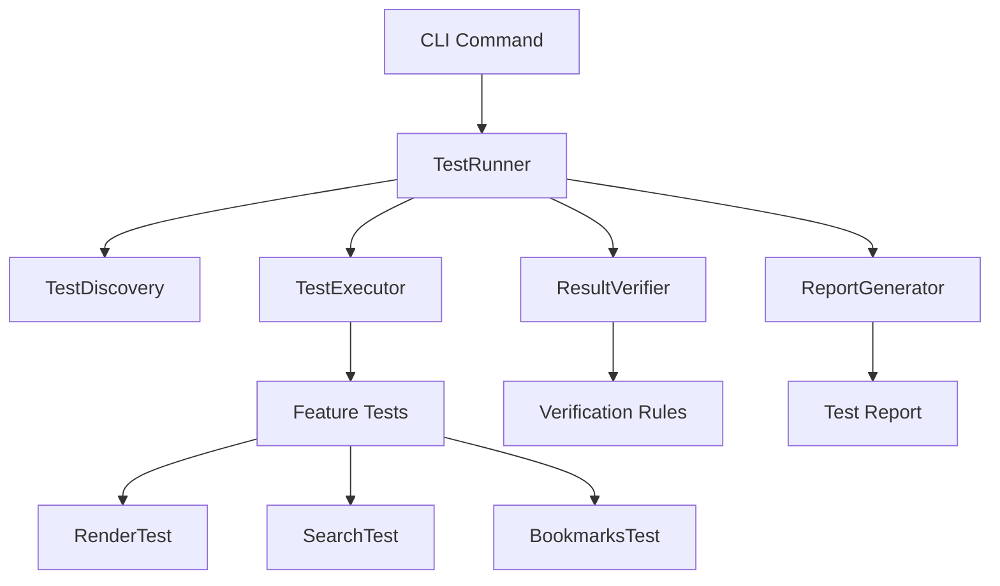

# Design Document

## Overview

Create a comprehensive CLI testing infrastructure that enables all FluentPDF features to be tested via command line. The framework provides test discovery, execution, verification, and reporting capabilities with structured logging and exit code semantics for CI/CD integration.

## Steering Document Alignment

### Technical Standards (tech.md)
- Follows .NET 9 patterns
- Uses Serilog for structured logging
- Leverages FluentResults for error handling

### Project Structure (structure.md)
- Test framework in `src/FluentPDF.App/Testing/`
- CLI commands in `CommandLineOptions.cs` and `DiagnosticCommandHandler.cs`
- Test data in `tests/Fixtures/`

## Code Reuse Analysis

### Existing Components to Leverage
- **DiagnosticCommandHandler.cs**: CLI command infrastructure (--test-render, --test-thumbnails patterns)
- **CommandLineOptions.cs**: Argument parsing
- **Serilog**: Structured logging already configured
- **FluentResults**: Result pattern for operation outcomes

### Integration Points
- **Test Fixtures**: Existing test PDFs in tests/Fixtures/
- **Services**: All rendering, document, search services
- **Logging**: Application log infrastructure

## Architecture



### Modular Design Principles
- **Single File Responsibility**: Each test type in separate file
- **Component Isolation**: Test framework independent of production code
- **Service Layer Separation**: Tests use services via interfaces
- **Utility Modularity**: Shared test utilities in dedicated module

## Components and Interfaces

### ICliTest Interface
- **Purpose:** Define contract for all CLI tests
- **Interfaces:**
  - `string Name { get; }` - Test identifier
  - `string Description { get; }` - Human-readable description
  - `Task<CliTestResult> RunAsync(CliTestContext)` - Execute test
  - `Task<bool> VerifyAsync(CliTestResult)` - Verify results
- **Dependencies:** None (interface only)
- **Reuses:** N/A

### TestRunner
- **Purpose:** Orchestrates test execution and reporting
- **Interfaces:**
  - `Task<TestSuiteResult> RunTestAsync(string testName)` - Run single test
  - `Task<TestSuiteResult> RunAllTestsAsync()` - Run all discovered tests
  - `List<ICliTest> DiscoverTests()` - Find all available tests
- **Dependencies:** TestDiscovery, TestExecutor, ResultVerifier
- **Reuses:** Serilog for logging

### TestDiscovery
- **Purpose:** Discovers all available CLI tests via reflection
- **Interfaces:**
  - `List<ICliTest> DiscoverAllTests()` - Find all ICliTest implementations
  - `ICliTest? FindTest(string name)` - Find specific test by name
- **Dependencies:** Reflection APIs
- **Reuses:** N/A

### TestExecutor
- **Purpose:** Executes tests with proper isolation and logging
- **Interfaces:**
  - `Task<CliTestResult> ExecuteTestAsync(ICliTest, CliTestContext)` - Run test
  - `CliTestContext CreateContext(string workDir)` - Create isolated context
- **Dependencies:** File system, services
- **Reuses:** Serilog, temporary directory management

### ResultVerifier
- **Purpose:** Verifies test results against expected outcomes
- **Interfaces:**
  - `Task<bool> VerifyResultAsync(CliTestResult, IVerificationRule)` - Verify result
  - `VerificationReport GenerateReport(List<CliTestResult>)` - Create report
- **Dependencies:** Verification rules
- **Reuses:** File comparison utilities

### CliTestContext
- **Purpose:** Provides isolated environment for each test
- **Interfaces:**
  - `string WorkingDirectory { get; }` - Temp directory for test
  - `IServiceProvider Services { get; }` - DI container
  - `ILogger Logger { get; }` - Test logger
  - `Dictionary<string, object> Data { get; }` - Test data
- **Dependencies:** DI container, file system
- **Reuses:** Application service provider

## Data Models

### CliTestResult
```csharp
public class CliTestResult
{
    public string TestName { get; set; }
    public bool Success { get; set; }
    public TimeSpan Duration { get; set; }
    public string? ErrorMessage { get; set; }
    public Dictionary<string, object> Outputs { get; set; }  // Files, metrics, etc.
    public List<string> LogEntries { get; set; }
}
```

### TestSuiteResult
```csharp
public class TestSuiteResult
{
    public int TotalTests { get; set; }
    public int PassedTests { get; set; }
    public int FailedTests { get; set; }
    public TimeSpan TotalDuration { get; set; }
    public List<CliTestResult> Results { get; set; }
}
```

### IVerificationRule
```csharp
public interface IVerificationRule
{
    string Name { get; }
    Task<bool> VerifyAsync(CliTestResult result);
    string GetFailureMessage();
}
```

## Error Handling

### Error Scenarios
1. **Test Execution Failure:** Test throws exception during execution
   - **Handling:** Catch exception, log details, mark test as failed
   - **User Impact:** Test fails with error details in log

2. **Verification Failure:** Result doesn't match expected outcome
   - **Handling:** Generate diff report, mark test as failed
   - **User Impact:** Clear diff showing expected vs actual

3. **Discovery Failure:** Cannot find test implementations
   - **Handling:** Log warning, continue with available tests
   - **User Impact:** Warning in logs, may run subset of tests

## Testing Strategy

### Unit Testing
- Test each component independently
- Mock dependencies for isolation
- Verify error handling with intentional failures

### Integration Testing
- Test full test execution flow
- Use actual services with test fixtures
- Verify reporting and verification logic

### End-to-End Testing
- Run actual CLI tests via framework
- Verify all tests discovered and executed
- Validate CI/CD integration
