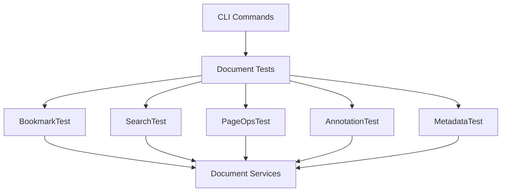

# Design Document

## Overview

Implement comprehensive CLI tests for all PDF document manipulation operations. Each test uses existing document services and verifies output correctness, ensuring GUI operations will work reliably.

## Code Reuse Analysis

### Existing Components to Leverage
- **IBookmarkService**: Bookmark extraction
- **ISearchService**: PDF text search
- **IPageOperationsService**: Page manipulation (rotate, delete, reorder)
- **IAnnotationService**: Annotation detection
- **IPdfDocumentService**: Document loading and metadata
- **ICliTest Interface**: From cli-test-infrastructure spec

### Integration Points
- **Test Framework**: ICliTest implementations
- **Document Services**: All manipulation services
- **Verification**: JSON output, file comparison

## Architecture

## Components and Interfaces

### BookmarksCliTest (implements ICliTest)
- **Purpose:** Verify bookmark extraction and structure
- **Reuses:** IBookmarkService, JSON serialization

### SearchCliTest (implements ICliTest)
- **Purpose:** Verify search functionality
- **Reuses:** ISearchService

### PageRotateCliTest (implements ICliTest)
- **Purpose:** Verify page rotation
- **Reuses:** IPageOperationsService

### PageDeleteCliTest (implements ICliTest)
- **Purpose:** Verify page deletion
- **Reuses:** IPageOperationsService

### PageReorderCliTest (implements ICliTest)
- **Purpose:** Verify page reordering
- **Reuses:** IPageOperationsService

### AnnotationsCliTest (implements ICliTest)
- **Purpose:** Verify annotation detection
- **Reuses:** IAnnotationService

### MetadataCliTest (implements ICliTest)
- **Purpose:** Verify metadata extraction
- **Reuses:** IPdfDocumentService

## Testing Strategy

### Integration Testing
- All tests use real PDFs from tests/Fixtures
- Verify actual service behavior
- Validate output correctness

### Edge Case Testing
- Test with PDFs lacking features (no bookmarks, no annotations)
- Test with malformed PDFs where safe
- Verify graceful error handling
