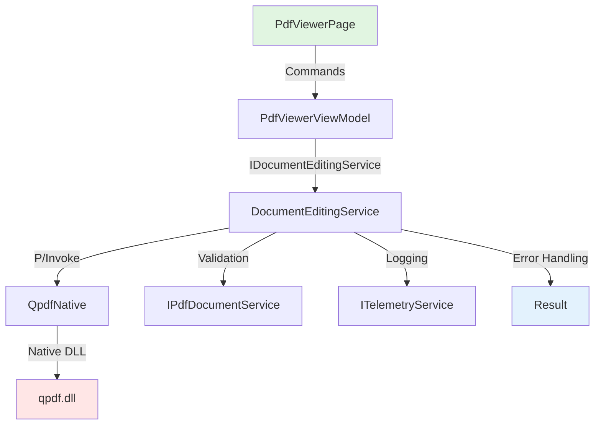

# Design Document

## Overview

This feature implements PDF structure manipulation using QPDF library through P/Invoke interop. It adds three core services (IMergerService, ISplitterService, IOptimizerService) to FluentPDF.Core with concrete implementations in FluentPDF.Rendering using QPDF native library.

The design follows the existing architecture pattern established for PDFium integration, using SafeHandle wrappers for memory safety and Result<T> pattern for error handling.

## Steering Document Alignment

### Technical Standards (tech.md)

- **QPDF Integration**: Uses QPDF library (Apache 2.0) via P/Invoke following same pattern as PDFium integration
- **Result Pattern**: All operations return `Result<T>` using FluentResults for type-safe error handling
- **Structured Logging**: Operations logged with Serilog including correlation IDs and performance metrics
- **Architecture**: Follows layered architecture with Core (interfaces) → Rendering (implementation) → App (UI)
- **Memory Management**: Uses SafeHandle for QPDF job handles to prevent memory leaks

### Project Structure (structure.md)

**New Files**:
- `src/FluentPDF.Core/Services/IDocumentEditingService.cs` - Service interfaces
- `src/FluentPDF.Rendering/Interop/QpdfNative.cs` - P/Invoke declarations
- `src/FluentPDF.Rendering/Interop/SafeQpdfJobHandle.cs` - SafeHandle wrapper
- `src/FluentPDF.Rendering/Services/DocumentEditingService.cs` - Implementation
- `tests/FluentPDF.Rendering.Tests/DocumentEditingTests.cs` - Integration tests
- `tests/FluentPDF.Architecture.Tests/DocumentEditingLayerTests.cs` - Architecture validation

## Code Reuse Analysis

### Existing Components to Leverage
- **PdfiumInterop.cs Pattern**: Reuse P/Invoke patterns, SafeHandle approach, error code translation
- **PdfError/ErrorCategory**: Extend with new error codes for QPDF-specific failures
- **IPdfDocumentService**: Use for PDF validation before/after operations
- **ITelemetryService**: Log operation start/end, duration, file sizes, error rates
- **Result<T> Pattern**: Consistent with existing error handling throughout codebase

### Integration Points
- **DI Container (App.xaml.cs)**: Register IDocumentEditingService as singleton
- **PdfViewerViewModel**: Add commands for merge/split/optimize operations
- **NavigationService**: Navigate to operation results or error dialogs
- **File System**: Use Windows.Storage APIs for file picker and save operations

## Architecture



### Modular Design Principles
- **Single File Responsibility**: QpdfNative.cs only P/Invoke, DocumentEditingService.cs only business logic
- **Component Isolation**: QPDF interop completely isolated from UI layer
- **Service Layer Separation**: Core contains interfaces, Rendering contains implementations, App contains UI
- **Utility Modularity**: Reuse existing error handling, logging, validation utilities

## Components and Interfaces

### IDocumentEditingService
- **Purpose:** Defines contract for PDF structure operations
- **Interfaces:**
  - `Task<Result<string>> MergeAsync(IEnumerable<string> sourcePaths, string outputPath, IProgress<double>? progress = null, CancellationToken ct = default)`
  - `Task<Result<string>> SplitAsync(string sourcePath, string pageRanges, string outputPath, IProgress<double>? progress = null, CancellationToken ct = default)`
  - `Task<Result<OptimizationResult>> OptimizeAsync(string sourcePath, string outputPath, OptimizationOptions options, IProgress<double>? progress = null, CancellationToken ct = default)`
- **Dependencies:** None (interface in Core layer)
- **Reuses:** N/A (new interface)

### DocumentEditingService
- **Purpose:** Concrete implementation using QPDF library
- **Interfaces:** Implements IDocumentEditingService
- **Dependencies:** IPdfDocumentService (validation), ITelemetryService (logging), QpdfNative (P/Invoke)
- **Reuses:** Result<T>, PdfError, Serilog logging patterns

### QpdfNative
- **Purpose:** P/Invoke declarations for QPDF C API
- **Interfaces:** Static methods for qpdf_init, qpdf_read, qpdf_write, qpdf_merge_pages, qpdf_optimize
- **Dependencies:** qpdf.dll (native library)
- **Reuses:** SafeHandle pattern from PdfiumInterop.cs

### SafeQpdfJobHandle
- **Purpose:** Memory-safe wrapper for QPDF job handles
- **Interfaces:** Extends SafeHandle, implements IDisposable
- **Dependencies:** QpdfNative (for cleanup)
- **Reuses:** SafeHandle pattern from SafePdfDocumentHandle.cs

## Data Models

### OptimizationOptions
```csharp
public record OptimizationOptions
{
    public bool CompressStreams { get; init; } = true;
    public bool RemoveUnusedObjects { get; init; } = true;
    public bool DeduplicateResources { get; init; } = true;
    public bool Linearize { get; init; } = false; // Web optimization
    public bool PreserveEncryption { get; init; } = true;
}
```

### OptimizationResult
```csharp
public record OptimizationResult
{
    public string OutputPath { get; init; } = string.Empty;
    public long OriginalSize { get; init; }
    public long OptimizedSize { get; init; }
    public double ReductionPercentage => 100.0 * (1.0 - (double)OptimizedSize / OriginalSize);
    public bool WasLinearized { get; init; }
    public TimeSpan ProcessingTime { get; init; }
}
```

### PageRange
```csharp
public record PageRange
{
    public int StartPage { get; init; }
    public int EndPage { get; init; }

    public static Result<List<PageRange>> Parse(string rangeString);
    // Example: "1-5, 10, 15-20" → [(1,5), (10,10), (15,20)]
}
```

## Error Handling

### Error Scenarios

1. **Invalid Page Range**
   - **Handling:** Parse page range string, return PdfError with ErrorCategory.Validation if invalid format
   - **User Impact:** Error dialog with specific guidance (e.g., "Use format like '1-5, 10, 15-20'")

2. **QPDF Library Failure**
   - **Handling:** Translate QPDF error codes to PdfError with ErrorCategory.System, log full stack trace
   - **User Impact:** User-friendly message like "Failed to merge PDFs. One or more files may be corrupted."

3. **Encrypted PDF Without Password**
   - **Handling:** Return PdfError with ErrorCategory.Security, prompt user for password via dialog
   - **User Impact:** Password input dialog with retry option

4. **Disk Space Insufficient**
   - **Handling:** Catch IOException, return PdfError with ErrorCategory.IO, include required vs available space
   - **User Impact:** Error message with specific space requirement (e.g., "Need 25 MB free, only 10 MB available")

5. **Operation Cancelled**
   - **Handling:** Check CancellationToken, clean up partial files, return Result.Fail with cancellation error
   - **User Impact:** Confirmation message "Operation cancelled. No changes were made."

## Testing Strategy

### Unit Testing
- Test PageRange.Parse with valid/invalid inputs (edge cases: empty, negative, overlapping ranges)
- Test OptimizationResult percentage calculation with zero/equal sizes
- Mock QPDF operations to test error handling paths in DocumentEditingService
- Test SafeQpdfJobHandle disposal and memory cleanup (using manual GC pressure tests)

### Integration Testing
- Merge 2-10 sample PDFs, verify output page count and structure using QPDF validation
- Split sample PDF with various page ranges, compare extracted pages with originals
- Optimize large PDF (100+ pages), verify size reduction and lossless quality (visual hash comparison)
- Test encrypted PDF handling with correct/incorrect passwords
- Test cancellation during long operations (large file merge/optimize)

### End-to-End Testing
- User flow: Open viewer → Select multiple files → Merge → Verify in viewer
- User flow: Open large PDF → Split pages 1-10 → Open split document → Verify correct pages
- User flow: Open bloated PDF → Optimize with linearization → Verify fast web viewing (measure first-page-load time)
- Error recovery: Attempt merge with corrupted PDF → Verify error message → Verify original files intact
