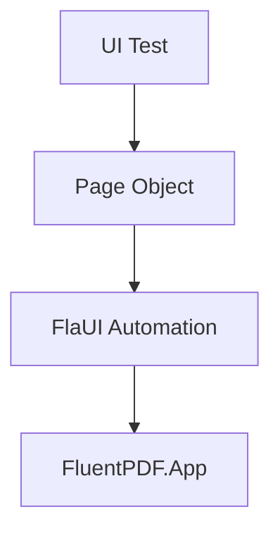

# Design Document

## Overview

Integrate FlaUI UI automation framework into FluentPDF.App.Tests project for end-to-end testing of Windows UI. Uses Page Object Pattern for maintainability.

## Steering Document Alignment

### Technical Standards (tech.md)
- Uses FlaUI as specified (replacing deprecated WinAppDriver)
- Page Object Pattern for maintainability
- AutomationId-based element discovery
- Retry strategies for flaky test mitigation

### Project Structure (structure.md)
- Tests in `tests/FluentPDF.App.Tests/E2E/`
- Page objects in `tests/FluentPDF.App.Tests/PageObjects/`
- Follows `[ClassName]Tests.cs` naming convention

## Code Reuse Analysis

### Existing Components to Leverage
- **FluentPDF.App.Tests.csproj**: Existing test project to extend
- **xUnit**: Already configured as test framework

### Integration Points
- **FluentPDF.App**: Application under test
- **AutomationId attributes**: Must be added to key XAML controls

## Architecture



## Components and Interfaces

### FlaUITestBase
- **Purpose:** Base class for all FlaUI tests with app lifecycle management
- **Interfaces:** `LaunchApp()`, `CloseApp()`, `TakeScreenshot()`
- **Dependencies:** FlaUI.Core, FlaUI.UIA3

### MainWindowPage
- **Purpose:** Page object for main application window
- **Interfaces:** `OpenFile(path)`, `GetCurrentPageNumber()`, `NavigateToPage(n)`
- **Dependencies:** FlaUITestBase

### PdfViewerPage
- **Purpose:** Page object for PDF viewer control
- **Interfaces:** `ZoomIn()`, `ZoomOut()`, `GetZoomLevel()`
- **Dependencies:** FlaUITestBase

## Data Models

### TestConfiguration
```csharp
- AppPath: string (path to FluentPDF.App.exe)
- Timeout: TimeSpan (default 30s)
- ScreenshotOnFailure: bool (default true)
```

## Error Handling

### Error Scenarios
1. **App launch failure**
   - **Handling:** Throw descriptive exception with app path
   - **User Impact:** Test marked as failed with clear message

2. **Element not found**
   - **Handling:** Retry with configurable timeout, then fail
   - **User Impact:** Test fails with element identifier in message

## Testing Strategy

### Unit Testing
- Page object helper methods tested in isolation

### Integration Testing
- Full app launch and interaction via FlaUI

### End-to-End Testing
- Complete user workflows (open file, navigate, zoom)
