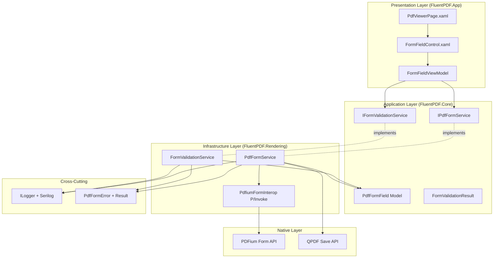

# Design Document

## Overview

The Form Filling feature enables users to interact with AcroForm fields in PDF documents using PDFium's form API. The design follows clean architecture with form detection in the interop layer, business logic in services, and WinUI 3 controls for form field overlays. All form operations integrate with existing error handling (Result pattern), logging (Serilog), and validation infrastructure.

## Steering Document Alignment

### Technical Standards (tech.md)

**PDFium Form API**: Use PDFium's FPDF_* form functions for field detection, value reading/writing, and metadata extraction.

**WinUI 3 + MVVM**: FormFieldControl (custom WinUI control) with FormFieldViewModel for data binding to PDF field values.

**FluentResults**: All form operations return `Result<T>` with PdfFormError for validation failures.

**Serilog + OpenTelemetry**: All form interactions logged (field type, tab order, validation results).

**Dependency Injection**: IPdfFormService registered in IHost container, FormFieldViewModel injected.

**ArchUnitNET**: Extended with rules for form layer (Form interop in Rendering, FormControls in App).

### Project Structure (structure.md)

**FluentPDF.Rendering**: Contains PDFium form P/Invoke declarations and form service implementation.

**FluentPDF.Core**: Contains form models (PdfFormField, FormFieldType enum) and service interfaces.

**FluentPDF.App**: Contains FormFieldControl (WinUI), FormFieldViewModel, and form UI integration.

**File Organization**:
- `src/FluentPDF.Rendering/Interop/PdfiumFormInterop.cs` - Form P/Invoke declarations
- `src/FluentPDF.Rendering/Services/PdfFormService.cs` - Form detection and manipulation
- `src/FluentPDF.Rendering/Services/FormValidationService.cs` - Field validation logic
- `src/FluentPDF.Core/Models/PdfFormField.cs` - Form field model
- `src/FluentPDF.Core/Services/IPdfFormService.cs` - Form service interface
- `src/FluentPDF.App/Controls/FormFieldControl.xaml` - Form field overlay control
- `src/FluentPDF.App/ViewModels/FormFieldViewModel.cs` - Form field presentation logic

## Code Reuse Analysis

### Existing Components to Leverage

- **PdfiumInterop**: Extend with form-specific P/Invoke declarations (FPDFDOC_InitFormFillEnvironment, FPDFPage_HasFormFieldAtPoint, etc.)
- **PdfDocument Model**: Add FormFieldCount property and HasFormFields boolean
- **PdfError + FluentResults**: Add form error codes (FORM_VALIDATION_FAILED, FORM_FIELD_REQUIRED, FORM_SAVE_FAILED)
- **SerilogConfiguration**: Log form interactions with structured data (field name, type, value)
- **PdfViewerPage**: Integrate form field overlays into existing page rendering
- **SaveFileService**: Extend to support form data persistence using QPDF

### Integration Points

- **Form Detection**: Called after PDF page render completes, enumerate fields for current page
- **Form Overlays**: FormFieldControl instances positioned over rendered page in PdfViewerPage
- **Keyboard Navigation**: Integrate with WinUI focus management, Tab key handling in PdfViewerPage code-behind
- **Save Operation**: Extend existing SaveDocument functionality to write form data using PDFium's FPDFDoc_SaveWithVersion

## Architecture

The Form Filling feature follows a layered architecture integrating with the existing PDF viewer:



### Modular Design Principles

- **Single File Responsibility**: Form detection (interop), form logic (service), form validation (separate service), form UI (control)
- **Component Isolation**: Form interop, services, and controls independently testable
- **Service Layer Separation**: Business logic in PdfFormService, validation logic in FormValidationService, presentation in ViewModels
- **Interface Abstraction**: All services behind interfaces for mocking

## Components and Interfaces

### Component 1: PdfiumFormInterop (P/Invoke Layer)

- **Purpose:** PDFium form API bindings for field detection, reading, and writing
- **Location:** `src/FluentPDF.Rendering/Interop/PdfiumFormInterop.cs`
- **Key Functions:**
  ```csharp
  // Form environment
  IntPtr FPDFDOC_InitFormFillEnvironment(SafePdfDocumentHandle document, IntPtr formInfo);
  void FPDFDOC_ExitFormFillEnvironment(IntPtr formHandle);

  // Field enumeration
  int FPDFPage_GetFormFieldCount(SafePdfPageHandle page);
  IntPtr FPDFPage_GetFormFieldAtIndex(SafePdfPageHandle page, int index);
  int FPDFPage_HasFormFieldAtPoint(SafePdfFormHandle form, SafePdfPageHandle page, double x, double y);

  // Field metadata
  int FPDFFormField_GetType(IntPtr field);
  int FPDFFormField_GetName(IntPtr field, byte[] buffer, int buflen);
  int FPDFFormField_GetFlags(IntPtr field);
  bool FPDFFormField_GetRect(IntPtr field, out double left, out double top, out double right, out double bottom);

  // Field value access
  int FPDFFormField_GetValue(IntPtr field, byte[] buffer, int buflen);
  bool FPDFFormField_SetValue(IntPtr field, string value);
  bool FPDFFormField_GetCheckState(IntPtr field);
  bool FPDFFormField_SetCheckState(IntPtr field, bool checked);

  // Field properties
  int FPDFFormField_GetMaxLength(IntPtr field);
  bool FPDFFormField_IsRequired(IntPtr field);
  bool FPDFFormField_IsReadOnly(IntPtr field);
  ```
- **SafeHandle Types:**
  ```csharp
  public class SafePdfFormHandle : SafeHandleZeroOrMinusOneIsInvalid
  {
      protected override bool ReleaseHandle() =>
          PdfiumFormInterop.FPDFDOC_ExitFormFillEnvironment(handle);
  }
  ```
- **Dependencies:** pdfium.dll (form functions)
- **Reuses:** Existing SafeHandleZeroOrMinusOneIsInvalid pattern

### Component 2: PdfFormField Model

- **Purpose:** Domain model representing a PDF form field with metadata
- **Location:** `src/FluentPDF.Core/Models/PdfFormField.cs`
- **Properties:**
  ```csharp
  public class PdfFormField
  {
      public required string Name { get; init; }
      public required FormFieldType Type { get; init; }
      public required int PageNumber { get; init; }
      public required PdfRectangle Bounds { get; init; }  // Position on page
      public required int TabOrder { get; init; }
      public string Value { get; set; } = string.Empty;
      public bool IsChecked { get; set; }  // For checkboxes/radio
      public bool IsRequired { get; init; }
      public bool IsReadOnly { get; init; }
      public int MaxLength { get; init; }  // For text fields
      public string? FormatMask { get; init; }  // e.g., "###-##-####" for SSN
      public IntPtr NativeHandle { get; init; }  // PDFium field handle
  }

  public enum FormFieldType
  {
      Unknown = 0,
      Text = 1,
      Checkbox = 2,
      RadioButton = 3,
      ComboBox = 4,
      ListBox = 5,
      Signature = 6
  }

  public record PdfRectangle(double Left, double Top, double Right, double Bottom);
  ```
- **Reuses:** None (new model)

### Component 3: IPdfFormService (Service Interface)

- **Purpose:** Contract for form field detection and manipulation
- **Location:** `src/FluentPDF.Core/Services/IPdfFormService.cs`
- **Methods:**
  ```csharp
  public interface IPdfFormService
  {
      Task<Result<IReadOnlyList<PdfFormField>>> GetFormFieldsAsync(PdfDocument document, int pageNumber);
      Task<Result<PdfFormField?>> GetFormFieldAtPointAsync(PdfDocument document, int pageNumber, double x, double y);
      Task<Result> SetFieldValueAsync(PdfFormField field, string value);
      Task<Result> SetCheckboxStateAsync(PdfFormField field, bool isChecked);
      Task<Result> SaveFormDataAsync(PdfDocument document, string outputPath);
      Result<IReadOnlyList<PdfFormField>> GetFieldsInTabOrder(IReadOnlyList<PdfFormField> fields);
  }
  ```
- **Reuses:** `Result<T>` pattern from foundation

### Component 4: PdfFormService (Service Implementation)

- **Purpose:** Implements form field detection and manipulation using PDFium
- **Location:** `src/FluentPDF.Rendering/Services/PdfFormService.cs`
- **Dependencies:** `PdfiumFormInterop`, `ILogger<PdfFormService>`
- **Key Operations:**
  - **GetFormFieldsAsync**: Initialize form environment, enumerate fields, extract metadata, sort by tab order
  - **GetFormFieldAtPointAsync**: Hit test to find field at mouse coordinates (for hover/click)
  - **SetFieldValueAsync**: Validate input, call FPDFFormField_SetValue, log operation
  - **SetCheckboxStateAsync**: Call FPDFFormField_SetCheckState, update model
  - **SaveFormDataAsync**: Use PDFium's save function to persist form data, validate output
  - **GetFieldsInTabOrder**: Sort fields by TabOrder property, fallback to spatial order (top-to-bottom, left-to-right)
- **Error Codes:**
  - `FORM_NO_FIELDS` - PDF has no form fields
  - `FORM_FIELD_NOT_FOUND` - Field at coordinates not found
  - `FORM_INVALID_VALUE` - Value exceeds max length or format constraints
  - `FORM_SAVE_FAILED` - Failed to save form data to file
  - `FORM_READONLY_FIELD` - Attempted to modify read-only field
- **Reuses:** PdfError, Result<T>, Serilog logging

### Component 5: IFormValidationService (Service Interface)

- **Purpose:** Contract for form field validation
- **Location:** `src/FluentPDF.Core/Services/IFormValidationService.cs`
- **Methods:**
  ```csharp
  public interface IFormValidationService
  {
      Result<FormValidationResult> ValidateField(PdfFormField field);
      Result<FormValidationResult> ValidateAllFields(IReadOnlyList<PdfFormField> fields);
  }

  public class FormValidationResult
  {
      public bool IsValid { get; init; }
      public List<FieldValidationError> Errors { get; init; } = new();
  }

  public class FieldValidationError
  {
      public required string FieldName { get; init; }
      public required string ErrorMessage { get; init; }
      public required ValidationErrorType Type { get; init; }
  }

  public enum ValidationErrorType
  {
      RequiredFieldEmpty,
      MaxLengthExceeded,
      InvalidFormat,
      ReadOnlyModified
  }
  ```
- **Reuses:** `Result<T>` pattern

### Component 6: FormValidationService (Service Implementation)

- **Purpose:** Validates form fields against constraints
- **Location:** `src/FluentPDF.Rendering/Services/FormValidationService.cs`
- **Validation Rules:**
  - **Required Fields**: Check IsRequired flag, verify value not empty
  - **Max Length**: Check text length <= MaxLength
  - **Format Masks**: Validate value matches FormatMask pattern (regex)
  - **Read-Only**: Prevent modification of read-only fields
- **Dependencies:** `ILogger<FormValidationService>`
- **Reuses:** PdfError, Result<T>, Serilog logging

### Component 7: FormFieldControl (WinUI Custom Control)

- **Purpose:** WinUI control overlaid on PDF page for form field input
- **Location:** `src/FluentPDF.App/Controls/FormFieldControl.xaml`
- **Control Templates by Type:**
  - **Text Field**: TextBox with border, supports max length and format validation
  - **Checkbox**: CheckBox control with custom styling
  - **Radio Button**: RadioButton control with group management
- **Visual States:**
  - Normal: Subtle border
  - Hover: Highlighted border (AccentColor at 50% opacity)
  - Focused: Thick border (AccentColor)
  - Error: Red border with error icon
  - ReadOnly: Gray background, no interaction
- **Properties:**
  ```csharp
  public PdfFormField Field { get; set; }
  public double ZoomLevel { get; set; }
  public bool IsInErrorState { get; set; }
  ```
- **Events:**
  - ValueChanged: Fired when user modifies field value
  - FocusChanged: Fired on focus/blur for tab order tracking
- **Reuses:** WinUI 3 TextBox, CheckBox, RadioButton controls

### Component 8: FormFieldViewModel

- **Purpose:** Presentation logic for form field interaction
- **Location:** `src/FluentPDF.App/ViewModels/FormFieldViewModel.cs`
- **Observable Properties:**
  ```csharp
  [ObservableProperty] private ObservableCollection<PdfFormField> _formFields = new();
  [ObservableProperty] private PdfFormField? _focusedField;
  [ObservableProperty] private bool _hasFormFields;
  [ObservableProperty] private bool _isModified;
  [ObservableProperty] private string _validationMessage = string.Empty;
  ```
- **Commands:**
  ```csharp
  [RelayCommand] private async Task LoadFormFieldsAsync(int pageNumber);
  [RelayCommand] private async Task UpdateFieldValueAsync(PdfFormField field, string newValue);
  [RelayCommand] private async Task ToggleCheckboxAsync(PdfFormField field);
  [RelayCommand] private async Task SaveFormAsync();
  [RelayCommand] private async Task ValidateFormAsync();
  [RelayCommand] private void FocusNextField();
  [RelayCommand] private void FocusPreviousField();
  ```
- **Dependencies:** `IPdfFormService`, `IFormValidationService`, `ILogger<FormFieldViewModel>`
- **Reuses:** ObservableObject, RelayCommand from CommunityToolkit.Mvvm

### Component 9: PdfViewerPage Form Integration

- **Purpose:** Integrate form field overlays into PDF viewer page
- **Location:** `src/FluentPDF.App/Views/PdfViewerPage.xaml` (modify)
- **XAML Changes:**
  - Add Canvas for form field overlays positioned above Image control
  - Add ItemsControl bound to FormFields collection
  - Add DataTemplate for FormFieldControl instances
  - Position controls using Canvas.Left/Top based on field.Bounds and ZoomLevel
- **Code-Behind:**
  - Handle Tab key for field navigation (call FormFieldViewModel.FocusNextField)
  - Handle Shift+Tab for reverse navigation
  - Update form field positions on zoom/scroll
  - Show validation errors in InfoBar at top of page
- **Reuses:** Existing PdfViewerPage, PdfViewerViewModel

## Data Models

### PdfFormField (detailed)
```csharp
namespace FluentPDF.Core.Models;

public class PdfFormField
{
    public required string Name { get; init; }
    public required FormFieldType Type { get; init; }
    public required int PageNumber { get; init; }
    public required PdfRectangle Bounds { get; init; }
    public required int TabOrder { get; init; }

    public string Value { get; set; } = string.Empty;
    public bool IsChecked { get; set; }

    public bool IsRequired { get; init; }
    public bool IsReadOnly { get; init; }
    public int MaxLength { get; init; }
    public string? FormatMask { get; init; }

    // For radio button groups
    public string? GroupName { get; init; }

    // Native handle for PDFium operations
    public IntPtr NativeHandle { get; init; }

    // Calculated at runtime
    public bool IsModified { get; set; }
}
```

### FormValidationResult
```csharp
namespace FluentPDF.Core.Models;

public class FormValidationResult
{
    public bool IsValid => !Errors.Any();
    public List<FieldValidationError> Errors { get; init; } = new();
    public int FieldCount { get; init; }
    public int ValidFieldCount { get; init; }
}
```

## Error Handling

### Error Scenarios

1. **No Form Fields**
   - **Handling:** Return `Result.Ok(emptyList)` with log message "PDF has no form fields"
   - **User Impact:** Form tools remain disabled

2. **Required Field Empty**
   - **Handling:** Validation fails, return `Result.Fail(new PdfFormError("FORM_VALIDATION_FAILED", ErrorCategory.Validation))`
   - **User Impact:** Error dialog: "Please fill in all required fields: [field names]"

3. **Max Length Exceeded**
   - **Handling:** Truncate input at MaxLength, show warning
   - **User Impact:** Visual indicator that max length reached, additional characters not accepted

4. **Invalid Format**
   - **Handling:** Show inline validation error under field
   - **User Impact:** Red border, error message: "Invalid format. Expected: [format mask]"

5. **Save Failed**
   - **Handling:** Return `Result.Fail(new PdfFormError("FORM_SAVE_FAILED", ErrorCategory.IO))`
   - **User Impact:** Error dialog: "Failed to save form data. Original file preserved."

6. **Read-Only Field Modified**
   - **Handling:** Prevent modification, log warning
   - **User Impact:** Field is visually grayed out, clicks have no effect

## Testing Strategy

### Unit Testing

**FluentPDF.Rendering.Tests/Interop/PdfiumFormInteropTests.cs**:
- Test InitFormFillEnvironment succeeds
- Test GetFormFieldCount returns correct count
- Test GetFormFieldAtIndex returns valid handle
- Test field metadata extraction (type, name, flags)
- Test SafePdfFormHandle properly disposes

**FluentPDF.Rendering.Tests/Services/PdfFormServiceTests.cs**:
- Mock PdfiumFormInterop
- Test GetFormFieldsAsync returns all fields
- Test GetFormFieldAtPointAsync finds correct field
- Test SetFieldValueAsync updates value
- Test SaveFormDataAsync creates valid PDF
- Test tab order sorting

**FluentPDF.Rendering.Tests/Services/FormValidationServiceTests.cs**:
- Test ValidateField with required field empty returns error
- Test ValidateField with max length exceeded returns error
- Test ValidateField with invalid format returns error
- Test ValidateAllFields aggregates errors

**FluentPDF.App.Tests/ViewModels/FormFieldViewModelTests.cs**:
- Mock IPdfFormService and IFormValidationService
- Test LoadFormFieldsAsync populates collection
- Test UpdateFieldValueAsync updates field and marks modified
- Test SaveFormAsync validates before saving
- Test tab order navigation commands

### Integration Testing

**FluentPDF.App.Tests/Integration/FormFillingIntegrationTests.cs**:
- Use real PDFium with sample form PDF (IRS 1040 form or similar)
- Test form field detection
- Test filling out text fields
- Test checkbox toggling
- Test radio button selection
- Test form validation
- Test save and reload (verify data persisted)

### End-to-End Testing

**FluentPDF.App.Tests/E2E/FormFillingE2ETests.cs**:
- Use FlaUI for UI automation
- Test complete workflow:
  1. Open PDF with forms
  2. Tab through fields
  3. Fill out text fields
  4. Check checkboxes
  5. Select radio buttons
  6. Attempt save with missing required field (verify error)
  7. Fill required field
  8. Save form
  9. Reopen and verify data

### Architecture Testing

**FluentPDF.Architecture.Tests/FormArchitectureTests.cs**:
- Test form P/Invoke methods only in Rendering.Interop namespace
- Test FormFieldControl only in App/Controls
- Test FormFieldViewModel uses service interfaces, not direct PDFium

## Performance Considerations

### Form Detection Optimization
- **Lazy Loading**: Only detect fields for currently visible page
- **Caching**: Cache form field list per page, invalidate on document change
- **Background Loading**: Enumerate fields on background thread

### Rendering Performance
- **Overlay Efficiency**: Use Canvas with absolute positioning (fast layout)
- **Virtualization**: Only create FormFieldControl instances for visible fields (future)
- **Z-Index Management**: Ensure form overlays don't impact page render performance

### Validation Performance
- **Incremental Validation**: Validate fields on blur, not on every keystroke
- **Debounced Format Validation**: Delay format checks by 500ms during typing
- **Async Validation**: Run validation on background thread for large forms

## Dependency Injection Registration

**App.xaml.cs ConfigureServices**:
```csharp
// Register form services
services.AddSingleton<IPdfFormService, PdfFormService>();
services.AddSingleton<IFormValidationService, FormValidationService>();
services.AddTransient<FormFieldViewModel>();
```

## Future Enhancements

- **JavaScript Validation**: Execute PDF-embedded JavaScript validation scripts (security implications)
- **XFA Forms**: Support XML Forms Architecture (more complex form format)
- **Form Templates**: Save/load form data as FDF (Forms Data Format) for reuse
- **Auto-Fill**: Detect common fields (name, address) and auto-fill from user profile
- **Digital Signatures**: Sign forms with certificate-based signatures
- **Form Designer**: Create new form fields (advanced feature for future)
- **Combo Boxes and List Boxes**: Support dropdown menus and multi-select lists
