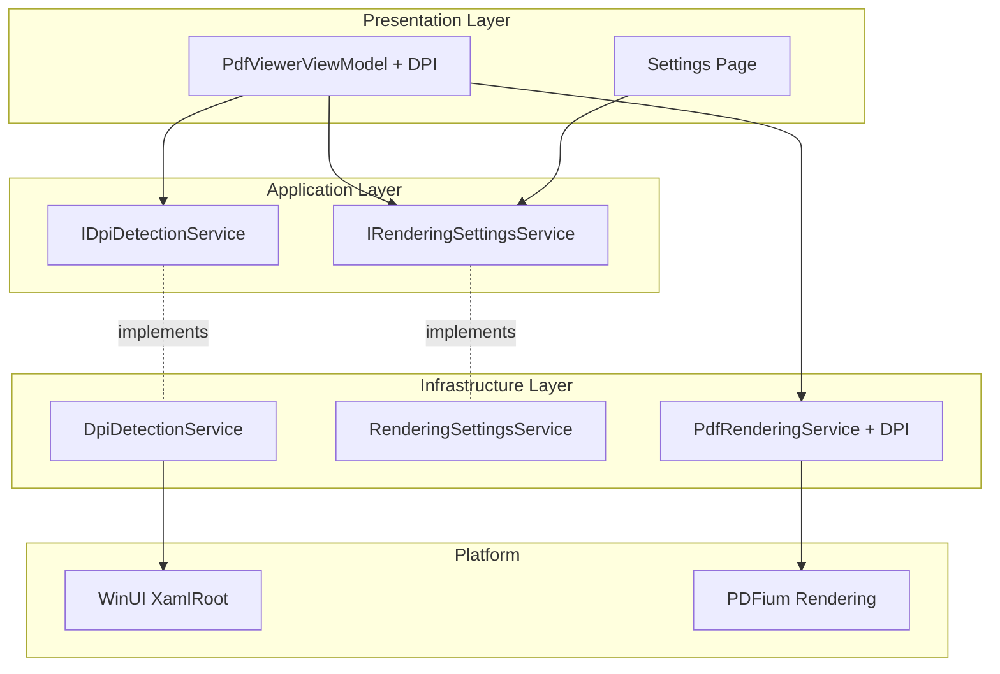

# Design Document

## Overview

The HiDPI Display Scaling feature extends the PDF rendering pipeline to automatically detect and adapt to high-resolution displays. The design integrates WinUI 3's RasterizationScale API with PDFium's DPI-aware rendering to provide pixel-perfect PDF display on any device, from standard 1080p monitors to 4K displays and Surface devices at 300% scaling.

## Steering Document Alignment

### Technical Standards (tech.md)

**WinUI 3 RasterizationScale**: Uses XamlRoot.RasterizationScale to detect display scaling dynamically.

**PDFium DPI Support**: Extends PdfRenderingService to accept custom DPI parameter based on display scale.

**FluentResults**: DPI detection and rendering operations return `Result<T>` for error handling.

**Serilog Logging**: All DPI changes and quality adjustments logged with performance metrics.

### Project Structure (structure.md)

**FluentPDF.Rendering**: Extends PdfRenderingService with DPI-aware rendering logic.

**FluentPDF.Core**: Contains IDpiDetectionService, IRenderingSettingsService interfaces.

**FluentPDF.App**: Implements DPI monitoring, settings UI, and automatic quality adjustment.

## Code Reuse Analysis

### Existing Components to Leverage

- **PdfRenderingService**: Modify RenderPageAsync to accept effectiveDpi parameter
- **PdfViewerViewModel**: Extend with DPI state and quality settings
- **Settings Infrastructure**: Add rendering quality settings to existing settings system
- **Serilog Logging**: Log DPI changes and performance metrics

### Integration Points

- **XamlRoot.Changed Event**: Monitor for display configuration changes
- **Existing Zoom Logic**: Integrate DPI with zoom level: `effectiveDpi = 96 * rasterizationScale * zoomLevel`
- **Settings Persistence**: Store quality preference using existing settings service

## Architecture



## Components and Interfaces

### Component 1: RenderingQuality Enum

- **Purpose:** Defines rendering quality presets
- **Location:** `src/FluentPDF.Core/Models/RenderingQuality.cs`
- **Definition:**
  ```csharp
  public enum RenderingQuality
  {
      Auto = 0,    // Use detected DPI
      Low = 1,     // 96 DPI (100%)
      Medium = 2,  // 144 DPI (150%)
      High = 3,    // 192 DPI (200%)
      Ultra = 4    // 288 DPI (300%)
  }
  ```

### Component 2: DisplayInfo Model

- **Purpose:** Contains display DPI and scaling information
- **Location:** `src/FluentPDF.Core/Models/DisplayInfo.cs`
- **Properties:**
  ```csharp
  public class DisplayInfo
  {
      public required double RasterizationScale { get; init; }
      public required double EffectiveDpi { get; init; } // 96 * RasterizationScale
      public required bool IsHighDpi { get; init; } // RasterizationScale > 1.0
      public required DateTime DetectedAt { get; init; }
  }
  ```

### Component 3: IDpiDetectionService

- **Purpose:** Contract for DPI detection and monitoring
- **Location:** `src/FluentPDF.Core/Services/IDpiDetectionService.cs`
- **Methods:**
  ```csharp
  public interface IDpiDetectionService
  {
      Result<DisplayInfo> GetCurrentDisplayInfo(XamlRoot xamlRoot);
      IObservable<DisplayInfo> MonitorDpiChanges(XamlRoot xamlRoot);
      double CalculateEffectiveDpi(DisplayInfo displayInfo, double zoomLevel, RenderingQuality quality);
  }
  ```

### Component 4: DpiDetectionService

- **Purpose:** Implements DPI detection using WinUI 3 APIs
- **Location:** `src/FluentPDF.Rendering/Services/DpiDetectionService.cs`
- **Dependencies:** `ILogger<DpiDetectionService>`
- **Implementation:**
  ```csharp
  public Result<DisplayInfo> GetCurrentDisplayInfo(XamlRoot xamlRoot)
  {
      if (xamlRoot == null)
      {
          return Result.Fail(new PdfError("XAMLROOT_NULL", ErrorCategory.Validation, ErrorSeverity.Error));
      }

      var scale = xamlRoot.RasterizationScale;
      var effectiveDpi = 96.0 * scale;

      var info = new DisplayInfo
      {
          RasterizationScale = scale,
          EffectiveDpi = effectiveDpi,
          IsHighDpi = scale > 1.0,
          DetectedAt = DateTime.UtcNow
      };

      _logger.LogInformation("Display info detected: {Scale}x ({Dpi} DPI)", scale, effectiveDpi);
      return Result.Ok(info);
  }

  public IObservable<DisplayInfo> MonitorDpiChanges(XamlRoot xamlRoot)
  {
      return Observable.FromEventPattern<TypedEventHandler<XamlRoot, XamlRootChangedEventArgs>, XamlRootChangedEventArgs>(
          h => xamlRoot.Changed += h,
          h => xamlRoot.Changed -= h)
          .Throttle(TimeSpan.FromMilliseconds(500)) // Debounce
          .Select(_ => GetCurrentDisplayInfo(xamlRoot))
          .Where(result => result.IsSuccess)
          .Select(result => result.Value);
  }

  public double CalculateEffectiveDpi(DisplayInfo displayInfo, double zoomLevel, RenderingQuality quality)
  {
      var baseDpi = quality switch
      {
          RenderingQuality.Auto => displayInfo.EffectiveDpi,
          RenderingQuality.Low => 96.0,
          RenderingQuality.Medium => 144.0,
          RenderingQuality.High => 192.0,
          RenderingQuality.Ultra => 288.0,
          _ => displayInfo.EffectiveDpi
      };

      var effectiveDpi = baseDpi * zoomLevel;

      // Clamp to reasonable bounds
      return Math.Clamp(effectiveDpi, 50, 576);
  }
  ```

### Component 5: IRenderingSettingsService

- **Purpose:** Contract for rendering quality settings management
- **Location:** `src/FluentPDF.Core/Services/IRenderingSettingsService.cs`
- **Methods:**
  ```csharp
  public interface IRenderingSettingsService
  {
      Task<Result<RenderingQuality>> GetQualityAsync();
      Task<Result> SetQualityAsync(RenderingQuality quality);
      IObservable<RenderingQuality> ObserveQualityChanges();
  }
  ```

### Component 6: RenderingSettingsService

- **Purpose:** Implements settings persistence and change notification
- **Location:** `src/FluentPDF.App/Services/RenderingSettingsService.cs`
- **Dependencies:** `ILogger<RenderingSettingsService>`
- **Storage:** Uses ApplicationData.LocalSettings for persistence
- **Observable:** Uses Subject<RenderingQuality> for change notifications

### Component 7: PdfRenderingService DPI Extension

- **Purpose:** Modify existing PdfRenderingService to accept custom DPI
- **Location:** `src/FluentPDF.Rendering/Services/PdfRenderingService.cs` (modify)
- **Modified Signature:**
  ```csharp
  // Old signature
  Task<Result<BitmapImage>> RenderPageAsync(PdfDocument document, int pageNumber, double zoomLevel, double dpi = 96);

  // New: dpi parameter now calculated externally based on RasterizationScale
  // No signature change needed, but callers now pass effectiveDpi instead of hardcoded 96
  ```
- **Rendering Logic:**
  ```csharp
  var scaleFactor = (effectiveDpi / 72.0); // PDF points to pixels
  var outputWidth = (int)(pageWidth * scaleFactor);
  var outputHeight = (int)(pageHeight * scaleFactor);
  ```

### Component 8: PdfViewerViewModel DPI Extensions

- **Purpose:** Extend ViewModel with DPI monitoring and quality management
- **Location:** `src/FluentPDF.App/ViewModels/PdfViewerViewModel.cs` (extend)
- **New Observable Properties:**
  ```csharp
  [ObservableProperty] private DisplayInfo? _currentDisplayInfo;
  [ObservableProperty] private RenderingQuality _renderingQuality = RenderingQuality.Auto;
  [ObservableProperty] private bool _isAdjustingQuality;
  ```
- **New Logic:**
  ```csharp
  private IDisposable? _dpiMonitorSubscription;

  public void StartDpiMonitoring(XamlRoot xamlRoot)
  {
      // Get initial display info
      var displayInfoResult = _dpiDetectionService.GetCurrentDisplayInfo(xamlRoot);
      if (displayInfoResult.IsSuccess)
      {
          CurrentDisplayInfo = displayInfoResult.Value;
      }

      // Monitor changes
      _dpiMonitorSubscription = _dpiDetectionService.MonitorDpiChanges(xamlRoot)
          .Subscribe(async displayInfo =>
          {
              var oldDpi = CurrentDisplayInfo?.EffectiveDpi ?? 96;
              var newDpi = displayInfo.EffectiveDpi;

              if (Math.Abs(newDpi - oldDpi) / oldDpi > 0.1) // > 10% change
              {
                  _logger.LogInformation("DPI changed from {OldDpi} to {NewDpi}", oldDpi, newDpi);
                  CurrentDisplayInfo = displayInfo;
                  IsAdjustingQuality = true;
                  await RenderCurrentPageAsync(); // Re-render at new DPI
                  IsAdjustingQuality = false;
              }
          });
  }

  private async Task RenderCurrentPageAsync()
  {
      if (_currentDocument == null || CurrentDisplayInfo == null) return;

      var effectiveDpi = _dpiDetectionService.CalculateEffectiveDpi(
          CurrentDisplayInfo,
          ZoomLevel,
          RenderingQuality);

      var result = await _renderingService.RenderPageAsync(
          _currentDocument,
          CurrentPageNumber,
          ZoomLevel,
          effectiveDpi);

      if (result.IsSuccess)
      {
          CurrentPageImage = result.Value;
      }
  }
  ```

### Component 9: Settings Page Quality UI

- **Purpose:** Provide UI for rendering quality settings
- **Location:** `src/FluentPDF.App/Views/SettingsPage.xaml` (add section)
- **UI Elements:**
  ```xml
  <StackPanel Header="Rendering Quality">
      <TextBlock Text="Choose rendering quality (higher = sharper but slower)"
                 Style="{StaticResource CaptionTextBlockStyle}"/>
      <ComboBox ItemsSource="{Binding QualityOptions}"
                SelectedItem="{Binding SelectedQuality, Mode=TwoWay}">
          <ComboBox.ItemTemplate>
              <DataTemplate>
                  <StackPanel>
                      <TextBlock Text="{Binding Name}"/>
                      <TextBlock Text="{Binding Description}"
                                 Style="{StaticResource CaptionTextBlockStyle}"
                                 Foreground="{ThemeResource TextFillColorSecondaryBrush}"/>
                  </StackPanel>
              </DataTemplate>
          </ComboBox.ItemTemplate>
      </ComboBox>
  </StackPanel>
  ```
- **Quality Options:**
  - Auto (Recommended) - Matches your display
  - Low (96 DPI) - Fast, lower quality
  - Medium (144 DPI) - Balanced
  - High (192 DPI) - Sharp on most displays
  - Ultra (288 DPI) - Maximum quality (may be slow)

## Data Models

### DisplayInfo
```csharp
public class DisplayInfo
{
    public required double RasterizationScale { get; init; }
    public required double EffectiveDpi { get; init; }
    public required bool IsHighDpi { get; init; }
    public required DateTime DetectedAt { get; init; }
}
```

### RenderingQuality
```csharp
public enum RenderingQuality
{
    Auto = 0,
    Low = 1,
    Medium = 2,
    High = 3,
    Ultra = 4
}
```

## Error Handling

### Error Scenarios

1. **XamlRoot Null**
   - **Handling:** Return `Result.Fail(new PdfError("XAMLROOT_NULL"))`
   - **User Impact:** Use default 96 DPI rendering

2. **High DPI Out of Memory**
   - **Handling:** Catch OutOfMemoryException, retry at lower DPI
   - **User Impact:** Show warning: "Rendering at reduced quality due to memory constraints"

3. **DPI Change During Rendering**
   - **Handling:** Cancel current render, start new render with new DPI
   - **User Impact:** Brief flicker, then correct quality

## Testing Strategy

### Unit Testing

**DpiDetectionServiceTests.cs**:
- Mock XamlRoot with various RasterizationScale values
- Test CalculateEffectiveDpi with different quality levels
- Test DPI clamping (min 50, max 576)
- Test throttling of DPI change events

**RenderingSettingsServiceTests.cs**:
- Test quality persistence
- Test observable change notifications
- Test default values

### Integration Testing

**HiDpiRenderingIntegrationTests.cs**:
- Simulate different display scales (1.0, 1.5, 2.0, 3.0)
- Verify rendered image dimensions match expected size
- Test quality with real PDFium
- Verify no memory leaks with repeated DPI changes

### Manual Testing

**Test on Multiple Devices:**
- Surface Pro (200% scaling)
- 4K monitor (150% scaling)
- Standard 1080p monitor (100% scaling)
- Multi-monitor setup with different DPIs
- Verify smooth DPI transitions
- Verify no performance degradation

## Performance Considerations

### Optimization Strategies
- **Progressive Rendering:** Render low-res preview first, then high-res
- **Viewport-Only High Quality:** Only render visible area at high DPI
- **DPI Capping:** Cap max DPI on low-memory devices
- **Throttling:** Debounce DPI change events (500ms)

### Memory Management
- **Scaling Factor:** 2x DPI = 4x memory (2x width * 2x height)
- **Memory Monitoring:** Track memory usage, reduce quality if approaching limit
- **Bitmap Disposal:** Aggressively dispose bitmaps after rendering

## Dependency Injection Registration

**App.xaml.cs ConfigureServices**:
```csharp
services.AddSingleton<IDpiDetectionService, DpiDetectionService>();
services.AddSingleton<IRenderingSettingsService, RenderingSettingsService>();
```

## Future Enhancements

- **Adaptive Quality:** Automatically reduce quality on battery power
- **Per-Monitor DPI:** Remember quality settings per display
- **Background Pre-Rendering:** Pre-render adjacent pages at detected DPI
- **GPU Acceleration:** Use DirectX for faster high-DPI rendering
