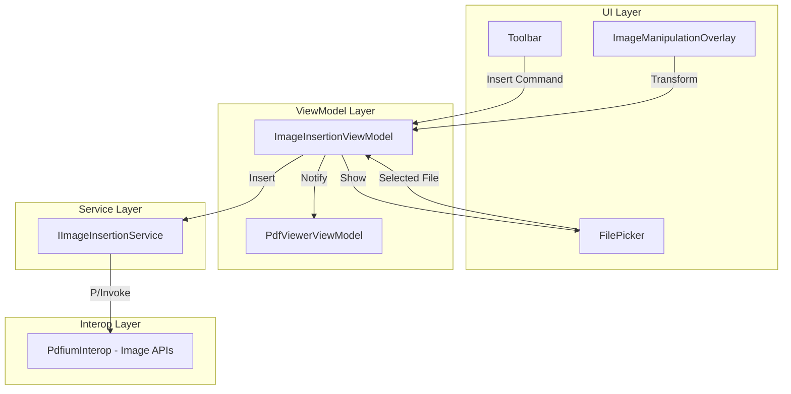

# Design Document

## Overview

The Image Insertion feature adds capability to embed images into PDF pages. It uses PDFium's FPDFPageObj APIs to create image objects and add them to pages. A visual overlay control provides selection handles for positioning, scaling, and rotation.

## Steering Document Alignment

### Technical Standards (tech.md)
- **PDFium Integration**: Uses FPDFPageObj_NewImageObj and related APIs
- **MVVM Pattern**: ImageInsertionViewModel with commands
- **Result Pattern**: FluentResults for operation errors
- **Dependency Injection**: IImageInsertionService registered in DI

### Project Structure (structure.md)
- **Core Services**: IImageInsertionService interface
- **Rendering**: ImageInsertionService using PDFium
- **UI Controls**: ImageManipulationOverlay for visual editing
- **ViewModels**: ImageInsertionViewModel for state management

## Code Reuse Analysis

### Existing Components to Leverage
- **PdfiumInterop**: Extend with image object P/Invoke
- **AnnotationLayer**: Pattern for overlay controls
- **PdfViewerPage**: Host for image manipulation overlay
- **FilePicker patterns**: From existing open/save implementations

### Integration Points
- **PdfViewerPage**: Add image manipulation overlay
- **Toolbar**: Add "Insert Image" button
- **PdfViewerViewModel**: Coordinate with HasUnsavedChanges

## Architecture



## Components and Interfaces

### Component 1: IImageInsertionService
- **Purpose**: Embed and manipulate images in PDF pages
- **Interfaces**:
  ```csharp
  Task<Result<ImageObject>> InsertImageAsync(PdfDocument doc, int pageIndex, string imagePath, PointF position);
  Task<Result> MoveImageAsync(ImageObject image, PointF newPosition);
  Task<Result> ScaleImageAsync(ImageObject image, SizeF newSize);
  Task<Result> RotateImageAsync(ImageObject image, float angleDegrees);
  Task<Result> DeleteImageAsync(ImageObject image);
  ```
- **Dependencies**: PdfiumInterop
- **Reuses**: PDFium P/Invoke patterns

### Component 2: ImageManipulationOverlay
- **Purpose**: Visual control for image selection and transformation
- **Interfaces**: Canvas overlay with selection handles
- **Dependencies**: ImageInsertionViewModel
- **Reuses**: AnnotationLayer overlay pattern

### Component 3: ImageInsertionViewModel
- **Purpose**: Manage image insertion state and commands
- **Interfaces**:
  - `IRelayCommand InsertImageCommand { get; }`
  - `IRelayCommand DeleteSelectedImageCommand { get; }`
  - `ImageObject SelectedImage { get; set; }`
  - `ObservableCollection<ImageObject> InsertedImages { get; }`
- **Dependencies**: IImageInsertionService
- **Reuses**: MVVM command patterns

## Data Models

### ImageObject Class
```csharp
public class ImageObject
{
    public int PageIndex { get; set; }
    public PointF Position { get; set; }
    public SizeF Size { get; set; }
    public float RotationDegrees { get; set; }
    public string SourcePath { get; set; }
    public IntPtr PdfiumHandle { get; set; }
}
```

## Error Handling

### Error Scenarios
1. **Corrupted image file**
   - **Handling**: Validate image before import
   - **User Impact**: Error message with specific issue

2. **Image too large**
   - **Handling**: Warn user, offer to resize
   - **User Impact**: Warning dialog with size info

3. **PDFium insertion fails**
   - **Handling**: Return Result.Fail, cleanup partial state
   - **User Impact**: Error dialog with retry option

## Testing Strategy

### Unit Testing
- ImageInsertionService: Test insert, move, scale, rotate, delete
- ImageInsertionViewModel: Test commands and state

### Integration Testing
- FlaUI: Test Insert Image workflow
- FlaUI: Test image manipulation handles

### End-to-End Testing
- Insert image, save, reopen and verify
- Insert multiple images, verify z-order
