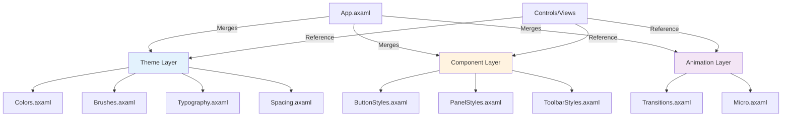
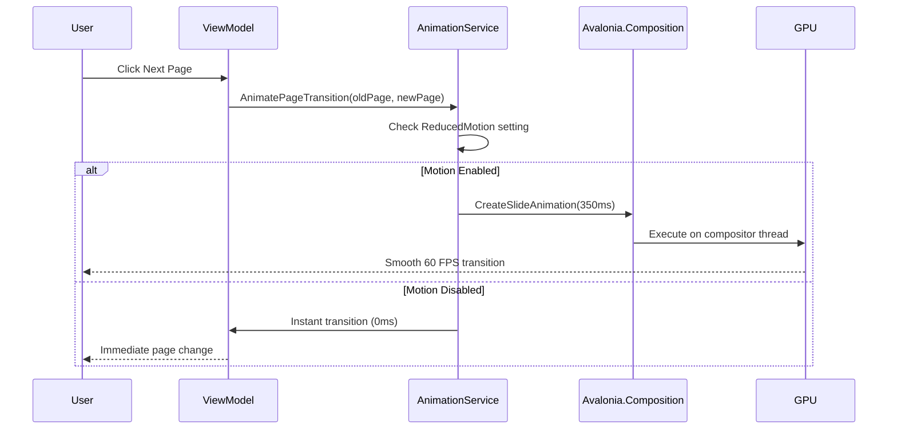

# Design Document: Liquid Glass UI Enhancement

## Overview

This design implements a comprehensive UI/UX transformation for FluentPDF using Avalonia's modern rendering capabilities combined with custom acrylic materials, fluid animations, and modular component architecture. The system leverages Avalonia's GPU-accelerated composition layer to deliver 60 FPS animations while maintaining clean architectural boundaries through MVVM separation and dependency injection.

The design establishes a three-layer resource system (Theme → Components → Pages), implements a centralized animation framework, and creates reusable styled components that can be composed into complex layouts while maintaining visual consistency and performance.

## Steering Document Alignment

### Technical Standards (tech.md)

**MVVM with CommunityToolkit**
- All ViewModels use `[ObservableProperty]` source generators
- Zero WinUI (Avalonia) dependencies in ViewModels - testable as POCOs
- `WeakReferenceMessenger` for cross-component communication

**FluentResults Error Handling**
- Theme loading errors return `Result<Theme>` with structured error codes
- Animation failures degrade gracefully with fallback to instant transitions
- UI errors display user-friendly messages while logging full context

**Dependency Injection**
- `IThemeService`, `IAnimationService` registered in `App.axaml.cs`
- Services injected via constructor in ViewModels
- Mock services in unit tests for isolated testing

**Serilog Structured Logging**
- Theme switches logged with correlation IDs
- Animation performance metrics logged (frame times, dropped frames)
- UI errors captured with full context (ViewMode, PageNumber, etc.)

### Project Structure (structure.md)

```
src/FluentPDF.Avalonia/
├── Styles/
│   ├── Theme/
│   │   ├── Colors.axaml              # Color palette (Light/Dark/HighContrast)
│   │   ├── Brushes.axaml             # Acrylic brushes, gradients
│   │   ├── Typography.axaml          # Font sizes, weights, line heights
│   │   └── Spacing.axaml             # Grid system (4px, 8px, 16px, etc.)
│   ├── Components/
│   │   ├── ButtonStyles.axaml        # Enhanced button with liquid effects
│   │   ├── PanelStyles.axaml         # Frosted glass panels
│   │   ├── ToolbarStyles.axaml       # Acrylic toolbar styling
│   │   └── DialogStyles.axaml        # Modal dialog glass effects
│   └── Animations/
│       ├── Transitions.axaml         # Page transition animations
│       ├── Micro.axaml               # Hover, press, focus effects
│       └── Easing.axaml              # Cubic bezier easing functions
├── Controls/
│   ├── LiquidButton.axaml/.cs        # Button with ripple effect
│   ├── GlassPanel.axaml/.cs          # Frosted glass container
│   └── AnimatedToolbar.axaml/.cs     # Toolbar with slide transitions
├── ViewModels/
│   ├── ThemeViewModel.cs             # Theme switching logic
│   └── AnimationViewModel.cs         # Animation preferences
└── Services/
    ├── IThemeService.cs / ThemeService.cs
    ├── IAnimationService.cs / AnimationService.cs
    └── IPerformanceMonitor.cs / PerformanceMonitor.cs
```

## Code Reuse Analysis

### Existing Components to Leverage

- **PdfViewerViewModel.cs**: Extend with animation hooks for page transitions
- **MainWindow.axaml**: Apply acrylic backdrop, enhance toolbar styling
- **SearchPanel.axaml**: Add slide-in/out animations, frosted glass background
- **ThumbnailsSidebar.axaml**: Implement virtualization with shimmer loading placeholders
- **BookmarksPanel.axaml**: Apply glass panel styling, smooth expand/collapse

### Integration Points

- **ThemeResources.axaml**: Extend with new color definitions and acrylic brushes
- **ButtonStyles.axaml**: Enhance with micro-interaction animations (ripple, scale)
- **App.axaml.cs**: Register `IThemeService` and `IAnimationService` in DI container
- **Serilog Configuration**: Add performance sink for animation metrics

## Architecture

### Layered Theme System



### Animation Service Architecture



### Modular Design Principles

1. **Single File Responsibility**
   - `Colors.axaml`: Only color definitions (hex values, theme variants)
   - `ButtonStyles.axaml`: Only button visual states and styling
   - `Transitions.axaml`: Only animation storyboards and easing functions

2. **Component Isolation**
   - Each UserControl has its own `.axaml` and `.axaml.cs` with paired ViewModel
   - Controls have zero knowledge of parent pages - communicate via events/messages
   - ViewModels depend only on service interfaces, never concrete implementations

3. **Service Layer Separation**
   - **ThemeService**: Manages theme switching, color palette, acrylic opacity
   - **AnimationService**: Orchestrates transitions, checks accessibility settings
   - **PerformanceMonitor**: Tracks FPS, memory usage, logs performance metrics

4. **Utility Modularity**
   - `AcrylicHelper.cs`: GPU-accelerated blur calculations
   - `EasingFunctions.cs`: Cubic bezier curve implementations
   - `ColorExtensions.cs`: Color interpolation, opacity adjustments

## Components and Interfaces

### Component 1: ThemeService

**Purpose:** Centralized theme management with hot-reload support

**Interfaces:**
```csharp
public interface IThemeService
{
    ThemeVariant CurrentTheme { get; }
    IObservable<ThemeVariant> ThemeChanged { get; }
    Task<Result> SetThemeAsync(ThemeVariant theme);
    Color GetAccentColor();
    double GetAcrylicOpacity();
}
```

**Dependencies:**
- `Avalonia.Styling.IResourceProvider` (for runtime theme switching)
- `ILogger<ThemeService>` (Serilog)

**Reuses:**
- Existing `ThemeResources.axaml` as base palette
- Windows `SystemColors` for accent color detection

### Component 2: AnimationService

**Purpose:** GPU-accelerated animation orchestration with accessibility support

**Interfaces:**
```csharp
public interface IAnimationService
{
    bool IsMotionEnabled { get; }
    Task AnimatePageTransitionAsync(Visual oldPage, Visual newPage, TransitionType type);
    Task AnimatePanelSlideAsync(Visual panel, SlideDirection direction, TimeSpan duration);
    Task AnimateFadeAsync(Visual element, double targetOpacity, TimeSpan duration);
    void RegisterAnimation(string name, Animation animation);
}
```

**Dependencies:**
- `Avalonia.Animation.IAnimationService` (built-in)
- `IAccessibilityService` (for reduced motion detection)
- `IPerformanceMonitor` (for FPS tracking)

**Reuses:**
- Avalonia's `Transitions` infrastructure
- Existing `DoubleTransition` and `ThicknessTransition` classes

### Component 3: GlassPanel Control

**Purpose:** Reusable frosted glass container with backdrop blur

**Interfaces:**
```xaml
<GlassPanel BlurRadius="20" TintOpacity="0.6" Elevation="8">
    <!-- Content here -->
</GlassPanel>
```

**Properties:**
- `BlurRadius` (double, default: 20px)
- `TintOpacity` (double, default: 0.6)
- `Elevation` (double, default: 0dp for shadow depth)
- `CornerRadius` (CornerRadius, default: 8px)

**Dependencies:**
- `Avalonia.Media.ExperimentalAcrylicMaterial` (or custom shader)
- `Avalonia.Controls.Border` (base visual)

**Reuses:**
- Avalonia's existing `Panel` base class
- Rendering pipeline for effects

### Component 4: LiquidButton Control

**Purpose:** Button with ripple effect and scale animations

**Interfaces:**
```xaml
<LiquidButton RippleColor="#40FFFFFF"
              ScaleFactor="0.95"
              AnimationDuration="150">
    Click Me
</LiquidButton>
```

**Properties:**
- `RippleColor` (Color with alpha, for ripple effect)
- `ScaleFactor` (double, 0.95 for subtle press feedback)
- `AnimationDuration` (TimeSpan, 150ms default)

**Dependencies:**
- `Avalonia.Animation.Transitions`
- `Avalonia.Input.Pointer events` (for ripple origin point)

**Reuses:**
- Existing `Button` styling from `ButtonStyles.axaml`
- Touch/mouse event infrastructure

### Component 5: PerformanceMonitor

**Purpose:** Real-time FPS tracking and performance logging

**Interfaces:**
```csharp
public interface IPerformanceMonitor
{
    int CurrentFPS { get; }
    long MemoryUsageMB { get; }
    IObservable<PerformanceMetrics> MetricsStream { get; }
    void StartMonitoring();
    void StopMonitoring();
}
```

**Dependencies:**
- `Avalonia.Rendering.IRenderTimer` (for frame callbacks)
- `System.Diagnostics.Process` (for memory tracking)
- `Serilog.ILogger` (for metrics logging)

**Reuses:**
- Existing diagnostic infrastructure
- Performance counters

## Data Models

### ThemeVariant Model
```csharp
public enum ThemeVariant
{
    Light,
    Dark,
    HighContrast
}

public record ThemeColors
{
    public Color Background { get; init; }
    public Color Foreground { get; init; }
    public Color Accent { get; init; }
    public Color AcrylicTint { get; init; }
    public double AcrylicOpacity { get; init; }
}
```

### AnimationConfiguration Model
```csharp
public record AnimationConfig
{
    public bool IsMotionEnabled { get; init; }
    public TimeSpan PageTransitionDuration { get; init; } = TimeSpan.FromMilliseconds(350);
    public TimeSpan PanelSlideDuration { get; init; } = TimeSpan.FromMilliseconds(250);
    public TimeSpan MicroInteractionDuration { get; init; } = TimeSpan.FromMilliseconds(150);
    public EasingFunction DefaultEasing { get; init; } = EasingFunction.CubicEaseOut;
}
```

### PerformanceMetrics Model
```csharp
public record PerformanceMetrics
{
    public int FPS { get; init; }
    public long ManagedMemoryMB { get; init; }
    public long NativeMemoryMB { get; init; }
    public TimeSpan LastFrameTime { get; init; }
    public int DroppedFrames { get; init; }
    public DateTime Timestamp { get; init; }
}
```

## Error Handling

### Error Scenarios

1. **GPU Acceleration Unavailable**
   - **Handling:** Detect in ThemeService initialization, log warning, disable acrylic effects
   - **User Impact:** Solid color backgrounds instead of glass, instant transitions instead of animated
   - **Code:**
     ```csharp
     var gpuAvailable = Application.Current.TryGetResource("SupportsCompositor", out bool supports) && supports;
     if (!gpuAvailable)
     {
         _logger.LogWarning("GPU compositor unavailable, disabling acrylic materials");
         return Result.Fail(new Error("GPU_UNAVAILABLE")
             .WithMetadata("FallbackMode", "SolidColors"));
     }
     ```

2. **Theme Resource Loading Failure**
   - **Handling:** Catch `ResourceNotFoundException`, log error, fall back to default theme
   - **User Impact:** Default light theme applied instead of selected theme
   - **Code:**
     ```csharp
     try
     {
         var themeDict = new ResourceInclude(new Uri("avares://FluentPDF.Avalonia/Styles/Theme/Colors.axaml"));
         Application.Current.Resources.MergedDictionaries.Add(themeDict);
     }
     catch (ResourceNotFoundException ex)
     {
         _logger.LogError(ex, "Failed to load theme resources");
         return Result.Fail(new Error("THEME_LOAD_FAILED")
             .CausedBy(ex)
             .WithMetadata("FallbackTheme", "Light"));
     }
     ```

3. **Animation Frame Drop (< 30 FPS)**
   - **Handling:** PerformanceMonitor detects sustained low FPS, disables complex animations
   - **User Impact:** Simplified animations or instant transitions to maintain responsiveness
   - **Code:**
     ```csharp
     if (_consecutiveLowFrames > 60) // ~1 second at 60 FPS
     {
         _logger.LogWarning("Sustained low FPS detected, simplifying animations");
         AnimationConfig = AnimationConfig with { IsMotionEnabled = false };
     }
     ```

4. **Accessibility Conflict (Reduced Motion)**
   - **Handling:** Detect system setting on startup, disable all animations
   - **User Impact:** All transitions are instant (<16ms), acrylic effects remain
   - **Code:**
     ```csharp
     var reducedMotion = PlatformSettings?.GetColorValues().ReduceTransparency ?? false;
     if (reducedMotion)
     {
         _logger.LogInformation("Reduced motion enabled, disabling animations");
         AnimationConfig = AnimationConfig with { IsMotionEnabled = false };
     }
     ```

## Testing Strategy

### Unit Testing

**Theme Service Tests**
```csharp
[Fact]
public async Task SetTheme_ValidTheme_UpdatesResources()
{
    // Arrange
    var mockResourceProvider = new Mock<IResourceProvider>();
    var themeService = new ThemeService(mockResourceProvider.Object, _logger);

    // Act
    var result = await themeService.SetThemeAsync(ThemeVariant.Dark);

    // Assert
    result.IsSuccess.Should().BeTrue();
    themeService.CurrentTheme.Should().Be(ThemeVariant.Dark);
}
```

**Animation Service Tests**
```csharp
[Fact]
public async Task AnimatePageTransition_MotionDisabled_CompletesInstantly()
{
    // Arrange
    var animService = new AnimationService(new AnimationConfig { IsMotionEnabled = false });
    var visual = new Border();

    // Act
    var sw = Stopwatch.StartNew();
    await animService.AnimatePageTransitionAsync(visual, visual, TransitionType.Slide);
    sw.Stop();

    // Assert
    sw.ElapsedMilliseconds.Should().BeLessThan(50); // Instant, not 350ms
}
```

### Integration Testing

**FlaUI Automation Tests**
```csharp
[Fact]
public void ThemeSwitch_ToggleButton_ChangesVisualAppearance()
{
    using var app = Application.Launch("FluentPDF.Avalonia.exe");
    var window = app.GetMainWindow();

    // Get initial background color
    var initialBg = window.FindFirstDescendant(cf => cf.ByAutomationId("MainPanel"))
        .AsPanel().BackgroundColor;

    // Click theme toggle
    window.FindFirstDescendant(cf => cf.ByAutomationId("ThemeToggle")).AsButton().Click();

    // Verify background changed
    var newBg = window.FindFirstDescendant(cf => cf.ByAutomationId("MainPanel"))
        .AsPanel().BackgroundColor;

    newBg.Should().NotBe(initialBg);
}
```

### Visual Regression Testing

**Verify.Xaml Snapshot Tests**
```csharp
[Fact]
public Task GlassPanel_DarkTheme_MatchesBaseline()
{
    var panel = new GlassPanel
    {
        BlurRadius = 20,
        TintOpacity = 0.6,
        Width = 300,
        Height = 200
    };

    // Apply dark theme
    Application.Current.RequestedThemeVariant = ThemeVariant.Dark;

    // Render and verify
    return Verify(panel).UseDirectory("Snapshots");
}
```

**SSIM Image Comparison**
```csharp
[Fact]
public void AnimatedButton_Hover_PerceptuallyCorrect()
{
    var button = new LiquidButton { Content = "Test" };

    // Render baseline
    var baseline = RenderToImage(button);

    // Simulate hover state
    button.RaiseEvent(new PointerEventArgs(...) { RoutedEvent = PointerMovedEvent });

    // Render after hover
    var hovered = RenderToImage(button);

    // Compare with SSIM (should be different but similar structure)
    var ssim = ImageComparer.SSIM(baseline, hovered);
    ssim.Should().BeInRange(0.85, 0.98); // Changed but recognizably same element
}
```

### Performance Benchmarking

**BenchmarkDotNet Tests**
```csharp
[Benchmark]
public async Task PageTransition_350ms_MaintainsFPS()
{
    var animService = new AnimationService(_config);
    var oldPage = new Border();
    var newPage = new Border();

    var fpsMonitor = new PerformanceMonitor();
    fpsMonitor.StartMonitoring();

    await animService.AnimatePageTransitionAsync(oldPage, newPage, TransitionType.Slide);

    fpsMonitor.StopMonitoring();

    // Assert minimum FPS during animation
    Assert.True(fpsMonitor.MinimumFPS >= 30, "FPS dropped below 30 during transition");
}
```

**Memory Profiling**
```csharp
[MemoryDiagnoser]
public class AcrylicPerformanceTests
{
    [Benchmark]
    public void ApplyAcrylicMaterial_1000Panels()
    {
        for (int i = 0; i < 1000; i++)
        {
            var panel = new GlassPanel { BlurRadius = 20 };
            panel.ApplyTemplate();
        }
    }
}
```

## Implementation Notes

### Acrylic Material Implementation

Avalonia doesn't have native AcrylicBrush, so we implement custom:

```csharp
public class AcrylicMaterial : ExperimentalAcrylicMaterial
{
    public static readonly StyledProperty<double> BlurRadiusProperty =
        AvaloniaProperty.Register<AcrylicMaterial, double>(nameof(BlurRadius), 20.0);

    public double BlurRadius
    {
        get => GetValue(BlurRadiusProperty);
        set => SetValue(BlurRadiusProperty, value);
    }

    // Use compositor shaders for GPU-accelerated blur
    protected override void OnAttachedToVisualTree(VisualTreeAttachmentEventArgs e)
    {
        base.OnAttachedToVisualTree(e);

        var compositor = ElementComposition.GetElementVisual(this)?.Compositor;
        if (compositor != null)
        {
            // Apply backdrop blur shader
            var blurEffect = compositor.CreateGaussianBlurEffect();
            blurEffect.BlurRadius = (float)BlurRadius;
            // ... apply to visual
        }
    }
}
```

### Animation Easing Functions

```csharp
public static class Easing
{
    public static readonly Easing CubicEaseOut = new Easing(0.215, 0.61, 0.355, 1.0);
    public static readonly Easing CubicEaseInOut = new Easing(0.645, 0.045, 0.355, 1.0);

    // Used in XAML:
    // <DoubleAnimation Easing="{StaticResource CubicEaseOut}" Duration="0:0:0.35" />
}
```

### Resource Dictionary Loading Order

Critical for correct theme application:

```xml
<!-- App.axaml -->
<Application.Resources>
    <ResourceDictionary>
        <ResourceDictionary.MergedDictionaries>
            <!-- 1. Theme foundation (colors, brushes) -->
            <ResourceInclude Source="/Styles/Theme/Colors.axaml"/>
            <ResourceInclude Source="/Styles/Theme/Brushes.axaml"/>
            <ResourceInclude Source="/Styles/Theme/Typography.axaml"/>
            <ResourceInclude Source="/Styles/Theme/Spacing.axaml"/>

            <!-- 2. Component styles (reference theme) -->
            <ResourceInclude Source="/Styles/Components/ButtonStyles.axaml"/>
            <ResourceInclude Source="/Styles/Components/PanelStyles.axaml"/>

            <!-- 3. Animations (reference components) -->
            <ResourceInclude Source="/Styles/Animations/Transitions.axaml"/>
            <ResourceInclude Source="/Styles/Animations/Micro.axaml"/>
        </ResourceDictionary.MergedDictionaries>
    </ResourceDictionary>
</Application.Resources>
```

## Performance Optimization Strategies

1. **Virtualization**: ThumbnailsSidebar uses `VirtualizingStackPanel` for 1000+ pages
2. **GPU Offloading**: All animations use `Transitions` (GPU compositor thread)
3. **Lazy Loading**: Acrylic materials only created when panels are visible
4. **Batching**: Multiple simultaneous animations use single composition batch
5. **Caching**: Theme resources cached on first load, reused on subsequent theme switches

## Accessibility Compliance

- **Screen Reader**: All `AutomationProperties.Name` set on interactive elements
- **Keyboard Navigation**: Tab order logical, all actions keyboard-accessible
- **High Contrast**: Acrylic replaced with solid colors, borders enhanced
- **Reduced Motion**: All animations disabled, instant transitions
- **Color Contrast**: WCAG AA compliance (4.5:1 text, 3:1 UI components)
