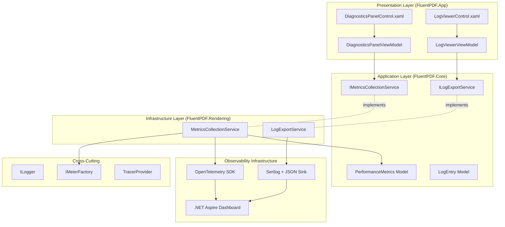

# Design Document

## Overview

The Observability Dashboard provides comprehensive visibility into FluentPDF's runtime behavior through three main components: .NET Aspire Dashboard integration for development, in-app diagnostics panel for production debugging, and structured log viewer with export capabilities. The design leverages existing Serilog and OpenTelemetry infrastructure while adding WinUI 3 controls for in-app observability.

## Steering Document Alignment

### Technical Standards (tech.md)

**Serilog + OpenTelemetry**: Already configured in foundation, extended with OTLP exporter for Aspire Dashboard and metrics collection.

**WinUI 3 + MVVM**: DiagnosticsPanelControl and LogViewerViewModel for in-app diagnostics UI.

**FluentResults**: Export operations return `Result<T>` for error handling.

**Dependency Injection**: IMetricsCollectionService, ILogExportService registered in IHost container.

**ArchUnitNET**: Extended with rules for observability layer (metrics in Core, diagnostics UI in App).

### Project Structure (structure.md)

**FluentPDF.Core**: Contains metrics models and service interfaces.

**FluentPDF.Rendering**: Contains metrics collection implementation (rendering performance tracking).

**FluentPDF.App**: Contains diagnostics panel, log viewer UI, and settings.

**File Organization**:
- `src/FluentPDF.Core/Observability/PerformanceMetrics.cs` - Metrics model
- `src/FluentPDF.Core/Services/IMetricsCollectionService.cs` - Metrics service interface
- `src/FluentPDF.Core/Services/ILogExportService.cs` - Log export service interface
- `src/FluentPDF.Rendering/Services/MetricsCollectionService.cs` - Metrics collection implementation
- `src/FluentPDF.Rendering/Services/LogExportService.cs` - Log export implementation
- `src/FluentPDF.App/Controls/DiagnosticsPanelControl.xaml` - Diagnostics overlay
- `src/FluentPDF.App/Controls/LogViewerControl.xaml` - Log viewer UI
- `src/FluentPDF.App/ViewModels/DiagnosticsPanelViewModel.cs` - Diagnostics presentation logic
- `src/FluentPDF.App/ViewModels/LogViewerViewModel.cs` - Log viewer presentation logic

## Code Reuse Analysis

### Existing Components to Leverage

- **Serilog Configuration**: Extend with OTLP sink for Aspire Dashboard, JSON file sink already configured
- **OpenTelemetry Setup**: Add MeterProvider and TracerProvider for metrics and traces
- **PdfRenderingService**: Instrument with metrics collection (render time, FPS tracking)
- **App Settings**: Extend with diagnostics configuration (enabled/disabled, refresh interval, log retention)
- **WinUI 3 Controls**: Use InfoBar, ListView, ProgressRing for diagnostics UI

### Integration Points

- **Rendering Pipeline**: Inject metrics collection into PdfRenderingService to track render times
- **Application Startup**: Configure OpenTelemetry and Aspire OTLP endpoint in App.xaml.cs
- **Settings UI**: Add diagnostics section to existing settings page
- **Keyboard Shortcuts**: Register Ctrl+Shift+D and Ctrl+Shift+L in PdfViewerPage
- **Log Files**: Read from Serilog JSON files in ApplicationData.LocalFolder/logs

## Architecture

The Observability Dashboard follows a layered architecture integrating with existing logging and metrics infrastructure:



### Modular Design Principles

- **Single File Responsibility**: Metrics collection (service), log export (service), diagnostics UI (control), log viewer (separate control)
- **Component Isolation**: Metrics service, export service, and UI controls independently testable
- **Service Layer Separation**: Business logic in services, presentation logic in ViewModels
- **Interface Abstraction**: All observability services behind interfaces for mocking

## Components and Interfaces

### Component 1: PerformanceMetrics Model

- **Purpose:** Domain model for runtime performance metrics
- **Location:** `src/FluentPDF.Core/Observability/PerformanceMetrics.cs`
- **Properties:**
  ```csharp
  public class PerformanceMetrics
  {
      public double CurrentFPS { get; init; }
      public long ManagedMemoryMB { get; init; }
      public long NativeMemoryMB { get; init; }
      public long TotalMemoryMB => ManagedMemoryMB + NativeMemoryMB;
      public double LastRenderTimeMs { get; init; }
      public int CurrentPageNumber { get; init; }
      public DateTime Timestamp { get; init; }
      public PerformanceLevel Level { get; init; }  // Good, Warning, Critical
  }

  public enum PerformanceLevel
  {
      Good,      // FPS >= 30, Memory < 500MB
      Warning,   // FPS 15-30, Memory 500-1000MB
      Critical   // FPS < 15, Memory > 1000MB
  }
  ```
- **Reuses:** None (new model)

### Component 2: LogEntry Model

- **Purpose:** Domain model representing a structured log entry
- **Location:** `src/FluentPDF.Core/Observability/LogEntry.cs`
- **Properties:**
  ```csharp
  public class LogEntry
  {
      public required DateTime Timestamp { get; init; }
      public required LogLevel Level { get; init; }
      public required string Message { get; init; }
      public string? CorrelationId { get; init; }
      public required string Component { get; init; }  // Namespace
      public Dictionary<string, object> Context { get; init; } = new();
      public string? Exception { get; init; }
      public string? StackTrace { get; init; }
  }

  public enum LogLevel
  {
      Trace,
      Debug,
      Information,
      Warning,
      Error,
      Critical
  }
  ```
- **Reuses:** None (new model)

### Component 3: IMetricsCollectionService (Service Interface)

- **Purpose:** Contract for performance metrics collection and reporting
- **Location:** `src/FluentPDF.Core/Services/IMetricsCollectionService.cs`
- **Methods:**
  ```csharp
  public interface IMetricsCollectionService
  {
      void RecordFPS(double fps);
      void RecordRenderTime(int pageNumber, double milliseconds);
      void RecordMemoryUsage(long managedMB, long nativeMB);
      PerformanceMetrics GetCurrentMetrics();
      IReadOnlyList<PerformanceMetrics> GetMetricsHistory(TimeSpan duration);
      Task<Result> ExportMetricsAsync(string filePath, ExportFormat format);
  }

  public enum ExportFormat
  {
      Json,
      Csv
  }
  ```
- **Reuses:** `Result<T>` pattern

### Component 4: MetricsCollectionService (Service Implementation)

- **Purpose:** Implements metrics collection using OpenTelemetry and in-memory storage
- **Location:** `src/FluentPDF.Rendering/Services/MetricsCollectionService.cs`
- **Dependencies:** `IMeterFactory`, `ILogger<MetricsCollectionService>`
- **Key Operations:**
  - **RecordFPS**: Update FPS gauge, add to history buffer (circular buffer, 1000 samples)
  - **RecordRenderTime**: Record histogram metric, calculate average render time
  - **RecordMemoryUsage**: Query GC for managed memory, track native memory, update gauges
  - **GetCurrentMetrics**: Return latest metrics snapshot with performance level calculation
  - **GetMetricsHistory**: Return recent metrics within time window (last N minutes)
  - **ExportMetricsAsync**: Write metrics to JSON or CSV file
- **OpenTelemetry Instruments:**
  ```csharp
  private readonly Meter _meter;
  private readonly ObservableGauge<double> _fpsGauge;
  private readonly ObservableGauge<long> _managedMemoryGauge;
  private readonly ObservableGauge<long> _nativeMemoryGauge;
  private readonly Histogram<double> _renderTimeHistogram;
  ```
- **Performance Level Logic:**
  - Good: FPS >= 30 AND Memory < 500MB
  - Warning: FPS 15-30 OR Memory 500-1000MB
  - Critical: FPS < 15 OR Memory > 1000MB
- **Reuses:** OpenTelemetry SDK, Serilog logging

### Component 5: ILogExportService (Service Interface)

- **Purpose:** Contract for log reading and exporting
- **Location:** `src/FluentPDF.Core/Services/ILogExportService.cs`
- **Methods:**
  ```csharp
  public interface ILogExportService
  {
      Task<Result<IReadOnlyList<LogEntry>>> GetRecentLogsAsync(int count);
      Task<Result<IReadOnlyList<LogEntry>>> FilterLogsAsync(LogFilterCriteria criteria);
      Task<Result> ExportLogsAsync(IReadOnlyList<LogEntry> logs, string filePath);
  }

  public class LogFilterCriteria
  {
      public LogLevel? MinimumLevel { get; init; }
      public string? CorrelationId { get; init; }
      public string? ComponentFilter { get; init; }
      public DateTime? StartTime { get; init; }
      public DateTime? EndTime { get; init; }
      public string? SearchText { get; init; }
  }
  ```
- **Reuses:** `Result<T>` pattern

### Component 6: LogExportService (Service Implementation)

- **Purpose:** Reads Serilog JSON log files and provides filtering/export
- **Location:** `src/FluentPDF.Rendering/Services/LogExportService.cs`
- **Dependencies:** `ILogger<LogExportService>`
- **Key Operations:**
  - **GetRecentLogsAsync**: Read JSON log files from ApplicationData.LocalFolder/logs, parse last N entries
  - **FilterLogsAsync**: Apply filters (level, correlation ID, component, time range, search) to log entries
  - **ExportLogsAsync**: Write filtered logs to JSON file (preserving Serilog format)
- **Log File Reading Strategy:**
  - Read most recent log file first (log-YYYYMMDD.json)
  - If not enough entries, read previous day's files (rolling window)
  - Parse JSON using System.Text.Json
  - Cache parsed logs in memory (LRU cache, max 10,000 entries)
- **Filter Logic:**
  - Level: >= MinimumLevel (Debug shows Debug, Info, Warning, Error, Critical)
  - Correlation ID: Exact match
  - Component: StartsWith match (e.g., "FluentPDF.Rendering" matches all rendering logs)
  - Time Range: Timestamp between StartTime and EndTime
  - Search: Case-insensitive Contains on Message field
- **Reuses:** Serilog JSON format, System.Text.Json

### Component 7: DiagnosticsPanelControl (WinUI Custom Control)

- **Purpose:** In-app overlay showing real-time performance metrics
- **Location:** `src/FluentPDF.App/Controls/DiagnosticsPanelControl.xaml`
- **UI Layout:**
  ```xml
  <Border Background="{ThemeResource AcrylicBackgroundFillColorDefaultBrush}"
          CornerRadius="8"
          Padding="16"
          HorizontalAlignment="Right"
          VerticalAlignment="Top"
          Margin="16">
      <StackPanel Spacing="8">
          <TextBlock Text="Diagnostics" Style="{StaticResource SubtitleTextBlockStyle}"/>

          <!-- FPS -->
          <StackPanel Orientation="Horizontal" Spacing="8">
              <FontIcon Glyph="&#xE7C4;" Foreground="{Binding FPSColor}"/>
              <TextBlock Text="FPS:"/>
              <TextBlock Text="{Binding CurrentFPS, StringFormat='{}{0:F1}'}" Foreground="{Binding FPSColor}"/>
          </StackPanel>

          <!-- Memory -->
          <StackPanel Orientation="Horizontal" Spacing="8">
              <FontIcon Glyph="&#xE7B8;"/>
              <TextBlock Text="Memory:"/>
              <TextBlock Text="{Binding TotalMemoryMB, StringFormat='{}{0} MB'}"/>
              <TextBlock Text="(M:" FontSize="10"/>
              <TextBlock Text="{Binding ManagedMemoryMB}" FontSize="10"/>
              <TextBlock Text="/ N:" FontSize="10"/>
              <TextBlock Text="{Binding NativeMemoryMB}" FontSize="10"/>
              <TextBlock Text=")" FontSize="10"/>
          </StackPanel>

          <!-- Render Time -->
          <StackPanel Orientation="Horizontal" Spacing="8">
              <FontIcon Glyph="&#xE916;"/>
              <TextBlock Text="Last Render:"/>
              <TextBlock Text="{Binding LastRenderTimeMs, StringFormat='{}{0:F0} ms'}"/>
          </StackPanel>

          <!-- Current Page -->
          <StackPanel Orientation="Horizontal" Spacing="8">
              <FontIcon Glyph="&#xE8A5;"/>
              <TextBlock Text="Page:"/>
              <TextBlock Text="{Binding CurrentPageNumber}"/>
          </StackPanel>

          <!-- Buttons -->
          <StackPanel Orientation="Horizontal" Spacing="8" Margin="0,8,0,0">
              <Button Content="Export Metrics" Command="{Binding ExportMetricsCommand}" FontSize="12"/>
              <Button Content="View Logs" Command="{Binding OpenLogViewerCommand}" FontSize="12"/>
          </StackPanel>
      </StackPanel>
  </Border>
  ```
- **Color Coding:**
  - FPS Green: >= 30, Yellow: 15-30, Red: < 15
  - Memory Green: < 500MB, Yellow: 500-1000MB, Red: > 1000MB
- **Reuses:** WinUI 3 Border, StackPanel, TextBlock, FontIcon

### Component 8: DiagnosticsPanelViewModel

- **Purpose:** Presentation logic for diagnostics panel
- **Location:** `src/FluentPDF.App/ViewModels/DiagnosticsPanelViewModel.cs`
- **Observable Properties:**
  ```csharp
  [ObservableProperty] private double _currentFPS;
  [ObservableProperty] private long _managedMemoryMB;
  [ObservableProperty] private long _nativeMemoryMB;
  [ObservableProperty] private long _totalMemoryMB;
  [ObservableProperty] private double _lastRenderTimeMs;
  [ObservableProperty] private int _currentPageNumber;
  [ObservableProperty] private SolidColorBrush _fpsColor = new(Colors.Green);
  [ObservableProperty] private bool _isVisible;
  ```
- **Commands:**
  ```csharp
  [RelayCommand] private async Task ExportMetricsAsync();
  [RelayCommand] private void OpenLogViewer();
  [RelayCommand] private void ToggleVisibility();
  ```
- **Periodic Update Logic:**
  - Use DispatcherTimer with 500ms interval
  - Call IMetricsCollectionService.GetCurrentMetrics()
  - Update observable properties
  - Calculate color based on performance level
- **Dependencies:** `IMetricsCollectionService`, `ILogger<DiagnosticsPanelViewModel>`
- **Reuses:** ObservableObject, RelayCommand from CommunityToolkit.Mvvm

### Component 9: LogViewerControl (WinUI Custom Control)

- **Purpose:** In-app structured log viewer with filtering
- **Location:** `src/FluentPDF.App/Controls/LogViewerControl.xaml`
- **UI Layout:**
  - Top: Filter controls (Severity dropdown, Correlation ID textbox, Component filter, Search box, Time range pickers)
  - Middle: ListView of log entries (ItemTemplate: Timestamp, Level icon, Message, Correlation ID)
  - Bottom: Details panel (expands when log entry clicked, shows full context, exception, stack trace)
  - Toolbar: Refresh button, Export button, Clear filters button
- **ListView ItemTemplate:**
  ```xml
  <DataTemplate x:DataType="local:LogEntry">
      <Grid Padding="8" Background="{Binding Level, Converter={StaticResource LevelToBackgroundConverter}}">
          <Grid.ColumnDefinitions>
              <ColumnDefinition Width="150"/>
              <ColumnDefinition Width="Auto"/>
              <ColumnDefinition Width="*"/>
              <ColumnDefinition Width="200"/>
          </Grid.ColumnDefinitions>
          <TextBlock Grid.Column="0" Text="{Binding Timestamp, StringFormat='{}{0:HH:mm:ss.fff}'}"/>
          <FontIcon Grid.Column="1" Glyph="{Binding Level, Converter={StaticResource LevelToIconConverter}}"/>
          <TextBlock Grid.Column="2" Text="{Binding Message}" TextTrimming="CharacterEllipsis"/>
          <TextBlock Grid.Column="3" Text="{Binding CorrelationId}" FontFamily="Consolas" FontSize="10"/>
      </Grid>
  </DataTemplate>
  ```
- **Reuses:** WinUI 3 ListView, ComboBox, TextBox, DatePicker, Button

### Component 10: LogViewerViewModel

- **Purpose:** Presentation logic for log viewer with filtering
- **Location:** `src/FluentPDF.App/ViewModels/LogViewerViewModel.cs`
- **Observable Properties:**
  ```csharp
  [ObservableProperty] private ObservableCollection<LogEntry> _logEntries = new();
  [ObservableProperty] private LogEntry? _selectedLogEntry;
  [ObservableProperty] private LogLevel _minimumLevel = LogLevel.Debug;
  [ObservableProperty] private string _correlationIdFilter = string.Empty;
  [ObservableProperty] private string _componentFilter = string.Empty;
  [ObservableProperty] private string _searchText = string.Empty;
  [ObservableProperty] private DateTime? _startTime;
  [ObservableProperty] private DateTime? _endTime;
  [ObservableProperty] private bool _isLoading;
  ```
- **Commands:**
  ```csharp
  [RelayCommand] private async Task LoadLogsAsync();
  [RelayCommand] private async Task ApplyFiltersAsync();
  [RelayCommand] private void ClearFilters();
  [RelayCommand] private async Task ExportLogsAsync();
  [RelayCommand] private void CopyCorrelationId(string correlationId);
  ```
- **Filter Application:**
  - Build LogFilterCriteria from filter properties
  - Call ILogExportService.FilterLogsAsync()
  - Update LogEntries collection
  - Show result count in status bar
- **Dependencies:** `ILogExportService`, `ILogger<LogViewerViewModel>`
- **Reuses:** ObservableObject, RelayCommand from CommunityToolkit.Mvvm

### Component 11: .NET Aspire Dashboard Integration

- **Purpose:** Configure OpenTelemetry OTLP export to Aspire Dashboard
- **Location:** `src/FluentPDF.App/App.xaml.cs` (modify ConfigureServices)
- **Configuration:**
  ```csharp
  // Add OpenTelemetry with OTLP exporters
  services.AddOpenTelemetry()
      .WithMetrics(metrics => metrics
          .AddMeter("FluentPDF.Rendering")
          .AddOtlpExporter(options =>
          {
              options.Endpoint = new Uri("http://localhost:4317");
              options.Protocol = OtlpExportProtocol.Grpc;
          }))
      .WithTracing(tracing => tracing
          .AddSource("FluentPDF.Rendering")
          .SetResourceBuilder(ResourceBuilder.CreateDefault()
              .AddService("FluentPDF.Desktop", serviceVersion: "1.0.0"))
          .AddOtlpExporter(options =>
          {
              options.Endpoint = new Uri("http://localhost:4317");
              options.Protocol = OtlpExportProtocol.Grpc;
          }));

  // Configure Serilog with OTLP sink
  Log.Logger = new LoggerConfiguration()
      .MinimumLevel.Debug()
      .Enrich.FromLogContext()
      .WriteTo.OpenTelemetry(options =>
      {
          options.Endpoint = "http://localhost:4317";
          options.Protocol = OtlpProtocol.Grpc;
          options.ResourceAttributes = new Dictionary<string, object>
          {
              ["service.name"] = "FluentPDF.Desktop",
              ["service.version"] = "1.0.0"
          };
      })
      .CreateLogger();
  ```
- **Graceful Fallback:** If localhost:4317 not reachable, OTLP exporter silently drops data
- **Development Script:** Provide docker-compose.yml to run Aspire Dashboard:
  ```yaml
  version: '3.8'
  services:
    aspire-dashboard:
      image: mcr.microsoft.com/dotnet/aspire-dashboard:8.0
      ports:
        - "4317:4317"  # OTLP gRPC
        - "18888:18888"  # Dashboard UI
      environment:
        - DOTNET_DASHBOARD_UNSECURED_ALLOW_ANONYMOUS=true
  ```

### Component 12: Distributed Tracing in Rendering Service

- **Purpose:** Instrument PdfRenderingService with OpenTelemetry tracing
- **Location:** `src/FluentPDF.Rendering/Services/PdfRenderingService.cs` (modify)
- **Instrumentation:**
  ```csharp
  private readonly ActivitySource _activitySource = new("FluentPDF.Rendering");

  public async Task<Result<BitmapImage>> RenderPageAsync(...)
  {
      using var activity = _activitySource.StartActivity("RenderPage");
      activity?.SetTag("page.number", pageNumber);
      activity?.SetTag("zoom.level", zoomLevel);

      var correlationId = Guid.NewGuid().ToString();
      activity?.SetTag("correlation.id", correlationId);

      try
      {
          using var loadActivity = _activitySource.StartActivity("LoadPage");
          // ... load page code ...

          using var renderActivity = _activitySource.StartActivity("RenderBitmap");
          // ... render code ...

          using var convertActivity = _activitySource.StartActivity("ConvertToImage");
          // ... convert code ...

          activity?.SetTag("render.time.ms", stopwatch.ElapsedMilliseconds);
          return Result.Ok(image);
      }
      catch (Exception ex)
      {
          activity?.SetStatus(ActivityStatusCode.Error, ex.Message);
          activity?.RecordException(ex);
          throw;
      }
  }
  ```
- **Span Attributes:** page.number, zoom.level, correlation.id, render.time.ms
- **Reuses:** System.Diagnostics.ActivitySource

## Data Models

### PerformanceMetrics (detailed)
```csharp
namespace FluentPDF.Core.Observability;

public class PerformanceMetrics
{
    public double CurrentFPS { get; init; }
    public long ManagedMemoryMB { get; init; }
    public long NativeMemoryMB { get; init; }
    public long TotalMemoryMB => ManagedMemoryMB + NativeMemoryMB;
    public double LastRenderTimeMs { get; init; }
    public int CurrentPageNumber { get; init; }
    public DateTime Timestamp { get; init; } = DateTime.UtcNow;
    public PerformanceLevel Level { get; init; }

    public static PerformanceLevel CalculateLevel(double fps, long totalMemoryMB)
    {
        if (fps < 15 || totalMemoryMB > 1000)
            return PerformanceLevel.Critical;
        if (fps < 30 || totalMemoryMB > 500)
            return PerformanceLevel.Warning;
        return PerformanceLevel.Good;
    }
}
```

### LogFilterCriteria (detailed)
```csharp
namespace FluentPDF.Core.Observability;

public class LogFilterCriteria
{
    public LogLevel? MinimumLevel { get; init; }
    public string? CorrelationId { get; init; }
    public string? ComponentFilter { get; init; }
    public DateTime? StartTime { get; init; }
    public DateTime? EndTime { get; init; }
    public string? SearchText { get; init; }

    public bool Matches(LogEntry entry)
    {
        if (MinimumLevel.HasValue && entry.Level < MinimumLevel.Value)
            return false;

        if (!string.IsNullOrEmpty(CorrelationId) && entry.CorrelationId != CorrelationId)
            return false;

        if (!string.IsNullOrEmpty(ComponentFilter) && !entry.Component.StartsWith(ComponentFilter, StringComparison.OrdinalIgnoreCase))
            return false;

        if (StartTime.HasValue && entry.Timestamp < StartTime.Value)
            return false;

        if (EndTime.HasValue && entry.Timestamp > EndTime.Value)
            return false;

        if (!string.IsNullOrEmpty(SearchText) && !entry.Message.Contains(SearchText, StringComparison.OrdinalIgnoreCase))
            return false;

        return true;
    }
}
```

## Error Handling

### Error Scenarios

1. **Aspire Dashboard Unavailable**
   - **Handling:** OTLP exporter silently drops metrics/logs, app continues normally
   - **User Impact:** None (graceful fallback, logs still written to files)

2. **Log File Not Found**
   - **Handling:** Return `Result.Ok(emptyList)` with log message "No log files found"
   - **User Impact:** Log viewer shows "No logs available" message

3. **Export Failed (Disk Full)**
   - **Handling:** Return `Result.Fail(new PdfError("EXPORT_FAILED", ErrorCategory.IO))`
   - **User Impact:** Error dialog: "Failed to export: Disk is full"

4. **Log File Corrupted (Invalid JSON)**
   - **Handling:** Skip corrupted entries, log warning, continue with valid entries
   - **User Impact:** Some logs may be missing, warning shown in log viewer

5. **Metrics Collection Overhead Too High**
   - **Handling:** Increase refresh interval dynamically (500ms → 1000ms → 2000ms)
   - **User Impact:** Slower metrics updates, but app remains responsive

## Testing Strategy

### Unit Testing

**FluentPDF.Rendering.Tests/Services/MetricsCollectionServiceTests.cs**:
- Test RecordFPS updates gauge
- Test RecordRenderTime adds histogram sample
- Test RecordMemoryUsage tracks managed and native memory
- Test GetCurrentMetrics returns correct snapshot
- Test performance level calculation
- Test metrics history buffer (circular buffer, max 1000)

**FluentPDF.Rendering.Tests/Services/LogExportServiceTests.cs**:
- Mock log files in temp directory
- Test GetRecentLogsAsync reads JSON and parses entries
- Test FilterLogsAsync applies filters correctly
- Test ExportLogsAsync writes valid JSON
- Test correlation ID filtering
- Test time range filtering

**FluentPDF.App.Tests/ViewModels/DiagnosticsPanelViewModelTests.cs**:
- Mock IMetricsCollectionService
- Test periodic update timer fires and updates properties
- Test color calculation based on performance level
- Test ExportMetricsCommand calls service
- Test ToggleVisibility toggles IsVisible

**FluentPDF.App.Tests/ViewModels/LogViewerViewModelTests.cs**:
- Mock ILogExportService
- Test LoadLogsAsync populates collection
- Test ApplyFiltersAsync filters logs
- Test ClearFilters resets all filters
- Test ExportLogsCommand exports filtered logs

### Integration Testing

**FluentPDF.App.Tests/Integration/ObservabilityIntegrationTests.cs**:
- Test OpenTelemetry configuration (verify MeterProvider and TracerProvider registered)
- Test metrics collection during actual rendering (load PDF, render pages, verify metrics recorded)
- Test log file reading (write test logs to JSON file, read via LogExportService)
- Test Aspire OTLP export (if Aspire running, verify logs/metrics sent)
- Test distributed tracing (render page, verify activity spans created)

### End-to-End Testing

**FluentPDF.App.Tests/E2E/ObservabilityE2ETests.cs**:
- Use FlaUI for UI automation
- Test complete workflow:
  1. Open PDF and render pages
  2. Press Ctrl+Shift+D to open diagnostics panel
  3. Verify metrics display (FPS, memory, render time)
  4. Press Ctrl+Shift+L to open log viewer
  5. Apply filters (correlation ID, severity)
  6. Export logs to JSON
  7. Verify exported file is valid JSON

### Architecture Testing

**FluentPDF.Architecture.Tests/ObservabilityArchitectureTests.cs**:
- Test observability services only in Core/Rendering namespaces
- Test diagnostics UI only in App/Controls
- Test ViewModels use service interfaces, not direct metrics collection
- Test MetricsCollectionService implements IMetricsCollectionService

## Performance Considerations

### Metrics Collection Optimization
- **Sampling:** Only collect detailed metrics when diagnostics mode enabled
- **Buffering:** Use circular buffer for metrics history (max 1000 samples, O(1) insertion)
- **Async Updates:** Update UI on background thread, marshal to UI thread only for display

### Log File Reading Optimization
- **Lazy Loading:** Only read log files when log viewer opened
- **Caching:** Cache parsed logs in memory (LRU cache, max 10,000 entries)
- **Streaming:** Read large log files in chunks (1MB at a time)
- **Indexing:** Build in-memory index of correlation IDs for fast filtering

### UI Performance
- **Virtualization:** ListView in log viewer uses UI virtualization (only render visible items)
- **Throttling:** Diagnostics panel updates throttled to 500ms (avoid overwhelming UI thread)
- **Background Filtering:** Apply log filters on background thread, update UI only when complete

## Dependency Injection Registration

**App.xaml.cs ConfigureServices**:
```csharp
// Register observability services
services.AddSingleton<IMetricsCollectionService, MetricsCollectionService>();
services.AddSingleton<ILogExportService, LogExportService>();
services.AddTransient<DiagnosticsPanelViewModel>();
services.AddTransient<LogViewerViewModel>();

// Configure OpenTelemetry
services.AddOpenTelemetry()
    .WithMetrics(...)
    .WithTracing(...);
```

## Future Enhancements

- **Real-time Aspire Dashboard View**: Embed Aspire Dashboard UI in app (WebView2 iframe)
- **Performance Profiling**: CPU profiling integration (dotnet-trace)
- **Memory Snapshots**: Heap snapshot capture for memory leak analysis
- **Custom Metrics**: Allow users to define custom metrics via settings
- **Alerting**: Configurable alerts when metrics exceed thresholds
- **Historical Trends**: Store metrics over time, show trend graphs (last 7 days)
- **Remote Logging**: Optional secure logging to remote endpoint (enterprise feature)
- **AI Quality Agent Integration**: Webhook to send metrics/logs to AI quality agent for analysis
