# Design Document

## Overview

The Office Document Conversion feature implements a lightweight .docx to PDF conversion pipeline using Mammoth.NET for semantic parsing and WebView2 for Chromium-based PDF rendering. The design prioritizes quality, maintainability, and observability while keeping the solution lightweight compared to LibreOffice integration (5MB vs 300MB).

## Steering Document Alignment

### Technical Standards (tech.md)

**Mammoth.NET + WebView2**: Uses NuGet package for DOCX parsing and built-in WebView2 for PDF generation via CoreWebView2.PrintToPdfAsync.

**FluentResults**: All service operations return `Result<T>` with structured errors (DOCX_PARSE_FAILED, PDF_GENERATION_FAILED, WEBVIEW2_NOT_FOUND).

**Serilog + OpenTelemetry**: All conversion operations logged with correlation IDs, conversion time, file sizes, and quality metrics.

**Dependency Injection**: All services registered in IHost container with interface-based abstraction for testability.

**Quality Validation**: Optional SSIM-based comparison against LibreOffice baseline using OpenCvSharp.

### Project Structure (structure.md)

**FluentPDF.Core**: Contains service interfaces (IDocxConverterService, IQualityValidationService) and domain models.

**FluentPDF.Rendering**: Contains concrete implementations (DocxConverterService, HtmlToPdfService, LibreOfficeValidator).

**FluentPDF.App**: Contains conversion UI (ConversionPage, ConversionViewModel).

**File Organization**:
- `src/FluentPDF.Core/Services/IDocxConverterService.cs` - Service interface
- `src/FluentPDF.Rendering/Services/DocxConverterService.cs` - Mammoth + WebView2 pipeline
- `src/FluentPDF.Rendering/Services/HtmlToPdfService.cs` - WebView2 PDF generation
- `src/FluentPDF.Rendering/Services/LibreOfficeValidator.cs` - Quality validation
- `src/FluentPDF.App/ViewModels/ConversionViewModel.cs` - Presentation logic
- `src/FluentPDF.App/Views/ConversionPage.xaml` - UI

## Code Reuse Analysis

### Existing Components to Leverage

- **PdfError + FluentResults**: Extend with new error codes (DOCX_PARSE_FAILED, PDF_GENERATION_FAILED, WEBVIEW2_NOT_FOUND, DOCX_PASSWORD_PROTECTED, DOCX_CORRUPTED)
- **SerilogConfiguration**: Use existing structured logging for conversion performance metrics
- **INavigationService**: Navigate to ConversionPage from MainWindow
- **Global Exception Handlers**: Catch unhandled errors in conversion pipeline
- **App.xaml.cs DI Container**: Register new services (IDocxConverterService, IQualityValidationService)
- **PdfRenderingService**: Reuse for rendering converted PDFs to images for SSIM comparison

### Integration Points

- **File Picker**: Use WinUI's FileOpenPicker with .docx filter and FileSavePicker for PDF output
- **PDF Viewer**: After conversion, navigate to PdfViewerPage with converted PDF path
- **Dependency Injection**: Register services in existing IHost container
- **Error Handling**: All service methods return `Result<T>` following foundation pattern
- **Logging**: Use `ILogger<T>` injected via DI for all operations
- **Quality Validation**: Use existing OpenCvSharp integration from visual regression testing

## Architecture

The Office Document Conversion follows a pipeline architecture with three main stages:

```mermaid
graph TB
    subgraph "Presentation Layer (FluentPDF.App)"
        ConversionPage[ConversionPage.xaml]
        ConversionVM[ConversionViewModel]
    end

    subgraph "Application Layer (FluentPDF.Core)"
        IDocxConverter[IDocxConverterService]
        IQualityVal[IQualityValidationService]
        ConversionResult[ConversionResult Model]
    end

    subgraph "Infrastructure Layer (FluentPDF.Rendering)"
        DocxConverter[DocxConverterService]
        HtmlToPdf[HtmlToPdfService]
        LibreOfficeVal[LibreOfficeValidator]
        MammothLib[Mammoth.NET Library]
        WebView2[WebView2 CoreWebView2]
        LibreOffice[LibreOffice CLI]
    end

    subgraph "Cross-Cutting"
        Logger[ILogger + Serilog]
        ErrorHandler[PdfError + Result<T>]
    end

    ConversionPage --> ConversionVM
    ConversionVM --> IDocxConverter
    ConversionVM --> IQualityVal
    IDocxConverter -.implements.- DocxConverter
    IQualityVal -.implements.- LibreOfficeVal
    DocxConverter --> MammothLib
    DocxConverter --> HtmlToPdf
    HtmlToPdf --> WebView2
    LibreOfficeVal --> LibreOffice
    LibreOfficeVal --> PdfRenderingService
    DocxConverter --> Logger
    DocxConverter --> ErrorHandler
```



### Conversion Pipeline Flow


### Modular Design Principles

- **Single File Responsibility**: Mammoth parsing, WebView2 rendering, and quality validation are separate services
- **Component Isolation**: Each service is independently testable with mocked dependencies
- **Service Layer Separation**: Business logic in services, presentation logic in ViewModels
- **Pipeline Architecture**: Conversion flows through stages: Parse → Render → Validate

## Components and Interfaces

### Component 1: IDocxConverterService (Service Interface)

- **Purpose:** Contract for DOCX to PDF conversion operations
- **Location:** `src/FluentPDF.Core/Services/IDocxConverterService.cs`
- **Methods:**
  ```csharp
  Task<Result<ConversionResult>> ConvertAsync(
      string docxPath,
      string pdfOutputPath,
      ConversionOptions? options = null,
      CancellationToken cancellationToken = default);
  ```
- **Dependencies:** None (interface)
- **Reuses:** `Result<T>` pattern from foundation

### Component 2: ConversionOptions Model

- **Purpose:** Configuration for conversion pipeline
- **Location:** `src/FluentPDF.Core/Models/ConversionOptions.cs`
- **Properties:**
  ```csharp
  public class ConversionOptions
  {
      public bool EnableQualityValidation { get; init; } = false;
      public double QualityThreshold { get; init; } = 0.85; // SSIM threshold
      public PageOrientation Orientation { get; init; } = PageOrientation.Portrait;
      public PageSize PageSize { get; init; } = PageSize.Letter;
      public bool PreserveImages { get; init; } = true;
      public int TimeoutSeconds { get; init; } = 60;
  }
  ```

### Component 3: ConversionResult Model

- **Purpose:** Result of conversion with quality metrics
- **Location:** `src/FluentPDF.Core/Models/ConversionResult.cs`
- **Properties:**
  ```csharp
  public class ConversionResult
  {
      public required string OutputPath { get; init; }
      public required long OutputSizeBytes { get; init; }
      public required TimeSpan ConversionDuration { get; init; }
      public required int PageCount { get; init; }
      public QualityReport? QualityReport { get; init; }
  }

  public class QualityReport
  {
      public required double SsimScore { get; init; }
      public required bool MeetsThreshold { get; init; }
      public string? ComparisonImagePath { get; init; }
      public string? BaselinePdfPath { get; init; }
  }
  ```

### Component 4: DocxConverterService (Service Implementation)

- **Purpose:** Orchestrates DOCX to PDF conversion pipeline
- **Location:** `src/FluentPDF.Rendering/Services/DocxConverterService.cs`
- **Dependencies:** `Mammoth.IDocumentConverter`, `IHtmlToPdfService`, `IQualityValidationService`, `ILogger<DocxConverterService>`
- **Conversion Pipeline:**
  1. Validate input file exists and is valid DOCX
  2. Extract HTML from DOCX using Mammoth.NET
  3. Generate PDF from HTML using WebView2
  4. Optionally validate quality against LibreOffice baseline
  5. Clean up temporary files
  6. Return ConversionResult with metrics
- **Error Codes:**
  - `DOCX_FILE_NOT_FOUND` - Input file doesn't exist
  - `DOCX_INVALID_FORMAT` - Not a valid DOCX file
  - `DOCX_CORRUPTED` - DOCX is corrupted
  - `DOCX_PASSWORD_PROTECTED` - Password-protected DOCX
  - `DOCX_PARSE_FAILED` - Mammoth parsing failed
  - `PDF_GENERATION_FAILED` - WebView2 rendering failed
  - `CONVERSION_TIMEOUT` - Conversion exceeded timeout
- **Reuses:** PdfError, Result<T>, Serilog logging

### Component 5: IHtmlToPdfService (Service Interface)

- **Purpose:** Contract for HTML to PDF rendering
- **Location:** `src/FluentPDF.Core/Services/IHtmlToPdfService.cs`
- **Methods:**
  ```csharp
  Task<Result<string>> GeneratePdfAsync(
      string htmlContent,
      string outputPath,
      PrintSettings? settings = null);
  ```

### Component 6: HtmlToPdfService (Service Implementation)

- **Purpose:** Renders HTML to PDF using WebView2
- **Location:** `src/FluentPDF.Rendering/Services/HtmlToPdfService.cs`
- **Dependencies:** `CoreWebView2Environment`, `ILogger<HtmlToPdfService>`
- **Rendering Pipeline:**
  1. Initialize CoreWebView2Environment (singleton)
  2. Create CoreWebView2 instance
  3. NavigateToString(html)
  4. Wait for NavigationCompleted event
  5. Call PrintToPdfAsync with optimized settings
  6. Dispose WebView2 instance
- **Error Codes:**
  - `WEBVIEW2_NOT_FOUND` - WebView2 runtime not installed
  - `WEBVIEW2_INIT_FAILED` - Failed to initialize WebView2 environment
  - `PDF_GENERATION_FAILED` - PrintToPdfAsync failed
- **Print Settings:**
  ```csharp
  var printSettings = new CoreWebView2PrintSettings
  {
      Orientation = CoreWebView2PrintOrientation.Portrait,
      ShouldPrintBackgrounds = true,
      MarginTop = 0.5,
      MarginBottom = 0.5,
      MarginLeft = 0.5,
      MarginRight = 0.5,
      ScaleFactor = 1.0
  };
  ```
- **Reuses:** PdfError, Result<T>, Serilog logging

### Component 7: IQualityValidationService (Service Interface)

- **Purpose:** Contract for quality validation against LibreOffice
- **Location:** `src/FluentPDF.Core/Services/IQualityValidationService.cs`
- **Methods:**
  ```csharp
  Task<Result<QualityReport>> ValidateAsync(
      string docxPath,
      string convertedPdfPath,
      double threshold = 0.85);
  ```

### Component 8: LibreOfficeValidator (Service Implementation)

- **Purpose:** Validates conversion quality using SSIM comparison
- **Location:** `src/FluentPDF.Rendering/Services/LibreOfficeValidator.cs`
- **Dependencies:** `IPdfRenderingService`, `ILogger<LibreOfficeValidator>`
- **Validation Pipeline:**
  1. Check if LibreOffice CLI (soffice) is installed
  2. Convert DOCX to PDF using LibreOffice: `soffice --headless --convert-to pdf:writer_pdf_Export --outdir {temp} {docxPath}`
  3. Render first page of both PDFs to images (1920x1080)
  4. Calculate SSIM using OpenCvSharp
  5. Compare SSIM score to threshold
  6. Save comparison images if score < threshold
  7. Return QualityReport
- **Error Codes:**
  - `LIBREOFFICE_NOT_FOUND` - LibreOffice not installed (skip validation)
  - `BASELINE_CONVERSION_FAILED` - LibreOffice conversion failed
  - `SSIM_CALCULATION_FAILED` - Image comparison failed
- **Reuses:** PdfRenderingService, OpenCvSharp, PdfError, Result<T>

### Component 9: ConversionViewModel

- **Purpose:** Presentation logic for conversion UI
- **Location:** `src/FluentPDF.App/ViewModels/ConversionViewModel.cs`
- **Observable Properties:**
  ```csharp
  [ObservableProperty] private string _docxFilePath = string.Empty;
  [ObservableProperty] private string _pdfOutputPath = string.Empty;
  [ObservableProperty] private bool _isConverting;
  [ObservableProperty] private double _conversionProgress; // 0-100
  [ObservableProperty] private string _statusMessage = "Select a DOCX file to convert";
  [ObservableProperty] private ConversionResult? _lastResult;
  [ObservableProperty] private bool _enableQualityValidation;
  ```
- **Commands:**
  ```csharp
  [RelayCommand] private async Task SelectDocxFileAsync();
  [RelayCommand] private async Task SelectOutputPathAsync();
  [RelayCommand(CanExecute = nameof(CanConvert))] private async Task ConvertAsync();
  [RelayCommand(CanExecute = nameof(CanOpenPdf))] private async Task OpenConvertedPdfAsync();
  ```
- **Dependencies:** `IDocxConverterService`, `INavigationService`, `ILogger<ConversionViewModel>`
- **Reuses:** ObservableObject, RelayCommand from CommunityToolkit.Mvvm

### Component 10: ConversionPage (UI)

- **Purpose:** XAML view for document conversion
- **Location:** `src/FluentPDF.App/Views/ConversionPage.xaml`
- **UI Elements:**
  - **File Selection:**
    - TextBox: DOCX file path (read-only)
    - Button: Browse for DOCX file
    - TextBox: PDF output path (read-only)
    - Button: Browse for output location
  - **Options:**
    - CheckBox: Enable quality validation
  - **Conversion:**
    - Button: Convert to PDF (primary action)
    - ProgressBar: Conversion progress
    - TextBlock: Status message
  - **Results:**
    - StackPanel: Conversion results (visible after conversion)
    - TextBlock: Output file size
    - TextBlock: Conversion time
    - TextBlock: Quality score (if validation enabled)
    - Button: Open PDF
- **Keyboard Accelerators:**
  - Ctrl+Shift+C: Start conversion
- **Reuses:** WinUI 3 controls, data binding to ViewModel

## Data Models

### ConversionOptions
```csharp
public class ConversionOptions
{
    public bool EnableQualityValidation { get; init; } = false;
    public double QualityThreshold { get; init; } = 0.85;
    public PageOrientation Orientation { get; init; } = PageOrientation.Portrait;
    public PageSize PageSize { get; init; } = PageSize.Letter;
    public bool PreserveImages { get; init; } = true;
    public int TimeoutSeconds { get; init; } = 60;
}

public enum PageOrientation { Portrait, Landscape }
public enum PageSize { Letter, A4, Legal }
```

### ConversionResult
```csharp
public class ConversionResult
{
    public required string OutputPath { get; init; }
    public required long OutputSizeBytes { get; init; }
    public required TimeSpan ConversionDuration { get; init; }
    public required int PageCount { get; init; }
    public QualityReport? QualityReport { get; init; }
}
```

### QualityReport
```csharp
public class QualityReport
{
    public required double SsimScore { get; init; }
    public required bool MeetsThreshold { get; init; }
    public string? ComparisonImagePath { get; init; }
    public string? BaselinePdfPath { get; init; }
}
```

## Error Handling

### Error Scenarios

1. **DOCX File Not Found**
   - **Handling:** Return `Result.Fail(new PdfError("DOCX_FILE_NOT_FOUND", ErrorCategory.IO, ErrorSeverity.Error).WithContext("FilePath", path))`
   - **User Impact:** Error dialog: "The DOCX file could not be found."

2. **Invalid DOCX Format**
   - **Handling:** Return `Result.Fail(new PdfError("DOCX_INVALID_FORMAT", ErrorCategory.Validation, ErrorSeverity.Error))`
   - **User Impact:** Error dialog: "The selected file is not a valid DOCX document."

3. **Password-Protected DOCX**
   - **Handling:** Return `Result.Fail(new PdfError("DOCX_PASSWORD_PROTECTED", ErrorCategory.Security, ErrorSeverity.Warning))`
   - **User Impact:** Error dialog: "This DOCX is password-protected. Password support coming soon."

4. **Mammoth Parsing Failure**
   - **Handling:** Return `Result.Fail(new PdfError("DOCX_PARSE_FAILED", ErrorCategory.Conversion, ErrorSeverity.Error))`
   - **User Impact:** Error dialog: "Failed to parse DOCX document. The file may be corrupted."

5. **WebView2 Not Found**
   - **Handling:** Return `Result.Fail(new PdfError("WEBVIEW2_NOT_FOUND", ErrorCategory.System, ErrorSeverity.Critical))`
   - **User Impact:** Error dialog: "WebView2 runtime not found. Please install from: https://go.microsoft.com/fwlink/p/?LinkId=2124703"

6. **PDF Generation Failed**
   - **Handling:** Return `Result.Fail(new PdfError("PDF_GENERATION_FAILED", ErrorCategory.Rendering, ErrorSeverity.Error))`
   - **User Impact:** Error dialog: "Failed to generate PDF. Please try again or report this issue."

7. **Conversion Timeout**
   - **Handling:** Return `Result.Fail(new PdfError("CONVERSION_TIMEOUT", ErrorCategory.System, ErrorSeverity.Error))`
   - **User Impact:** Error dialog: "Conversion timed out. Try converting a smaller document or increase timeout."

## Testing Strategy

### Unit Testing

**FluentPDF.Rendering.Tests/Services/DocxConverterServiceTests.cs**:
- Mock Mammoth.IDocumentConverter and IHtmlToPdfService
- Test ConvertAsync with valid DOCX returns Result.Ok
- Test error codes for missing file, invalid format, etc.
- Test cleanup of temporary files on success and failure
- Test timeout handling

**FluentPDF.Rendering.Tests/Services/HtmlToPdfServiceTests.cs**:
- Mock CoreWebView2Environment
- Test GeneratePdfAsync with valid HTML returns Result.Ok
- Test error handling for WebView2 initialization failures
- Test print settings are correctly applied

**FluentPDF.Rendering.Tests/Services/LibreOfficeValidatorTests.cs**:
- Mock IPdfRenderingService
- Test SSIM calculation with similar images returns score > threshold
- Test SSIM calculation with different images returns score < threshold
- Test LibreOffice not found returns appropriate error
- Test comparison images saved when score < threshold

### Integration Testing

**FluentPDF.Rendering.Tests/Integration/DocxConversionIntegrationTests.cs**:
- Use real Mammoth.NET and WebView2
- Load sample DOCX files from test fixtures
- Verify conversion produces valid PDF
- Verify PDF has correct page count
- Test quality validation with LibreOffice (if installed)
- Verify no resource leaks (WebView2 cleanup)

### End-to-End Testing

**FluentPDF.App.Tests/E2E/ConversionE2ETests.cs**:
- Use FlaUI for UI automation
- Test complete workflow:
  1. Launch app
  2. Navigate to ConversionPage
  3. Select sample DOCX
  4. Select output location
  5. Start conversion
  6. Verify success message
  7. Open converted PDF

## Performance Considerations

### Conversion Optimization
- **WebView2 Reuse:** Initialize WebView2Environment once as singleton, reuse across conversions
- **Async Processing:** All conversion steps async to prevent UI blocking
- **Temp File Cleanup:** Aggressively delete intermediate files to minimize disk usage
- **Queue Management:** Serialize conversions to prevent WebView2 resource contention

### Quality Validation Optimization
- **Optional Validation:** Only run if EnableQualityValidation is true
- **LibreOffice Detection:** Check once at startup, cache result
- **SSIM Caching:** Cache SSIM results for identical documents
- **Parallel Rendering:** Render baseline and converted PDFs in parallel

## Dependency Injection Registration

**App.xaml.cs ConfigureServices**:
```csharp
// Register Mammoth document converter
services.AddSingleton<Mammoth.IDocumentConverter>(sp => new Mammoth.DocumentConverter());

// Register HTML to PDF service
services.AddSingleton<IHtmlToPdfService, HtmlToPdfService>();

// Register quality validation service
services.AddSingleton<IQualityValidationService, LibreOfficeValidator>();

// Register DOCX converter service (orchestrator)
services.AddSingleton<IDocxConverterService, DocxConverterService>();

// Register ViewModels
services.AddTransient<ConversionViewModel>();
```

## Future Enhancements

- **Batch Conversion:** Convert multiple DOCX files in one operation
- **Format Support:** Add .doc (legacy Word) support using Aspose.Words or similar
- **Template Support:** Save/load conversion templates with custom settings
- **Cloud Integration:** Optional OneDrive/SharePoint integration for converting cloud documents
- **Advanced Styling:** Custom CSS injection for better control over PDF appearance
- **Progress Callbacks:** Real-time progress updates during Mammoth parsing
- **Undo/Redo:** Keep conversion history for quick re-conversion
