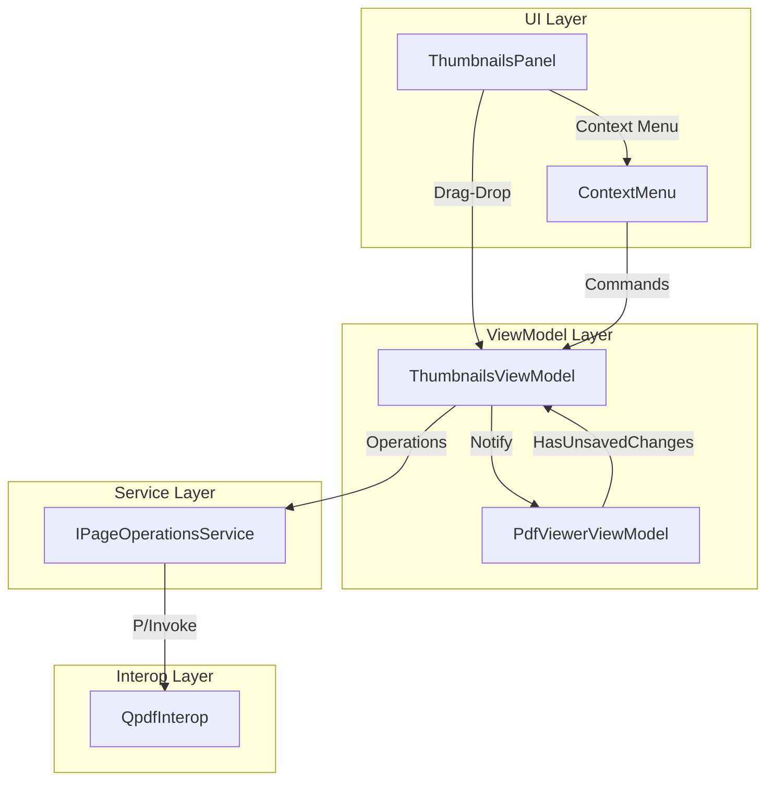

# Design Document

## Overview

The Page Operations feature adds rotate, delete, reorder, and insert capabilities to FluentPDF. It integrates with the existing thumbnails sidebar for visual page management and uses QPDF for lossless page manipulation. Operations track unsaved changes via the save-document spec's HasUnsavedChanges pattern.

## Steering Document Alignment

### Technical Standards (tech.md)
- **MVVM Pattern**: Commands in ThumbnailsViewModel and PdfViewerViewModel
- **Result Pattern**: FluentResults for operation errors
- **QPDF Integration**: Reuses existing QPDF P/Invoke from document-structure-operations
- **Dependency Injection**: IPageOperationsService registered in DI container

### Project Structure (structure.md)
- **Core Services**: IPageOperationsService in FluentPDF.Core
- **Implementation**: PageOperationsService in FluentPDF.Rendering using QPDF
- **ViewModels**: Extend ThumbnailsViewModel with page operation commands
- **UI**: Context menus and drag-drop in ThumbnailsPanel

## Code Reuse Analysis

### Existing Components to Leverage
- **ThumbnailsViewModel**: Already has page selection, extend with operation commands
- **ThumbnailsPanel.xaml**: Add context menu and drag-drop support
- **QpdfInterop**: Existing P/Invoke bindings for QPDF operations
- **IDocumentEditingService**: Pattern for QPDF-based operations
- **HasUnsavedChanges**: From save-document spec for dirty tracking

### Integration Points
- **ThumbnailsPanel**: Context menu for operations, drag-drop for reorder
- **PdfViewerViewModel**: Coordinate page changes with main viewer
- **PdfDocument**: Track page modifications

## Architecture



## Components and Interfaces

### Component 1: IPageOperationsService
- **Purpose**: Perform page-level operations on PDF documents
- **Interfaces**:
  ```csharp
  Task<Result> RotatePagesAsync(PdfDocument doc, int[] pageIndices, RotationAngle angle);
  Task<Result> DeletePagesAsync(PdfDocument doc, int[] pageIndices);
  Task<Result> ReorderPagesAsync(PdfDocument doc, int[] pageIndices, int targetIndex);
  Task<Result> InsertBlankPageAsync(PdfDocument doc, int insertIndex, PageSize size);
  ```
- **Dependencies**: QpdfInterop, IPdfDocumentService
- **Reuses**: QPDF P/Invoke patterns from document-structure-operations

### Component 2: ThumbnailsViewModel Extensions
- **Purpose**: Add page operation commands to thumbnails
- **Interfaces**:
  - `IRelayCommand RotateRightCommand { get; }`
  - `IRelayCommand RotateLeftCommand { get; }`
  - `IRelayCommand DeletePagesCommand { get; }`
  - `IRelayCommand InsertBlankPageCommand { get; }`
  - `void MovePagesTo(int[] indices, int targetIndex)`
- **Dependencies**: IPageOperationsService, PdfViewerViewModel
- **Reuses**: Existing SelectedThumbnails property

### Component 3: ThumbnailsPanel Context Menu
- **Purpose**: Provide right-click menu for page operations
- **Interfaces**: XAML MenuFlyout with operation items
- **Dependencies**: ThumbnailsViewModel commands
- **Reuses**: Existing ThumbnailsPanel.xaml

### Component 4: Drag-Drop Handler
- **Purpose**: Enable page reordering via drag-drop
- **Interfaces**: DragStarting, DragOver, Drop event handlers
- **Dependencies**: ThumbnailsViewModel.MovePagesTo
- **Reuses**: WinUI ListView drag-drop infrastructure

## Data Models

### RotationAngle Enum
```csharp
public enum RotationAngle
{
    Rotate90,   // Clockwise 90°
    Rotate180,  // 180°
    Rotate270   // Counter-clockwise 90° (or clockwise 270°)
}
```

### PageSize Enum
```csharp
public enum PageSize
{
    SameAsCurrent,
    Letter,     // 8.5 x 11 inches
    A4,         // 210 x 297 mm
    Legal       // 8.5 x 14 inches
}
```

## Error Handling

### Error Scenarios
1. **Delete last page**
   - **Handling**: Validate before operation, return Result.Fail
   - **User Impact**: Error message "Cannot delete all pages from document"

2. **QPDF operation fails**
   - **Handling**: Catch exception, return Result.Fail with ErrorCategory.System
   - **User Impact**: Error dialog with retry option

3. **Invalid page index**
   - **Handling**: Validate indices before operation
   - **User Impact**: Error logged, operation skipped

## Testing Strategy

### Unit Testing
- IPageOperationsService: Test each operation with mock QPDF
- ThumbnailsViewModel: Test commands enable/disable logic
- Test page index validation

### Integration Testing
- FlaUI: Test context menu appears on right-click
- FlaUI: Test drag-drop reorder updates thumbnails
- Test multi-page selection operations

### End-to-End Testing
- Rotate page, verify display updates
- Delete page, verify page count decreases
- Reorder pages, save, reopen and verify order
