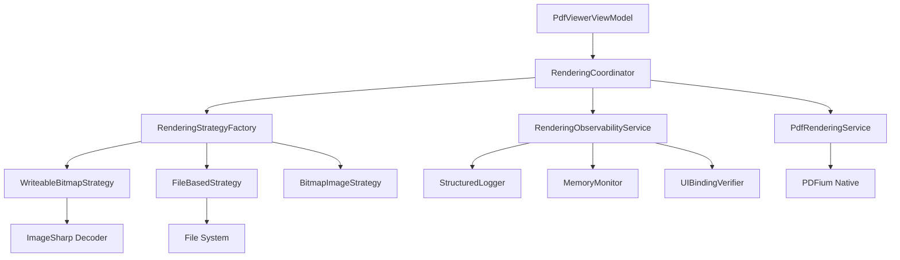
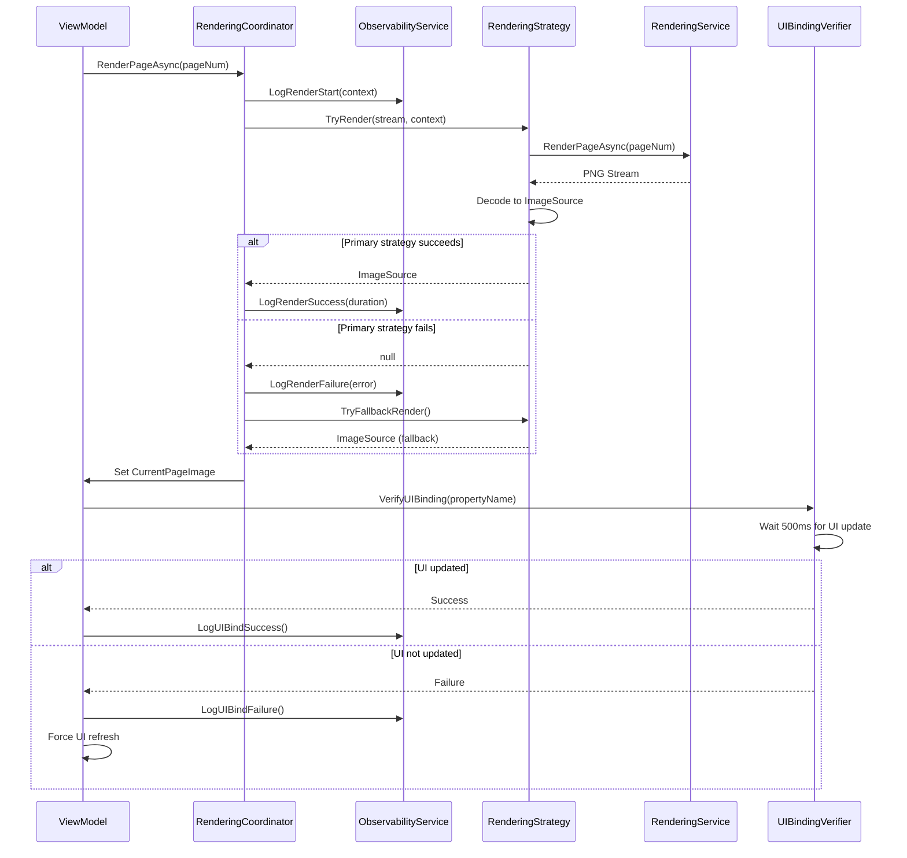

# Design Document

## Overview

This design implements a comprehensive rendering reliability system for FluentPDF, addressing the critical issue where PDFs render successfully but fail to display to users. The solution adds multi-layered observability, fallback rendering strategies, UI binding verification, enhanced CLI diagnostics, and automated verification tests.

## Steering Document Alignment

### Technical Standards (tech.md)
- Follows SOLID principles with strategy pattern for rendering approaches
- Dependency injection for all new services (RenderingObservabilityService, RenderingStrategyFactory)
- Structured logging with Serilog throughout rendering pipeline
- Fail-fast validation at rendering pipeline entry points

### Project Structure (structure.md)
- New services in `src/FluentPDF.App/Services/` directory
- New interfaces in `src/FluentPDF.Core/Interfaces/` directory
- Enhanced CLI in `src/FluentPDF.App/CommandLineOptions.cs`
- Integration tests in `tests/FluentPDF.App.Tests/Integration/`
- E2E tests in `tests/FluentPDF.E2E.Tests/Tests/`

## Code Reuse Analysis

### Existing Components to Leverage
- **PdfRenderingService**: Core rendering logic remains unchanged, add observability hooks
- **PdfViewerViewModel**: Add UI verification after CurrentPageImage updates
- **ThumbnailsViewModel**: Add UI verification for thumbnail binding
- **Serilog Configuration**: Extend existing logging with rendering-specific enrichers
- **CommandLineOptions**: Extend with new diagnostic commands
- **DisposableBitmapImage**: Monitor for proper disposal in leak detection

### Integration Points
- **Serilog**: Add rendering pipeline source context and timing metrics
- **Dependency Injection**: Register new services in App.xaml.cs host builder
- **SafeHandle Monitoring**: Hook into SafePdfDocumentHandle, SafePdfPageHandle disposal
- **UI Thread Dispatcher**: Use existing DispatcherQueue for UI verification checks

## Architecture

### Modular Design Principles
- **Single File Responsibility**: Each rendering strategy in separate file
- **Service Layer Separation**: Observability service separate from rendering service
- **Component Isolation**: Fallback strategies completely independent, no cross-dependencies
- **Utility Modularity**: Diagnostic utilities separate from core rendering logic



### Rendering Pipeline with Observability



## Components and Interfaces

### IRenderingStrategy Interface
- **Purpose:** Contract for different rendering approaches
- **Interfaces:**
  - `Task<ImageSource?> TryRenderAsync(Stream pngStream, RenderContext context)`
  - `string StrategyName { get; }`
  - `int Priority { get; }` (lower = try first)
- **Dependencies:** None (pure strategy)
- **Reuses:** None (interface definition)

### WriteableBitmapRenderingStrategy
- **Purpose:** Current rendering approach using WriteableBitmap + ImageSharp
- **Interfaces:** Implements IRenderingStrategy
- **Dependencies:** ImageSharp, WindowsRuntime extensions
- **Reuses:** Current implementation from PdfViewerViewModel

### FileBasedRenderingStrategy
- **Purpose:** Fallback that saves PNG to temp file and loads via file URI
- **Interfaces:** Implements IRenderingStrategy
- **Dependencies:** File I/O, WinUI BitmapImage
- **Reuses:** Existing temp file patterns from application

### BitmapImageRenderingStrategy (Experimental)
- **Purpose:** Attempts BitmapImage.SetSourceAsync with workarounds
- **Interfaces:** Implements IRenderingStrategy
- **Dependencies:** WinUI BitmapImage
- **Reuses:** Original rendering approach (for testing if fixed in future WinUI updates)

### RenderingStrategyFactory
- **Purpose:** Creates and orders rendering strategies by priority
- **Interfaces:**
  - `IEnumerable<IRenderingStrategy> GetStrategies()`
  - `void RegisterStrategy(IRenderingStrategy strategy)`
- **Dependencies:** DI container for strategy instances
- **Reuses:** Factory pattern from existing services

### RenderingCoordinator
- **Purpose:** Orchestrates rendering with fallback logic
- **Interfaces:**
  - `Task<ImageSource?> RenderWithFallbackAsync(int pageNumber, RenderContext context)`
  - `Task<ImageSource?> RenderThumbnailWithFallbackAsync(int pageNumber, RenderContext context)`
- **Dependencies:** RenderingStrategyFactory, RenderingObservabilityService, PdfRenderingService
- **Reuses:** Integrates with existing PdfRenderingService

### RenderingObservabilityService
- **Purpose:** Centralized logging, timing, and monitoring for rendering pipeline
- **Interfaces:**
  - `IDisposable BeginRenderOperation(string operationName, object context)`
  - `void LogRenderSuccess(string operation, TimeSpan duration, long outputSize)`
  - `void LogRenderFailure(string operation, Exception ex, object diagnostics)`
  - `void LogUIBindingFailure(string propertyName, string diagnostics)`
- **Dependencies:** ILogger<RenderingObservabilityService>, MemoryMonitor
- **Reuses:** Serilog structured logging

### MemoryMonitor
- **Purpose:** Tracks memory usage and resource leaks during rendering
- **Interfaces:**
  - `MemorySnapshot CaptureSnapshot(string label)`
  - `MemoryDelta CalculateDelta(MemorySnapshot before, MemorySnapshot after)`
  - `Task<List<SafeHandleLeak>> DetectSafeHandleLeaksAsync()`
- **Dependencies:** System.Diagnostics, GC APIs
- **Reuses:** Existing SafeHandle types (SafePdfDocumentHandle, etc.)

### UIBindingVerifier
- **Purpose:** Verifies UI controls receive property updates
- **Interfaces:**
  - `Task<bool> VerifyPropertyUpdateAsync(INotifyPropertyChanged viewModel, string propertyName, TimeSpan timeout)`
  - `Task<bool> VerifyImageControlUpdateAsync(Image control, TimeSpan timeout)`
- **Dependencies:** WinUI DispatcherQueue, PropertyChanged events
- **Reuses:** Existing ViewModels' INotifyPropertyChanged implementation

### EnhancedCommandLineOptions
- **Purpose:** New CLI commands for diagnostics and testing
- **Interfaces:**
  - `--test-render <file>`: Quick render test with exit code
  - `--diagnostics`: System info dump
  - `--verbose <file>`: Maximum logging enabled
  - `--render-test <file> --output <dir>`: Batch render to files
  - `--capture-crash-dump`: Enable crash dump on failure
- **Dependencies:** Existing CommandLineOptions
- **Reuses:** Extends current CLI argument parsing

## Data Models

### RenderContext
```csharp
public record RenderContext(
    string DocumentPath,
    int PageNumber,
    int TotalPages,
    double RenderDpi,
    string RequestSource, // "MainViewer" or "Thumbnail"
    DateTime RequestTime,
    Guid OperationId
);
```

### MemorySnapshot
```csharp
public record MemorySnapshot(
    string Label,
    long WorkingSetBytes,
    long PrivateMemoryBytes,
    long ManagedMemoryBytes,
    int HandleCount,
    DateTime Timestamp
);
```

### MemoryDelta
```csharp
public record MemoryDelta(
    MemorySnapshot Before,
    MemorySnapshot After,
    long WorkingSetDelta,
    long PrivateMemoryDelta,
    long ManagedMemoryDelta,
    int HandleCountDelta,
    bool IsAbnormal // true if any delta > threshold
);
```

### SafeHandleLeak
```csharp
public record SafeHandleLeak(
    string HandleType,
    IntPtr HandleValue,
    DateTime CreatedAt,
    string AllocationStackTrace,
    bool IsDisposed
);
```

### RenderingDiagnostics
```csharp
public record RenderingDiagnostics(
    RenderContext Context,
    string StrategyUsed,
    List<string> StrategiesFailed,
    TimeSpan TotalDuration,
    long OutputSizeBytes,
    MemoryDelta MemoryImpact,
    bool UIBindingSucceeded,
    Dictionary<string, object> AdditionalMetrics
);
```

## Error Handling

### Error Scenarios

1. **WriteableBitmap rendering fails (ImageSharp decode exception)**
   - **Handling:** Catch exception, log detailed error, proceed to next strategy
   - **User Impact:** Transparent fallback, user sees PDF via alternative method

2. **All rendering strategies fail**
   - **Handling:** Log critical error with all failure details, show error dialog with specific steps
   - **User Impact:** Clear error message: "Unable to display PDF. Diagnostic log saved to: <path>. Try: 1) Update Windows, 2) Reinstall app, 3) Report issue with log file."

3. **Rendering succeeds but UI doesn't update**
   - **Handling:** UIBindingVerifier detects failure, logs critical warning, forces dispatcher refresh
   - **User Impact:** Automatic recovery attempt, brief delay before content appears

4. **Memory exhaustion during render**
   - **Handling:** MemoryMonitor detects high usage, triggers GC, logs warning, attempts render with lower DPI
   - **User Impact:** Slightly lower quality render, but page displays successfully

5. **SafeHandle leak detected**
   - **Handling:** Log critical error with stack trace, force GC collection, continue operation
   - **User Impact:** No immediate impact, diagnostic data captured for bug fix

6. **CLI test command fails**
   - **Handling:** Write detailed failure log to stdout, exit with specific error code (1=load failure, 2=render failure, 3=UI failure)
   - **User Impact:** Clear automation-friendly error reporting

## Testing Strategy

### Unit Testing
- Test each IRenderingStrategy implementation in isolation with mock PNG streams
- Test RenderingCoordinator fallback logic with failing strategies
- Test MemoryMonitor snapshot calculations with known memory states
- Test UIBindingVerifier with mock ViewModels
- Test CommandLineOptions parsing with various argument combinations

### Integration Testing
- Test full rendering pipeline with real PDF files
- Test fallback rendering when primary strategy is disabled
- Test memory monitoring during multi-page document loads
- Test UI binding verification with real ViewModels and Views
- Test CLI commands execute correctly and produce expected output

### End-to-End Testing
- Test PDF opens and displays within 5 seconds
- Test visual verification that image appears in UI
- Test thumbnail grid populates correctly
- Test verbose mode produces readable console output
- Test render-test command generates all PNG files correctly

### Regression Testing
- Test WriteableBitmap rendering still works after refactoring
- Test all existing PDF features still work (zoom, navigation, annotations)
- Test application stability with 100+ page documents
- Test memory usage doesn't regress with new monitoring overhead

### Performance Testing
- Verify observability overhead < 50ms per page render
- Verify memory monitoring allocates < 1MB per document
- Verify UI verification completes < 500ms
- Verify fallback rendering adds < 2 seconds delay

## Implementation Phases

### Phase 1: Core Infrastructure (Tasks 1-4)
- Create interfaces and data models
- Implement RenderingObservabilityService
- Implement MemoryMonitor
- Register services in DI container

### Phase 2: Rendering Strategies (Tasks 5-7)
- Extract WriteableBitmapRenderingStrategy from existing code
- Implement FileBasedRenderingStrategy
- Implement RenderingStrategyFactory
- Implement RenderingCoordinator

### Phase 3: UI Verification (Tasks 8-9)
- Implement UIBindingVerifier
- Integrate verification into ViewModels
- Add automatic recovery for binding failures

### Phase 4: CLI Enhancements (Tasks 10-12)
- Extend CommandLineOptions with new commands
- Implement test-render command
- Implement diagnostics command
- Implement verbose mode and render-test command

### Phase 5: Integration and Testing (Tasks 13-15)
- Write integration tests for rendering pipeline
- Write E2E tests for UI verification
- Performance testing and optimization
- Documentation and cleanup
