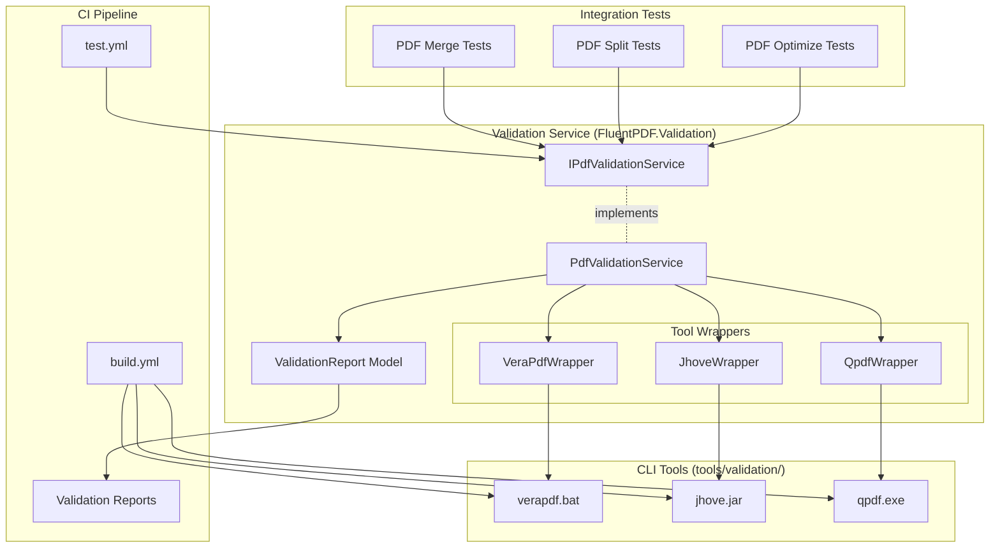

# Design Document

## Overview

The PDF Validation Integration system establishes a comprehensive validation layer using industry-standard tools (VeraPDF, JHOVE, QPDF) to verify PDF quality against ISO specifications. The design follows a wrapper pattern where each validation tool is encapsulated in a dedicated wrapper class, orchestrated by a unified PdfValidationService that provides profile-based validation (Quick, Standard, Full).

## Steering Document Alignment

### Technical Standards (tech.md)

**FluentResults**: All validation operations return `Result<ValidationReport>` for type-safe error handling.

**Serilog Logging**: All validation tool executions logged with structured data (tool name, file path, execution time, exit code).

**Dependency Injection**: PdfValidationService and tool wrappers registered in IHost DI container.

**JSON Schema Validation**: Validation reports conform to JSON Schema for programmatic parsing.

### Project Structure (structure.md)

**FluentPDF.Validation**: New library project in `src/FluentPDF.Validation/`

**File Organization**:
- `src/FluentPDF.Validation/Services/IPdfValidationService.cs` - Service interface
- `src/FluentPDF.Validation/Services/PdfValidationService.cs` - Orchestration service
- `src/FluentPDF.Validation/Wrappers/VeraPdfWrapper.cs` - VeraPDF CLI wrapper
- `src/FluentPDF.Validation/Wrappers/JhoveWrapper.cs` - JHOVE CLI wrapper
- `src/FluentPDF.Validation/Wrappers/QpdfWrapper.cs` - QPDF CLI wrapper
- `src/FluentPDF.Validation/Models/ValidationReport.cs` - Report model
- `tools/validation/install-tools.ps1` - Tool installation script
- `schemas/validation-report.schema.json` - JSON Schema for reports

## Code Reuse Analysis

### Existing Components to Leverage

- **PdfError + Result<T>**: Validation failures return PdfError with error codes
- **Process Execution Patterns**: Reuse process invocation patterns from QPDF operations
- **Test Fixtures**: Reuse sample PDFs from `tests/Fixtures/`
- **Serilog Configuration**: Validation operations log to existing structured logging

### Integration Points

- **Integration Tests**: PDF generation tests (merge, split, optimize) use IPdfValidationService
- **CI Workflows**: Validation tools installed in build.yml, executed in test.yml
- **Artifacts**: Validation reports uploaded alongside test results

## Architecture



### Modular Design Principles

- **Single Wrapper Responsibility**: Each wrapper handles one validation tool
- **Service Orchestration**: PdfValidationService coordinates wrappers based on validation profile
- **Profile-Based Execution**: Quick (QPDF), Standard (QPDF + JHOVE), Full (All tools)
- **Parallel Execution**: Tools run concurrently using Task.WhenAll for Full profile

## Components and Interfaces

### Component 1: IPdfValidationService (Service Interface)

- **Purpose:** Contract for PDF validation operations
- **Location:** `src/FluentPDF.Validation/Services/IPdfValidationService.cs`
- **Methods:**
  ```csharp
  public interface IPdfValidationService
  {
      Task<Result<ValidationReport>> ValidateAsync(string filePath, ValidationProfile profile = ValidationProfile.Standard);
      Result<bool> VerifyToolsInstalled();
  }

  public enum ValidationProfile
  {
      Quick,    // QPDF only
      Standard, // QPDF + JHOVE
      Full      // QPDF + JHOVE + VeraPDF
  }
  ```

### Component 2: PdfValidationService (Service Implementation)

- **Purpose:** Orchestrates validation tools based on profile
- **Location:** `src/FluentPDF.Validation/Services/PdfValidationService.cs`
- **Dependencies:** IVeraPdfWrapper, IJhoveWrapper, IQpdfWrapper, ILogger
- **Key Logic:**
  ```csharp
  public async Task<Result<ValidationReport>> ValidateAsync(string filePath, ValidationProfile profile)
  {
      var correlationId = Guid.NewGuid().ToString();
      _logger.Information("Starting validation: {FilePath}, Profile: {Profile}, CorrelationId: {CorrelationId}",
          filePath, profile, correlationId);

      var tasks = new List<Task<Result>>();

      // Always run QPDF
      tasks.Add(_qpdfWrapper.ValidateAsync(filePath));

      if (profile >= ValidationProfile.Standard)
          tasks.Add(_jhoveWrapper.ValidateAsync(filePath));

      if (profile == ValidationProfile.Full)
          tasks.Add(_veraPdfWrapper.ValidateAsync(filePath));

      var results = await Task.WhenAll(tasks);

      var report = new ValidationReport
      {
          FilePath = filePath,
          ValidationDate = DateTime.UtcNow,
          Profile = profile,
          QpdfResult = results[0],
          JhoveResult = profile >= ValidationProfile.Standard ? results[1] : null,
          VeraPdfResult = profile == ValidationProfile.Full ? results[2] : null,
          OverallStatus = DetermineOverallStatus(results)
      };

      return Result.Ok(report);
  }
  ```

### Component 3: VeraPdfWrapper (CLI Wrapper)

- **Purpose:** Execute VeraPDF CLI and parse JSON output
- **Location:** `src/FluentPDF.Validation/Wrappers/VeraPdfWrapper.cs`
- **Execution:**
  ```csharp
  public async Task<Result<VeraPdfResult>> ValidateAsync(string filePath)
  {
      var process = new Process
      {
          StartInfo = new ProcessStartInfo
          {
              FileName = Path.Combine(_toolsPath, "verapdf", "verapdf.bat"),
              Arguments = $"--format json \"{filePath}\"",
              RedirectStandardOutput = true,
              RedirectStandardError = true,
              UseShellExecute = false
          }
      };

      process.Start();
      var output = await process.StandardOutput.ReadToEndAsync();
      await process.WaitForExitAsync();

      if (process.ExitCode != 0)
          return Result.Fail(new PdfError("VERAPDF_EXECUTION_FAILED", ErrorCategory.System, ErrorSeverity.Error));

      var result = JsonSerializer.Deserialize<VeraPdfResult>(output);
      return Result.Ok(result);
  }
  ```

### Component 4: JhoveWrapper (CLI Wrapper)

- **Purpose:** Execute JHOVE CLI and parse JSON output
- **Location:** `src/FluentPDF.Validation/Wrappers/JhoveWrapper.cs`
- **Execution:** Similar pattern to VeraPDF, executes `java -jar jhove.jar -m PDF-hul -h json "$filePath"`

### Component 5: QpdfWrapper (CLI Wrapper)

- **Purpose:** Execute QPDF CLI and parse stderr output
- **Location:** `src/FluentPDF.Validation/Wrappers/QpdfWrapper.cs`
- **Execution:** Similar pattern, executes `qpdf --check "$filePath"`

### Component 6: ValidationReport (Data Model)

- **Purpose:** Aggregated validation results from all tools
- **Location:** `src/FluentPDF.Validation/Models/ValidationReport.cs`
- **Structure:**
  ```csharp
  public class ValidationReport
  {
      public string FilePath { get; init; }
      public DateTime ValidationDate { get; init; }
      public ValidationProfile Profile { get; init; }
      public string OverallStatus { get; init; } // Pass, Warn, Fail
      public QpdfResult QpdfResult { get; init; }
      public JhoveResult? JhoveResult { get; init; }
      public VeraPdfResult? VeraPdfResult { get; init; }
  }
  ```

### Component 7: Tool Installation Script

- **Purpose:** Automate validation tool installation
- **Location:** `tools/validation/install-tools.ps1`
- **Script Logic:**
  ```powershell
  # Download VeraPDF
  Invoke-WebRequest -Uri "https://downloads.verapdf.org/..." -OutFile "verapdf-installer.zip"
  Expand-Archive -Path "verapdf-installer.zip" -DestinationPath "verapdf/"

  # Download JHOVE
  Invoke-WebRequest -Uri "https://github.com/openpreserve/jhove/releases/download/..." -OutFile "jhove.zip"
  Expand-Archive -Path "jhove.zip" -DestinationPath "jhove/"

  # QPDF is already installed via vcpkg
  Write-Host "QPDF available via vcpkg build"
  ```

## Error Handling

### Error Scenarios

1. **Tool Not Installed**
   - **Handling:** VerifyToolsInstalled() returns Result.Fail with missing tool names
   - **User Impact:** Clear error message: "Validation tools not installed. Run tools/validation/install-tools.ps1"

2. **Tool Execution Timeout**
   - **Handling:** Kill process after 30 seconds, return Result.Fail with timeout error
   - **User Impact:** Validation report shows tool timed out

3. **Invalid JSON Output**
   - **Handling:** Catch JsonException, return Result.Fail with parsing error
   - **User Impact:** Validation fails with "Failed to parse tool output"

4. **PDF Validation Failures**
   - **Handling:** Validation report includes failures, OverallStatus = "Fail"
   - **User Impact:** Test fails with detailed validation report

## Testing Strategy

### Unit Testing

**FluentPDF.Validation.Tests/Wrappers/VeraPdfWrapperTests.cs**:
- Mock Process execution
- Test JSON parsing with sample VeraPDF output
- Test error handling (non-zero exit code, invalid JSON)

**Similar tests for JhoveWrapper and QpdfWrapper**

### Integration Testing

**FluentPDF.Validation.Tests/Integration/ValidationServiceTests.cs**:
- Use real validation tools with test fixtures
- Test Quick/Standard/Full profiles
- Verify valid PDFs pass validation
- Verify invalid PDFs fail with expected errors

## Future Enhancements

- **Validation Dashboard**: Web UI showing validation trends over time
- **Custom Validation Rules**: User-defined validation checks
- **Batch Validation**: Validate entire directories of PDFs
- **Validation Caching**: Cache validation results to speed up repeated checks
