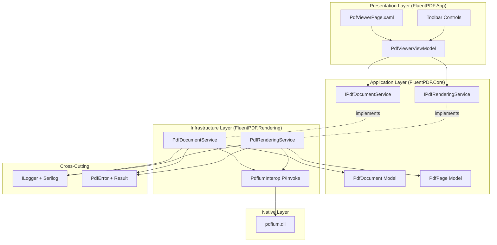

# Design Document

## Overview

The PDF Viewer Core implements the fundamental PDF viewing functionality using PDFium native library. The design follows clean architecture with strict layer separation: native interop layer (P/Invoke), service layer (business logic), and presentation layer (MVVM). All components integrate with the existing foundation (DI, logging, error handling, architecture testing).

## Steering Document Alignment

### Technical Standards (tech.md)

**WinUI 3 + MVVM**: PdfViewerViewModel uses CommunityToolkit.Mvvm source generators for observable properties and commands.

**FluentResults**: All service operations return `Result<T>` with PdfError for failures (file not found, corrupted PDF, rendering errors).

**Serilog + OpenTelemetry**: All operations logged with structured data (file path, page number, zoom level, render time).

**Dependency Injection**: All services registered in IHost container, ViewModels get dependencies via constructor injection.

**ArchUnitNET**: Extended with rules for P/Invoke layer (must be in Rendering project, must use SafeHandle).

### Project Structure (structure.md)

**FluentPDF.Rendering**: Contains PDFium P/Invoke declarations and low-level rendering services.

**FluentPDF.Core**: Contains domain models (PdfDocument, PdfPage) and service interfaces.

**FluentPDF.App**: Contains PdfViewerPage, PdfViewerViewModel, and UI controls.

**File Organization**:
- `src/FluentPDF.Rendering/Interop/PdfiumInterop.cs` - P/Invoke declarations
- `src/FluentPDF.Rendering/Services/PdfDocumentService.cs` - Document loading
- `src/FluentPDF.Rendering/Services/PdfRenderingService.cs` - Page rendering
- `src/FluentPDF.Core/Models/PdfDocument.cs` - Document model
- `src/FluentPDF.App/ViewModels/PdfViewerViewModel.cs` - Presentation logic
- `src/FluentPDF.App/Views/PdfViewerPage.xaml` - UI

## Code Reuse Analysis

### Existing Components to Leverage

- **PdfError + FluentResults**: Extend with new error codes (PDF_REQUIRES_PASSWORD, PDF_CORRUPTED, PDF_RENDERING_FAILED)
- **SerilogConfiguration**: Use existing structured logging for rendering performance metrics
- **INavigationService**: Navigate to PdfViewerPage from MainWindow
- **Global Exception Handlers**: Catch unhandled errors in rendering pipeline
- **App.xaml.cs DI Container**: Register new services (IPdfDocumentService, IPdfRenderingService)
- **ArchUnitNET Tests**: Add rules for P/Invoke layer (must use SafeHandle, must be in Rendering namespace)

### Integration Points

- **File Picker**: Use WinUI's FileOpenPicker with .pdf filter
- **Dependency Injection**: Register services in existing IHost container
- **Error Handling**: All service methods return `Result<T>` following foundation pattern
- **Logging**: Use `ILogger<T>` injected via DI for all operations
- **UI Threading**: Use `DispatcherQueue` for updating UI from background threads

## Architecture

The PDF Viewer Core follows a layered architecture with strict separation of concerns:



### Modular Design Principles

- **Single File Responsibility**: Each service handles one concern (loading vs. rendering)
- **Component Isolation**: P/Invoke, services, and ViewModels are independently testable
- **Service Layer Separation**: Business logic in services, presentation logic in ViewModels
- **Interface Abstraction**: All services behind interfaces for mocking in tests

## Components and Interfaces

### Component 1: PdfiumInterop (P/Invoke Layer)

- **Purpose:** Low-level PDFium native library bindings with safe memory management
- **Location:** `src/FluentPDF.Rendering/Interop/PdfiumInterop.cs`
- **Interfaces:**
  - `bool InitializeLibrary()` - Calls FPDF_InitLibrary()
  - `void ShutdownLibrary()` - Calls FPDF_DestroyLibrary()
  - `SafePdfDocumentHandle LoadDocument(string filePath, string? password)` - Calls FPDF_LoadDocument()
  - `int GetPageCount(SafePdfDocumentHandle document)` - Calls FPDF_GetPageCount()
  - `SafePdfPageHandle LoadPage(SafePdfDocumentHandle document, int pageIndex)` - Calls FPDF_LoadPage()
  - `void RenderPageBitmap(SafePdfPageHandle page, IntPtr bitmap, ...)` - Calls FPDF_RenderPageBitmap()
  - `void ClosePage(IntPtr page)` - Calls FPDF_ClosePage()
  - `void CloseDocument(IntPtr document)` - Calls FPDF_CloseDocument()
- **Dependencies:** pdfium.dll (native library)
- **SafeHandle Types:**
  ```csharp
  public class SafePdfDocumentHandle : SafeHandleZeroOrMinusOneIsInvalid
  {
      protected override bool ReleaseHandle() => PdfiumInterop.CloseDocument(handle);
  }

  public class SafePdfPageHandle : SafeHandleZeroOrMinusOneIsInvalid
  {
      protected override bool ReleaseHandle() => PdfiumInterop.ClosePage(handle);
  }
  ```

### Component 2: PdfDocument Model

- **Purpose:** Domain model representing a loaded PDF document
- **Location:** `src/FluentPDF.Core/Models/PdfDocument.cs`
- **Properties:**
  - `string FilePath { get; init; }` - Path to PDF file
  - `int PageCount { get; init; }` - Total number of pages
  - `SafePdfDocumentHandle Handle { get; init; }` - Native PDFium handle
  - `DateTime LoadedAt { get; init; }` - When document was loaded
  - `long FileSizeBytes { get; init; }` - File size
- **Methods:**
  - `void Dispose()` - Implements IDisposable to clean up native resources
- **Reuses:** None (new model)

### Component 3: PdfPage Model

- **Purpose:** Represents metadata about a single PDF page
- **Location:** `src/FluentPDF.Core/Models/PdfPage.cs`
- **Properties:**
  - `int PageNumber { get; init; }` - 1-based page number
  - `double Width { get; init; }` - Page width in points
  - `double Height { get; init; }` - Page height in points
  - `double AspectRatio { get; init; }` - Width / Height
- **Reuses:** None (new model)

### Component 4: IPdfDocumentService (Service Interface)

- **Purpose:** Contract for PDF document loading operations
- **Location:** `src/FluentPDF.Core/Services/IPdfDocumentService.cs`
- **Methods:**
  ```csharp
  Task<Result<PdfDocument>> LoadDocumentAsync(string filePath, string? password = null);
  Task<Result<PdfPage>> GetPageInfoAsync(PdfDocument document, int pageNumber);
  Result CloseDocument(PdfDocument document);
  ```
- **Reuses:** `Result<T>` pattern from foundation

### Component 5: PdfDocumentService (Service Implementation)

- **Purpose:** Implements PDF document loading using PDFium
- **Location:** `src/FluentPDF.Rendering/Services/PdfDocumentService.cs`
- **Dependencies:** `PdfiumInterop`, `ILogger<PdfDocumentService>`
- **Error Codes:**
  - `PDF_FILE_NOT_FOUND` - File doesn't exist
  - `PDF_INVALID_FORMAT` - Not a valid PDF file
  - `PDF_CORRUPTED` - PDF is corrupted
  - `PDF_REQUIRES_PASSWORD` - Password-protected PDF
  - `PDF_LOAD_FAILED` - Generic load failure
- **Reuses:** PdfError, Result<T>, Serilog logging

### Component 6: IPdfRenderingService (Service Interface)

- **Purpose:** Contract for PDF page rendering operations
- **Location:** `src/FluentPDF.Core/Services/IPdfRenderingService.cs`
- **Methods:**
  ```csharp
  Task<Result<BitmapImage>> RenderPageAsync(PdfDocument document, int pageNumber, double zoomLevel, double dpi = 96);
  ```
- **Reuses:** `Result<T>` pattern from foundation

### Component 7: PdfRenderingService (Service Implementation)

- **Purpose:** Renders PDF pages to BitmapImage using PDFium
- **Location:** `src/FluentPDF.Rendering/Services/PdfRenderingService.cs`
- **Dependencies:** `PdfiumInterop`, `ILogger<PdfRenderingService>`
- **Rendering Pipeline:**
  1. Load page using PDFium (FPDF_LoadPage)
  2. Get page dimensions (FPDF_GetPageWidth, FPDF_GetPageHeight)
  3. Calculate output size based on zoom and DPI
  4. Create bitmap (Windows Imaging Component)
  5. Render to bitmap (FPDF_RenderPageBitmap)
  6. Convert to BitmapImage for WinUI
  7. Dispose native resources
- **Error Codes:**
  - `PDF_PAGE_INVALID` - Invalid page number
  - `PDF_RENDERING_FAILED` - Rendering operation failed
  - `PDF_OUT_OF_MEMORY` - Not enough memory for bitmap
- **Performance Logging:** Log render time for pages taking > 1 second
- **Reuses:** PdfError, Result<T>, Serilog logging

### Component 8: PdfViewerViewModel

- **Purpose:** Presentation logic for PDF viewer UI
- **Location:** `src/FluentPDF.App/ViewModels/PdfViewerViewModel.cs`
- **Observable Properties (via source generators):**
  ```csharp
  [ObservableProperty] private BitmapImage? _currentPageImage;
  [ObservableProperty] private int _currentPageNumber = 1;
  [ObservableProperty] private int _totalPages;
  [ObservableProperty] private double _zoomLevel = 1.0;
  [ObservableProperty] private bool _isLoading;
  [ObservableProperty] private string _statusMessage = "Ready";
  ```
- **Commands (via source generators):**
  ```csharp
  [RelayCommand] private async Task OpenDocumentAsync();
  [RelayCommand(CanExecute = nameof(CanGoToPreviousPage))] private async Task GoToPreviousPageAsync();
  [RelayCommand(CanExecute = nameof(CanGoToNextPage))] private async Task GoToNextPageAsync();
  [RelayCommand(CanExecute = nameof(CanZoomIn))] private void ZoomIn();
  [RelayCommand(CanExecute = nameof(CanZoomOut))] private void ZoomOut();
  [RelayCommand] private void ResetZoom();
  [RelayCommand] private async Task GoToPageAsync(int pageNumber);
  ```
- **Dependencies:** `IPdfDocumentService`, `IPdfRenderingService`, `ILogger<PdfViewerViewModel>`
- **State Management:** Holds reference to current PdfDocument, disposes on new document load
- **Reuses:** ObservableObject, RelayCommand from CommunityToolkit.Mvvm

### Component 9: PdfViewerPage (UI)

- **Purpose:** XAML view for PDF viewer
- **Location:** `src/FluentPDF.App/Views/PdfViewerPage.xaml`
- **UI Elements:**
  - **Toolbar (CommandBar):**
    - AppBarButton: Open File (command: OpenDocumentCommand)
    - AppBarButton: Previous Page (command: GoToPreviousPageCommand)
    - TextBlock: "Page {CurrentPageNumber} of {TotalPages}"
    - AppBarButton: Next Page (command: GoToNextPageCommand)
    - AppBarSeparator
    - AppBarButton: Zoom Out (command: ZoomOutCommand)
    - TextBlock: "{ZoomLevel:P0}" (e.g., "150%")
    - AppBarButton: Zoom In (command: ZoomInCommand)
    - AppBarButton: Reset Zoom (command: ResetZoomCommand)
  - **Content Area:**
    - ScrollViewer (for panning when zoomed)
    - Image (bound to CurrentPageImage)
    - ProgressRing (visible when IsLoading)
    - TextBlock: "Open a PDF file to get started" (visible when no document loaded)
- **Keyboard Accelerators:**
  - Ctrl+O: Open Document
  - Left Arrow: Previous Page
  - Right Arrow: Next Page
  - Ctrl+Plus: Zoom In
  - Ctrl+Minus: Zoom Out
  - Ctrl+0: Reset Zoom
- **Reuses:** WinUI 3 controls, data binding to ViewModel

## Data Models

### PdfDocument
```csharp
public class PdfDocument : IDisposable
{
    public required string FilePath { get; init; }
    public required int PageCount { get; init; }
    public required SafePdfDocumentHandle Handle { get; init; }
    public required DateTime LoadedAt { get; init; }
    public required long FileSizeBytes { get; init; }

    public void Dispose()
    {
        Handle?.Dispose();
        GC.SuppressFinalize(this);
    }
}
```

### PdfPage
```csharp
public class PdfPage
{
    public required int PageNumber { get; init; }
    public required double Width { get; init; }  // in points
    public required double Height { get; init; } // in points
    public double AspectRatio => Width / Height;
}
```

### ZoomLevel Enum
```csharp
public enum ZoomLevel
{
    FiftyPercent = 50,
    SeventyFivePercent = 75,
    OneHundredPercent = 100,
    OneTwentyFivePercent = 125,
    OneFiftyPercent = 150,
    OneSeventyFivePercent = 175,
    TwoHundredPercent = 200
}
```

## Error Handling

### Error Scenarios

1. **File Not Found**
   - **Handling:** Return `Result.Fail(new PdfError("PDF_FILE_NOT_FOUND", ErrorCategory.IO, ErrorSeverity.Error).WithContext("FilePath", path))`
   - **User Impact:** Error dialog: "The file could not be found. Please verify the path and try again."

2. **Invalid PDF Format**
   - **Handling:** Return `Result.Fail(new PdfError("PDF_INVALID_FORMAT", ErrorCategory.Validation, ErrorSeverity.Error))`
   - **User Impact:** Error dialog: "The selected file is not a valid PDF document."

3. **Password-Protected PDF**
   - **Handling:** Return `Result.Fail(new PdfError("PDF_REQUIRES_PASSWORD", ErrorCategory.Security, ErrorSeverity.Warning))`
   - **User Impact:** Error dialog: "This PDF is password-protected. Password support coming soon." (Future enhancement)

4. **Corrupted PDF**
   - **Handling:** Return `Result.Fail(new PdfError("PDF_CORRUPTED", ErrorCategory.Validation, ErrorSeverity.Error))`
   - **User Impact:** Error dialog: "The PDF file appears to be corrupted and cannot be opened."

5. **Rendering Failure**
   - **Handling:** Return `Result.Fail(new PdfError("PDF_RENDERING_FAILED", ErrorCategory.Rendering, ErrorSeverity.Error).WithContext("PageNumber", pageNum))`
   - **User Impact:** Show placeholder image with error icon for that page, allow navigation to other pages

6. **Out of Memory**
   - **Handling:** Return `Result.Fail(new PdfError("PDF_OUT_OF_MEMORY", ErrorCategory.System, ErrorSeverity.Critical))`
   - **User Impact:** Error dialog: "Not enough memory to render this page. Try closing other applications or reducing zoom level."

7. **PDFium Initialization Failure**
   - **Handling:** Log critical error, show error dialog with correlation ID
   - **User Impact:** Error dialog: "Failed to initialize PDF engine. Please reinstall the application."

## Testing Strategy

### Unit Testing

**FluentPDF.Rendering.Tests/Interop/PdfiumInteropTests.cs**:
- Test InitializeLibrary succeeds
- Test LoadDocument with valid PDF returns non-null handle
- Test LoadDocument with invalid file returns null
- Test GetPageCount returns correct count
- Test SafeHandle properly disposes resources

**FluentPDF.Rendering.Tests/Services/PdfDocumentServiceTests.cs**:
- Mock PdfiumInterop
- Test LoadDocumentAsync with valid file returns Result.Ok
- Test LoadDocumentAsync with non-existent file returns Result.Fail
- Test error codes match expected scenarios
- Test Context dictionary includes file path

**FluentPDF.Rendering.Tests/Services/PdfRenderingServiceTests.cs**:
- Mock PdfiumInterop
- Test RenderPageAsync returns BitmapImage
- Test invalid page number returns Result.Fail
- Test zoom levels calculate correct output dimensions
- Test rendering logs performance warnings for slow pages

**FluentPDF.App.Tests/ViewModels/PdfViewerViewModelTests.cs**:
- Mock IPdfDocumentService and IPdfRenderingService
- Test OpenDocumentCommand loads document and renders page 1
- Test GoToNextPageCommand advances page number
- Test ZoomIn increases zoom level
- Test command CanExecute states (PreviousPage disabled on page 1, etc.)
- Test property change notifications fire correctly

### Integration Testing

**FluentPDF.App.Tests/Integration/PdfViewerIntegrationTests.cs**:
- Use real PDFium library (not mocked)
- Load sample PDF files from test fixtures
- Verify document loads successfully
- Verify all pages render without errors
- Verify zoom levels work correctly
- Test memory cleanup (no handle leaks)

### End-to-End Testing

**FluentPDF.App.Tests/E2E/PdfViewerE2ETests.cs**:
- Use FlaUI for UI automation
- Test complete user workflow:
  1. Launch app
  2. Click "Open File"
  3. Select test PDF
  4. Verify page renders
  5. Click "Next Page"
  6. Verify page 2 renders
  7. Click "Zoom In"
  8. Verify zoom increases
  9. Close document

### Architecture Testing

**FluentPDF.Architecture.Tests/PdfViewerArchitectureTests.cs**:
- Test P/Invoke methods only exist in FluentPDF.Rendering namespace
- Test all P/Invoke pointer parameters use SafeHandle
- Test PdfViewerViewModel has no direct PDFium references
- Test Core services only use interfaces, not concrete implementations

## Performance Considerations

### Rendering Optimization
- **Bitmap Caching:** Consider caching rendered bitmaps for recently viewed pages (future enhancement)
- **Background Rendering:** Render on background thread, marshal BitmapImage to UI thread
- **Lazy Loading:** Only render current page on demand, pre-render adjacent pages in background (future)
- **Memory Management:** Aggressively dispose bitmaps, use GC.Collect() hints after large operations

### Zoom Performance
- **DPI Scaling:** Calculate correct DPI for zoom level: `dpi = 96 * zoomLevel`
- **Incremental Zoom:** Discrete zoom levels prevent constant re-rendering
- **Debouncing:** If implementing slider zoom, debounce render calls

### Large Document Handling
- **Metadata Loading:** Load page count and metadata quickly, defer rendering
- **Virtual Scrolling:** For multi-page view (future), only render visible pages
- **Memory Limits:** Warn user if document has > 1000 pages (future)

## Dependency Injection Registration

**App.xaml.cs ConfigureServices**:
```csharp
services.AddSingleton<IPdfDocumentService, PdfDocumentService>();
services.AddSingleton<IPdfRenderingService, PdfRenderingService>();
services.AddSingleton<PdfiumInterop>(sp =>
{
    var interop = new PdfiumInterop();
    if (!interop.InitializeLibrary())
    {
        sp.GetRequiredService<ILogger<App>>().LogCritical("Failed to initialize PDFium");
        throw new InvalidOperationException("Failed to initialize PDFium library");
    }
    return interop;
});
services.AddTransient<PdfViewerViewModel>();
```

## Future Enhancements

- **Thumbnail View:** Show page thumbnails in sidebar
- **Text Selection:** Select and copy text from PDFs
- **Search:** Find text within document
- **Annotations:** Highlight, comment, draw on PDFs
- **Password Support:** Prompt for password when loading protected PDFs
- **Bookmarks:** PDF outline/bookmark navigation
- **Printing:** Print PDF pages
- **Multi-page View:** Show 2 pages side-by-side
- **Rotation:** Rotate pages 90/180/270 degrees
