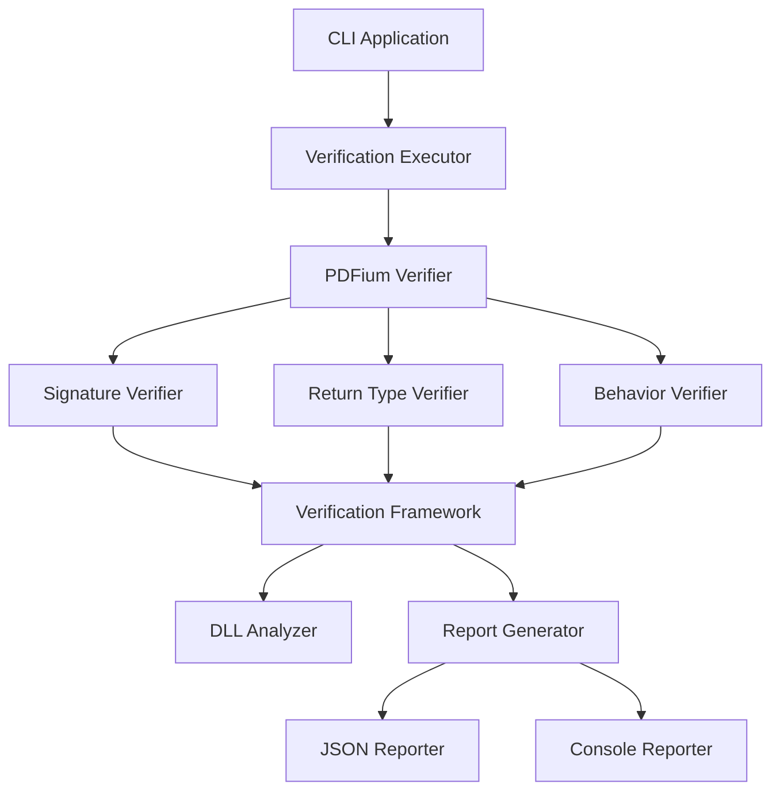

# Design Document

## Overview

The PDFium Library Verification tool is a standalone console application that validates P/Invoke declarations against actual PDFium DLL exports. It discovers function signature mismatches, invalid return types, and marshalling errors that cause silent failures. The tool provides a reusable framework for verifying any native library used via P/Invoke.

## Steering Document Alignment

### Technical Standards (tech.md)
- Follows .NET 9 C# coding standards
- Uses xUnit for testing framework
- Implements structured logging with Serilog
- Uses Result<T> pattern for error handling

### Project Structure (structure.md)
- Console application: `src/FluentPDF.Verification/`
- Shared verification framework: `src/FluentPDF.Verification.Core/`
- Test project: `tests/FluentPDF.Verification.Tests/`
- Follows existing project naming and organization conventions

## Code Reuse Analysis

### Existing Components to Leverage
- **PdfiumInterop.cs**: Current P/Invoke declarations to validate
- **FluentResults**: For error handling and result composition
- **Serilog**: For structured logging
- **xUnit**: For test framework and assertions

### Integration Points
- **Build Pipeline**: Integrate as pre-build verification step
- **CI/CD**: Run as automated test before deployment
- **PDFium DLL**: Located in `libs/x64/bin/pdfium.dll`

## Architecture

The system uses a three-layer architecture:

1. **Verification Framework** (`FluentPDF.Verification.Core`): Generic library verification engine
2. **PDFium Verifier** (`FluentPDF.Verification.Pdfium`): PDFium-specific verification rules
3. **CLI Application** (`FluentPDF.Verification.Cli`): Command-line interface for running verifications

### Modular Design Principles
- **Single File Responsibility**: Each verifier tests one category (signatures, return types, behaviors)
- **Component Isolation**: Verification framework is independent of specific library details
- **Service Layer Separation**: Verification logic, execution, and reporting are separate concerns
- **Utility Modularity**: Common verification utilities in shared module



## Components and Interfaces

### VerificationFramework (Core)
- **Purpose:** Provides generic infrastructure for verifying native library P/Invoke declarations
- **Interfaces:**
  - `ILibraryVerifier<TResult>`: Contract for library-specific verifiers
  - `IDllAnalyzer`: Analyzes DLL exports and function signatures
  - `IVerificationReporter`: Generates verification reports
- **Dependencies:** System.Reflection.Metadata, System.Runtime.InteropServices
- **Reuses:** FluentResults for result composition

### PdfiumSignatureVerifier
- **Purpose:** Validates PDFium P/Invoke signatures match actual DLL exports
- **Interfaces:**
  - `VerifySignature(string functionName, Type[] paramTypes, Type returnType): Result<SignatureMatch>`
  - `VerifyAllSignatures(): Result<VerificationReport>`
- **Dependencies:** DllAnalyzer, PdfiumInterop reflection
- **Reuses:** Verification Framework base classes

### PdfiumReturnTypeVerifier
- **Purpose:** Validates PDFium function return values contain valid data
- **Interfaces:**
  - `VerifyNumericReturn(string functionName, double value, double min, double max): Result`
  - `VerifyPointerReturn(string functionName, IntPtr value): Result`
- **Dependencies:** PDFium test fixtures
- **Reuses:** Verification Framework validators

### PdfiumBehaviorVerifier
- **Purpose:** Tests PDFium functions with known inputs/outputs to verify correct behavior
- **Interfaces:**
  - `VerifyPageDimensions(string pdfPath): Result<DimensionVerification>`
  - `VerifyDocumentLoading(string pdfPath): Result<LoadVerification>`
- **Dependencies:** Test PDF files in `tests/Fixtures/`
- **Reuses:** PdfiumInterop, test utilities

### VerificationExecutor
- **Purpose:** Orchestrates execution of all verification tests
- **Interfaces:**
  - `ExecuteAsync(VerificationOptions options): Task<Result<VerificationSummary>>`
  - `ExecuteParallelAsync(VerificationOptions options): Task<Result<VerificationSummary>>`
- **Dependencies:** All verifiers
- **Reuses:** Task Parallel Library for parallel execution

### ReportGenerator
- **Purpose:** Generates human and machine-readable verification reports
- **Interfaces:**
  - `GenerateConsoleReport(VerificationSummary summary): string`
  - `GenerateJsonReport(VerificationSummary summary): string`
  - `GenerateHtmlReport(VerificationSummary summary): string`
- **Dependencies:** System.Text.Json
- **Reuses:** Serilog for structured logging

## Data Models

### VerificationResult
```csharp
public record VerificationResult
{
    public string TestName { get; init; }
    public bool Success { get; init; }
    public string? ErrorMessage { get; init; }
    public Dictionary<string, object> Metadata { get; init; }
    public TimeSpan Duration { get; init; }
}
```

### SignatureMatch
```csharp
public record SignatureMatch
{
    public string FunctionName { get; init; }
    public bool Matches { get; init; }
    public string DeclaredSignature { get; init; }
    public string ActualSignature { get; init; }
    public string? SuggestedFix { get; init; }
}
```

### VerificationSummary
```csharp
public record VerificationSummary
{
    public int TotalTests { get; init; }
    public int PassedTests { get; init; }
    public int FailedTests { get; init; }
    public List<VerificationResult> Results { get; init; }
    public TimeSpan TotalDuration { get; init; }
    public string PdfiumVersion { get; init; }
}
```

### VerificationOptions
```csharp
public record VerificationOptions
{
    public string PdfiumDllPath { get; init; }
    public string TestPdfDirectory { get; init; }
    public bool ParallelExecution { get; init; }
    public ReportFormat OutputFormat { get; init; }
    public string? OutputPath { get; init; }
}
```

## Error Handling

### Error Scenarios
1. **PDFium DLL Not Found**
   - **Handling:** Check default and specified paths, fail with clear message
   - **User Impact:** Exit code 1, message: "PDFium DLL not found at: {path}. Verify DLL location."

2. **Function Signature Mismatch**
   - **Handling:** Log detailed comparison, suggest corrected signature
   - **User Impact:** Exit code 2, detailed report with fix suggestion

3. **Garbage Return Value Detected**
   - **Handling:** Report function name, expected range, actual value
   - **User Impact:** Exit code 3, message: "FPDF_GetPageWidthF returns garbage (5.64e-315). Use FPDF_GetPageWidth instead."

4. **Test PDF Corruption**
   - **Handling:** Skip corrupted files, report warning
   - **User Impact:** Warning in report, continue with other tests

5. **DLL Load Failure**
   - **Handling:** Check dependencies, bitness mismatch, permissions
   - **User Impact:** Exit code 4, detailed diagnostic information

## Testing Strategy

### Unit Testing
- Test each verifier in isolation with mocked dependencies
- Test DllAnalyzer with known good and bad DLL exports
- Test ReportGenerator with various verification results
- Aim for 90% code coverage on verification logic

### Integration Testing
- Test complete verification workflow with real PDFium DLL
- Test with multiple PDFium versions if available
- Test parallel execution with concurrent verifications
- Verify correct exit codes and report formats

### End-to-End Testing
- Run complete verification suite against production PDFium DLL
- Verify integration with build pipeline
- Test CLI argument parsing and error handling
- Validate reports in CI/CD environment

## Performance Considerations

- Use lazy loading for DLL analysis (only analyze on demand)
- Cache DLL export information after first analysis
- Parallel execution for independent verification tests
- Stream large reports instead of building in memory
- Limit test PDF file sizes to < 1MB for fast execution

## Security Considerations

- Validate PDFium DLL hash before loading
- Sandbox PDF file operations (no write access)
- Do not include sensitive paths in reports
- Sanitize error messages before logging
- Run with minimum required permissions
