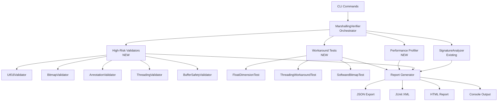

# Design Document

## Overview

This design extends the existing marshaling verification infrastructure (`MarshallingVerifier`, `SignatureAnalyzer`, `DataMarshallerTester`) to provide comprehensive, CLI-centric validation of all PDFium P/Invoke marshaling operations. The system is designed as a modular testing framework that can run standalone via CLI commands, integrate into CI/CD pipelines, and provide actionable diagnostics for developers.

The design follows FluentPDF's "Verifiable Architecture" principle by making marshaling correctness measurable, observable, and continuously validated through automated tools that execute in < 30 seconds.

## Steering Document Alignment

### Technical Standards (tech.md)

**Result Pattern**: All validators return `Result<ValidationReport>` instead of throwing exceptions, using `FluentResults` with rich error context (`ErrorCode`, `Category`, `Severity`, `Context`).

**P/Invoke Interop Pattern**: All new validators follow the established pattern in `FluentPDF.Rendering.Interop.Verification/`:
- Static analysis via reflection (no PDFium execution)
- Runtime validation with real PDFium calls (isolated in `DataMarshallerTester`)
- Thread-safe implementations with `lock` synchronization

**Structured Logging**: All validators emit structured logs using `Serilog` with correlation IDs for distributed tracing. Integration with OpenTelemetry enables visualization in .NET Aspire Dashboard during development.

**Testing Stack**:
- xUnit for unit tests
- BenchmarkDotNet for performance profiling
- JSON Schema validation for report outputs
- CI/CD integration via JUnit XML export

### Project Structure (structure.md)

**File Organization**:
```
src/FluentPDF.Rendering/
├── Interop/
│   └── Verification/              # Existing foundation
│       ├── MarshallingVerifier.cs    # Orchestrator (existing)
│       ├── SignatureAnalyzer.cs      # Signature analysis (existing)
│       ├── DataMarshallerTester.cs   # Basic marshaling tests (existing)
│       ├── CoverageReporter.cs       # Reporting (existing)
│       │
│       ├── Validators/               # NEW: Specialized validators
│       │   ├── IValidator.cs
│       │   ├── Utf16MarshalingValidator.cs
│       │   ├── BitmapMarshalingValidator.cs
│       │   ├── AnnotationMarshalingValidator.cs
│       │   ├── ThreadingModelValidator.cs
│       │   └── BufferSafetyValidator.cs
│       │
│       ├── Profilers/                # NEW: Performance profiling
│       │   ├── IMarshalingProfiler.cs
│       │   └── MarshalingPerformanceProfiler.cs
│       │
│       ├── Regression/               # NEW: Workaround regression tests
│       │   ├── IWorkaroundTest.cs
│       │   ├── FloatDimensionWorkaroundTest.cs
│       │   ├── ThreadingWorkaroundTest.cs
│       │   └── SoftwareBitmapWorkaroundTest.cs
│       │
│       └── Reports/                  # NEW: Enhanced reporting
│           ├── ValidationReport.cs
│           ├── ProfilingReport.cs
│           ├── JsonReportExporter.cs
│           ├── JUnitXmlExporter.cs
│           └── HtmlReportGenerator.cs

tests/FluentPDF.Rendering.Tests/
└── Interop/Verification/
    ├── Utf16MarshalingValidatorTests.cs
    ├── BitmapMarshalingValidatorTests.cs
    ├── ThreadingModelValidatorTests.cs
    └── IntegrationTests/
        └── EndToEndValidationTests.cs
```

**Namespace Organization**:
- `FluentPDF.Rendering.Interop.Verification` - Core verification infrastructure
- `FluentPDF.Rendering.Interop.Verification.Validators` - High-risk area validators
- `FluentPDF.Rendering.Interop.Verification.Profilers` - Performance profiling
- `FluentPDF.Rendering.Interop.Verification.Regression` - Workaround tests
- `FluentPDF.Rendering.Interop.Verification.Reports` - Report generation

**Code Size Compliance**:
- Each validator class: < 500 lines (excluding comments)
- Each validation method: < 50 lines
- Extract helper methods for complex logic (buffer calculations, encoding conversions)

## Code Reuse Analysis

### Existing Components to Leverage

1. **MarshallingVerifier (existing)** - `src/FluentPDF.Rendering/Interop/Verification/MarshallingVerifier.cs`
   - **Reuse**: Orchestration pattern for running multiple validators in parallel
   - **Extension**: Add new `ValidateHighRiskAreas()` method that runs specialized validators

2. **SignatureAnalyzer (existing)** - `src/FluentPDF.Rendering/Interop/Verification/SignatureAnalyzer.cs`
   - **Reuse**: Reflection-based signature extraction and validation
   - **Extension**: Add `ValidateAgainstPDFiumSpec(specificationPath)` method for external JSON spec validation

3. **DataMarshallerTester (existing)** - `src/FluentPDF.Rendering/Interop/Verification/DataMarshallerTester.cs`
   - **Reuse**: Test harness pattern with real PDFium calls
   - **Extension**: Create specialized subclasses for each high-risk area (UTF-16, bitmaps, annotations)

4. **CoverageReporter (existing)** - `src/FluentPDF.Rendering/Interop/Verification/CoverageReporter.cs`
   - **Reuse**: Markdown and console report generation
   - **Extension**: Add JSON export, JUnit XML export, and HTML report generation

5. **CommandLineOptions** - `src/FluentPDF.App/CommandLineOptions.cs`
   - **Reuse**: CLI flag parsing pattern (existing flags: `--test-render`, `--diagnostics`, `--verify-marshalling`)
   - **Extension**: Add granular validation flags: `--validate-utf16-marshalling`, `--validate-bitmap-marshalling`, `--validate-all`, `--profile-marshalling`

6. **PdfiumInterop** - `src/FluentPDF.Rendering/Interop/PdfiumInterop.cs`
   - **Reuse**: Centralized P/Invoke declarations (1806 lines of existing API bindings)
   - **Integration**: Validators reference this class for reflection-based signature analysis

### Integration Points

1. **Existing CLI Command Handler**
   - **Location**: `src/FluentPDF.App/App.xaml.cs` (CLI mode detection) and handler methods
   - **Integration**: Add new command handlers for granular validation flags
   - **Pattern**: Follow existing `TestRenderCommand()`, `DiagnosticsCommand()` pattern

2. **Test Infrastructure**
   - **Location**: `tests/FluentPDF.Rendering.Tests/Interop/MarshallingVerificationTests.cs`
   - **Integration**: Extend existing test fixtures with new validator tests
   - **Pattern**: Use xUnit `[Theory]` with `[InlineData]` for parameterized edge-case testing

3. **CI/CD Pipeline**
   - **Location**: `.github/workflows/test.yml`
   - **Integration**: Add validation step that runs `FluentPDF.App.exe --validate-all --junit-output results.xml`
   - **Pattern**: Use JUnit XML output for GitHub Actions test reporting

## Architecture

### High-Level Architecture



### Modular Design Principles

**Single File Responsibility**:
- Each validator handles exactly one high-risk area (UTF-16, bitmaps, annotations, threading, buffer safety)
- Each workaround test validates exactly one documented workaround
- Each report exporter handles exactly one format (JSON, JUnit XML, HTML, console)

**Component Isolation**:
- Validators are stateless and thread-safe (no shared mutable state)
- Each validator can run independently via dedicated CLI flags
- Validators do not depend on each other (can run in parallel)

**Service Layer Separation**:
- **Validation Layer**: Pure logic for marshaling correctness checks
- **Orchestration Layer**: `MarshallingVerifier` coordinates validators
- **Reporting Layer**: Generate reports from validation results
- **CLI Layer**: Parse flags and invoke validators

**Dependency Injection**:
- Validators accept dependencies via constructor injection
- `IValidator<TReport>` interface for testability
- Factories create validators with injected dependencies (logger, configuration)

### Layered Architecture

```
┌─────────────────────────────────────────────────┐
│  CLI Layer (CommandLineOptions + Handlers)     │  ← User-facing commands
├─────────────────────────────────────────────────┤
│  Orchestration (MarshallingVerifier)            │  ← Coordinates validation
├─────────────────────────────────────────────────┤
│  Validation Layer (Validators + Profilers)      │  ← Core logic
├─────────────────────────────────────────────────┤
│  Reporting Layer (Report Generators)            │  ← Output generation
├─────────────────────────────────────────────────┤
│  PDFium Interop (PdfiumInterop + SafeHandles)   │  ← P/Invoke layer
└─────────────────────────────────────────────────┘
```

## Components and Interfaces

### Component 1: IValidator Interface

**Purpose**: Unified interface for all high-risk area validators

**Interfaces**:
```csharp
namespace FluentPDF.Rendering.Interop.Verification.Validators;

/// <summary>
/// Represents a validator for a specific high-risk marshaling area.
/// </summary>
public interface IValidator
{
    /// <summary>
    /// Gets the name of the validation area (e.g., "UTF-16 String Marshaling").
    /// </summary>
    string ValidationArea { get; }

    /// <summary>
    /// Runs all validation tests for this area.
    /// </summary>
    /// <param name="testPdfPath">Optional path to test PDF file for runtime validation.</param>
    /// <param name="cancellationToken">Cancellation token.</param>
    /// <returns>Validation report with results and diagnostics.</returns>
    Task<Result<ValidationReport>> ValidateAsync(
        string? testPdfPath = null,
        CancellationToken cancellationToken = default);
}
```

**Dependencies**: `FluentResults`, `Serilog.ILogger`

**Reuses**: N/A (new interface)

### Component 2: Utf16MarshalingValidator

**Purpose**: Validates UTF-16LE string marshaling for bookmarks, text search, and form fields

**Interfaces**:
```csharp
public class Utf16MarshalingValidator : IValidator
{
    public string ValidationArea => "UTF-16 String Marshaling";

    /// <summary>
    /// Validates bookmark title extraction (two-phase allocation pattern).
    /// </summary>
    public Task<Result<Utf16TestResult>> ValidateBookmarkMarshalingAsync(string testPdfPath);

    /// <summary>
    /// Validates text search with UTF-16LE byte array marshaling.
    /// </summary>
    public Task<Result<Utf16TestResult>> ValidateTextSearchMarshalingAsync(string testPdfPath);

    /// <summary>
    /// Validates form field text marshaling.
    /// </summary>
    public Task<Result<Utf16TestResult>> ValidateFormFieldMarshalingAsync(string testPdfPath);
}
```

**Dependencies**:
- `PdfiumInterop` - for calling `FPDFBookmark_GetTitle`, `FPDFText_FindStart`
- `ILogger<Utf16MarshalingValidator>` - structured logging
- Test PDF with UTF-16 bookmarks, searchable text, and form fields

**Reuses**:
- `DataMarshallerTester` pattern for runtime validation
- Existing `FPDFBookmark_GetTitle` workaround logic from `PdfiumInterop.cs:429-449`

**Test Cases**:
1. Bookmark titles with emojis (4-byte UTF-16 surrogate pairs)
2. Bookmark titles with null characters in the middle
3. Text search queries with combining diacritics (e.g., "é" as e + combining acute)
4. Form field text with CRLF line endings vs. LF
5. Empty strings (zero-length buffer with null terminator)
6. Maximum length strings (boundary testing for buffer allocation)

### Component 3: BitmapMarshalingValidator

**Purpose**: Validates bitmap buffer marshaling, stride calculations, and overflow prevention

**Interfaces**:
```csharp
public class BitmapMarshalingValidator : IValidator
{
    public string ValidationArea => "Bitmap Buffer Marshaling";

    /// <summary>
    /// Validates stride calculation with checked arithmetic.
    /// </summary>
    public Result<BufferTestResult> ValidateStrideCalculation(int width, int height);

    /// <summary>
    /// Validates Marshal.Copy with edge-case buffer sizes.
    /// </summary>
    public Task<Result<BufferTestResult>> ValidateMarshalCopyAsync(int width, int height);

    /// <summary>
    /// Validates pixel data integrity after marshaling.
    /// </summary>
    public Task<Result<BufferTestResult>> ValidatePixelDataIntegrityAsync(string testPdfPath);
}
```

**Dependencies**:
- `PdfiumInterop` - for `FPDFBitmap_Create`, `FPDFBitmap_GetBuffer`, `FPDFBitmap_GetStride`
- `System.Runtime.InteropServices.Marshal` - for `Marshal.Copy`

**Reuses**:
- `PdfRenderingService` logic from `PdfRenderingService.cs:323-343` (bitmap buffer copying)

**Test Cases**:
1. 1x1 pixel image (minimum size)
2. 8192x8192 pixel image (large size, potential stride overflow)
3. Non-power-of-2 dimensions (e.g., 1920x1080, 2560x1440)
4. Width that causes stride padding (e.g., 1023 pixels → stride 4096 bytes)
5. Zero-width or zero-height images (should fail gracefully)
6. Negative dimensions (should fail validation)
7. Checked arithmetic for `stride × height` calculation

### Component 4: AnnotationMarshalingValidator

**Purpose**: Validates annotation geometry marshaling (FS_QUADPOINTSF, FS_RECTF structs)

**Interfaces**:
```csharp
public class AnnotationMarshalingValidator : IValidator
{
    public string ValidationArea => "Annotation Geometry Marshaling";

    /// <summary>
    /// Validates FS_QUADPOINTSF struct marshaling with all 8 coordinates.
    /// </summary>
    public Task<Result<AnnotationTestResult>> ValidateQuadPointsMarshalingAsync();

    /// <summary>
    /// Validates FS_RECTF struct marshaling.
    /// </summary>
    public Task<Result<AnnotationTestResult>> ValidateRectMarshalingAsync();
}
```

**Dependencies**:
- `PdfiumInterop` - for `FPDFAnnot_SetAttachmentPoints`, `FPDFAnnot_GetRect`

**Reuses**:
- Existing struct definitions from `PdfiumInterop.cs` (FS_QUADPOINTSF, FS_RECTF)

**Test Cases**:
1. Complete quad points array (8 floats)
2. Partial quad points array (< 8 elements) - should fail or use safe defaults
3. NaN and infinity float values
4. Very large coordinate values (e.g., 1e10)
5. Negative coordinates
6. Rect with inverted coordinates (left > right, top > bottom)

### Component 5: ThreadingModelValidator

**Purpose**: Validates Task.Yield() threading workaround and detects AccessViolation scenarios

**Interfaces**:
```csharp
public class ThreadingModelValidator : IValidator
{
    public string ValidationArea => "Threading Model Correctness";

    /// <summary>
    /// Validates that Task.Yield() prevents AccessViolation.
    /// </summary>
    public Task<Result<ThreadingTestResult>> ValidateTaskYieldWorkaroundAsync(string testPdfPath);

    /// <summary>
    /// Attempts concurrent PDFium operations and detects crashes.
    /// Runs in isolated process to prevent test runner crashes.
    /// </summary>
    public Task<Result<ThreadingTestResult>> ValidateConcurrentAccessAsync(string testPdfPath);
}
```

**Dependencies**:
- `PdfiumServiceBase` - existing `ExecutePdfiumOperationAsync` pattern
- `Process` - for isolated process execution to detect AccessViolation

**Reuses**:
- `PdfiumServiceBase.ExecutePdfiumOperationAsync` logic from `PdfiumServiceBase.cs`

**Test Cases**:
1. Sequential PDFium calls with `Task.Yield()` - should succeed
2. Concurrent PDFium calls with `Task.Run()` - should detect AccessViolation (run in isolated process)
3. High concurrency stress test (100 simultaneous operations with `Task.Yield()`)

### Component 6: BufferSafetyValidator

**Purpose**: Detects buffer overflow risks in all `Marshal.Copy` operations

**Interfaces**:
```csharp
public class BufferSafetyValidator : IValidator
{
    public string ValidationArea => "Buffer Overflow Prevention";

    /// <summary>
    /// Validates all Marshal.Copy calls in PdfiumInterop for overflow risks.
    /// Uses reflection to find all Marshal.Copy call sites and static analysis.
    /// </summary>
    public Task<Result<BufferSafetyReport>> AnalyzeMarshalCopyCallsAsync();

    /// <summary>
    /// Simulates buffer overflow scenarios with edge-case sizes.
    /// </summary>
    public Task<Result<BufferTestResult>> SimulateBufferOverflowAsync();
}
```

**Dependencies**:
- `System.Reflection` - for finding all `Marshal.Copy` call sites
- `Roslyn` (optional) - for static code analysis of buffer size calculations

**Reuses**:
- N/A (new static analysis capability)

**Test Cases**:
1. Zero-length buffer allocation
2. 1-byte buffer (UTF-16 requires minimum 2 bytes)
3. Maximum allocation (2GB on x64) - check for `OutOfMemoryException` handling
4. Stride calculation overflow detection (checked arithmetic)
5. Two-phase allocation pattern validation (get length → allocate → fill)

### Component 7: MarshalingPerformanceProfiler

**Purpose**: Measures execution time and memory overhead for all marshaling operations

**Interfaces**:
```csharp
public interface IMarshalingProfiler
{
    /// <summary>
    /// Profiles a specific P/Invoke function across N iterations.
    /// </summary>
    Task<Result<ProfilingResult>> ProfileFunctionAsync(
        string functionName,
        int iterations = 1000,
        CancellationToken cancellationToken = default);

    /// <summary>
    /// Profiles all P/Invoke functions and generates a comprehensive report.
    /// </summary>
    Task<Result<ProfilingReport>> ProfileAllFunctionsAsync(
        string testPdfPath,
        int iterations = 1000,
        CancellationToken cancellationToken = default);

    /// <summary>
    /// Compares current performance against a saved baseline.
    /// </summary>
    Result<RegressionReport> CompareAgainstBaseline(
        ProfilingReport current,
        string baselineJsonPath);
}

public class MarshalingPerformanceProfiler : IMarshalingProfiler
{
    // Implementation using System.Diagnostics.Stopwatch and BenchmarkDotNet patterns
}
```

**Dependencies**:
- `System.Diagnostics.Stopwatch` - high-resolution timing
- `BenchmarkDotNet` patterns - memory diagnostics

**Reuses**:
- BenchmarkDotNet patterns from existing performance tests

**Metrics Collected**:
- Min, max, median, P95, P99 latencies
- Memory allocations (managed buffer size, unmanaged pinning overhead)
- Garbage collection counts during profiling window
- CPU cycles (via `Stopwatch.GetTimestamp()`)

### Component 8: Workaround Regression Tests

**Purpose**: Automated tests for all documented workarounds to detect breakage on PDFium updates

**Interfaces**:
```csharp
public interface IWorkaroundTest
{
    string WorkaroundName { get; }
    string DocumentationReference { get; }
    Task<Result<WorkaroundTestResult>> TestWorkaroundAsync(string testPdfPath);
}

public class FloatDimensionWorkaroundTest : IWorkaroundTest
{
    public string WorkaroundName => "Float Dimension API Workaround";
    public string DocumentationReference => "PdfiumInterop.cs:177-183";

    public async Task<Result<WorkaroundTestResult>> TestWorkaroundAsync(string testPdfPath)
    {
        // Test that integer API returns valid values
        // Test that float API returns garbage (or document if fixed)
    }
}
```

**Dependencies**:
- `PdfiumInterop` - existing workaround implementations

**Reuses**:
- Existing workaround logic from `PdfiumInterop.cs`, `ThumbnailsViewModel.cs:155`, `PdfiumServiceBase.cs`

**Test Cases**:
1. **Float Dimension API** - Compare integer vs. float API results
2. **Task.Yield() Threading** - Verify AccessViolation prevention
3. **SoftwareBitmapSource** - Validate bitmap conversion workaround

### Component 9: Report Exporters

**Purpose**: Generate reports in multiple formats for different consumers

**Interfaces**:
```csharp
public interface IReportExporter<TReport>
{
    string FormatName { get; }
    Task<Result<string>> ExportAsync(TReport report, string outputPath);
}

public class JsonReportExporter : IReportExporter<ValidationReport>
{
    public string FormatName => "JSON";
    // Uses System.Text.Json with indentation for readability
}

public class JUnitXmlExporter : IReportExporter<ValidationReport>
{
    public string FormatName => "JUnit XML";
    // Generates XML compatible with GitHub Actions, Azure DevOps, Jenkins
}

public class HtmlReportGenerator : IReportExporter<ValidationReport>
{
    public string FormatName => "HTML";
    // Generates styled HTML with color-coded severity levels
}
```

**Dependencies**:
- `System.Text.Json` - JSON serialization
- `System.Xml.Linq` - JUnit XML generation
- Embedded HTML template - for HTML report generation

**Reuses**:
- `CoverageReporter` patterns from existing infrastructure

## Data Models

### ValidationReport

```csharp
/// <summary>
/// Comprehensive report of all validation results.
/// </summary>
public class ValidationReport
{
    /// <summary>
    /// Timestamp of validation execution.
    /// </summary>
    public DateTime ExecutedAt { get; init; }

    /// <summary>
    /// Correlation ID for distributed tracing.
    /// </summary>
    public string CorrelationId { get; init; }

    /// <summary>
    /// Overall validation status.
    /// </summary>
    public ValidationStatus Status { get; init; } // Pass, Warning, Fail

    /// <summary>
    /// Validation results grouped by area.
    /// </summary>
    public Dictionary<string, List<ValidationResult>> ResultsByArea { get; init; }

    /// <summary>
    /// Performance profiling results (optional).
    /// </summary>
    public ProfilingReport? ProfilingResults { get; init; }

    /// <summary>
    /// Workaround regression test results (optional).
    /// </summary>
    public List<WorkaroundTestResult>? WorkaroundResults { get; init; }

    /// <summary>
    /// Summary statistics.
    /// </summary>
    public ValidationSummary Summary { get; init; }
}

public class ValidationSummary
{
    public int TotalTests { get; init; }
    public int PassedTests { get; init; }
    public int FailedTests { get; init; }
    public int WarningTests { get; init; }
    public TimeSpan ExecutionTime { get; init; }
}
```

### ValidationResult (Extends Existing)

```csharp
/// <summary>
/// Result of a single validation test.
/// Extended from existing VerificationResult class.
/// </summary>
public class ValidationResult
{
    // Existing fields
    public string FunctionName { get; init; }
    public bool SignatureValid { get; init; }
    public bool? MarshallingCorrect { get; init; }
    public string? ErrorMessage { get; init; }
    public SignatureDetails? Signature { get; init; }
    public MarshallingTestResult? TestResult { get; init; }

    // NEW fields for enhanced diagnostics
    public ValidationSeverity Severity { get; init; } // Critical, Error, Warning, Info
    public string? SuggestedFix { get; init; }
    public string? DocumentationUrl { get; init; }
    public Dictionary<string, object> Context { get; init; } = new();
}

public enum ValidationSeverity
{
    Info,      // Informational, no action needed
    Warning,   // Potential issue, should investigate
    Error,     // Validation failed, should fix
    Critical   // Critical failure, blocks release
}
```

### ProfilingReport

```csharp
/// <summary>
/// Performance profiling report for all marshaling operations.
/// </summary>
public class ProfilingReport
{
    public DateTime ProfiledAt { get; init; }
    public int Iterations { get; init; }
    public Dictionary<string, ProfilingResult> ResultsByFunction { get; init; }
    public ProfilingSummary Summary { get; init; }
}

public class ProfilingResult
{
    public string FunctionName { get; init; }
    public PerformanceMetrics Metrics { get; init; }
    public MemoryMetrics Memory { get; init; }
}

public class PerformanceMetrics
{
    public TimeSpan MinLatency { get; init; }
    public TimeSpan MaxLatency { get; init; }
    public TimeSpan MedianLatency { get; init; }
    public TimeSpan P95Latency { get; init; }
    public TimeSpan P99Latency { get; init; }
    public double LatencyStdDev { get; init; }
}

public class MemoryMetrics
{
    public long ManagedBytesAllocated { get; init; }
    public long UnmanagedBytesAllocated { get; init; }
    public int Gen0Collections { get; init; }
    public int Gen1Collections { get; init; }
    public int Gen2Collections { get; init; }
}
```

### WorkaroundTestResult

```csharp
/// <summary>
/// Result of testing a documented workaround.
/// </summary>
public class WorkaroundTestResult
{
    public string WorkaroundName { get; init; }
    public string DocumentationReference { get; init; }
    public WorkaroundStatus Status { get; init; } // StillNeeded, CanBeRemoved, Broken
    public string Details { get; init; }
    public string? RecommendedAction { get; init; }
}

public enum WorkaroundStatus
{
    StillNeeded,   // Workaround still required (PDFium bug not fixed)
    CanBeRemoved,  // PDFium bug fixed, workaround can be removed
    Broken         // Workaround no longer works (requires investigation)
}
```

## Error Handling

### Error Scenarios

#### 1. PDFium Library Not Found

**Handling**:
```csharp
try
{
    PdfiumInterop.Initialize();
}
catch (DllNotFoundException ex)
{
    return Result.Fail(new PdfError(
        "PDFIUM_NOT_FOUND",
        "PDFium library (pdfium.dll) not found. Ensure vcpkg libraries are deployed.",
        ErrorCategory.System,
        ErrorSeverity.Critical
    ).CausedBy(ex));
}
```

**User Impact**: Validation cannot run. CLI exits with error code 2 and clear message directing user to check vcpkg installation.

#### 2. Test PDF File Missing or Corrupted

**Handling**:
```csharp
if (!File.Exists(testPdfPath))
{
    return Result.Fail(new PdfError(
        "TEST_PDF_NOT_FOUND",
        $"Test PDF file not found: {testPdfPath}",
        ErrorCategory.Validation,
        ErrorSeverity.Error
    ));
}

var loadResult = PdfiumInterop.LoadDocument(testPdfPath, null);
if (loadResult.IsInvalid)
{
    return Result.Fail(new PdfError(
        "TEST_PDF_CORRUPTED",
        $"Failed to load test PDF: {testPdfPath}. File may be corrupted.",
        ErrorCategory.Validation,
        ErrorSeverity.Error
    ));
}
```

**User Impact**: Validation skips tests requiring real PDF. Report indicates which tests were skipped with reason.

#### 3. AccessViolation During Threading Test (Expected Failure)

**Handling**:
```csharp
// Run in isolated process to prevent test runner crash
var process = Process.Start(new ProcessStartInfo
{
    FileName = "FluentPDF.App.exe",
    Arguments = "--test-threading-isolation",
    RedirectStandardOutput = true,
    RedirectStandardError = true
});

await process.WaitForExitAsync();

if (process.ExitCode == -1073741819) // 0xC0000005 = ACCESS_VIOLATION
{
    return Result.Ok(new ThreadingTestResult
    {
        TestName = "Concurrent Access Without Task.Yield",
        Status = ValidationStatus.Pass,
        Details = "AccessViolation correctly detected (expected behavior)"
    });
}
```

**User Impact**: Test passes if AccessViolation is detected (proves workaround is necessary). No crash of test runner.

#### 4. Performance Regression Detected (> 20% Slowdown)

**Handling**:
```csharp
var regression = current.MedianLatency / baseline.MedianLatency;
if (regression > 1.2)
{
    _logger.Warning(
        "Performance regression detected: {FunctionName} is {Percentage:P0} slower than baseline",
        functionName,
        regression - 1.0
    );

    return Result.Fail(new PdfError(
        "PERFORMANCE_REGRESSION",
        $"{functionName} performance regressed by {(regression - 1.0):P0}",
        ErrorCategory.Performance,
        ErrorSeverity.Warning
    ).WithContext("BaselineLatency", baseline.MedianLatency)
     .WithContext("CurrentLatency", current.MedianLatency));
}
```

**User Impact**: CI build fails with warning (not critical). Developer investigates regression before merge.

#### 5. JSON Schema Validation Failure

**Handling**:
```csharp
using var document = JsonDocument.Parse(reportJson);
var validationResults = schema.Evaluate(document.RootElement);

if (!validationResults.IsValid)
{
    var errors = validationResults.Errors.Select(e => e.Message);
    return Result.Fail(new PdfError(
        "REPORT_SCHEMA_INVALID",
        $"Generated report does not match JSON schema: {string.Join("; ", errors)}",
        ErrorCategory.System,
        ErrorSeverity.Error
    ));
}
```

**User Impact**: Report generation fails. Developer fixes report structure to match schema.

## Testing Strategy

### Unit Testing

**Approach**: Isolated testing of each validator with mocked dependencies

**Tools**: xUnit, Moq, FluentAssertions

**Key Components to Test**:
1. **Each Validator** - Test with synthetic data (no real PDFium calls)
   - UTF-16 encoding/decoding logic
   - Buffer size calculations
   - Struct marshaling logic

2. **Report Exporters** - Validate JSON/XML/HTML output format
   - JSON schema compliance
   - JUnit XML compatibility
   - HTML rendering correctness

3. **Orchestrator** - Test coordination of multiple validators
   - Parallel execution
   - Result aggregation
   - Error handling

**Example**:
```csharp
[Fact]
public void Utf16Validator_WithNullTerminatedString_ReturnsCorrectLength()
{
    // Arrange
    var validator = new Utf16MarshalingValidator(_logger);
    var testString = "Test\0";
    var utf16Bytes = Encoding.Unicode.GetBytes(testString);

    // Act
    var result = validator.ValidateUtf16Encoding(utf16Bytes, expectedLength: 10);

    // Assert
    result.Should().BeSuccess();
    result.Value.DecodedString.Should().Be("Test");
}
```

### Integration Testing

**Approach**: End-to-end validation with real PDFium library and test PDFs

**Tools**: xUnit, real pdfium.dll, curated test PDFs

**Key Flows to Test**:
1. **Full Validation Suite** - Run `--validate-all` with realistic test PDF
   - All validators execute successfully
   - Report generated in all formats (JSON, JUnit XML, HTML, console)
   - No crashes or AccessViolations

2. **Performance Profiling** - Run `--profile-marshalling` with baseline comparison
   - Profiling data collected for all functions
   - Regression detection works correctly
   - Report generation completes in < 5 seconds

3. **CI/CD Integration** - Simulate CI environment
   - JUnit XML output parseable by GitHub Actions
   - Exit codes correct (0 = pass, 1 = fail)
   - Logs structured and parseable

**Example**:
```csharp
[Fact]
public async Task ValidateAll_WithRealPdf_GeneratesCompleteReport()
{
    // Arrange
    var testPdfPath = Path.Combine("TestData", "comprehensive_test.pdf");
    var verifier = new MarshallingVerifier(typeof(PdfiumInterop));

    // Act
    var result = await verifier.ValidateAllAsync(testPdfPath);

    // Assert
    result.Should().BeSuccess();
    result.Value.Summary.TotalTests.Should().BeGreaterThan(50);
    result.Value.ResultsByArea.Should().ContainKeys(
        "UTF-16 String Marshaling",
        "Bitmap Buffer Marshaling",
        "Annotation Geometry Marshaling",
        "Threading Model Correctness",
        "Buffer Overflow Prevention"
    );
}
```

### End-to-End Testing

**Approach**: Test via CLI commands exactly as user/CI would invoke them

**Tools**: Process execution, file system validation

**User Scenarios to Test**:

#### Scenario 1: Developer Runs Quick Validation Before Commit
```bash
FluentPDF.App.exe --validate-utf16-marshalling --validate-bitmap-marshalling
```
**Expected**:
- Executes in < 5 seconds
- Console output shows pass/fail for each test
- Exit code 0 if all pass, 1 if any fail

#### Scenario 2: CI Runs Full Validation Suite
```bash
FluentPDF.App.exe --validate-all --junit-output validation-results.xml --json-output validation-report.json
```
**Expected**:
- Executes in < 30 seconds
- JUnit XML and JSON files generated
- Exit code 1 if critical failures detected
- GitHub Actions parses JUnit XML and shows test results in PR

#### Scenario 3: Performance Profiling with Baseline Comparison
```bash
FluentPDF.App.exe --profile-marshalling --compare-baseline baseline.json --output profiling-report.json
```
**Expected**:
- Profiling data collected for all functions
- Regression detected if > 20% slowdown
- JSON report includes baseline vs. current comparison
- Console shows summary of regressed functions

#### Scenario 4: Workaround Regression Testing After PDFium Update
```bash
FluentPDF.App.exe --test-workarounds --output workaround-report.md
```
**Expected**:
- All documented workarounds tested
- Markdown report generated with recommendations
- If workaround can be removed, report suggests code cleanup
- Exit code 0 (workarounds are advisory, not blockers)

**Example End-to-End Test**:
```csharp
[Fact]
public async Task CLI_ValidateAll_GeneratesJUnitXml()
{
    // Arrange
    var outputPath = Path.Combine(Path.GetTempPath(), "validation-results.xml");
    var process = new Process
    {
        StartInfo = new ProcessStartInfo
        {
            FileName = "FluentPDF.App.exe",
            Arguments = $"--validate-all --junit-output \"{outputPath}\"",
            RedirectStandardOutput = true,
            RedirectStandardError = true,
            UseShellExecute = false
        }
    };

    // Act
    process.Start();
    await process.WaitForExitAsync();

    // Assert
    process.ExitCode.Should().Be(0);
    File.Exists(outputPath).Should().BeTrue();

    var xmlContent = await File.ReadAllTextAsync(outputPath);
    var doc = XDocument.Parse(xmlContent);
    doc.Root.Name.LocalName.Should().Be("testsuites");

    var testCases = doc.Descendants("testcase").ToList();
    testCases.Should().HaveCountGreaterThan(50);
}
```

## Implementation Phases

### Phase 1: Core Validators (Week 1)
- [x] `IValidator` interface
- [ ] `Utf16MarshalingValidator`
- [ ] `BitmapMarshalingValidator`
- [ ] `BufferSafetyValidator`
- [ ] Unit tests for each validator

### Phase 2: Threading & Annotations (Week 2)
- [ ] `ThreadingModelValidator`
- [ ] `AnnotationMarshalingValidator`
- [ ] Isolated process execution for AccessViolation detection
- [ ] Integration tests with real PDFs

### Phase 3: Performance Profiling (Week 3)
- [ ] `IMarshalingProfiler` interface
- [ ] `MarshalingPerformanceProfiler` implementation
- [ ] Baseline comparison logic
- [ ] Performance regression detection

### Phase 4: Workaround Tests (Week 4)
- [ ] `IWorkaroundTest` interface
- [ ] `FloatDimensionWorkaroundTest`
- [ ] `ThreadingWorkaroundTest`
- [ ] `SoftwareBitmapWorkaroundTest`

### Phase 5: Reporting & CLI (Week 5)
- [ ] `JsonReportExporter`
- [ ] `JUnitXmlExporter`
- [ ] `HtmlReportGenerator`
- [ ] CLI command handlers in `CommandLineOptions.cs`
- [ ] End-to-end CLI tests

### Phase 6: CI/CD Integration (Week 6)
- [ ] GitHub Actions workflow update
- [ ] JUnit XML parsing configuration
- [ ] Performance baseline storage
- [ ] Documentation generation

## Dependencies & Infrastructure

### Required Test Data

**Test PDFs** (stored in `tests/TestData/`):
1. `utf16_bookmarks.pdf` - PDF with UTF-16 bookmark titles (emojis, combining diacritics)
2. `searchable_text.pdf` - PDF with searchable text for text search tests
3. `form_fields.pdf` - PDF with form fields for form text marshaling
4. `large_image.pdf` - PDF with 8192x8192 image for bitmap marshaling stress test
5. `annotations.pdf` - PDF with highlight annotations for geometry marshaling
6. `comprehensive_test.pdf` - All-in-one PDF for full validation suite

**PDFium Specification** (JSON):
```json
{
  "FPDF_LoadDocument": {
    "returnType": "IntPtr",
    "parameters": [
      { "name": "file_path", "type": "string", "charSet": "Ansi" },
      { "name": "password", "type": "string", "charSet": "Ansi" }
    ],
    "callingConvention": "Cdecl"
  },
  "FPDFBookmark_GetTitle": {
    "returnType": "int",
    "parameters": [
      { "name": "bookmark", "type": "IntPtr" },
      { "name": "buffer", "type": "byte[]", "marshalAs": "LPArray" },
      { "name": "buflen", "type": "uint" }
    ],
    "callingConvention": "Cdecl",
    "notes": "Returns length including null terminator. UTF-16LE encoding."
  }
}
```

### Performance Baseline

**Baseline JSON** (stored in `tests/Baselines/`):
```json
{
  "recordedAt": "2026-01-21T00:00:00Z",
  "pdfiumVersion": "5948",
  "functions": {
    "FPDF_LoadDocument": {
      "medianLatency": "2.5ms",
      "p95Latency": "5.0ms",
      "managedBytesAllocated": 1024
    },
    "FPDF_RenderPageBitmap": {
      "medianLatency": "15.0ms",
      "p95Latency": "25.0ms",
      "managedBytesAllocated": 8294400
    }
  }
}
```

### CI/CD Configuration

**.github/workflows/marshaling-validation.yml**:
```yaml
name: Marshaling Validation

on: [pull_request]

jobs:
  validate:
    runs-on: windows-latest

    steps:
      - uses: actions/checkout@v3

      - name: Setup .NET
        uses: actions/setup-dotnet@v3
        with:
          dotnet-version: '8.0.x'

      - name: Build
        run: dotnet build -c Release

      - name: Run Marshaling Validation
        run: |
          ./src/FluentPDF.App/bin/Release/net8.0-windows10.0.19041.0/FluentPDF.App.exe `
            --validate-all `
            --junit-output validation-results.xml `
            --json-output validation-report.json

      - name: Publish Test Results
        uses: EnricoMi/publish-unit-test-result-action/composite@v2
        if: always()
        with:
          files: validation-results.xml

      - name: Upload Validation Report
        uses: actions/upload-artifact@v3
        if: always()
        with:
          name: validation-report
          path: validation-report.json
```

## Future Enhancements

### Phase 7: Fuzzing Integration
- Integrate SharpFuzz for automated malformed PDF generation
- Detect marshaling crashes caused by malicious input
- Generate crash reports with stack traces

### Phase 8: Runtime Telemetry
- Optional instrumentation for production builds
- Log marshaling exceptions to Serilog with correlation IDs
- Aggregate field diagnostics for unknown edge cases

### Phase 9: Roslyn Analyzer
- Real-time IDE warnings for unsafe marshaling patterns
- Code fix providers for common issues
- Integration with Visual Studio and Rider

### Phase 10: Auto-Generated P/Invoke Wrappers
- Parse PDFium header files with ClangSharp
- Generate safe P/Invoke wrappers with compile-time validation
- Reduce manual marshaling code
