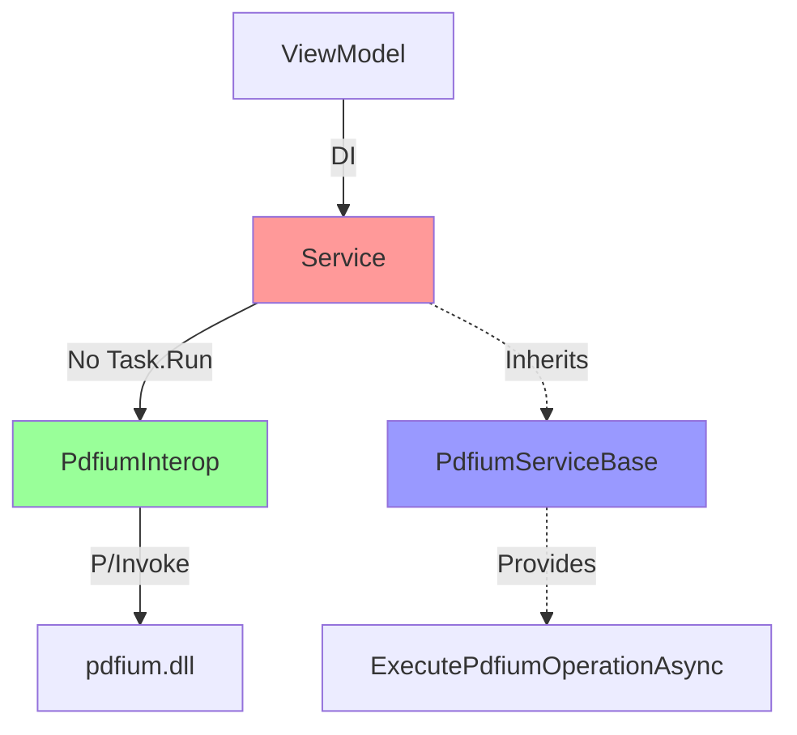

# Design Document

## Overview

This design addresses the systematic removal of Task.Run wrappers around PDFium interop calls and establishes architectural patterns to prevent their reintroduction. The root cause is that PDFium native library cannot be safely called from background threads in .NET 9.0 WinUI 3 self-contained deployments, causing AccessViolation crashes.

The solution involves:
1. Systematically removing Task.Run from all services that call PDFium
2. Creating a base class or attribute system to enforce threading requirements
3. Adding documentation and code comments to prevent future mistakes
4. Optionally adding Roslyn analyzers to detect violations at compile time

## Steering Document Alignment

### Technical Standards (tech.md)
- Maintains existing service architecture patterns
- Uses FluentResults for error handling
- Preserves async/await patterns without Task.Run
- Follows existing logging and telemetry conventions

### Project Structure (structure.md)
- Changes limited to `src/FluentPDF.Rendering/Services`
- May add base classes to `src/FluentPDF.Rendering/Services/Base`
- Documentation updates in relevant service files

## Code Reuse Analysis

### Existing Components to Leverage
- **PdfiumInterop**: Already has correct IntPtr-based P/Invoke declarations
- **SafeHandle classes**: Proper resource management already in place
- **FluentResults**: Error handling pattern to preserve
- **Existing service interfaces**: Contract preservation

### Integration Points
- **All ViewModels**: Already consume services via dependency injection
- **Service layer**: Minimal API surface changes needed
- **Error handling**: Existing PdfError system continues to work

## Architecture

### Core Pattern Change

**Before (Broken):**
```csharp
public async Task<Result<Data>> OperationAsync(...)
{
    return await Task.Run(() =>  // ← WRONG: Crashes in .NET 9.0 WinUI 3
    {
        var handle = PdfiumInterop.Method(...);  // Native call on background thread
        // ... process
        return Result.Ok(data);
    });
}
```

**After (Fixed):**
```csharp
public async Task<Result<Data>> OperationAsync(...)
{
    await Task.Yield();  // ← Proper async without thread switch

    var handle = PdfiumInterop.Method(...);  // Native call on calling thread
    // ... process
    return Result.Ok(data);
}
```

### Architectural Safeguards

#### Option 1: Base Service Class (Recommended)
```csharp
public abstract class PdfiumServiceBase
{
    /// <summary>
    /// CRITICAL: PDFium cannot be called from Task.Run threads in .NET 9.0 WinUI 3.
    /// Always use await Task.Yield() instead of Task.Run for async behavior.
    /// </summary>
    protected static async Task<T> ExecutePdfiumOperationAsync<T>(Func<T> operation)
    {
        await Task.Yield();  // Proper async without thread switch
        return operation();
    }
}
```

#### Option 2: Attribute Documentation
```csharp
[AttributeUsage(AttributeTargets.Method)]
public class RequiresCallingThreadAttribute : Attribute
{
    public string Reason { get; set; } = "PDFium interop requires calling thread";
}
```

#### Option 3: Roslyn Analyzer (Future Enhancement)
- Detect Task.Run calls in methods that call PdfiumInterop
- Compile-time error with fix suggestion
- Can be added in future iteration

### Modular Design Principles
- **Single File Responsibility**: Each service maintains its current responsibility
- **Component Isolation**: Services remain independent
- **Service Layer Separation**: No changes to layer boundaries
- **Minimal API Changes**: Preserve existing method signatures



## Components and Interfaces

### Services Requiring Task.Run Removal

#### Already Fixed (3)
- **PdfDocumentService**: LoadDocumentAsync, GetPageInfoAsync
- **PdfRenderingService**: RenderPageAsync
- **AnnotationService**: (verified no Task.Run)

#### Require Fixing (17)
1. **BookmarkService**: LoadBookmarksAsync
2. **TextSearchService**: SearchTextAsync
3. **ThumbnailRenderingService**: RenderThumbnailAsync
4. **WatermarkService**: AddWatermarkAsync
5. **TextExtractionService**: ExtractTextAsync
6. **PdfFormService**: GetFormFieldsAsync, UpdateFormFieldAsync
7. **PageOperationsService**: DeletePageAsync, RotatePageAsync, ExtractPageAsync
8. **ImageInsertionService**: InsertImageAsync
9. **DocxParserService**: (may not use PDFium)
10. **DocumentEditingService**: Various edit operations
11. **DpiDetectionService**: (may not use PDFium)
12. **FormValidationService**: ValidateFormAsync
13. **DocxConverterService**: (may not use PDFium)
14. **HtmlToPdfService**: (may not use PDFium)
15. **LogExportService**: (may not use PDFium)
16. **MetricsCollectionService**: (may not use PDFium)
17. **LibreOfficeValidator**: (may not use PDFium)

### Base Class: PdfiumServiceBase

- **Purpose:** Provide helper methods and documentation for PDFium threading requirements
- **Interfaces:**
  - `ExecutePdfiumOperationAsync<T>(Func<T> operation)`
  - Documentation comments explaining threading constraints
- **Dependencies:** None
- **Reuses:** Existing async patterns

## Data Models

No new data models required. All existing models preserved.

## Error Handling

### Error Scenarios
1. **Scenario:** PDFium operation fails due to invalid handle
   - **Handling:** Existing PdfError with appropriate error code
   - **User Impact:** Error message displayed, operation canceled

2. **Scenario:** Async operation canceled
   - **Handling:** Existing cancellation token handling
   - **User Impact:** Operation stops cleanly

3. **Scenario:** Native library crash (should not occur after fix)
   - **Handling:** N/A - fix prevents this scenario
   - **User Impact:** Application remains stable

## Testing Strategy

### Unit Testing
- Verify no Task.Run calls in PDFium service methods
- Test async behavior with Task.Yield works correctly
- Validate error handling paths remain functional

### Integration Testing
- Load PDF files and verify no crashes
- Render pages across all services
- Execute all PDF operations (bookmarks, forms, search, etc.)
- Test with real PDFs of various complexities

### End-to-End Testing
- Open application and load PDF
- Navigate pages, use search, fill forms
- Add annotations, bookmarks, watermarks
- Verify application remains responsive and stable
- Test for at least 5 minutes of continuous use

### Verification Checklist
- [ ] No `Task.Run` calls wrapping PDFium interop in any service
- [ ] All async methods use `await Task.Yield()` instead
- [ ] Application loads PDFs without crashing
- [ ] Application stays open during PDF operations
- [ ] All existing functionality works as before
- [ ] Performance is equivalent or better
- [ ] Code comments document threading requirements
