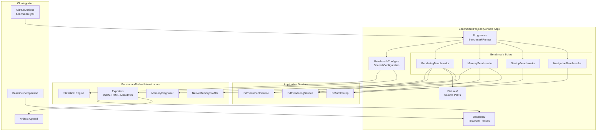

# Design Document

## Overview

The Performance Benchmarking system uses BenchmarkDotNet to establish comprehensive, automated performance measurement for FluentPDF. The design follows a suite-based architecture where each benchmark category (rendering, memory, startup, navigation) is isolated into dedicated classes, all sharing a common configuration and reporting infrastructure.

The system integrates with CI to provide continuous performance monitoring, regression detection, and historical trend tracking through baseline comparison.

## Steering Document Alignment

### Technical Standards (tech.md)

**BenchmarkDotNet**: Industry-standard .NET benchmarking framework with statistical analysis, outlier detection, and export formats (JSON, HTML, Markdown).

**Serilog Integration**: Benchmarks log to the same structured logging infrastructure for correlation with application logs.

**Result Pattern**: Benchmark validation uses `Result<T>` for operations that may fail (e.g., loading baseline, comparing results).

**Dependency Injection**: Benchmarks use the same IHost DI container as the main application for realistic measurements.

### Project Structure (structure.md)

**FluentPDF.Benchmarks**: New console application project in `tests/FluentPDF.Benchmarks/`

**File Organization**:
- `tests/FluentPDF.Benchmarks/Program.cs` - Entry point with BenchmarkRunner
- `tests/FluentPDF.Benchmarks/Config/BenchmarkConfig.cs` - Shared configuration
- `tests/FluentPDF.Benchmarks/Suites/RenderingBenchmarks.cs` - Rendering performance
- `tests/FluentPDF.Benchmarks/Suites/MemoryBenchmarks.cs` - Memory profiling
- `tests/FluentPDF.Benchmarks/Suites/StartupBenchmarks.cs` - Initialization performance
- `tests/FluentPDF.Benchmarks/Suites/NavigationBenchmarks.cs` - Navigation and zoom
- `tests/FluentPDF.Benchmarks/Fixtures/` - Sample PDFs for benchmarking
- `tests/FluentPDF.Benchmarks/Baselines/` - Historical benchmark results

## Code Reuse Analysis

### Existing Components to Leverage

- **PdfDocumentService + PdfRenderingService**: Benchmarks measure these services directly
- **PdfiumInterop**: Benchmarks test native library performance
- **DI Container from App.xaml.cs**: Benchmarks use the same service registration
- **Test Fixtures**: Reuse sample PDFs from `tests/Fixtures/`
- **Serilog Configuration**: Benchmarks log to the same logging infrastructure

### Integration Points

- **CI Workflows**: Add new workflow `benchmark.yml` that runs on Windows agents
- **Baseline Storage**: Commit baselines to repo in `tests/FluentPDF.Benchmarks/Baselines/`
- **Result Comparison**: Compare against baseline from `main` branch to detect regressions
- **Artifact Upload**: Upload HTML reports and JSON results as GitHub artifacts

## Architecture



### Modular Design Principles

- **Single Suite Responsibility**: Each benchmark suite measures one aspect (rendering, memory, startup)
- **Shared Configuration**: Common BenchmarkConfig for consistent setup across all suites
- **Fixture Reuse**: All suites use the same sample PDFs from `Fixtures/`
- **Independent Execution**: Each suite can run independently or as part of full run

## Components and Interfaces

### Component 1: BenchmarkConfig (Shared Configuration)

- **Purpose:** Centralized BenchmarkDotNet configuration for all suites
- **Location:** `tests/FluentPDF.Benchmarks/Config/BenchmarkConfig.cs`
- **Configuration:**
  ```csharp
  public class BenchmarkConfig : ManualConfig
  {
      public BenchmarkConfig()
      {
          AddDiagnoser(MemoryDiagnoser.Default);
          AddDiagnoser(new NativeMemoryProfiler());
          AddExporter(JsonExporter.Full);
          AddExporter(HtmlExporter.Default);
          AddExporter(MarkdownExporter.GitHub);
          AddJob(Job.Default
              .WithRuntime(CoreRuntime.Core80)
              .WithPlatform(Platform.X64)
              .WithWarmupCount(3)
              .WithIterationCount(10));
          AddValidator(JitOptimizationsValidator.FailOnError);
          AddColumnProvider(DefaultColumnProviders.Instance);
      }
  }
  ```
- **Reuses:** BenchmarkDotNet configuration API

### Component 2: RenderingBenchmarks (Suite)

- **Purpose:** Measure PDF page rendering performance across document types and zoom levels
- **Location:** `tests/FluentPDF.Benchmarks/Suites/RenderingBenchmarks.cs`
- **Benchmarks:**
  ```csharp
  [Config(typeof(BenchmarkConfig))]
  public class RenderingBenchmarks
  {
      private IPdfDocumentService _documentService;
      private IPdfRenderingService _renderingService;
      private PdfDocument _textHeavyDoc;
      private PdfDocument _imageHeavyDoc;
      private PdfDocument _vectorDoc;

      [GlobalSetup]
      public void Setup()
      {
          // Initialize DI container
          // Load sample PDFs
      }

      [Benchmark]
      [Arguments(1, 1.0)] // Page 1, 100% zoom
      [Arguments(1, 1.5)] // Page 1, 150% zoom
      [Arguments(1, 2.0)] // Page 1, 200% zoom
      public async Task<BitmapImage> RenderTextHeavyPage(int pageNumber, double zoomLevel)
      {
          var result = await _renderingService.RenderPageAsync(_textHeavyDoc, pageNumber, zoomLevel);
          return result.Value;
      }

      [Benchmark]
      public async Task<BitmapImage> RenderImageHeavyPage(int pageNumber, double zoomLevel) { ... }

      [Benchmark]
      public async Task<BitmapImage> RenderVectorGraphicsPage(int pageNumber, double zoomLevel) { ... }

      [GlobalCleanup]
      public void Cleanup()
      {
          _textHeavyDoc?.Dispose();
          _imageHeavyDoc?.Dispose();
          _vectorDoc?.Dispose();
      }
  }
  ```
- **Dependencies:** IPdfDocumentService, IPdfRenderingService, sample PDFs
- **Reuses:** Services from FluentPDF.Rendering

### Component 3: MemoryBenchmarks (Suite)

- **Purpose:** Profile memory allocations and detect leaks in PDF operations
- **Location:** `tests/FluentPDF.Benchmarks/Suites/MemoryBenchmarks.cs`
- **Benchmarks:**
  ```csharp
  [Config(typeof(BenchmarkConfig))]
  [MemoryDiagnoser]
  [NativeMemoryProfiler]
  public class MemoryBenchmarks
  {
      [Benchmark]
      public void LoadAndDispose_Document()
      {
          var doc = _documentService.LoadDocumentAsync("sample.pdf").Result.Value;
          doc.Dispose();
          // MemoryDiagnoser tracks allocations
      }

      [Benchmark]
      public void RenderAndDispose_Page()
      {
          var bitmap = _renderingService.RenderPageAsync(_doc, 1, 1.0).Result.Value;
          // Check for bitmap leaks
      }

      [Benchmark]
      public void LoadRender_100Pages()
      {
          // Stress test: load and render 100 pages
          // Verify memory is reclaimed
      }
  }
  ```
- **Dependencies:** IPdfDocumentService, IPdfRenderingService
- **Reuses:** MemoryDiagnoser, NativeMemoryProfiler from BenchmarkDotNet

### Component 4: StartupBenchmarks (Suite)

- **Purpose:** Measure application initialization performance
- **Location:** `tests/FluentPDF.Benchmarks/Suites/StartupBenchmarks.cs`
- **Benchmarks:**
  ```csharp
  [Config(typeof(BenchmarkConfig))]
  public class StartupBenchmarks
  {
      [Benchmark]
      public void Initialize_PDFium()
      {
          var interop = new PdfiumInterop();
          interop.Initialize();
          interop.Shutdown();
      }

      [Benchmark]
      public void Initialize_DIContainer()
      {
          var services = new ServiceCollection();
          // Register all services as in App.xaml.cs
          var provider = services.BuildServiceProvider();
      }

      [Benchmark]
      public void ColdStart_FullApplication()
      {
          // Simulate full application startup
          // PDFium init + DI setup + first window render
      }
  }
  ```
- **Dependencies:** PdfiumInterop, DI container setup
- **Reuses:** Application initialization code

### Component 5: NavigationBenchmarks (Suite)

- **Purpose:** Measure page navigation and zoom operation performance
- **Location:** `tests/FluentPDF.Benchmarks/Suites/NavigationBenchmarks.cs`
- **Benchmarks:**
  ```csharp
  [Config(typeof(BenchmarkConfig))]
  public class NavigationBenchmarks
  {
      [Benchmark]
      public async Task Navigate_NextPage()
      {
          // Simulate navigation from page 1 to page 2
          await _renderingService.RenderPageAsync(_doc, 2, 1.0);
      }

      [Benchmark]
      public async Task Navigate_PreviousPage()
      {
          // Simulate navigation from page 2 to page 1
          await _renderingService.RenderPageAsync(_doc, 1, 1.0);
      }

      [Benchmark]
      public async Task ZoomChange_100To150()
      {
          // Simulate zoom change from 100% to 150%
          await _renderingService.RenderPageAsync(_doc, 1, 1.5);
      }
  }
  ```
- **Dependencies:** IPdfRenderingService
- **Reuses:** Rendering service

### Component 6: BaselineManager (Utility)

- **Purpose:** Manage baseline storage, loading, and comparison
- **Location:** `tests/FluentPDF.Benchmarks/Utils/BaselineManager.cs`
- **Methods:**
  ```csharp
  public class BaselineManager
  {
      public Result SaveBaseline(BenchmarkRunInfo runInfo, string outputPath);
      public Result<BaselineData> LoadBaseline(string branch);
      public ComparisonResult Compare(BenchmarkRunInfo current, BaselineData baseline);
      public bool HasRegression(ComparisonResult comparison, double threshold = 0.20);
  }
  ```
- **Storage Format:**
  ```json
  {
      "commitSha": "abc123",
      "date": "2026-01-11T10:30:00Z",
      "hardware": {
          "cpu": "Intel i7-12700K",
          "ram": "32GB"
      },
      "benchmarks": [
          {
              "name": "RenderTextHeavyPage",
              "mean": 234.5,
              "p50": 220.0,
              "p95": 280.0,
              "p99": 310.0,
              "allocatedBytes": 5242880
          }
      ]
  }
  ```
- **Reuses:** Result<T> pattern for file I/O operations

### Component 7: CI Benchmark Workflow

- **Purpose:** Run benchmarks in CI and detect regressions
- **Location:** `.github/workflows/benchmark.yml`
- **Steps:**
  1. Checkout code
  2. Setup .NET 8
  3. Build native libraries (PDFium)
  4. Run benchmarks: `dotnet run -c Release --project tests/FluentPDF.Benchmarks`
  5. Load baseline from `main` branch
  6. Compare results using BaselineManager
  7. If regression > 20%: fail build
  8. If regression 10-20%: show warning
  9. Upload artifacts (HTML report, JSON results)
  10. Comment on PR with benchmark summary
- **Triggers:** Push to PR, push to `main`, manual workflow dispatch
- **Runner:** Windows Server 2022 with consistent hardware specs

## Data Models

### BenchmarkRunInfo
```csharp
public class BenchmarkRunInfo
{
    public string CommitSha { get; init; }
    public DateTime Date { get; init; }
    public HardwareInfo Hardware { get; init; }
    public List<BenchmarkResult> Results { get; init; }
}
```

### BenchmarkResult
```csharp
public class BenchmarkResult
{
    public string Name { get; init; }
    public double Mean { get; init; }
    public double P50 { get; init; }
    public double P95 { get; init; }
    public double P99 { get; init; }
    public long AllocatedBytes { get; init; }
    public int Gen0Collections { get; init; }
    public int Gen1Collections { get; init; }
    public int Gen2Collections { get; init; }
}
```

### ComparisonResult
```csharp
public class ComparisonResult
{
    public string BenchmarkName { get; init; }
    public double BaselineP99 { get; init; }
    public double CurrentP99 { get; init; }
    public double PercentChange { get; init; }
    public bool IsRegression => PercentChange > 0.10; // 10% threshold
    public bool IsCriticalRegression => PercentChange > 0.20; // 20% threshold
}
```

## Error Handling

### Error Scenarios

1. **Benchmark Execution Failure**
   - **Handling:** Catch exceptions in benchmark methods, log to Serilog, mark benchmark as failed
   - **User Impact:** CI shows "Benchmark failed: {error message}", does not block other benchmarks

2. **Missing Baseline**
   - **Handling:** If no baseline exists for branch, treat current run as new baseline
   - **User Impact:** CI logs "No baseline found, establishing new baseline"

3. **Baseline Load Failure**
   - **Handling:** Return `Result.Fail` with error, skip comparison
   - **User Impact:** CI shows warning "Could not load baseline, skipping comparison"

4. **Critical Regression Detected**
   - **Handling:** Fail CI build, post PR comment with regression details
   - **User Impact:** PR blocked until regression is addressed or explicitly overridden

5. **Benchmark Timeout**
   - **Handling:** BenchmarkDotNet has built-in timeout, kill long-running benchmarks
   - **User Impact:** Benchmark marked as timeout, other benchmarks continue

## Testing Strategy

### Unit Testing

**FluentPDF.Benchmarks.Tests/BaselineManagerTests.cs**:
- Test SaveBaseline writes JSON correctly
- Test LoadBaseline reads and deserializes
- Test Compare calculates percent change correctly
- Test HasRegression detects regressions at thresholds

### Integration Testing

**Manual Validation**:
- Run benchmarks locally: `dotnet run -c Release --project tests/FluentPDF.Benchmarks`
- Verify HTML report is generated
- Verify JSON output is valid
- Verify memory profiling shows allocations

**CI Integration**:
- Run benchmark workflow manually
- Verify artifacts are uploaded
- Verify baseline comparison works
- Verify PR comments are posted

### End-to-End Testing

**E2E Workflow**:
1. Create PR with intentional performance regression (add Thread.Sleep)
2. CI runs benchmarks
3. Verify CI detects regression and fails build
4. Verify PR comment shows regression details
5. Fix regression, re-run CI
6. Verify CI passes and updates baseline

## Performance Considerations

### Benchmark Isolation
- Run each suite in separate process to avoid interference
- Use `[GlobalSetup]` and `[GlobalCleanup]` for resource management
- Disable background tasks during benchmarking

### Statistical Rigor
- Minimum 10 iterations per benchmark for reliable P50/P95/P99
- Warmup phase (3 iterations) to eliminate JIT compilation effects
- Outlier detection to filter anomalous results

### CI Resource Management
- Benchmarks run on dedicated Windows agents to ensure consistent hardware
- Limit concurrent benchmark runs to avoid resource contention
- Cache baseline results to speed up comparison

## Benchmark Reporting

### HTML Report Structure
- Summary table: Benchmark name, P50, P95, P99, mean, stddev, allocations
- Memory profile: Gen0/1/2 collections, total allocated, native memory
- Charts: Latency distribution histogram, memory over time
- Comparison section: Baseline vs. current with % change highlighted

### CI PR Comment Format
```markdown
## Benchmark Results

### Summary
- ✅ 12 benchmarks passed
- ⚠️ 2 benchmarks showed minor regression (10-20%)
- ❌ 1 benchmark failed critical threshold (>20%)

### Regressions Detected
| Benchmark | Baseline P99 | Current P99 | Change |
|-----------|--------------|-------------|--------|
| RenderImageHeavyPage | 450ms | 580ms | +28.9% ❌ |
| RenderVectorGraphicsPage | 320ms | 360ms | +12.5% ⚠️ |

### Details
[View full HTML report](https://github.com/.../artifacts/benchmark-report.html)
```

## Future Enhancements

- **Continuous Benchmark Dashboard**: Web dashboard showing performance trends over time
- **Benchmark History Graphs**: Visualize P99 latency trends across commits
- **Automatic Optimization Suggestions**: AI agent analyzes benchmark results and suggests optimizations
- **Cross-Platform Benchmarks**: Run benchmarks on Linux/macOS (via Avalonia port)
- **Real-World Workload Benchmarks**: Simulate user workflows (open 10 PDFs, navigate, zoom)
