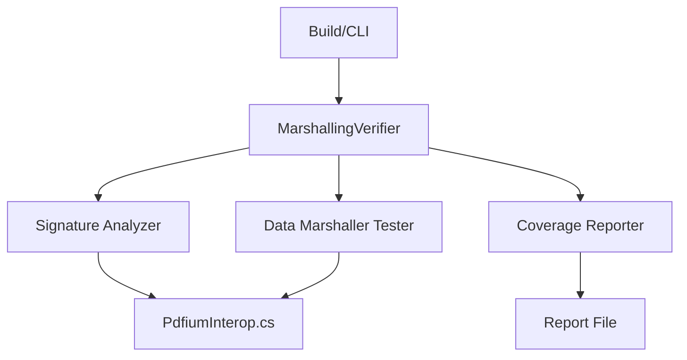

# Design Document

## Overview

Create a build-time and runtime verification system for P/Invoke marshalling correctness. The system analyzes all DllImport declarations, compares them against PDFium API specifications, and tests actual marshalling behavior with known test data.

## Steering Document Alignment

### Technical Standards (tech.md)
- Follows .NET 9 testing patterns
- Uses xUnit for test framework
- Leverages existing PDFium interop layer

### Project Structure (structure.md)
- Tests in `tests/FluentPDF.Rendering.Tests/Interop/MarshallingVerificationTests.cs`
- Verification tool in `src/FluentPDF.Rendering/Interop/MarshallingVerifier.cs`
- CLI command in `src/FluentPDF.App/CommandLineOptions.cs` and `DiagnosticCommandHandler.cs`

## Code Reuse Analysis

### Existing Components to Leverage
- **PdfiumInterop.cs**: All DllImport declarations to verify
- **DiagnosticCommandHandler.cs**: CLI command infrastructure
- **CommandLineOptions.cs**: Argument parsing framework

### Integration Points
- **Build Process**: MSBuild target for pre-build verification
- **CI/CD Pipeline**: CLI command in build scripts
- **Testing Framework**: xUnit test infrastructure

## Architecture



### Modular Design Principles
- **Single File Responsibility**: Separate verifier, analyzer, tester, reporter
- **Component Isolation**: Verification logic independent of rendering
- **Service Layer Separation**: Clear separation between verification and production code
- **Utility Modularity**: Reusable verification utilities

## Components and Interfaces

### MarshallingVerifier
- **Purpose:** Orchestrates verification process
- **Interfaces:**
  - `VerifyAllSignatures()` - Verifies all P/Invoke signatures
  - `TestMarshalling()` - Tests data marshalling with test cases
  - `GenerateReport()` - Generates coverage report
- **Dependencies:** PdfiumInterop, reflection APIs
- **Reuses:** Existing PDFium function list from PdfiumInterop.cs

### SignatureAnalyzer
- **Purpose:** Analyzes DllImport signatures for correctness
- **Interfaces:**
  - `AnalyzeSignature(MethodInfo)` - Validates single signature
  - `CompareWithSpec(MethodInfo, PdfiumSpec)` - Compares against spec
- **Dependencies:** Reflection, PDFium specification data
- **Reuses:** N/A (new component)

### DataMarshallerTester
- **Purpose:** Tests actual marshalling behavior
- **Interfaces:**
  - `TestFunction(string functionName, object[] testData)` - Tests function marshalling
  - `VerifyReturn<T>(T expected, T actual)` - Verifies return value
- **Dependencies:** PdfiumInterop
- **Reuses:** Existing PDFium initialization from tests

### CoverageReporter
- **Purpose:** Generates marshalling verification coverage reports
- **Interfaces:**
  - `GenerateReport(VerificationResults)` - Creates report
  - `ExportToFile(string path)` - Saves report to file
- **Dependencies:** Verification results data
- **Reuses:** N/A (new component)

## Data Models

### VerificationResult
```csharp
public class VerificationResult
{
    public string FunctionName { get; set; }
    public bool SignatureValid { get; set; }
    public bool MarshallingCorrect { get; set; }
    public string? ErrorMessage { get; set; }
    public SignatureDetails? Signature { get; set; }
    public MarshallingTestResult? TestResult { get; set; }
}
```

### SignatureDetails
```csharp
public class SignatureDetails
{
    public string ReturnType { get; set; }
    public List<ParameterInfo> Parameters { get; set; }
    public string CallingConvention { get; set; }
    public string EntryPoint { get; set; }
}
```

### MarshallingTestResult
```csharp
public class MarshallingTestResult
{
    public bool Success { get; set; }
    public object? ExpectedValue { get; set; }
    public object? ActualValue { get; set; }
    public string? ErrorDetails { get; set; }
}
```

### CoverageReport
```csharp
public class CoverageReport
{
    public int TotalFunctions { get; set; }
    public int VerifiedFunctions { get; set; }
    public int TestedFunctions { get; set; }
    public List<string> UntestedFunctions { get; set; }
    public List<VerificationResult> Results { get; set; }
}
```

## Error Handling

### Error Scenarios
1. **Signature Mismatch:** DllImport signature doesn't match PDFium API
   - **Handling:** Fail build with detailed error showing expected vs actual
   - **User Impact:** Build fails, developer fixes signature

2. **Marshalling Failure:** Data marshals incorrectly at runtime
   - **Handling:** Test fails with expected vs actual values
   - **User Impact:** Test fails, developer fixes marshalling attributes

3. **PDFium Not Available:** pdfium.dll not found during verification
   - **Handling:** Skip runtime tests, verify signatures only
   - **User Impact:** Partial verification, warning logged

## Testing Strategy

### Unit Testing
- Test each verifier component independently
- Mock PDFium calls for deterministic tests
- Verify error detection with intentionally broken signatures

### Integration Testing
- Test full verification flow end-to-end
- Use actual PDFium library with test PDFs
- Verify CLI command integration

### End-to-End Testing
- Run verification as part of CI/CD pipeline
- Test against all supported PDFium versions
- Verify build fails on signature mismatch
