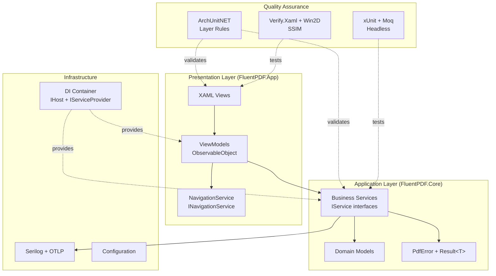

# Design Document

## Overview

The project foundation implements a multi-layered Windows application using WinUI 3, following clean architecture principles with verifiable quality mechanisms. The design emphasizes testability, observability, and AI-assisted quality analysis through structured logging and architectural enforcement.

This foundation creates a "golden path" for all future development, ensuring consistency and quality from the start.

## Steering Document Alignment

### Technical Standards (tech.md)

The design implements all key technical decisions:
- **WinUI 3 with CommunityToolkit.Mvvm**: Uses source generators for MVVM with minimal boilerplate
- **FluentResults**: Type-safe error handling with rich context for AI analysis
- **Serilog + OpenTelemetry**: Structured logging with OTLP export to .NET Aspire Dashboard
- **ArchUnitNET**: Automated architectural validation in CI/CD pipeline
- **Microsoft.Extensions.DependencyInjection**: Standard .NET DI container with IHost pattern
- **vcpkg**: Manages PDFium and QPDF native dependencies with reproducible builds

### Project Structure (structure.md)

Follows exact directory organization:
```
FluentPDF/
├── src/
│   ├── FluentPDF.App/              # WinUI 3 UI layer
│   ├── FluentPDF.Core/             # Business logic (UI-agnostic)
│   └── FluentPDF.Rendering/        # PDF rendering (PDFium P/Invoke)
├── tests/
│   ├── FluentPDF.Architecture.Tests/  # ArchUnitNET rules
│   ├── FluentPDF.Core.Tests/       # Unit tests (headless)
│   └── FluentPDF.App.Tests/        # UI automation (FlaUI)
├── tools/
│   ├── vcpkg/                      # Native library management
│   └── ai-quality-agent/           # AI analysis scripts
└── .github/workflows/              # CI/CD pipelines
```

## Code Reuse Analysis

### Existing Components to Leverage
- **None (greenfield project)**: This is the foundation; no existing code to reuse

### Integration Points for Future Features
- **IPdfService**: Will be implemented later for PDF operations; DI setup prepares for it
- **INavigationService**: Abstraction ready for routing between pages
- **IFileService**: Interface prepared for file system operations with `broadFileSystemAccess`
- **ITelemetryService**: Hook for future Application Insights integration

## Architecture

### Overall System Design



### Modular Design Principles

1. **Single File Responsibility**:
   - `App.xaml.cs`: DI configuration and global exception handling
   - `PdfError.cs`: Structured error types
   - `SerilogConfiguration.cs`: Logging setup
   - `LayerTests.cs`: ArchUnitNET rules

2. **Component Isolation**:
   - ViewModels have ZERO dependencies on WinUI types (testable headless)
   - Core layer has ZERO dependencies on App layer (enforced by ArchUnitNET)
   - Services use interfaces exclusively for mockability

3. **Service Layer Separation**:
   - Core: Business logic and domain models
   - Infrastructure: DI, logging, configuration
   - Presentation: ViewModels and Views

4. **Utility Modularity**:
   - `ErrorHandling/PdfError.cs`: Structured error definitions
   - `Logging/SerilogConfiguration.cs`: Logging setup
   - `DependencyInjection/ServiceCollectionExtensions.cs`: DI registration helpers

## Components and Interfaces

### Component 1: Solution Structure

**Purpose:** Establish Visual Studio solution with properly configured projects

**Structure:**
```xml
FluentPDF.sln
├── src/
│   ├── FluentPDF.App (WinUI 3 Application)
│   │   - Targets: net8.0-windows10.0.19041.0
│   │   - Packaged: MSIX
│   │   - References: FluentPDF.Core, FluentPDF.Rendering
│   ├── FluentPDF.Core (Class Library)
│   │   - Targets: net8.0
│   │   - No UI dependencies
│   │   - NuGet: FluentResults, Serilog
│   └── FluentPDF.Rendering (Class Library)
│       - Targets: net8.0
│       - P/Invoke to PDFium
│       - References: FluentPDF.Core
└── tests/
    ├── FluentPDF.Architecture.Tests (xUnit)
    │   - NuGet: ArchUnitNET.xUnit
    ├── FluentPDF.Core.Tests (xUnit)
    │   - NuGet: xUnit, FluentAssertions, Moq
    └── FluentPDF.App.Tests (xUnit)
        - NuGet: FlaUI.Core, FlaUI.UIA3
```

**Reuses:** Directory.Build.props for shared MSBuild properties

### Component 2: MVVM Foundation

**Purpose:** Enable testable ViewModels with minimal boilerplate

**Interfaces:**
```csharp
// CommunityToolkit.Mvvm base class
public partial class MainViewModel : ObservableObject
{
    [ObservableProperty]
    private string _title = "FluentPDF";

    [RelayCommand]
    private async Task OpenFileAsync() { ... }
}

// Navigation abstraction
public interface INavigationService
{
    void NavigateTo<TViewModel>() where TViewModel : ObservableObject;
    void GoBack();
    bool CanGoBack { get; }
}
```

**Dependencies:**
- CommunityToolkit.Mvvm (NuGet)
- Microsoft.Extensions.DependencyInjection (NuGet)

**Reuses:** Standard WinUI 3 XAML patterns

### Component 3: Result Pattern Error Handling

**Purpose:** Type-safe domain error handling with AI-analyzable metadata

**Interfaces:**
```csharp
// Base error type
public class PdfError : Error
{
    public string ErrorCode { get; init; }
    public ErrorCategory Category { get; init; }
    public ErrorSeverity Severity { get; init; }
    public Dictionary<string, object> Context { get; init; }
}

// Error categories for classification
public enum ErrorCategory
{
    Validation, System, Security, IO, Rendering, Conversion
}

// Severity for prioritization
public enum ErrorSeverity
{
    Critical, Error, Warning, Info
}

// Usage example
public Result<PdfDocument> LoadDocument(string path)
{
    if (!File.Exists(path))
    {
        var error = new PdfError(
            "PDF_LOAD_FILE_NOT_FOUND",
            $"File not found: {path}",
            ErrorCategory.IO,
            ErrorSeverity.Error
        );
        error.Context["FilePath"] = path;
        return Result.Fail(error);
    }

    return Result.Ok(new PdfDocument(path));
}
```

**Dependencies:** FluentResults (NuGet)

**Reuses:** Standard Result pattern conventions

### Component 4: Dependency Injection Container

**Purpose:** Centralized service registration and resolution

**Interfaces:**
```csharp
// App.xaml.cs setup
public partial class App : Application
{
    private IHost _host;

    public App()
    {
        _host = Host.CreateDefaultBuilder()
            .ConfigureServices((context, services) =>
            {
                // ViewModels (Transient)
                services.AddTransient<MainViewModel>();

                // Services (Singleton)
                services.AddSingleton<INavigationService, NavigationService>();
                services.AddSingleton<ITelemetryService, OpenTelemetryService>();

                // Logging
                services.AddLogging(builder =>
                {
                    builder.AddSerilog(dispose: true);
                });
            })
            .Build();
    }

    public T GetService<T>() => _host.Services.GetRequiredService<T>();
}

// Service interface pattern
public interface IPdfService
{
    Task<Result<PdfDocument>> LoadAsync(string path);
}

public class PdfService : IPdfService
{
    private readonly ILogger<PdfService> _logger;

    public PdfService(ILogger<PdfService> logger)
    {
        _logger = logger;
    }

    public async Task<Result<PdfDocument>> LoadAsync(string path)
    {
        _logger.Information("Loading PDF: {Path}", path);
        // Implementation
    }
}
```

**Dependencies:** Microsoft.Extensions.Hosting (NuGet)

**Reuses:** Standard .NET Generic Host pattern

### Component 5: Structured Logging Infrastructure

**Purpose:** Observable system with correlation IDs and AI-friendly logs

**Interfaces:**
```csharp
// Serilog configuration
public static class SerilogConfiguration
{
    public static ILogger CreateLogger()
    {
        return new LoggerConfiguration()
            .MinimumLevel.Debug()
            .Enrich.FromLogContext()
            .Enrich.WithProperty("Application", "FluentPDF")
            .Enrich.WithProperty("Version", GetVersion())
            .Enrich.WithMachineName()
            .WriteTo.Async(a => a.File(
                new JsonFormatter(),
                GetLogPath(),
                rollingInterval: RollingInterval.Day))
            .WriteTo.OpenTelemetry(options =>
            {
                options.Endpoint = "http://localhost:4317";
                options.Protocol = OtlpProtocol.Grpc;
                options.ResourceAttributes = new Dictionary<string, object>
                {
                    ["service.name"] = "FluentPDF.Desktop",
                    ["service.version"] = GetVersion()
                };
            })
            .CreateLogger();
    }

    private static string GetLogPath()
    {
        var localFolder = ApplicationData.Current.LocalFolder.Path;
        return Path.Combine(localFolder, "logs", "log-.json");
    }
}

// Usage with correlation IDs
public async Task ProcessDocumentAsync(string path)
{
    var correlationId = Guid.NewGuid().ToString();
    using var _ = LogContext.PushProperty("CorrelationId", correlationId);

    _logger.Information("Starting document processing");
    // All logs in this scope include CorrelationId
}
```

**Dependencies:**
- Serilog (NuGet)
- Serilog.Sinks.File (NuGet)
- Serilog.Sinks.Async (NuGet)
- Serilog.Sinks.OpenTelemetry (NuGet)
- Serilog.Formatting.Compact (NuGet)

**Reuses:** Standard Serilog patterns

### Component 6: ArchUnitNET Architecture Tests

**Purpose:** Automated enforcement of architectural rules

**Interfaces:**
```csharp
public class LayerTests
{
    private static readonly Architecture Architecture =
        new ArchLoader().LoadAssemblies(
            typeof(FluentPDF.Core.Pdf.PdfDocument).Assembly,
            typeof(FluentPDF.App.App).Assembly
        ).Build();

    [Fact]
    public void CoreLayer_ShouldNot_DependOn_AppLayer()
    {
        var rule = Types()
            .That().ResideInNamespace("FluentPDF.Core", useRegularExpressions: true)
            .Should().NotDependOnAny(Types()
                .That().ResideInNamespace("FluentPDF.App", useRegularExpressions: true))
            .Because("Core must be UI-agnostic");

        rule.Check(Architecture);
    }

    [Fact]
    public void ViewModels_Should_InheritFrom_ObservableObject()
    {
        var rule = Classes()
            .That().HaveNameEndingWith("ViewModel")
            .Should().Inherit(typeof(ObservableObject))
            .Because("ViewModels must use CommunityToolkit.Mvvm");

        rule.Check(Architecture);
    }
}
```

**Dependencies:** ArchUnitNET.xUnit (NuGet)

**Reuses:** Standard ArchUnitNET fluent API

### Component 7: Testing Infrastructure Setup

**Purpose:** Comprehensive testing tools for all layers

**Structure:**
```
tests/
├── FluentPDF.Architecture.Tests/
│   ├── LayerTests.cs              # Dependency rules
│   ├── NamingTests.cs             # Naming conventions
│   └── InterfaceTests.cs          # Service interface patterns
├── FluentPDF.Core.Tests/
│   ├── TestBase.cs                # Base test class with helpers
│   ├── Fixtures/                  # Shared test data
│   └── Mocks/                     # Mock implementations
└── FluentPDF.App.Tests/
    ├── PageObjects/               # FlaUI page objects
    └── Visual/                    # Verify.Xaml snapshots
```

**Dependencies:**
- xUnit (NuGet)
- FluentAssertions (NuGet)
- Moq (NuGet)
- Verify.Xunit (NuGet)
- FlaUI.Core (NuGet)
- FlaUI.UIA3 (NuGet)
- BenchmarkDotNet (NuGet)
- Microsoft.Graphics.Win2D (NuGet)
- OpenCvSharp4 (NuGet)

**Reuses:** Standard xUnit patterns

### Component 8: vcpkg Build Infrastructure

**Purpose:** Automated native library build and integration

**Structure:**
```powershell
# tools/build-libs.ps1
param(
    [string]$Triplet = "x64-windows",
    [switch]$UseCache
)

# Bootstrap vcpkg if needed
if (-not (Test-Path "tools/vcpkg/vcpkg.exe")) {
    Write-Host "Bootstrapping vcpkg..."
    git clone https://github.com/microsoft/vcpkg.git tools/vcpkg
    .\tools\vcpkg\bootstrap-vcpkg.bat
}

# Install dependencies
Write-Host "Installing PDFium and QPDF..."
.\tools\vcpkg\vcpkg install pdfium:$Triplet qpdf:$Triplet

# Copy DLLs to libs directory
$installPath = "tools/vcpkg/installed/$Triplet/bin"
$targetPath = "libs/$($Triplet -replace '-windows', '')"
New-Item -ItemType Directory -Force -Path $targetPath
Copy-Item "$installPath/*.dll" $targetPath -Force

Write-Host "Native libraries built successfully!"
```

**Dependencies:** vcpkg (git submodule)

**Reuses:** Standard vcpkg patterns

### Component 9: CI/CD Pipeline Configuration

**Purpose:** Automated quality gates in GitHub Actions

**Structure:**
```yaml
# .github/workflows/build.yml
name: Build
on: [push, pull_request]
jobs:
  build:
    runs-on: windows-2022
    steps:
      - uses: actions/checkout@v4
      - uses: microsoft/setup-msbuild@v2
      - name: Build native libraries
        run: ./tools/build-libs.ps1 -UseCache
      - name: Restore NuGet
        run: dotnet restore
      - name: Build solution
        run: msbuild FluentPDF.sln /p:Configuration=Release

# .github/workflows/test.yml
name: Tests
on: [push, pull_request]
jobs:
  test:
    runs-on: windows-2022
    steps:
      - uses: actions/checkout@v4
      - name: Run architecture tests
        run: dotnet test tests/FluentPDF.Architecture.Tests
      - name: Run unit tests
        run: dotnet test tests/FluentPDF.Core.Tests
      - name: Upload TRX results
        uses: actions/upload-artifact@v4
        with:
          name: test-results
          path: '**/*.trx'
```

**Dependencies:** GitHub Actions

**Reuses:** Standard GitHub Actions workflow patterns

## Data Models

### PdfError (Core Layer)
```csharp
public class PdfError : FluentResults.Error
{
    public string ErrorCode { get; init; }          // e.g., "PDF_LOAD_FILE_NOT_FOUND"
    public ErrorCategory Category { get; init; }    // Validation, System, Security, IO, Rendering, Conversion
    public ErrorSeverity Severity { get; init; }    // Critical, Error, Warning, Info
    public Dictionary<string, object> Context { get; init; } // Additional metadata
}
```

### LogEntry (Infrastructure)
```json
{
  "Timestamp": "2026-01-10T10:30:45.123Z",
  "Level": "Information",
  "MessageTemplate": "Loading PDF: {Path}",
  "Properties": {
    "Path": "C:\\Users\\user\\document.pdf",
    "CorrelationId": "abc123-def456",
    "Application": "FluentPDF",
    "Version": "1.0.0"
  }
}
```

## Error Handling

### Error Scenarios

1. **Scenario: Service Operation Fails**
   - **Handling:** Return `Result.Fail(new PdfError(...))` with appropriate ErrorCode and Context
   - **User Impact:** ViewModel receives failure, displays friendly error message, logs details

2. **Scenario: Unhandled Exception (Crash)**
   - **Handling:** Global handler catches in `Application.UnhandledException`, logs with correlation ID, shows error dialog
   - **User Impact:** App remains stable, user sees error dialog with correlation ID for support

3. **Scenario: Architecture Rule Violation**
   - **Handling:** ArchUnitNET test fails in CI, PR cannot merge
   - **User Impact:** Developer receives clear error message explaining the violated rule

4. **Scenario: Logging Failure**
   - **Handling:** Async logging continues, file sink has fallback, app doesn't crash
   - **User Impact:** No visible impact; logs may be incomplete but app remains functional

## Testing Strategy

### Unit Testing
- **Approach:** Headless tests for Core and ViewModels using xUnit + Moq
- **Key Components:**
  - PdfError serialization and metadata
  - Result pattern success/failure flows
  - ViewModel property change notifications
  - Service methods with mocked dependencies

### Integration Testing
- **Approach:** FlaUI for UI automation with Page Object Pattern
- **Key Flows:**
  - Application startup and DI resolution
  - Navigation between pages
  - Error dialog display

### Architecture Testing
- **Approach:** ArchUnitNET rules executed in CI
- **Key Rules:**
  - Layer dependency validation
  - Naming convention enforcement
  - Interface usage patterns

### Visual Regression Testing
- **Approach:** Verify.Xaml snapshots + Win2D headless rendering with SSIM
- **Key Scenarios:**
  - Error dialog appearance
  - Main window layout
  - Theme consistency

### Performance Testing
- **Approach:** BenchmarkDotNet for critical paths
- **Key Metrics:**
  - DI container resolution time
  - Logging throughput
  - ViewModel creation overhead
