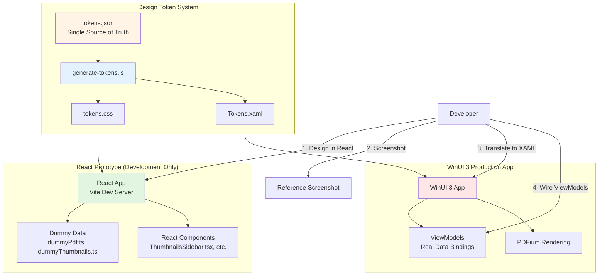
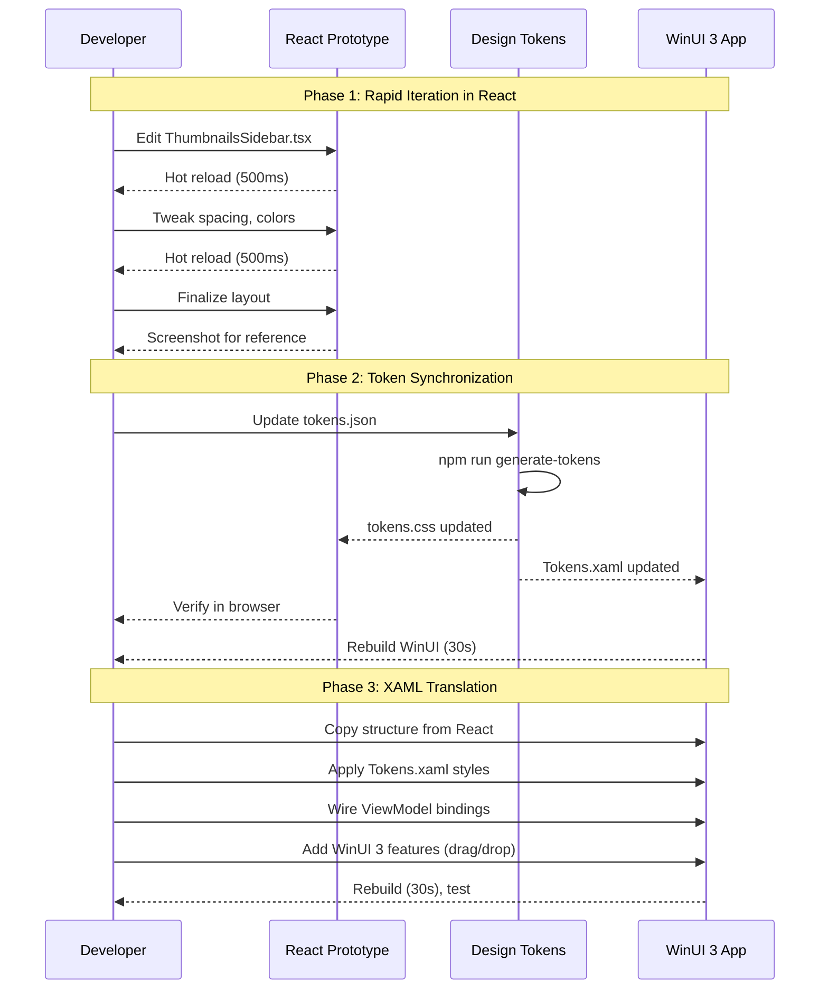

# Design Document

## Overview

The React Prototype Workflow system creates a parallel UI development environment using React, TypeScript, and Vite alongside FluentPDF's production WinUI 3 application. This dual-track approach maintains WinUI 3 as the production UI while leveraging web tooling's instant hot reload for rapid visual iteration.

The system consists of four key subsystems:
1. **React Development Environment**: Vite-powered development server with hot module replacement (HMR)
2. **XAML → React Reverse Engineering Pipeline**: Automated and manual tools to generate React components from existing XAML
3. **Design Token System**: JSON-based single source of truth for colors, spacing, typography that generates both CSS and XAML
4. **Dummy Data Infrastructure**: Realistic mock PDFs, thumbnails, bookmarks for visual testing without rendering logic

**Architecture Philosophy**: The React prototype is **write-only** for developers—it generates visual designs that are manually translated to XAML. There is no automatic XAML↔React synchronization (deliberately avoided as error-prone). Design tokens are the only shared artifact, managed through explicit generation commands.

## Steering Document Alignment

### Technical Standards (tech.md)

**Dependency Injection**: Not applicable to React prototype (no business logic). XAML side continues using Microsoft.Extensions.DependencyInjection.

**Error Handling**: React prototype uses FluentResults pattern concepts for documenting error states visually, but doesn't implement actual error handling (dummy data only).

**Modular Design**: Each React component maps 1:1 to a XAML UserControl, enforcing clean boundaries.

**Testing**: React prototype has minimal testing (TypeScript compilation + basic build verification). Focus remains on WinUI 3 architecture tests (ArchUnitNET), visual regression tests (Verify.Xaml + Win2D), and FlaUI integration tests.

**Development Tools**: Adds Node.js/npm to existing C# toolchain. Developers must have both Visual Studio 2022 (WinUI 3) and Node 20+ (React).

### Project Structure (structure.md)

New prototype directory **outside** main FluentPDF source tree to prevent accidental inclusion in MSIX package:

```
FluentPDF/
├── src/
│   ├── FluentPDF.Core/       # .NET business logic (unchanged)
│   ├── FluentPDF.Rendering/   # PDFium wrappers (unchanged)
│   └── FluentPDF.App/         # WinUI 3 production UI (unchanged)
├── tests/                      # .NET tests (unchanged)
├── prototype/                  # NEW: React development environment
│   ├── src/
│   │   ├── components/         # React components mirroring XAML
│   │   ├── data/               # Dummy data generators
│   │   ├── styles/             # CSS, design tokens
│   │   └── utils/              # Type definitions, helpers
│   ├── tools/                  # Design token generation scripts
│   ├── package.json
│   ├── tsconfig.json
│   └── vite.config.ts
├── docs/
│   └── component-mapping.md   # NEW: React ↔ XAML translation guide
└── design-tokens/              # NEW: Shared styling source of truth
    ├── tokens.json             # Master token definitions
    ├── tokens.css              # Generated for React
    └── Tokens.xaml             # Generated for WinUI 3
```

## Code Reuse Analysis

### Existing Components to Leverage

**None from C# codebase**—React prototype is intentionally isolated. However, the **visual structure** of existing XAML components will be reverse-engineered:

- **ThumbnailsSidebar.xaml** (170 lines): Extract layout structure (150px width, 8px spacing, StackLayout), ignore drag/drop logic
- **BookmarksPanel.xaml**: Extract TreeView hierarchy structure, ignore navigation logic
- **PdfViewerControl.xaml**: Extract main viewer layout, ignore PDFium rendering integration
- **Toolbar components**: Extract button grouping, ignore command bindings

**Existing Styles to Extract**:
- **WinUI 3 Theme Resources**: `AccentFillColorDefaultBrush`, `CardBackgroundFillColorDefaultBrush`, `TextFillColorSecondaryBrush`
- **Spacing values**: Existing `Margin="8"` becomes `--spacing-sm: 8px`
- **Font styles**: `CaptionTextBlockStyle`, `BodyTextBlockStyle`

### Integration Points

**No runtime integration**—React and WinUI 3 apps never communicate. Integration happens through:

1. **Design Tokens** (build-time): JSON → CSS + XAML generation
2. **Developer Workflow** (manual): React → Screenshot → XAML translation
3. **CI Verification** (automated): React build validation in GitHub Actions to prevent prototype rot

## Architecture

### Modular Design Principles

- **Single File Responsibility**: Each React component mirrors one XAML UserControl (e.g., `ThumbnailsSidebar.tsx` ↔ `ThumbnailsSidebar.xaml`)
- **Component Isolation**: React components use props only (no global state, no context) to match XAML's property-driven model
- **Service Layer Separation**: No services in React—all data is hardcoded dummy data from `data/` modules
- **Utility Modularity**: Design token generator is standalone Node.js script, reusable for other projects

### System Architecture



### Development Workflow



## Components and Interfaces

### Component 1: Design Token Generator

- **Purpose:** Transforms tokens.json into CSS custom properties and XAML ResourceDictionary
- **Technology:** Node.js script (TypeScript)
- **Input:** `design-tokens/tokens.json` (validated JSON Schema)
- **Outputs:**
  - `prototype/src/styles/tokens.css`
  - `design-tokens/Tokens.xaml`
- **Dependencies:** None (standalone script)
- **Algorithm:**
  ```typescript
  // Simplified logic
  function generateCSS(tokens) {
    return `:root {
      ${Object.entries(tokens.colors).map(([k, v]) => `--color-${k}: ${v};`).join('\n')}
    }`;
  }

  function generateXAML(tokens) {
    return `<ResourceDictionary>
      ${Object.entries(tokens.colors).map(([k, v]) =>
        `<SolidColorBrush x:Key="${capitalize(k)}Brush" Color="${v}"/>`
      ).join('\n')}
    </ResourceDictionary>`;
  }
  ```

### Component 2: React Components (Prototype UI)

**Example: ThumbnailsSidebar Component**

- **Purpose:** Visual prototype of ThumbnailsSidebar.xaml for rapid layout iteration
- **Interface:**
  ```typescript
  interface ThumbnailsSidebarProps {
    // Props mirror XAML properties (but receive dummy data)
  }
  export function ThumbnailsSidebar(props: ThumbnailsSidebarProps) {
    const thumbnails = useDummyThumbnails(10); // Hardcoded dummy data
    return (
      <div className="thumbnails-sidebar">
        {thumbnails.map(item => (
          <div className="thumbnail-item" key={item.pageNumber}>
            <div className="thumbnail-image" />
            <span className="page-number">{item.pageNumber}</span>
          </div>
        ))}
      </div>
    );
  }
  ```
- **Styling:** Uses CSS classes that reference design tokens (`var(--spacing-sm)`)
- **Dependencies:** Dummy data from `data/dummyThumbnails.ts`
- **Reuses:** None (new code)

**Component Inventory (18 components to create):**

**Controls (9):**
1. PdfViewerControl.tsx
2. ThumbnailsSidebar.tsx
3. BookmarksPanel.tsx
4. AnnotationLayer.tsx
5. FormFieldControl.tsx
6. ImageManipulationOverlay.tsx
7. LogViewerControl.tsx
8. DiagnosticsPanelControl.tsx
9. ValidationErrorPanel.tsx

**Views/Dialogs (9):**
10. MainWindow.tsx
11. MainPage.tsx
12. PdfViewerPage.tsx
13. SettingsPage.tsx
14. ConversionPage.tsx
15. WatermarkDialog.tsx
16. DeletePagesDialog.tsx
17. ErrorDialog.tsx
18. SaveConfirmationDialog.tsx

### Component 3: Dummy Data Generators

- **Purpose:** Provide realistic PDF metadata and UI states for visual testing
- **Modules:**
  - `dummyPdfDocument.ts`: Generates fake PdfDocument with pages
  - `dummyThumbnails.ts`: Generates thumbnail array with loading/selected states
  - `dummyBookmarks.ts`: Generates hierarchical bookmark tree
  - `dummyFormFields.ts`: Generates form field samples
- **Example:**
  ```typescript
  // dummyThumbnails.ts
  export function useDummyThumbnails(count: number): ThumbnailItem[] {
    return Array.from({ length: count }, (_, i) => ({
      pageNumber: i + 1,
      isSelected: i === 2, // Page 3 selected
      isLoading: i > count - 3, // Last 3 pages loading
      thumbnail: null, // Visual placeholder rendered as gradient
    }));
  }
  ```
- **Reuses:** TypeScript type definitions

### Component 4: Vite Development Server

- **Purpose:** Provides instant hot reload for React components
- **Configuration:** `vite.config.ts` with React plugin, port 5173
- **Features:**
  - Hot Module Replacement (HMR) for sub-second updates
  - TypeScript type checking
  - CSS processing with PostCSS
- **Dependencies:** Vite 5.x, React 18.x, TypeScript 5.x

## Data Models

### Design Token Schema

```typescript
// tokens.schema.json (validated with JSON Schema)
interface DesignTokens {
  colors: {
    surface: string;        // Hex color (#F3F3F3)
    accent: string;         // #0078D4
    textPrimary: string;    // #1F1F1F
    textSecondary: string;  // #616161
    border: string;         // #E0E0E0
    error: string;          // #E81123
    warning: string;        // #FFB900
    success: string;        // #107C10
  };
  spacing: {
    xs: string;   // "4px"
    sm: string;   // "8px"
    md: string;   // "16px"
    lg: string;   // "24px"
    xl: string;   // "32px"
  };
  typography: {
    bodySize: string;     // "14px"
    bodyLineHeight: string; // "20px"
    headingSize: string;   // "18px"
    captionSize: string;   // "12px"
    fontFamily: string;    // "Segoe UI"
  };
  borders: {
    thin: string;   // "1px"
    medium: string; // "2px"
    thick: string;  // "3px"
    radius: string; // "4px"
  };
}
```

### Dummy PDF Document Model

```typescript
// data/models.ts
interface DummyPdfDocument {
  fileName: string;
  pageCount: number;
  fileSize: number; // bytes
  pages: DummyPage[];
  bookmarks: DummyBookmark[];
  metadata: {
    title?: string;
    author?: string;
    subject?: string;
    keywords?: string;
  };
}

interface DummyPage {
  pageNumber: number;
  width: number;   // points
  height: number;  // points
  rotation: 0 | 90 | 180 | 270;
  contentType: 'text' | 'image' | 'mixed';
}

interface DummyBookmark {
  title: string;
  pageNumber: number;
  children: DummyBookmark[];
}

interface ThumbnailItem {
  pageNumber: number;
  isSelected: boolean;
  isLoading: boolean;
  thumbnail: string | null; // null = show placeholder
}
```

## Error Handling

### Error Scenarios

1. **Scenario: Invalid Design Token**
   - **Handling:** Token generator script validates JSON schema, reports line number and error type
   - **User Impact:** Developer sees error message: `Invalid color hex in tokens.json:42 - "color.accent" must be valid hex (e.g., #0078D4)`
   - **Recovery:** Fix tokens.json, re-run `npm run generate-tokens`

2. **Scenario: React Build Failure in CI**
   - **Handling:** GitHub Actions fails PR if `npm run build` exits non-zero
   - **User Impact:** PR cannot merge until React prototype builds successfully
   - **Recovery:** Fix TypeScript errors or dependency issues

3. **Scenario: Missing Node.js/npm on Developer Machine**
   - **Handling:** README includes prerequisite check script: `npm --version || echo "Install Node.js 20+"`
   - **User Impact:** Developer cannot start React dev server
   - **Recovery:** Install Node.js from https://nodejs.org/

4. **Scenario: Port 5173 Already in Use**
   - **Handling:** Vite automatically tries next available port (5174, 5175, etc.)
   - **User Impact:** Dev server starts on different port, logged to console
   - **Recovery:** None needed (automatic)

## Testing Strategy

### Unit Testing

**Design Token Generator:**
- **Test:** Valid JSON → Valid CSS and XAML output
- **Test:** Invalid color hex → Descriptive error message
- **Test:** Missing required token → Schema validation error
- **Framework:** Jest (Node.js)

**React Components:**
- **Minimal testing**: Only TypeScript type checking (`tsc --noEmit`)
- **Rationale:** Prototype is visual reference only, not production code
- **CI Verification:** `npm run build` must succeed (ensures no TS errors)

### Integration Testing

**Not Applicable**: React prototype is isolated from production app. No integration points to test.

### End-to-End Testing

**Manual Visual Verification:**
- Developer screenshots React prototype
- Compares screenshot to WinUI 3 app during translation
- No automated E2E tests for prototype

**WinUI 3 E2E Tests (Unchanged):**
- Existing FlaUI tests verify production XAML functionality
- Verify.Xaml snapshot tests catch visual regressions in XAML

## Tool Selection Rationale

### Vite vs. Create React App (CRA)
- **Decision:** Vite
- **Rationale:** 10x faster dev server startup, better HMR, active maintenance (CRA is semi-deprecated)

### TypeScript vs. JavaScript
- **Decision:** TypeScript
- **Rationale:** Type safety prevents common errors, better IDE support, matches C# developer skillset

### React vs. Vue/Svelte
- **Decision:** React
- **Rationale:** Largest ecosystem, most learning resources, familiar to C# developers (JSX similar to XAML)

### CSS vs. Tailwind CSS
- **Decision:** Plain CSS with design tokens
- **Rationale:** Direct mapping to XAML styles easier with explicit CSS classes. Tailwind's utility classes don't map cleanly to XAML.

### JSON Schema Validation
- **Decision:** Use Ajv for runtime validation of tokens.json
- **Rationale:** Catch token errors immediately, provide clear error messages

## CI/CD Integration

### GitHub Actions Workflow

```yaml
# .github/workflows/prototype-build.yml
name: React Prototype Build
on: [pull_request]
jobs:
  build:
    runs-on: ubuntu-latest
    steps:
      - uses: actions/checkout@v3
      - uses: actions/setup-node@v3
        with:
          node-version: 20
      - run: cd prototype && npm ci
      - run: cd prototype && npm run build
      - run: cd prototype && npm run typecheck
```

**Purpose:** Prevent prototype rot by ensuring React code always builds successfully.

## Documentation Deliverables

1. **prototype/README.md**: Setup instructions, dev server commands, token generation workflow
2. **docs/component-mapping.md**: React ↔ XAML translation guide with side-by-side examples
3. **design-tokens/README.md**: Token schema, generation commands, adding new tokens
4. **CLAUDE.md update**: Add React prototype workflow to developer onboarding section
