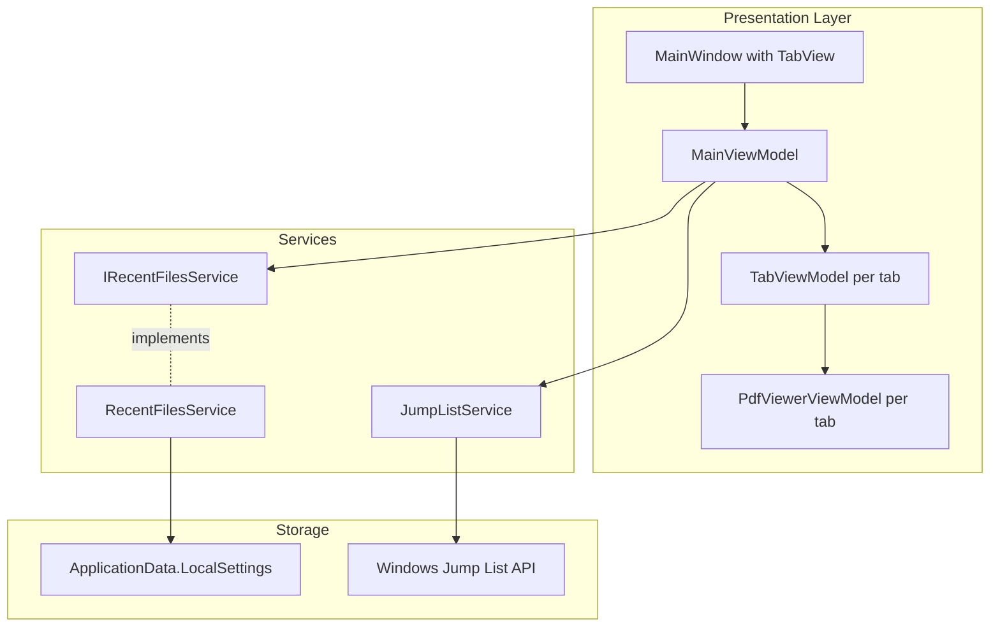

# Design Document

## Overview

Recent Files Management implements MRU tracking, Windows Jump List integration, and multi-tab document support using WinUI 3 TabView. The design follows clean architecture with services for recent files tracking and Jump List management, ViewModels for tab state, and WinUI TabView for presentation.

## Steering Document Alignment

### Technical Standards (tech.md)

**WinUI 3 + MVVM**: TabView with MainViewModel managing tab collection, each tab has TabViewModel.

**FluentResults**: File operations return `Result<T>` with appropriate errors.

**Serilog**: All file access and tab operations logged.

**Dependency Injection**: IRecentFilesService, IJumpListService registered in container.

### Project Structure (structure.md)

**FluentPDF.Core**: IRecentFilesService interface, RecentFileEntry model.

**FluentPDF.App**: RecentFilesService, JumpListService, MainViewModel, TabViewModel.

**File Organization**:
- `src/FluentPDF.Core/Services/IRecentFilesService.cs`
- `src/FluentPDF.Core/Models/RecentFileEntry.cs`
- `src/FluentPDF.App/Services/RecentFilesService.cs`
- `src/FluentPDF.App/Services/JumpListService.cs`
- `src/FluentPDF.App/ViewModels/MainViewModel.cs`
- `src/FluentPDF.App/ViewModels/TabViewModel.cs`
- `src/FluentPDF.App/Views/MainWindow.xaml` (modify to use TabView)

## Code Reuse Analysis

### Existing Components to Leverage

- **PdfViewerViewModel**: Each tab will have its own instance
- **PdfDocumentService**: Reuse for opening files in tabs
- **ApplicationData.LocalSettings**: Store recent files list
- **Windows.UI.StartScreen.JumpList**: Platform API for taskbar integration

### Integration Points

- **MainWindow**: Replace content with TabView containing multiple PdfViewerPage instances
- **File Menu**: Add "Recent Files" submenu with dynamic items
- **PdfViewerViewModel**: Embed in TabViewModel for per-tab state

## Architecture



## Components and Interfaces

### Component 1: RecentFileEntry Model

```csharp
public class RecentFileEntry
{
    public required string FilePath { get; init; }
    public required DateTime LastAccessed { get; init; }
    public string FileName => Path.GetFileName(FilePath);
}
```

### Component 2: IRecentFilesService

```csharp
public interface IRecentFilesService
{
    Task<List<RecentFileEntry>> GetRecentFilesAsync();
    Task AddRecentFileAsync(string filePath);
    Task RemoveRecentFileAsync(string filePath);
    Task ClearRecentFilesAsync();
}
```

### Component 3: RecentFilesService

- **Storage Key**: "RecentFiles" in LocalSettings as JSON array
- **Max Items**: 10
- **Ordering**: MRU (most recent first)
- **Validation**: Remove non-existent paths on load

### Component 4: JumpListService

```csharp
public class JumpListService
{
    public async Task UpdateJumpListAsync(List<RecentFileEntry> recentFiles)
    {
        var jumpList = await JumpList.LoadCurrentAsync();
        jumpList.Items.Clear();
        foreach (var file in recentFiles.Take(10))
        {
            var item = JumpListItem.CreateWithArguments(file.FilePath, file.FileName);
            item.Logo = new Uri("ms-appx:///Assets/PdfIcon.png");
            jumpList.Items.Add(item);
        }
        await jumpList.SaveAsync();
    }

    public async Task ClearJumpListAsync()
    {
        var jumpList = await JumpList.LoadCurrentAsync();
        jumpList.Items.Clear();
        await jumpList.SaveAsync();
    }
}
```

### Component 5: TabViewModel

```csharp
public partial class TabViewModel : ObservableObject
{
    [ObservableProperty] private string _filePath;
    [ObservableProperty] private string _fileName;
    [ObservableProperty] private PdfViewerViewModel _viewerViewModel;
    [ObservableProperty] private bool _isActive;

    public TabViewModel(string filePath, PdfViewerViewModel viewerViewModel)
    {
        FilePath = filePath;
        FileName = Path.GetFileName(filePath);
        ViewerViewModel = viewerViewModel;
    }

    public void Activate() => IsActive = true;
    public void Deactivate() => IsActive = false;
}
```

### Component 6: MainViewModel

```csharp
public partial class MainViewModel : ObservableObject
{
    [ObservableProperty] private ObservableCollection<TabViewModel> _tabs = new();
    [ObservableProperty] private TabViewModel? _activeTab;
    [ObservableProperty] private List<RecentFileEntry> _recentFiles = new();

    [RelayCommand]
    private async Task OpenFileAsync()
    {
        var picker = new FileOpenPicker();
        picker.FileTypeFilter.Add(".pdf");
        var file = await picker.PickSingleFileAsync();
        if (file != null)
        {
            await OpenFileInNewTabAsync(file.Path);
            await _recentFilesService.AddRecentFileAsync(file.Path);
            await UpdateJumpListAsync();
        }
    }

    [RelayCommand]
    private async Task OpenRecentFileAsync(string filePath)
    {
        if (File.Exists(filePath))
        {
            await OpenFileInNewTabAsync(filePath);
        }
        else
        {
            await _recentFilesService.RemoveRecentFileAsync(filePath);
        }
    }

    [RelayCommand]
    private void CloseTab(TabViewModel tab)
    {
        tab.ViewerViewModel.Dispose();
        Tabs.Remove(tab);
        if (Tabs.Any())
        {
            ActiveTab = Tabs.Last();
        }
    }

    [RelayCommand]
    private async Task ClearRecentFilesAsync()
    {
        await _recentFilesService.ClearRecentFilesAsync();
        await _jumpListService.ClearJumpListAsync();
        await LoadRecentFilesAsync();
    }

    private async Task OpenFileInNewTabAsync(string filePath)
    {
        var viewerVM = _serviceProvider.GetRequiredService<PdfViewerViewModel>();
        await viewerVM.OpenDocumentAsync(filePath);
        var tabVM = new TabViewModel(filePath, viewerVM);
        Tabs.Add(tabVM);
        ActiveTab = tabVM;
    }
}
```

## Testing Strategy

### Unit Testing

- RecentFilesServiceTests: Add, remove, clear, persistence
- JumpListServiceTests: Update, clear (mock Jump List API)
- MainViewModelTests: Tab management, recent files integration
- TabViewModelTests: State management

### Integration Testing

- End-to-end tab workflow: open multiple files, switch tabs, close tabs
- Recent files + Jump List integration
- Persistence across app restarts

### Architecture Testing

- MainViewModel should not reference PDFium
- Services implement interfaces
- Tab management follows MVVM

## Future Enhancements

- Session restoration (reopen tabs from last session)
- Tab groups/workspaces
- Drag-and-drop to reorder tabs
- Pin favorite files
