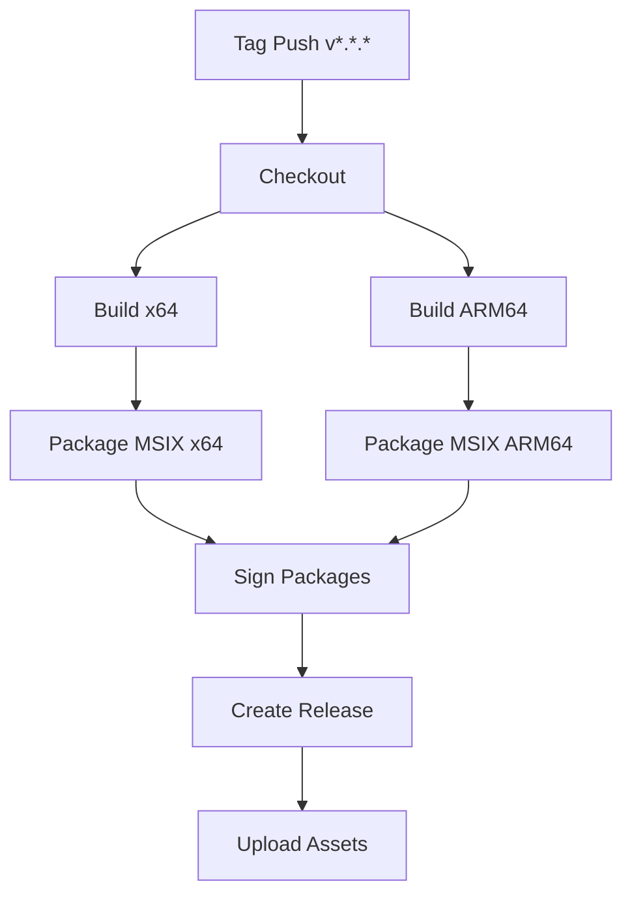

# Design Document

## Overview

GitHub Actions workflow for automated MSIX packaging and release publishing. Triggered on version tags, builds signed packages for x64 and ARM64, and publishes to GitHub Releases.

## Steering Document Alignment

### Technical Standards (tech.md)
- MSIX format with digital signature
- Windows 10 (1809+) and Windows 11 support
- x64 and ARM64 architectures

### Project Structure (structure.md)
- Workflow in `.github/workflows/release.yml`
- Uses `tools/package-msix.ps1` for packaging logic

## Code Reuse Analysis

### Existing Components to Leverage
- **build.yml**: Build job structure and caching
- **test.yml**: Test execution patterns
- **tools/package-msix.ps1**: Existing packaging script (or create if missing)

### Integration Points
- **GitHub Releases**: Publish MSIX as release assets
- **Microsoft Store**: Optional Partner Center API integration

## Architecture



## Components and Interfaces

### release.yml Workflow
- **Purpose:** Orchestrate release process
- **Trigger:** `push: tags: ['v*.*.*']` and `workflow_dispatch`
- **Jobs:** build, package, release

### package-msix.ps1
- **Purpose:** PowerShell script for MSIX packaging
- **Interfaces:** `-Platform x64|arm64`, `-Configuration Release`, `-CertPath path`
- **Dependencies:** Windows SDK, makeappx.exe

## Data Models

### Workflow Inputs
```yaml
- version: string (v1.0.0 format)
- skip_signing: boolean (default false)
- create_release: boolean (default true)
```

### Secrets Required
```
- SIGNING_CERTIFICATE: Base64-encoded PFX
- SIGNING_PASSWORD: Certificate password
- STORE_CREDENTIALS: Optional Partner Center credentials
```

## Error Handling

### Error Scenarios
1. **Build failure**
   - **Handling:** Job fails, no packages created
   - **User Impact:** Release aborted with build logs

2. **Signing failure**
   - **Handling:** Option to continue unsigned for testing
   - **User Impact:** Warning in release notes

## Testing Strategy

### Unit Testing
- N/A - workflow tested via dry-run

### Integration Testing
- Test workflow with manual trigger on feature branch

### End-to-End Testing
- Full release from test tag to published assets
