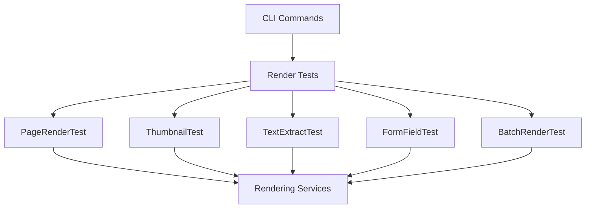

# Design Document

## Overview

Implement comprehensive CLI tests for all PDF rendering operations. Each test uses existing rendering services and verifies output correctness with measurable criteria, providing confidence that GUI rendering will work.

## Code Reuse Analysis

### Existing Components to Leverage
- **IPdfRenderingService**: Page rendering
- **IThumbnailRenderingService**: Thumbnail generation
- **ITextExtractionService**: Text extraction
- **IPdfFormService**: Form field detection
- **ICliTest Interface**: From cli-test-infrastructure spec
- **DiagnosticCommandHandler**: CLI command execution patterns

### Integration Points
- **Test Framework**: ICliTest implementations
- **Rendering Services**: All rendering operations
- **Verification**: File existence, size, dimensions

## Architecture

## Components and Interfaces

### PageRenderCliTest (implements ICliTest)
- **Purpose:** Verify single page rendering
- **Reuses:** IPdfRenderingService, ImageSharp for dimension checking

### ThumbnailAllPagesCliTest (implements ICliTest)
- **Purpose:** Verify all-page thumbnail generation
- **Reuses:** IThumbnailRenderingService, existing --test-thumbnails logic

### TextExtractionCliTest (implements ICliTest)
- **Purpose:** Verify text extraction correctness
- **Reuses:** ITextExtractionService

### FormFieldRenderCliTest (implements ICliTest)
- **Purpose:** Verify form field detection and rendering
- **Reuses:** IPdfFormService, IPdfRenderingService

### BatchRenderCliTest (implements ICliTest)
- **Purpose:** Verify multi-page batch rendering performance
- **Reuses:** IPdfRenderingService with parallel processing

## Testing Strategy

### Integration Testing
- All tests use real PDFs from tests/Fixtures
- Verify actual rendering service behavior
- Validate output files exist and are correct

### Performance Testing
- Batch rendering measures throughput
- Thumbnail generation measures speed
- All tests report timing metrics
