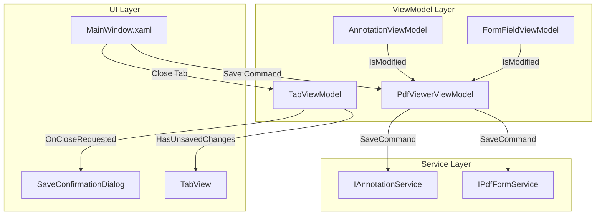

# Design Document

## Overview

The Save Document feature exposes existing save functionality through UI elements. The implementation adds menu items to MainWindow, keyboard shortcuts, unsaved changes tracking via a new `HasUnsavedChanges` property on `PdfViewerViewModel`, and a close confirmation dialog. No new service-layer code is required—existing `IAnnotationService.SaveAnnotationsAsync` and `IPdfFormService.SaveFormDataAsync` are reused.

## Steering Document Alignment

### Technical Standards (tech.md)
- **MVVM Pattern**: Save commands implemented as RelayCommands in ViewModels
- **Result Pattern**: Save operations use FluentResults for error handling
- **Async/Await**: All save operations are asynchronous
- **Dependency Injection**: Services injected via constructor

### Project Structure (structure.md)
- **Views**: MainWindow.xaml modified for menu items
- **ViewModels**: PdfViewerViewModel, TabViewModel extended
- **Dialogs**: New SaveConfirmationDialog.xaml in Views

## Code Reuse Analysis

### Existing Components to Leverage
- **IAnnotationService.SaveAnnotationsAsync**: Already implemented, saves annotations to PDF
- **IPdfFormService.SaveFormDataAsync**: Already implemented, saves form data to PDF
- **AnnotationViewModel.SaveAnnotationsAsync**: Private method to expose as command
- **FormFieldViewModel.IsModified**: Already tracks form dirty state
- **FileSavePicker**: Used by existing export commands (MergeDocumentsCommand, etc.)

### Integration Points
- **MainWindow.xaml**: Add Save/Save As menu items to File menu
- **TabViewModel**: Add HasUnsavedChanges property, bind to tab header
- **PdfViewerViewModel**: Coordinate save across annotations and forms
- **MainWindow.xaml.cs**: Handle tab close with confirmation

## Architecture



### Modular Design Principles
- **Single File Responsibility**: SaveConfirmationDialog handles only confirmation UI
- **Component Isolation**: HasUnsavedChanges computed from child ViewModels
- **Service Layer Separation**: No new service code, pure UI integration

## Components and Interfaces

### Component 1: PdfViewerViewModel Extensions
- **Purpose**: Add Save/SaveAs commands and coordinate unsaved changes tracking
- **Interfaces**:
  - `IRelayCommand SaveCommand { get; }`
  - `IRelayCommand SaveAsCommand { get; }`
  - `bool HasUnsavedChanges { get; }`
- **Dependencies**: IAnnotationService, IPdfFormService, AnnotationViewModel, FormFieldViewModel
- **Reuses**: Existing AnnotationViewModel.SaveAnnotationsAsync, FormFieldViewModel.SaveFormAsync

### Component 2: TabViewModel Extensions
- **Purpose**: Expose HasUnsavedChanges and modified tab header
- **Interfaces**:
  - `bool HasUnsavedChanges { get; }`
  - `string DisplayName { get; }` (returns "*filename.pdf" if unsaved)
- **Dependencies**: PdfViewerViewModel
- **Reuses**: Existing FileName property

### Component 3: MainWindow Menu Extensions
- **Purpose**: Add Save and Save As menu items with keyboard accelerators
- **Interfaces**: XAML MenuFlyoutItems bound to ViewModel commands
- **Dependencies**: MainViewModel (for active tab access)
- **Reuses**: Existing File menu structure

### Component 4: SaveConfirmationDialog
- **Purpose**: Prompt user before closing tab with unsaved changes
- **Interfaces**:
  - `static async Task<SaveConfirmationResult> ShowAsync(XamlRoot, string filename)`
  - `enum SaveConfirmationResult { Save, DontSave, Cancel }`
- **Dependencies**: ContentDialog (WinUI 3)
- **Reuses**: WinUI ContentDialog pattern

## Data Models

### SaveConfirmationResult Enum
```csharp
public enum SaveConfirmationResult
{
    Save,      // User clicked Save - save and close
    DontSave,  // User clicked Don't Save - close without saving
    Cancel     // User clicked Cancel - abort close
}
```

### No New Domain Models
All save functionality uses existing PdfDocument, Annotation, and FormField models.

## Error Handling

### Error Scenarios
1. **Save fails due to file in use**
   - **Handling**: Catch IOException, show error dialog with retry option
   - **User Impact**: Dialog shows "File is in use. Close other applications and try again."

2. **Save fails due to permissions**
   - **Handling**: Catch UnauthorizedAccessException, suggest Save As
   - **User Impact**: Dialog shows "Cannot save to this location. Use Save As to choose a different location."

3. **Backup creation fails**
   - **Handling**: Continue save with warning (existing behavior)
   - **User Impact**: Status bar shows warning "Saved without backup"

4. **FileSavePicker cancelled**
   - **Handling**: No action, return silently
   - **User Impact**: None (expected behavior)

## Testing Strategy

### Unit Testing
- **PdfViewerViewModel**: Test SaveCommand execution, CanExecute logic
- **PdfViewerViewModel**: Test HasUnsavedChanges aggregation from child VMs
- **TabViewModel**: Test DisplayName with/without unsaved changes
- **SaveConfirmationDialog**: Test result enum mapping

### Integration Testing
- **FlaUI**: Test Ctrl+S triggers save when document modified
- **FlaUI**: Test tab close with unsaved changes shows dialog
- **FlaUI**: Test dialog button clicks produce correct behavior

### End-to-End Testing
- Open PDF, add annotation, press Ctrl+S, verify file modified
- Open PDF, modify form, close tab, verify dialog appears
- Open PDF, make no changes, close tab, verify no dialog
