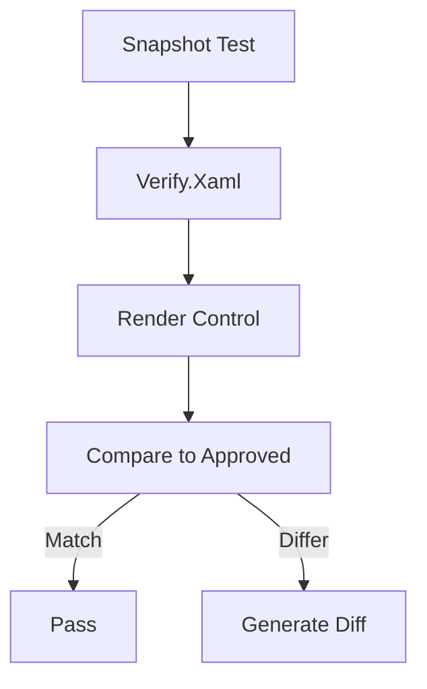

# Design Document

## Overview

Integrate Verify.Xaml snapshot testing framework for WinUI 3 component validation. Provides golden master testing to detect unintended UI changes.

## Steering Document Alignment

### Technical Standards (tech.md)
- Uses Verify.Xaml as specified
- Golden master testing approach
- Manual approval workflow for changes

### Project Structure (structure.md)
- Tests in `tests/FluentPDF.App.Tests/Snapshots/`
- Approved snapshots in `tests/FluentPDF.App.Tests/Snapshots/Verified/`

## Code Reuse Analysis

### Existing Components to Leverage
- **FluentPDF.App.Tests.csproj**: Existing test project
- **xUnit**: Test framework with Verify integration

### Integration Points
- **WinUI 3 Controls**: Components to snapshot
- **Existing visual tests**: Complement SSIM-based tests in Validation.Tests

## Architecture



## Components and Interfaces

### SnapshotTestBase
- **Purpose:** Base class configuring Verify for WinUI 3
- **Interfaces:** `VerifyControl(control)`, `VerifyWindow(window)`
- **Dependencies:** Verify.Xaml, VerifyXunit

### PdfViewerSnapshotTests
- **Purpose:** Snapshot tests for PDF viewer control
- **Interfaces:** Test methods for different viewer states
- **Dependencies:** SnapshotTestBase, PdfViewerControl

## Data Models

### VerifySettings
```csharp
- UseDirectory: string ("Snapshots")
- ScrubInlineGuids: bool (true)
- UseStrictJson: bool (false)
```

## Error Handling

### Error Scenarios
1. **Snapshot mismatch**
   - **Handling:** Generate .received file alongside .verified
   - **User Impact:** Developer reviews diff, approves or fixes

2. **Control render failure**
   - **Handling:** Capture exception in snapshot output
   - **User Impact:** Clear error message in test output

## Testing Strategy

### Unit Testing
- N/A - this is a testing infrastructure

### Integration Testing
- Verify snapshots match approved baselines

### End-to-End Testing
- Full component render and snapshot comparison
