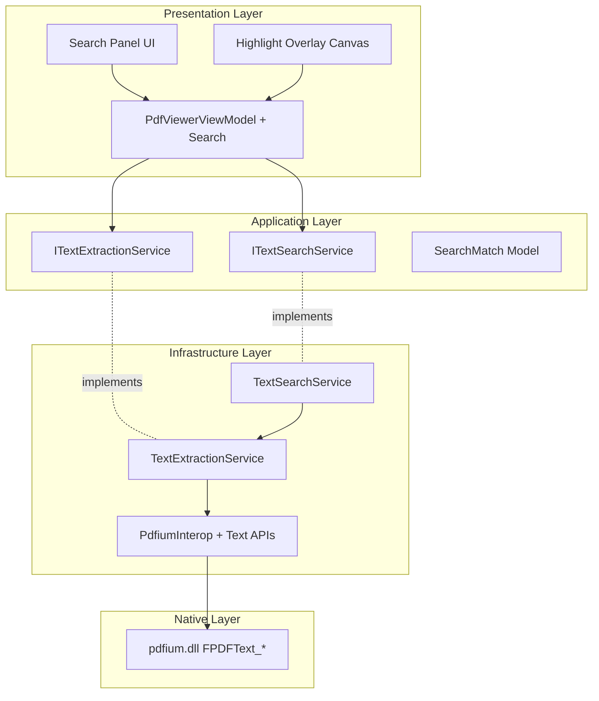

# Design Document

## Overview

The Text Extraction and Search feature extends the PDF viewer with text extraction, in-document search, match highlighting, and clipboard integration. The design builds on the existing PDFium P/Invoke layer from pdf-viewer-core, adding text-specific APIs while maintaining architectural consistency and performance.

## Steering Document Alignment

### Technical Standards (tech.md)

**PDFium Text APIs**: Extends existing PdfiumInterop with FPDFText_* functions using SafeHandle pattern for memory safety.

**FluentResults**: All text operations return `Result<T>` with structured errors (TEXT_EXTRACTION_FAILED, SEARCH_FAILED, NO_TEXT_FOUND).

**Serilog + OpenTelemetry**: All operations logged with correlation IDs, extraction time, search performance, and match counts.

**Dependency Injection**: Text services registered in IHost container following existing patterns.

### Project Structure (structure.md)

**FluentPDF.Rendering**: Extends PdfiumInterop with text extraction P/Invoke, implements TextExtractionService and TextSearchService.

**FluentPDF.Core**: Contains service interfaces (ITextExtractionService, ITextSearchService) and models (SearchMatch, TextSelection).

**FluentPDF.App**: Extends PdfViewerViewModel and PdfViewerPage with search UI and text selection.

## Code Reuse Analysis

### Existing Components to Leverage

- **PdfiumInterop**: Extend with text extraction P/Invoke declarations
- **SafeHandle Pattern**: Create SafePdfTextPageHandle following SafePdfDocumentHandle pattern
- **PdfViewerViewModel**: Add search commands and selection state
- **PdfViewerPage**: Add search toolbar and highlight overlay
- **PdfError + FluentResults**: Extend with text extraction error codes
- **SerilogConfiguration**: Use for text extraction and search performance logging

### Integration Points

- **PDF Rendering**: Overlay search highlights and text selection on rendered pages
- **Coordinate Transformation**: Convert PDFium text coordinates to screen coordinates for highlights
- **Clipboard API**: Use Windows.ApplicationModel.DataTransfer for copy operations
- **Existing Commands**: Integrate search shortcuts with existing keyboard accelerators

## Architecture



## Components and Interfaces

### Component 1: SafePdfTextPageHandle

- **Purpose:** Memory-safe wrapper for PDFium text page handles
- **Location:** `src/FluentPDF.Rendering/Interop/SafePdfTextPageHandle.cs`
- **Implementation:**
  ```csharp
  public sealed class SafePdfTextPageHandle : SafeHandleZeroOrMinusOneIsInvalid
  {
      private SafePdfTextPageHandle() : base(true) { }

      protected override bool ReleaseHandle()
      {
          if (!IsInvalid)
          {
              PdfiumInterop.FPDFText_ClosePage(handle);
          }
          return true;
      }
  }
  ```

### Component 2: PdfiumInterop Text Extensions

- **Purpose:** P/Invoke declarations for PDFium text APIs
- **Location:** `src/FluentPDF.Rendering/Interop/PdfiumInterop.cs` (extend existing)
- **New P/Invoke Methods:**
  ```csharp
  [DllImport(DllName, CallingConvention = CallingConvention.Cdecl)]
  internal static extern SafePdfTextPageHandle FPDFText_LoadPage(SafePdfPageHandle page);

  [DllImport(DllName, CallingConvention = CallingConvention.Cdecl)]
  internal static extern void FPDFText_ClosePage(IntPtr text_page);

  [DllImport(DllName, CallingConvention = CallingConvention.Cdecl)]
  internal static extern int FPDFText_CountChars(SafePdfTextPageHandle text_page);

  [DllImport(DllName, CallingConvention = CallingConvention.Cdecl)]
  internal static extern int FPDFText_GetText(
      SafePdfTextPageHandle text_page,
      int start_index,
      int count,
      [Out] byte[] result);

  [DllImport(DllName, CallingConvention = CallingConvention.Cdecl)]
  internal static extern int FPDFText_GetCharBox(
      SafePdfTextPageHandle text_page,
      int index,
      out double left,
      out double right,
      out double bottom,
      out double top);

  [DllImport(DllName, CallingConvention = CallingConvention.Cdecl)]
  internal static extern int FPDFText_FindStart(
      SafePdfTextPageHandle text_page,
      [MarshalAs(UnmanagedType.LPWStr)] string findwhat,
      uint flags,
      int start_index);

  [DllImport(DllName, CallingConvention = CallingConvention.Cdecl)]
  [return: MarshalAs(UnmanagedType.Bool)]
  internal static extern bool FPDFText_FindNext(IntPtr search_handle);

  [DllImport(DllName, CallingConvention = CallingConvention.Cdecl)]
  internal static extern int FPDFText_GetSchResultIndex(IntPtr search_handle);

  [DllImport(DllName, CallingConvention = CallingConvention.Cdecl)]
  internal static extern int FPDFText_GetSchCount(IntPtr search_handle);

  [DllImport(DllName, CallingConvention = CallingConvention.Cdecl)]
  internal static extern void FPDFText_FindClose(IntPtr search_handle);
  ```

### Component 3: SearchMatch Model

- **Purpose:** Represents a search match with location and bounding box
- **Location:** `src/FluentPDF.Core/Models/SearchMatch.cs`
- **Properties:**
  ```csharp
  public class SearchMatch
  {
      public required int PageNumber { get; init; }
      public required int CharIndex { get; init; }
      public required int Length { get; init; }
      public required string Text { get; init; }
      public required Rect BoundingBox { get; init; } // PDF coordinates (points)
  }

  public class SearchOptions
  {
      public bool CaseSensitive { get; init; } = false;
      public bool WholeWord { get; init; } = false;
  }
  ```

### Component 4: ITextExtractionService

- **Purpose:** Contract for text extraction operations
- **Location:** `src/FluentPDF.Core/Services/ITextExtractionService.cs`
- **Methods:**
  ```csharp
  Task<Result<string>> ExtractTextAsync(PdfDocument document, int pageNumber);
  Task<Result<Dictionary<int, string>>> ExtractAllTextAsync(
      PdfDocument document,
      CancellationToken cancellationToken = default);
  Task<Result<Rect>> GetCharBoundingBoxAsync(
      PdfDocument document,
      int pageNumber,
      int charIndex);
  ```

### Component 5: TextExtractionService

- **Purpose:** Implements text extraction using PDFium
- **Location:** `src/FluentPDF.Rendering/Services/TextExtractionService.cs`
- **Dependencies:** `PdfiumInterop`, `ILogger<TextExtractionService>`
- **Extraction Pipeline:**
  1. Load page via existing PdfDocumentService
  2. Call FPDFText_LoadPage to get text page handle
  3. Get character count via FPDFText_CountChars
  4. Extract text via FPDFText_GetText (handles UTF-16 encoding)
  5. Close text page (via SafeHandle)
- **Error Codes:**
  - `TEXT_PAGE_LOAD_FAILED` - Failed to load text page
  - `TEXT_EXTRACTION_FAILED` - Extraction operation failed
  - `NO_TEXT_FOUND` - Page has no text (info, not error)
- **Performance:** Log warning if extraction > 2 seconds

### Component 6: ITextSearchService

- **Purpose:** Contract for in-document search operations
- **Location:** `src/FluentPDF.Core/Services/ITextSearchService.cs`
- **Methods:**
  ```csharp
  Task<Result<List<SearchMatch>>> SearchAsync(
      PdfDocument document,
      string query,
      SearchOptions? options = null,
      CancellationToken cancellationToken = default);
  Task<Result<List<SearchMatch>>> SearchPageAsync(
      PdfDocument document,
      int pageNumber,
      string query,
      SearchOptions? options = null);
  ```

### Component 7: TextSearchService

- **Purpose:** Implements search using PDFium text search APIs
- **Location:** `src/FluentPDF.Rendering/Services/TextSearchService.cs`
- **Dependencies:** `ITextExtractionService`, `PdfiumInterop`, `ILogger<TextSearchService>`
- **Search Pipeline:**
  1. Validate query is not empty
  2. For each page in document:
     - Load text page
     - Call FPDFText_FindStart with query and flags
     - Loop FPDFText_FindNext to find all matches
     - For each match:
       - Get char index and count via FPDFText_GetSchResultIndex/Count
       - Get bounding boxes for all characters in match
       - Combine into single SearchMatch
  3. Return list of all SearchMatch objects
- **Search Flags:**
  - `FPDF_MATCHCASE (0x00000001)` for case-sensitive
  - `FPDF_MATCHWHOLEWORD (0x00000002)` for whole word
- **Performance:** Log warning if search > 10 seconds

### Component 8: PdfViewerViewModel Extensions

- **Purpose:** Add search state and commands to existing ViewModel
- **Location:** `src/FluentPDF.App/ViewModels/PdfViewerViewModel.cs` (extend)
- **New Observable Properties:**
  ```csharp
  [ObservableProperty] private bool _isSearchPanelVisible;
  [ObservableProperty] private string _searchQuery = string.Empty;
  [ObservableProperty] private List<SearchMatch> _searchMatches = new();
  [ObservableProperty] private int _currentMatchIndex = -1;
  [ObservableProperty] private bool _isSearching;
  [ObservableProperty] private bool _caseSensitive;
  ```
- **New Commands:**
  ```csharp
  [RelayCommand] private void ToggleSearchPanel();
  [RelayCommand] private async Task SearchAsync();
  [RelayCommand(CanExecute = nameof(CanGoToNextMatch))]
  private async Task GoToNextMatchAsync();
  [RelayCommand(CanExecute = nameof(CanGoToPreviousMatch))]
  private async Task GoToPreviousMatchAsync();
  [RelayCommand] private async Task CopySelectedTextAsync();
  ```

### Component 9: Search Panel UI

- **Purpose:** Search input and navigation controls
- **Location:** `src/FluentPDF.App/Views/PdfViewerPage.xaml` (add to existing)
- **UI Elements:**
  ```xml
  <Grid x:Name="SearchPanel" Visibility="{Binding IsSearchPanelVisible}">
      <TextBox PlaceholderText="Search..."
               Text="{Binding SearchQuery, UpdateSourceTrigger=PropertyChanged}"
               x:Name="SearchBox"/>
      <Button Content="⌃" Command="{Binding GoToPreviousMatchCommand}"/>
      <Button Content="⌄" Command="{Binding GoToNextMatchCommand}"/>
      <TextBlock Text="{Binding CurrentMatchIndex} of {Binding SearchMatches.Count}"/>
      <CheckBox Content="Aa" IsChecked="{Binding CaseSensitive}"/>
      <Button Content="✕" Command="{Binding ToggleSearchPanelCommand}"/>
  </Grid>
  ```
- **Keyboard Shortcuts:**
  - Ctrl+F: Show search panel
  - F3: Next match
  - Shift+F3: Previous match
  - Escape: Hide search panel

### Component 10: Highlight Overlay

- **Purpose:** Render search match highlights on PDF page
- **Location:** `src/FluentPDF.App/Views/PdfViewerPage.xaml` (overlay Canvas)
- **Implementation:**
  - Use Canvas overlay above Image control
  - Transform SearchMatch BoundingBox from PDF coordinates to screen coordinates
  - Draw semi-transparent Rectangle for each match
  - Highlight current match with different color (yellow for current, light blue for others)
- **Coordinate Transformation:**
  ```csharp
  Rect TransformPdfToScreen(Rect pdfRect, double zoomLevel, double dpi = 96)
  {
      var scaleFactor = (dpi / 72.0) * zoomLevel;
      return new Rect(
          pdfRect.X * scaleFactor,
          pdfRect.Y * scaleFactor,
          pdfRect.Width * scaleFactor,
          pdfRect.Height * scaleFactor
      );
  }
  ```

## Data Models

### SearchMatch
```csharp
public class SearchMatch
{
    public required int PageNumber { get; init; }
    public required int CharIndex { get; init; }
    public required int Length { get; init; }
    public required string Text { get; init; }
    public required Rect BoundingBox { get; init; }
}
```

### SearchOptions
```csharp
public class SearchOptions
{
    public bool CaseSensitive { get; init; } = false;
    public bool WholeWord { get; init; } = false;
}
```

## Error Handling

### Error Scenarios

1. **Text Page Load Failed**
   - **Handling:** Return `Result.Fail(new PdfError("TEXT_PAGE_LOAD_FAILED"))`
   - **User Impact:** Show error in status bar, disable search

2. **Text Extraction Failed**
   - **Handling:** Return `Result.Fail(new PdfError("TEXT_EXTRACTION_FAILED"))`
   - **User Impact:** Disable text selection and search for that page

3. **Search Query Empty**
   - **Handling:** Return `Result.Fail(new PdfError("SEARCH_QUERY_EMPTY", ErrorCategory.Validation))`
   - **User Impact:** No search performed, clear previous highlights

4. **Search Canceled**
   - **Handling:** Return `Result.Fail` with cancellation error
   - **User Impact:** Show "Search canceled" in status, keep partial results

## Testing Strategy

### Unit Testing

**TextExtractionServiceTests.cs**:
- Mock PdfiumInterop
- Test ExtractTextAsync returns text
- Test empty page returns empty string
- Test Unicode text handling
- Test error handling

**TextSearchServiceTests.cs**:
- Mock ITextExtractionService
- Test case-sensitive and case-insensitive search
- Test match bounding box calculation
- Test multi-page search
- Test search cancellation

### Integration Testing

**TextSearchIntegrationTests.cs**:
- Use real PDFium
- Test with PDF containing known text
- Verify search finds all matches
- Verify bounding boxes are correct
- Test performance with large documents

## Performance Considerations

### Optimization Strategies
- **Text Caching:** Cache extracted text per page to avoid re-extraction
- **Lazy Search:** Only search visible pages initially, then background search remaining pages
- **Incremental Highlighting:** Only render highlights for visible area
- **Debounced Search:** Wait 300ms after user stops typing before searching

## Dependency Injection Registration

**App.xaml.cs ConfigureServices**:
```csharp
services.AddSingleton<ITextExtractionService, TextExtractionService>();
services.AddSingleton<ITextSearchService, TextSearchService>();
```
