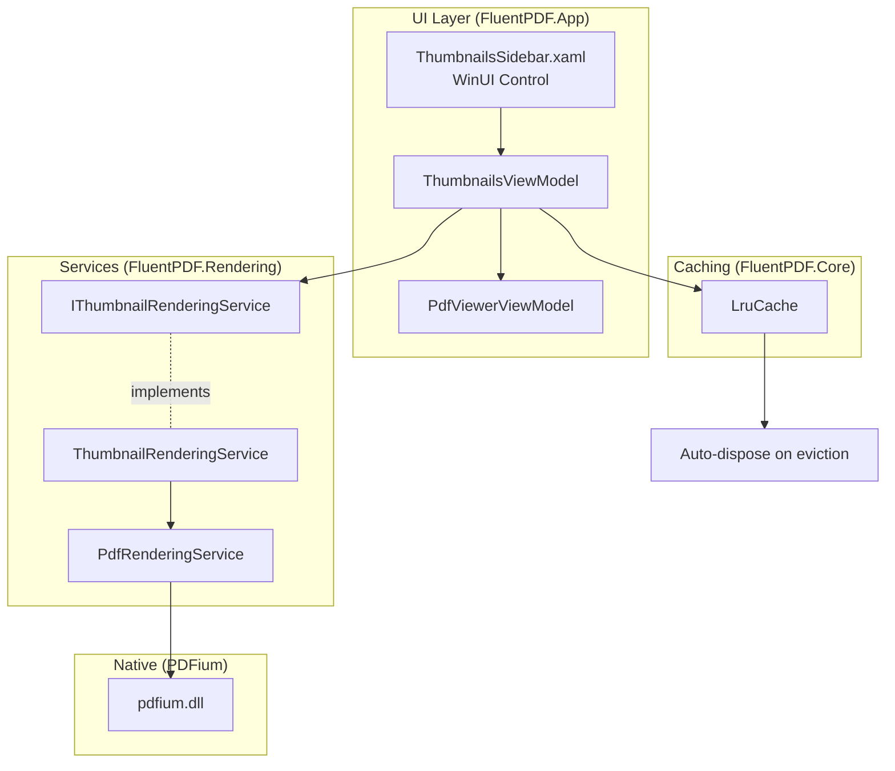

# Design Document

## Overview

The Thumbnails Sidebar implements a visual navigation interface using low-resolution page previews. The design follows MVVM with a dedicated ThumbnailsViewModel managing state, an LRU cache for memory efficiency, and a ThumbnailRenderingService extending the existing PdfRenderingService with optimized thumbnail generation.

## Steering Document Alignment

### Technical Standards (tech.md)

**WinUI 3 + MVVM**: ThumbnailsViewModel uses CommunityToolkit.Mvvm for observable collections and commands.

**FluentResults**: Thumbnail rendering returns `Result<BitmapImage>` for error handling.

**Serilog Logging**: All thumbnail operations logged with page number and render time.

**Dependency Injection**: ThumbnailRenderingService registered in DI container.

### Project Structure (structure.md)

**FluentPDF.Rendering**: Add `Services/ThumbnailRenderingService.cs`

**FluentPDF.App**: Add `Controls/ThumbnailsSidebar.xaml`, `ViewModels/ThumbnailsViewModel.cs`

**FluentPDF.Core**: Add `Caching/LruCache.cs` (generic LRU cache implementation)

## Code Reuse Analysis

### Existing Components to Leverage

- **PdfRenderingService**: ThumbnailRenderingService extends with low-DPI rendering
- **PdfDocument**: Thumbnails render from existing document handle
- **PdfViewerViewModel**: Integrate with existing navigation (CurrentPageNumber property)
- **DI Container**: Register thumbnail services alongside existing PDF services

### Integration Points

- **PdfViewerPage**: Add ThumbnailsSidebar control to left column
- **PdfViewerViewModel**: Add IsSidebarVisible property, wire thumbnail selection to page navigation
- **Serilog**: Log thumbnail rendering with same structured logging patterns

## Architecture



## Components and Interfaces

### Component 1: LruCache (Generic Cache)

- **Purpose:** Generic LRU cache with automatic eviction and disposal
- **Location:** `src/FluentPDF.Core/Caching/LruCache.cs`
- **Implementation:**
  ```csharp
  public class LruCache<TKey, TValue> where TValue : IDisposable
  {
      private readonly int _capacity;
      private readonly Dictionary<TKey, LinkedListNode<CacheItem>> _cache;
      private readonly LinkedList<CacheItem> _lruList;

      public bool TryGet(TKey key, out TValue value)
      {
          if (_cache.TryGetValue(key, out var node))
          {
              _lruList.Remove(node);
              _lruList.AddFirst(node); // Move to front (most recently used)
              value = node.Value.Value;
              return true;
          }
          value = default;
          return false;
      }

      public void Add(TKey key, TValue value)
      {
          if (_cache.Count >= _capacity)
          {
              var lru = _lruList.Last;
              lru.Value.Value.Dispose(); // Dispose evicted item
              _lruList.RemoveLast();
              _cache.Remove(lru.Value.Key);
          }

          var node = new LinkedListNode<CacheItem>(new CacheItem { Key = key, Value = value });
          _lruList.AddFirst(node);
          _cache[key] = node;
      }
  }
  ```

### Component 2: IThumbnailRenderingService

- **Purpose:** Service interface for thumbnail rendering
- **Location:** `src/FluentPDF.Core/Services/IThumbnailRenderingService.cs`
- **Methods:**
  ```csharp
  public interface IThumbnailRenderingService
  {
      Task<Result<BitmapImage>> RenderThumbnailAsync(PdfDocument document, int pageNumber);
  }
  ```

### Component 3: ThumbnailRenderingService

- **Purpose:** Render low-resolution page thumbnails
- **Location:** `src/FluentPDF.Rendering/Services/ThumbnailRenderingService.cs`
- **Implementation:**
  ```csharp
  public class ThumbnailRenderingService : IThumbnailRenderingService
  {
      private readonly IPdfRenderingService _renderingService;
      private const double ThumbnailDpi = 48; // 1/2 of standard 96 DPI
      private const double ThumbnailZoom = 0.2; // 20% of full size

      public async Task<Result<BitmapImage>> RenderThumbnailAsync(PdfDocument document, int pageNumber)
      {
          _logger.Information("Rendering thumbnail for page {PageNumber}", pageNumber);
          var sw = Stopwatch.StartNew();

          var result = await _renderingService.RenderPageAsync(document, pageNumber, ThumbnailZoom, ThumbnailDpi);

          sw.Stop();
          _logger.Information("Thumbnail rendered in {ElapsedMs}ms", sw.ElapsedMilliseconds);

          return result;
      }
  }
  ```

### Component 4: ThumbnailsViewModel

- **Purpose:** Manage thumbnail state and cache
- **Location:** `src/FluentPDF.App/ViewModels/ThumbnailsViewModel.cs`
- **Properties:**
  ```csharp
  [ObservableProperty] private ObservableCollection<ThumbnailItem> _thumbnails;
  [ObservableProperty] private int _selectedPageNumber;
  [ObservableProperty] private bool _isLoading;

  private LruCache<int, BitmapImage> _cache;
  private PdfDocument _document;
  ```
- **Commands:**
  ```csharp
  [RelayCommand]
  private async Task LoadThumbnailsAsync()
  {
      for (int i = 1; i <= _document.PageCount; i++)
      {
          Thumbnails.Add(new ThumbnailItem { PageNumber = i, IsLoading = true });
      }

      // Load visible thumbnails first (lazy loading)
      await LoadVisibleThumbnailsAsync();
  }

  [RelayCommand]
  private void NavigateToPage(int pageNumber)
  {
      // Notify PdfViewerViewModel to navigate
      _messenger.Send(new NavigateToPageMessage(pageNumber));
  }
  ```

### Component 5: ThumbnailsSidebar Control

- **Purpose:** XAML control displaying thumbnail list
- **Location:** `src/FluentPDF.App/Controls/ThumbnailsSidebar.xaml`
- **UI Structure:**
  ```xml
  <UserControl>
      <ScrollViewer>
          <ItemsRepeater ItemsSource="{Binding Thumbnails}" Layout="{StaticResource ThumbnailLayout}">
              <ItemsRepeater.ItemTemplate>
                  <DataTemplate>
                      <Grid Width="150" Height="220" Margin="8">
                          <!-- Thumbnail image or placeholder -->
                          <Image Source="{Binding Thumbnail}" Visibility="{Binding IsLoaded}"/>
                          <Rectangle Fill="Gray" Visibility="{Binding IsLoading}"/>

                          <!-- Page number -->
                          <TextBlock Text="{Binding PageNumber}" HorizontalAlignment="Center" VerticalAlignment="Bottom"/>

                          <!-- Click handler -->
                          <Button Command="{Binding NavigateToPageCommand}" CommandParameter="{Binding PageNumber}"
                                  Style="{StaticResource TransparentButton}"/>
                      </Grid>
                  </DataTemplate>
              </ItemsRepeater.ItemTemplate>
          </ItemsRepeater>
      </ScrollViewer>
  </UserControl>
  ```

### Component 6: ThumbnailItem Model

- **Purpose:** Data model for single thumbnail
- **Location:** `src/FluentPDF.App/Models/ThumbnailItem.cs`
- **Properties:**
  ```csharp
  public class ThumbnailItem : ObservableObject
  {
      [ObservableProperty] private int _pageNumber;
      [ObservableProperty] private BitmapImage? _thumbnail;
      [ObservableProperty] private bool _isLoading;
      [ObservableProperty] private bool _isSelected;
  }
  ```

## Data Models

### CacheItem (for LruCache)
```csharp
public class CacheItem<TKey, TValue>
{
    public TKey Key { get; init; }
    public TValue Value { get; init; }
}
```

## Error Handling

### Error Scenarios

1. **Thumbnail Rendering Failure**
   - **Handling:** Show placeholder image (gray rectangle with page number)
   - **User Impact:** User sees placeholder instead of thumbnail, can still navigate

2. **Cache Eviction**
   - **Handling:** Dispose evicted BitmapImage, re-render if requested again
   - **User Impact:** Transparent, no visible effect

3. **Memory Pressure**
   - **Handling:** Reduce cache capacity dynamically, log warning
   - **User Impact:** Fewer thumbnails cached, slight performance degradation

## Testing Strategy

### Unit Testing

**FluentPDF.Core.Tests/Caching/LruCacheTests.cs**:
- Test adding items to cache
- Test LRU eviction when capacity reached
- Test disposal of evicted items
- Test access updates LRU order

**FluentPDF.Rendering.Tests/Services/ThumbnailRenderingServiceTests.cs**:
- Mock PdfRenderingService
- Test thumbnail rendering at low DPI
- Test error handling

### Integration Testing

**FluentPDF.App.Tests/Integration/ThumbnailsIntegrationTests.cs**:
- Load document with thumbnails enabled
- Verify thumbnails render for all pages
- Verify cache limits memory usage
- Verify navigation works

## Performance Considerations

### Lazy Loading
- Load thumbnails for visible pages first
- Load remaining thumbnails in background
- Use IntersectionObserver pattern for scrolling

### Memory Management
- Limit cache to 100 thumbnails
- Dispose bitmaps on eviction
- Use low DPI (48) and small zoom (0.2) to reduce memory

### UI Responsiveness
- Render thumbnails on background threads
- Limit concurrent renders (max 4 parallel)
- Use UI virtualization for large documents (> 100 pages)

## Future Enhancements

- **Thumbnail Context Menu**: Right-click thumbnail to delete/extract page
- **Thumbnail Drag-and-Drop**: Reorder pages by dragging thumbnails
- **Thumbnail Annotations**: Show annotation indicators on thumbnails
- **Thumbnail Search**: Highlight thumbnails matching search query
