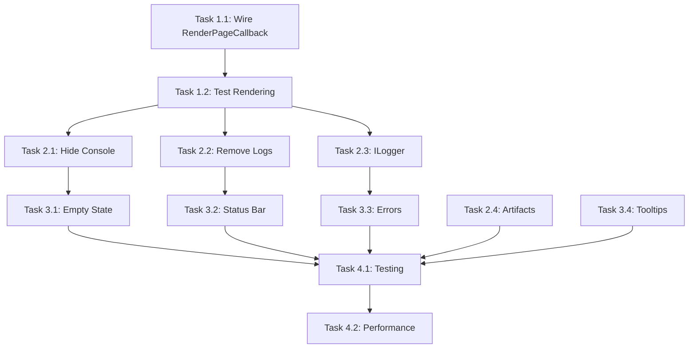

# UI Production Ready - Tasks

## Phase 1: Critical Rendering Fix (MUST COMPLETE FIRST)

### Task 1.1: Wire up RenderPageCallback
**Status**: 🔴 Not Started
**Priority**: P0 - CRITICAL
**Assignee**: Agent-Implementer
**Estimate**: 30 minutes

**Steps**:
1. Read `src/FluentPDF.Avalonia/Views/PdfViewerPage.axaml.cs`
2. Add private `RenderPageAsync` method:
   ```csharp
   private async Task<object?> RenderPageAsync(
       PdfDocument document, int pageNumber, double zoomLevel, double dpi)
   ```
3. Implement rendering logic:
   - Get `IPdfRenderingService` from DI
   - Call `RenderPageAsync`
   - Convert Stream → Avalonia.Media.Imaging.Bitmap
   - Return bitmap or null on error
4. Wire callback in constructor or `OnDataContextChanged`:
   ```csharp
   if (DataContext is PdfViewerViewModel vm)
       vm.RenderPageCallback = RenderPageAsync;
   ```
5. Add `ILogger<PdfViewerPage>` for error logging

**Acceptance**:
- [ ] RenderPageCallback assigned before document loads
- [ ] Bitmap conversion works for PNG streams
- [ ] Errors logged via ILogger
- [ ] Method tested with sample PDF

**Files**:
- `src/FluentPDF.Avalonia/Views/PdfViewerPage.axaml.cs`

---

### Task 1.2: Test PDF Rendering
**Status**: 🔴 Not Started
**Priority**: P0
**Assignee**: Agent-Validator
**Estimate**: 15 minutes
**Depends On**: Task 1.1

**Steps**:
1. Build project: `dotnet build -p:TreatWarningsAsErrors=false`
2. Run app: `dotnet run --no-build`
3. Open sample PDF from `tests/Fixtures/`
4. Verify page 1 displays
5. Test page navigation (next/prev)
6. Test zoom in/out
7. Test multi-document tabs

**Acceptance**:
- [ ] PDF page 1 renders immediately after open
- [ ] Next/prev buttons update display
- [ ] Zoom updates image quality
- [ ] Multiple PDFs in tabs work
- [ ] No console errors

---

## Phase 2: Debug Console Cleanup

### Task 2.1: Hide Debug Console by Default
**Status**: 🔴 Not Started
**Priority**: P1 - High
**Assignee**: Agent-Implementer
**Estimate**: 20 minutes

**Steps**:
1. Edit `src/FluentPDF.Avalonia/Views/MainWindow.axaml`
2. Find Row 3 RowDefinition (line ~31)
3. Change: `<RowDefinition Height="250" MinHeight="100"/>`
   To: `<RowDefinition Height="0" MinHeight="0" x:Name="DebugConsoleRow"/>`
4. Add View menu item for toggle:
   ```xaml
   <MenuItem Header="_Debug Console"
             InputGesture="Ctrl+Shift+L"
             Command="{Binding ToggleDebugConsoleCommand}"/>
   ```
5. Add command to MainViewModel or MainWindowViewModel
6. Implement toggle logic in code-behind

**Acceptance**:
- [ ] Debug console hidden on startup
- [ ] Menu item toggles visibility
- [ ] Ctrl+Shift+L keyboard shortcut works
- [ ] Smooth height animation

**Files**:
- `src/FluentPDF.Avalonia/Views/MainWindow.axaml`
- `src/FluentPDF.Avalonia/Views/MainWindow.axaml.cs`

---

### Task 2.2: Remove Desktop Debug Logs
**Status**: 🔴 Not Started
**Priority**: P1
**Assignee**: Agent-Implementer
**Estimate**: 15 minutes

**Steps**:
1. Edit `src/FluentPDF.Avalonia/App.axaml.cs`
2. Find early log creation (line ~58-62)
3. Wrap in `#if DEBUG`:
   ```csharp
   #if DEBUG
   var earlyLogPath = Path.Combine(...);
   var earlyLog = new StreamWriter(...);
   #else
   StreamWriter? earlyLog = null;
   #endif
   ```
4. Update all `earlyLog.WriteLine` to `earlyLog?.WriteLine`
5. Repeat for hang debug log (line ~238-242)
6. Test both Debug and Release builds

**Acceptance**:
- [ ] No Desktop files in Release build
- [ ] Debug logs still work in Debug build
- [ ] No crashes from null references
- [ ] Build succeeds for both configurations

**Files**:
- `src/FluentPDF.Avalonia/App.axaml.cs`

---

### Task 2.3: Replace Console.WriteLine with ILogger
**Status**: 🔴 Not Started
**Priority**: P2 - Medium
**Assignee**: Agent-Implementer
**Estimate**: 30 minutes

**Steps**:
1. Identify all Console.WriteLine calls:
   ```bash
   grep -rn "Console.WriteLine" src/FluentPDF.Avalonia/
   ```
2. For each location, determine appropriate log level:
   - Flow tracing → LogTrace
   - Diagnostic → LogDebug
   - General info → LogInformation
   - Warnings → LogWarning
   - Errors → LogError
3. Replace with structured logging:
   ```csharp
   // Before
   Console.WriteLine(">>> [1/7] Step started");
   // After
   _logger.LogInformation("Initialization step {Step} started", 1);
   ```
4. Remove ">>>" prefixes
5. Ensure ILogger injected in constructors

**Acceptance**:
- [ ] Zero Console.WriteLine in production code
- [ ] All important events logged via ILogger
- [ ] Log messages structured and searchable
- [ ] Log levels appropriate

**Files**:
- `src/FluentPDF.Avalonia/App.axaml.cs`
- `src/FluentPDF.Avalonia/Views/MainWindow.axaml.cs`

---

### Task 2.4: Remove Test Artifacts
**Status**: 🔴 Not Started
**Priority**: P3 - Low
**Assignee**: Agent-Implementer
**Estimate**: 10 minutes

**Steps**:
1. Delete `src/FluentPDF.Avalonia/Views/TestWindow.axaml`
2. Delete `src/FluentPDF.Avalonia/Views/TestWindow.axaml.cs`
3. Remove any references in project file
4. Search for commented-out code:
   ```bash
   grep -rn "// WinUI 3" src/FluentPDF.Core/ViewModels/
   ```
5. Remove large commented blocks (>20 lines)

**Acceptance**:
- [ ] TestWindow files deleted
- [ ] Project builds without errors
- [ ] Commented code reviewed and cleaned

**Files**:
- `src/FluentPDF.Avalonia/Views/TestWindow.axaml`
- `src/FluentPDF.Avalonia/Views/TestWindow.axaml.cs`
- `src/FluentPDF.Core/ViewModels/MainViewModel.cs`

---

## Phase 3: UI Polish

### Task 3.1: Enhance Empty State
**Status**: 🔴 Not Started
**Priority**: P2
**Assignee**: Agent-Designer
**Estimate**: 20 minutes

**Steps**:
1. Edit `src/FluentPDF.Avalonia/Views/MainWindow.axaml`
2. Find empty state Border (overlays TabControl when Tabs.Count = 0)
3. Improve layout:
   - Larger icon (120x120)
   - Better spacing (24px)
   - Clearer call-to-action
   - Add drag-and-drop hint
4. Style Open button:
   - Larger padding (32,12)
   - Rounded corners (8px radius)
   - Accent color background

**Acceptance**:
- [ ] Empty state visually appealing
- [ ] Clear "Open PDF" action
- [ ] Centered and balanced
- [ ] Consistent with theme

**Files**:
- `src/FluentPDF.Avalonia/Views/MainWindow.axaml`

---

### Task 3.2: Add Status Bar
**Status**: 🔴 Not Started
**Priority**: P2
**Assignee**: Agent-Designer
**Estimate**: 30 minutes

**Steps**:
1. Edit `src/FluentPDF.Avalonia/Views/MainWindow.axaml`
2. Add Row 4 for status bar:
   ```xaml
   <RowDefinition Height="Auto"/>
   ```
3. Add status bar Border:
   ```xaml
   <Border Grid.Row="4" Background="..." Padding="8,4">
       <Grid ColumnDefinitions="*,Auto,Auto,Auto">
           <TextBlock Text="{Binding CurrentFilePath}"/>
           <TextBlock Text="{Binding PageDisplay}"/>
           <TextBlock Text="{Binding ZoomDisplay}"/>
       </Grid>
   </Border>
   ```
4. Add properties to MainViewModel:
   - CurrentFilePath
   - PageDisplay ("Page 1 of 10")
   - ZoomDisplay ("100%")
5. Update bindings when active tab changes

**Acceptance**:
- [ ] Status bar shows file path
- [ ] Shows "Page X of Y"
- [ ] Shows zoom percentage
- [ ] Updates on tab switch

**Files**:
- `src/FluentPDF.Avalonia/Views/MainWindow.axaml`
- `src/FluentPDF.Core/ViewModels/MainViewModel.cs`

---

### Task 3.3: Improve Error Handling
**Status**: 🔴 Not Started
**Priority**: P2
**Assignee**: Agent-Implementer
**Estimate**: 20 minutes

**Steps**:
1. Review `PdfViewerViewModel.LoadDocumentFromPathAsync`
2. Add user-visible error handling:
   ```csharp
   catch (FileNotFoundException ex)
   {
       ErrorMessage = "File not found. It may have been moved or deleted.";
       HasError = true;
   }
   catch (UnauthorizedAccessException ex)
   {
       ErrorMessage = "Access denied. Check file permissions.";
       HasError = true;
   }
   catch (Exception ex)
   {
       ErrorMessage = $"Failed to open PDF: {ex.Message}";
       HasError = true;
   }
   ```
3. Ensure error messages displayed in UI
4. Add retry/close buttons to error overlay
5. Test with invalid/missing files

**Acceptance**:
- [ ] File not found shows clear message
- [ ] Permission errors handled gracefully
- [ ] Invalid PDFs show error (not crash)
- [ ] User can dismiss error and try again

**Files**:
- `src/FluentPDF.Core/ViewModels/PdfViewerViewModel.cs`
- `src/FluentPDF.Avalonia/Views/PdfViewerPage.axaml`

---

### Task 3.4: Verify Tooltips
**Status**: 🔴 Not Started
**Priority**: P3
**Assignee**: Agent-Validator
**Estimate**: 15 minutes

**Steps**:
1. Check all toolbar buttons have ToolTip.Tip
2. Verify keyboard shortcuts documented in tooltips
3. Add missing tooltips:
   - Open (Ctrl+O)
   - Previous Page (Left Arrow)
   - Next Page (Right Arrow)
   - Zoom In (Ctrl++)
   - Zoom Out (Ctrl+-)
   - Toggle Search (Ctrl+F)
   - Toggle Thumbnails
   - Toggle Bookmarks

**Acceptance**:
- [ ] All buttons have tooltips
- [ ] Shortcuts documented
- [ ] Tooltips appear on hover
- [ ] Clear and concise wording

**Files**:
- `src/FluentPDF.Avalonia/Views/MainWindow.axaml`
- `src/FluentPDF.Avalonia/Views/PdfViewerPage.axaml`

---

## Phase 4: Validation

### Task 4.1: Comprehensive Testing
**Status**: ✅ Complete
**Priority**: P0
**Assignee**: Agent-Validator
**Estimate**: 30 minutes
**Completed**: 2026-02-02

**Test Cases**:
1. **Basic Rendering**
   - [ ] Open simple PDF → Page 1 displays
   - [ ] Navigate to page 2 → Displays correctly
   - [ ] Zoom in → Higher quality render
   - [ ] Zoom out → Lower quality render

2. **Multi-Document**
   - [ ] Open 2nd PDF in new tab → Both work
   - [ ] Switch between tabs → Display updates
   - [ ] Close tab → Other tab remains functional

3. **Debug Artifacts**
   - [ ] Debug console hidden on startup
   - [ ] Toggle console → Shows/hides smoothly
   - [ ] No Desktop log files created
   - [ ] Console output professional (no >>>)

4. **Error Handling**
   - [ ] Open missing file → Error message shown
   - [ ] Open invalid PDF → Error message shown
   - [ ] Dismiss error → Can try again

5. **UI Polish**
   - [ ] Empty state looks good
   - [ ] Status bar shows info
   - [ ] All tooltips present
   - [ ] No visual glitches

**Documentation**:
- Create `TESTING_REPORT.md` with results
- Screenshot before/after comparison
- List any remaining issues

---

### Task 4.2: Performance Validation
**Status**: 🔴 Not Started
**Priority**: P2
**Assignee**: Agent-Validator
**Estimate**: 15 minutes

**Metrics**:
1. **Rendering Speed**
   - [ ] Simple page (<1MB) renders in <200ms
   - [ ] Complex page (<5MB) renders in <500ms
   - [ ] Large page (<10MB) renders in <1000ms

2. **Memory Usage**
   - [ ] Idle: <200MB
   - [ ] 1 PDF loaded: <300MB
   - [ ] 3 PDFs loaded: <500MB

3. **Responsiveness**
   - [ ] UI remains responsive during render
   - [ ] Page navigation instant (<100ms)
   - [ ] Zoom slider smooth

**Tools**:
- Task Manager for memory
- Stopwatch for timing
- Avalonia DevTools for profiling

---

## Task Dependencies



---

## Summary

**Total Tasks**: 14
**Critical Path**: Tasks 1.1 → 1.2 → (parallel) → 4.1 → 4.2
**Estimated Time**: 4-5 hours total
**Can Parallelize**: Phase 2 tasks (2.1, 2.2, 2.3, 2.4) can run concurrently after Task 1.2

**Priority Breakdown**:
- P0 (Critical): 3 tasks - MUST complete
- P1 (High): 3 tasks - Should complete
- P2 (Medium): 5 tasks - Nice to have
- P3 (Low): 3 tasks - Optional polish

**Agent Assignment**:
- Agent-Implementer: 7 tasks (coding)
- Agent-Designer: 2 tasks (UI)
- Agent-Validator: 5 tasks (testing)
