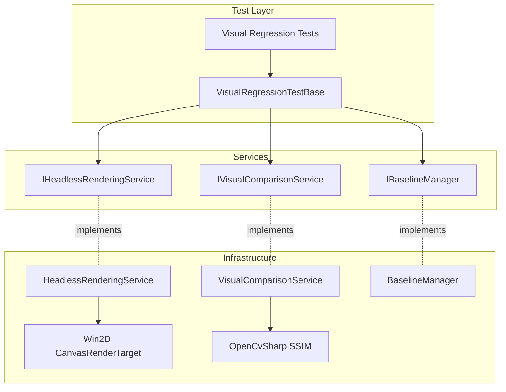

# Design Document

## Overview

The Visual Regression Testing feature provides automated visual quality assurance through headless PDF rendering, perceptual image comparison, and baseline management. The design uses Win2D CanvasRenderTarget for CI-compatible rendering, OpenCvSharp for SSIM-based comparison, and xUnit for test execution, enabling continuous monitoring of PDF rendering quality across code changes.

## Steering Document Alignment

### Technical Standards (tech.md)

**Win2D CanvasRenderTarget**: Uses DirectX-based off-screen rendering for headless screenshot capture without UI dependencies.

**OpenCvSharp**: Uses OpenCV's SSIM algorithm for perceptual similarity measurement with tolerance for minor GPU differences.

**xUnit + FluentAssertions**: Test framework with custom assertions for visual regression testing.

**GitHub Actions**: CI integration with artifact upload for failed test comparisons.

### Project Structure (structure.md)

**FluentPDF.Rendering.Tests**: Contains headless rendering logic and visual comparison services.

**FluentPDF.Validation.Tests**: Contains visual regression test classes organized by category.

**tests/Baselines**: Version-controlled baseline images for comparison.

**tests/TestResults**: Git-ignored directory for test outputs (actual, diff images).

## Code Reuse Analysis

### Existing Components to Leverage

- **PdfRenderingService**: Reuse for PDF page rendering (modify to support CanvasRenderTarget output)
- **Result<T> Pattern**: Use for visual comparison and baseline operations
- **Serilog Logging**: Log SSIM scores and test results
- **BenchmarkDotNet Patterns**: Use for performance testing of visual tests

### Integration Points

- **CI/CD Pipeline**: Add visual regression test job to GitHub Actions
- **Test Categories**: Use existing xUnit trait system for test organization
- **Artifact Management**: Integrate with GitHub Actions artifact upload

## Architecture



## Components and Interfaces

### Component 1: IHeadlessRenderingService

- **Purpose:** Contract for headless PDF rendering to image
- **Location:** `tests/FluentPDF.Rendering.Tests/Services/IHeadlessRenderingService.cs`
- **Methods:**
  ```csharp
  Task<Result<string>> RenderPageToFileAsync(
      string pdfPath,
      int pageNumber,
      string outputPath,
      int width = 1920,
      int height = 1080,
      double dpi = 96);
  ```

### Component 2: HeadlessRenderingService

- **Purpose:** Renders PDF pages to PNG using Win2D CanvasRenderTarget
- **Location:** `tests/FluentPDF.Rendering.Tests/Services/HeadlessRenderingService.cs`
- **Dependencies:** `PdfiumInterop`, `ILogger<HeadlessRenderingService>`
- **Rendering Pipeline:**
  ```csharp
  public async Task<Result<string>> RenderPageToFileAsync(...)
  {
      // 1. Initialize CanvasDevice (shared, reusable)
      using var device = CanvasDevice.GetSharedDevice();

      // 2. Create CanvasRenderTarget
      using var renderTarget = new CanvasRenderTarget(device, width, height, 96);

      // 3. Load PDF page using PDFium
      var docHandle = PdfiumInterop.LoadDocument(pdfPath, null);
      var pageHandle = PdfiumInterop.LoadPage(docHandle, pageNumber - 1);

      // 4. Get page dimensions
      var pageWidth = PdfiumInterop.GetPageWidth(pageHandle);
      var pageHeight = PdfiumInterop.GetPageHeight(pageHandle);

      // 5. Create bitmap for PDFium rendering
      var bitmapHandle = PdfiumInterop.FPDFBitmap_Create(width, height, 1);

      // 6. Render PDF to bitmap
      PdfiumInterop.FPDF_RenderPageBitmap(bitmapHandle, pageHandle, 0, 0, width, height, 0, 0);

      // 7. Get bitmap buffer
      var buffer = PdfiumInterop.FPDFBitmap_GetBuffer(bitmapHandle);

      // 8. Copy to CanvasRenderTarget
      using (var session = renderTarget.CreateDrawingSession())
      {
          // Convert BGRA buffer to CanvasBitmap
          var canvasBitmap = CanvasBitmap.CreateFromBytes(device, buffer, width, height, DirectXPixelFormat.B8G8R8A8UIntNormalized);
          session.DrawImage(canvasBitmap);
      }

      // 9. Save to PNG file
      using var fileStream = File.Create(outputPath);
      await renderTarget.SaveAsync(fileStream, CanvasBitmapFileFormat.Png);

      // 10. Cleanup PDFium resources
      PdfiumInterop.FPDFBitmap_Destroy(bitmapHandle);
      PdfiumInterop.ClosePage(pageHandle);
      PdfiumInterop.CloseDocument(docHandle);

      return Result.Ok(outputPath);
  }
  ```

### Component 3: ComparisonResult Model

- **Purpose:** Contains SSIM comparison results
- **Location:** `tests/FluentPDF.Rendering.Tests/Models/ComparisonResult.cs`
- **Properties:**
  ```csharp
  public class ComparisonResult
  {
      public required double SsimScore { get; init; }
      public required bool Passed { get; init; } // SsimScore >= threshold
      public required double Threshold { get; init; }
      public required string BaselinePath { get; init; }
      public required string ActualPath { get; init; }
      public string? DiffPath { get; init; }
  }
  ```

### Component 4: IVisualComparisonService

- **Purpose:** Contract for SSIM-based image comparison
- **Location:** `tests/FluentPDF.Rendering.Tests/Services/IVisualComparisonService.cs`
- **Methods:**
  ```csharp
  Task<Result<ComparisonResult>> CompareImagesAsync(
      string baselinePath,
      string actualPath,
      double threshold = 0.99,
      string? diffOutputPath = null);
  ```

### Component 5: VisualComparisonService

- **Purpose:** Compares images using OpenCvSharp SSIM
- **Location:** `tests/FluentPDF.Rendering.Tests/Services/VisualComparisonService.cs`
- **Dependencies:** `ILogger<VisualComparisonService>`
- **Comparison Pipeline:**
  ```csharp
  public async Task<Result<ComparisonResult>> CompareImagesAsync(...)
  {
      // 1. Load images as OpenCV Mat
      using var baseline = Cv2.ImRead(baselinePath, ImreadModes.Color);
      using var actual = Cv2.ImRead(actualPath, ImreadModes.Color);

      // 2. Validate dimensions match
      if (baseline.Size() != actual.Size())
      {
          return Result.Fail(new PdfError("IMAGE_SIZE_MISMATCH"));
      }

      // 3. Convert to grayscale
      using var baselineGray = new Mat();
      using var actualGray = new Mat();
      Cv2.CvtColor(baseline, baselineGray, ColorConversionCodes.BGR2GRAY);
      Cv2.CvtColor(actual, actualGray, ColorConversionCodes.BGR2GRAY);

      // 4. Calculate SSIM
      var ssim = Cv2.SSIM(baselineGray, actualGray);
      var ssimScore = ssim.Val0;

      // 5. Generate diff image if below threshold
      string? diffPath = null;
      if (ssimScore < threshold && diffOutputPath != null)
      {
          using var diff = new Mat();
          Cv2.Absdiff(baselineGray, actualGray, diff);
          Cv2.Threshold(diff, diff, 10, 255, ThresholdTypes.Binary);

          // Colorize diff (red overlay on baseline)
          using var colorDiff = new Mat();
          Cv2.CvtColor(baselineGray, colorDiff, ColorConversionCodes.GRAY2BGR);
          var diffMask = diff.ToMat();
          colorDiff.SetTo(new Scalar(0, 0, 255), diffMask); // Red

          Cv2.ImWrite(diffOutputPath, colorDiff);
          diffPath = diffOutputPath;
      }

      var result = new ComparisonResult
      {
          SsimScore = ssimScore,
          Passed = ssimScore >= threshold,
          Threshold = threshold,
          BaselinePath = baselinePath,
          ActualPath = actualPath,
          DiffPath = diffPath
      };

      return Result.Ok(result);
  }
  ```

### Component 6: IBaselineManager

- **Purpose:** Contract for baseline management
- **Location:** `tests/FluentPDF.Rendering.Tests/Services/IBaselineManager.cs`
- **Methods:**
  ```csharp
  string GetBaselinePath(string testCategory, string testName, int pageNumber);
  bool BaselineExists(string testCategory, string testName, int pageNumber);
  Task<Result> CreateBaselineAsync(string sourcePath, string testCategory, string testName, int pageNumber);
  Task<Result> UpdateBaselineAsync(string sourcePath, string testCategory, string testName, int pageNumber);
  ```

### Component 7: BaselineManager

- **Purpose:** Manages baseline image storage and retrieval
- **Location:** `tests/FluentPDF.Rendering.Tests/Services/BaselineManager.cs`
- **Storage Structure:**
  ```
  tests/
    Baselines/
      CoreRendering/
        SimplePdf/
          page-1.png
          page-2.png
        ComplexLayout/
          page-1.png
      TextRendering/
        UnicodeText/
          page-1.png
      Zoom/
        Zoom150Percent/
          page-1.png
  ```
- **Implementation:**
  ```csharp
  public string GetBaselinePath(string testCategory, string testName, int pageNumber)
  {
      return Path.Combine(_baselineDirectory, testCategory, testName, $"page-{pageNumber}.png");
  }

  public bool BaselineExists(string testCategory, string testName, int pageNumber)
  {
      var path = GetBaselinePath(testCategory, testName, pageNumber);
      return File.Exists(path);
  }

  public async Task<Result> CreateBaselineAsync(string sourcePath, string testCategory, string testName, int pageNumber)
  {
      var baselinePath = GetBaselinePath(testCategory, testName, pageNumber);
      Directory.CreateDirectory(Path.GetDirectoryName(baselinePath));
      File.Copy(sourcePath, baselinePath, overwrite: false);
      _logger.LogInformation("Created baseline: {BaselinePath}", baselinePath);
      return Result.Ok();
  }
  ```

### Component 8: VisualRegressionTestBase

- **Purpose:** Base class for visual regression tests
- **Location:** `tests/FluentPDF.Validation.Tests/VisualRegressionTestBase.cs`
- **Provides:**
  ```csharp
  public abstract class VisualRegressionTestBase : IDisposable
  {
      protected readonly IHeadlessRenderingService _renderingService;
      protected readonly IVisualComparisonService _comparisonService;
      protected readonly IBaselineManager _baselineManager;
      protected readonly ILogger _logger;
      protected readonly string _testResultsDirectory;

      protected async Task AssertVisualMatch(
          string pdfPath,
          int pageNumber,
          string testCategory,
          string testName,
          double threshold = 0.99)
      {
          // 1. Render PDF page to temp file
          var actualPath = Path.Combine(_testResultsDirectory, $"{testName}-page{pageNumber}-actual.png");
          var renderResult = await _renderingService.RenderPageToFileAsync(pdfPath, pageNumber, actualPath);
          renderResult.Should().BeSuccessful();

          // 2. Check if baseline exists
          if (!_baselineManager.BaselineExists(testCategory, testName, pageNumber))
          {
              _logger.LogInformation("No baseline found, creating initial baseline");
              await _baselineManager.CreateBaselineAsync(actualPath, testCategory, testName, pageNumber);
              return; // Pass on first run
          }

          // 3. Compare with baseline
          var baselinePath = _baselineManager.GetBaselinePath(testCategory, testName, pageNumber);
          var diffPath = Path.Combine(_testResultsDirectory, $"{testName}-page{pageNumber}-diff.png");
          var comparisonResult = await _comparisonService.CompareImagesAsync(baselinePath, actualPath, threshold, diffPath);
          comparisonResult.Should().BeSuccessful();

          // 4. Assert SSIM score
          var comparison = comparisonResult.Value;
          _logger.LogInformation("SSIM Score: {Score:F4} (threshold: {Threshold:F4})", comparison.SsimScore, threshold);

          if (!comparison.Passed)
          {
              throw new VisualRegressionException(
                  $"Visual regression detected! SSIM: {comparison.SsimScore:F4} < {threshold:F4}\n" +
                  $"Baseline: {baselinePath}\n" +
                  $"Actual: {actualPath}\n" +
                  $"Diff: {diffPath}");
          }
      }

      public virtual void Dispose()
      {
          // Cleanup temp files if tests pass
      }
  }
  ```

### Component 9: Visual Regression Tests

- **Purpose:** Concrete visual regression tests
- **Location:** `tests/FluentPDF.Validation.Tests/VisualRegressionTests.cs`
- **Example Tests:**
  ```csharp
  [Trait("Category", "VisualRegression")]
  public class CoreRenderingVisualTests : VisualRegressionTestBase
  {
      [Fact]
      public async Task SimplePdf_Page1_MatchesBaseline()
      {
          var pdfPath = Path.Combine("Fixtures", "simple.pdf");
          await AssertVisualMatch(pdfPath, 1, "CoreRendering", "SimplePdf");
      }

      [Fact]
      public async Task ComplexLayout_Page1_MatchesBaseline()
      {
          var pdfPath = Path.Combine("Fixtures", "complex-layout.pdf");
          await AssertVisualMatch(pdfPath, 1, "CoreRendering", "ComplexLayout");
      }
  }

  [Trait("Category", "VisualRegression")]
  public class ZoomVisualTests : VisualRegressionTestBase
  {
      [Theory]
      [InlineData(1.0, "Zoom100")]
      [InlineData(1.5, "Zoom150")]
      [InlineData(2.0, "Zoom200")]
      public async Task Zoom_MatchesBaseline(double zoomLevel, string testName)
      {
          var pdfPath = Path.Combine("Fixtures", "sample.pdf");
          // Modify rendering service to use zoomLevel
          await AssertVisualMatch(pdfPath, 1, "Zoom", testName);
      }
  }
  ```

## Error Handling

### Error Scenarios

1. **Win2D Initialization Failed**
   - **Handling:** Return `Result.Fail(new PdfError("WIN2D_INIT_FAILED"))`
   - **User Impact:** Skip visual tests with warning

2. **Image Size Mismatch**
   - **Handling:** Return `Result.Fail(new PdfError("IMAGE_SIZE_MISMATCH"))`
   - **User Impact:** Test fails, indicates baseline needs regeneration

3. **SSIM Calculation Failed**
   - **Handling:** Return `Result.Fail(new PdfError("SSIM_CALCULATION_FAILED"))`
   - **User Impact:** Test fails with detailed error

4. **Baseline Missing (First Run)**
   - **Handling:** Create baseline and pass test
   - **User Impact:** Logged as "Created initial baseline"

## Testing Strategy

### Test Organization

**Test Categories:**
- `CoreRendering`: Basic PDF rendering tests
- `TextRendering`: Text extraction and rendering
- `Zoom`: Zoom level rendering
- `Rotation`: Page rotation rendering
- `HiDpi`: High-DPI rendering

**Test Naming:**
- Format: `{Feature}_{Scenario}_{Expected}`
- Example: `SimplePdf_Page1_MatchesBaseline`

### CI Integration

**GitHub Actions Workflow:**
```yaml
name: Visual Regression Tests

on: [push, pull_request]

jobs:
  visual-tests:
    runs-on: windows-latest
    steps:
      - uses: actions/checkout@v3

      - name: Setup .NET
        uses: actions/setup-dotnet@v3

      - name: Restore dependencies
        run: dotnet restore

      - name: Build
        run: dotnet build --no-restore

      - name: Run Visual Regression Tests
        run: dotnet test --no-build --filter "Category=VisualRegression" --logger "trx;LogFileName=visual-tests.trx"

      - name: Upload Test Results
        if: failure()
        uses: actions/upload-artifact@v3
        with:
          name: visual-test-results
          path: tests/TestResults/
          retention-days: 30

      - name: Upload Baselines (on baseline changes)
        if: success()
        uses: actions/upload-artifact@v3
        with:
          name: baselines
          path: tests/Baselines/
```

## Performance Considerations

### Optimization Strategies
- **Shared CanvasDevice:** Reuse CanvasDevice across tests
- **Parallel Execution:** Run tests in parallel (xUnit default)
- **Caching:** Cache rendered images for repeated comparisons
- **Resolution:** Use standard 1920x1080 (balance quality and speed)

## Dependency Injection

**Test Setup:**
```csharp
public class VisualRegressionTestBase
{
    protected VisualRegressionTestBase()
    {
        // Initialize services
        _renderingService = new HeadlessRenderingService(LoggerFactory.Create(builder => builder.AddConsole()).CreateLogger<HeadlessRenderingService>());
        _comparisonService = new VisualComparisonService(LoggerFactory.Create(builder => builder.AddConsole()).CreateLogger<VisualComparisonService>());
        _baselineManager = new BaselineManager("tests/Baselines", LoggerFactory.Create(builder => builder.AddConsole()).CreateLogger<BaselineManager>());
    }
}
```

## Future Enhancements

- **Animated Diff**: Generate side-by-side animated GIF showing baseline vs actual
- **Perceptual Hash**: Use pHash for faster similarity checking before SSIM
- **Progressive Baselines**: Multiple baselines for different platforms/GPUs
- **Visual Test Dashboard**: Web UI showing test history and trends
- **Auto-Approval**: Automatically approve minor changes below threshold
