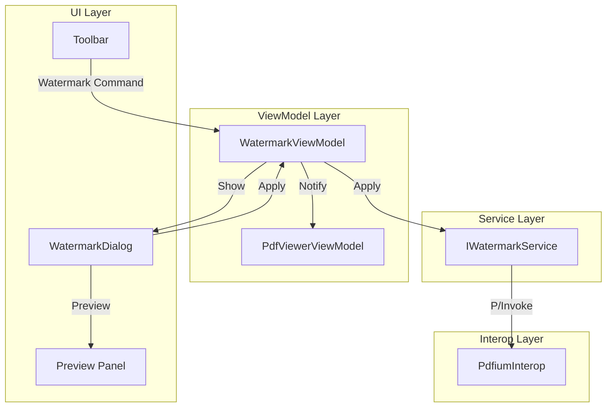

# Design Document

## Overview

The Watermarks feature adds text and image watermark capabilities to FluentPDF. It uses a configuration dialog with live preview, allowing users to customize appearance and apply watermarks to selected pages. Implementation uses PDFium for watermark embedding, treating watermarks as special page objects.

## Steering Document Alignment

### Technical Standards (tech.md)
- **PDFium Integration**: Uses FPDFPageObj APIs for watermark rendering
- **MVVM Pattern**: WatermarkViewModel with dialog
- **Result Pattern**: FluentResults for operations
- **WinUI 3**: ContentDialog for configuration

### Project Structure (structure.md)
- **Core Services**: IWatermarkService interface
- **Rendering**: WatermarkService using PDFium
- **UI**: WatermarkDialog for configuration
- **ViewModels**: WatermarkViewModel for state

## Code Reuse Analysis

### Existing Components to Leverage
- **PdfiumInterop**: Reuse image and text object APIs
- **ImageInsertionService**: Pattern for image embedding
- **ContentDialog**: Standard WinUI dialog pattern
- **FilePicker**: For image watermark selection

### Integration Points
- **PdfViewerPage toolbar**: Add "Watermark" button
- **PdfViewerViewModel**: Coordinate with HasUnsavedChanges
- **Page rendering**: Show watermarks in viewer

## Architecture



## Components and Interfaces

### Component 1: IWatermarkService
- **Purpose**: Apply and remove watermarks from PDF pages
- **Interfaces**:
  ```csharp
  Task<Result> ApplyTextWatermarkAsync(PdfDocument doc, TextWatermarkConfig config, PageRange range);
  Task<Result> ApplyImageWatermarkAsync(PdfDocument doc, ImageWatermarkConfig config, PageRange range);
  Task<Result> RemoveWatermarksAsync(PdfDocument doc, PageRange range);
  Task<byte[]> GeneratePreviewAsync(PdfDocument doc, int pageIndex, WatermarkConfig config);
  ```
- **Dependencies**: PdfiumInterop
- **Reuses**: Image object APIs from image-insertion

### Component 2: WatermarkDialog
- **Purpose**: Configuration UI for watermark creation
- **Interfaces**: ContentDialog with tabbed configuration
- **Dependencies**: WatermarkViewModel
- **Reuses**: ContentDialog patterns

### Component 3: WatermarkViewModel
- **Purpose**: Manage watermark configuration state
- **Interfaces**:
  - `TextWatermarkConfig TextConfig { get; set; }`
  - `ImageWatermarkConfig ImageConfig { get; set; }`
  - `WatermarkType SelectedType { get; set; }`
  - `PageRange TargetPages { get; set; }`
  - `IRelayCommand ApplyCommand { get; }`
  - `IRelayCommand PreviewCommand { get; }`
- **Dependencies**: IWatermarkService
- **Reuses**: MVVM patterns

## Data Models

### TextWatermarkConfig
```csharp
public class TextWatermarkConfig
{
    public string Text { get; set; }
    public string FontFamily { get; set; }
    public float FontSize { get; set; }
    public Color Color { get; set; }
    public float Opacity { get; set; }
    public float RotationDegrees { get; set; }
    public WatermarkPosition Position { get; set; }
    public bool BehindContent { get; set; }
}
```

### ImageWatermarkConfig
```csharp
public class ImageWatermarkConfig
{
    public string ImagePath { get; set; }
    public float Scale { get; set; }
    public float Opacity { get; set; }
    public float RotationDegrees { get; set; }
    public WatermarkPosition Position { get; set; }
    public bool BehindContent { get; set; }
}
```

### WatermarkPosition Enum
```csharp
public enum WatermarkPosition
{
    Center,
    TopLeft,
    TopRight,
    BottomLeft,
    BottomRight,
    Custom
}
```

### PageRange Class
```csharp
public class PageRange
{
    public PageRangeType Type { get; set; }
    public int[] SpecificPages { get; set; }

    public static PageRange All => new() { Type = PageRangeType.All };
    public static PageRange Parse(string range); // "1-5, 10, 15-20"
}

public enum PageRangeType
{
    All,
    CurrentPage,
    Custom,
    OddPages,
    EvenPages
}
```

## Error Handling

### Error Scenarios
1. **Invalid page range**
   - **Handling**: Validate before apply, show inline error
   - **User Impact**: "Invalid page range: pages must be 1 to {max}"

2. **Image file not found**
   - **Handling**: Validate path, show error
   - **User Impact**: "Image file not found"

3. **Watermark application fails**
   - **Handling**: Return Result.Fail, no partial changes
   - **User Impact**: Error dialog with details

## Testing Strategy

### Unit Testing
- WatermarkService: Test text and image watermark creation
- PageRange: Test parsing various range formats
- WatermarkViewModel: Test configuration state

### Integration Testing
- FlaUI: Test dialog opens and configures watermark
- FlaUI: Test preview updates on changes
- FlaUI: Test apply to multiple pages

### End-to-End Testing
- Add text watermark, save, reopen and verify
- Add image watermark to odd pages, verify pattern
