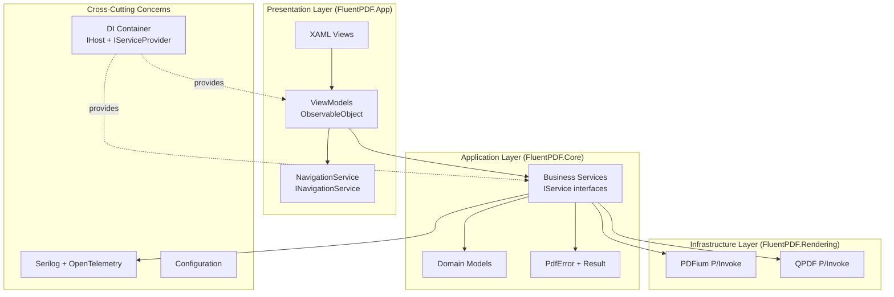

# FluentPDF Architecture

This document describes the architectural design of FluentPDF, including system overview, design decisions, and implementation patterns.

## Table of Contents

- [System Overview](#system-overview)
- [Layer Architecture](#layer-architecture)
- [Design Decisions](#design-decisions)
- [Error Handling Strategy](#error-handling-strategy)
- [Observability Infrastructure](#observability-infrastructure)
- [MVVM Pattern Implementation](#mvvm-pattern-implementation)
- [Dependency Injection](#dependency-injection)
- [Testing Strategy](#testing-strategy)

## System Overview

FluentPDF is a Windows desktop application built on WinUI 3 that provides enterprise-grade PDF viewing and manipulation capabilities. The architecture follows clean architecture principles with strict layer separation and testability as core requirements.

### High-Level Architecture Diagram



## Layer Architecture

### FluentPDF.App (Presentation Layer)

**Purpose**: WinUI 3 user interface layer implementing MVVM pattern.

**Dependencies**:
- FluentPDF.Core
- FluentPDF.Rendering
- CommunityToolkit.Mvvm
- Microsoft.Extensions.Hosting

**Key Components**:
- **Views**: XAML pages and controls with data binding
- **ViewModels**: Observable view models using source generators
- **Services**: UI-specific services (navigation, window management)
- **App.xaml.cs**: Application entry point with DI container and global exception handlers

**Rules**:
- ViewModels must inherit from `ObservableObject`
- ViewModels must end with "ViewModel" suffix
- No business logic in code-behind (only view logic)
- All navigation through `INavigationService` abstraction

### FluentPDF.Core (Application Layer)

**Purpose**: Business logic and domain models - completely UI-agnostic and headless testable.

**Dependencies**:
- FluentResults
- Serilog
- Microsoft.Extensions.Logging

**Key Components**:
- **ErrorHandling**: `PdfError`, `ErrorCategory`, `ErrorSeverity` types
- **Logging**: `SerilogConfiguration` for structured logging setup
- **Services**: Domain service interfaces (`ITelemetryService`, etc.)
- **Models**: Domain entities and value objects

**Rules**:
- ZERO UI dependencies (no `Microsoft.UI.Xaml` references)
- Must be headless testable (can run on Linux/CI without Windows runtime)
- All services must implement `I*Service` interfaces
- Use `Result<T>` pattern for error handling (no exceptions for expected failures)

### FluentPDF.Rendering (Infrastructure Layer)

**Purpose**: PDF rendering and manipulation using native libraries (PDFium, QPDF).

**Dependencies**:
- FluentPDF.Core
- PDFium (native)
- QPDF (native)

**Key Components**:
- **P/Invoke**: Native interop declarations
- **Rendering**: High-level rendering services
- **Operations**: PDF manipulation operations

**Rules**:
- Wraps native library calls with safe managed wrappers
- Returns `Result<T>` for all operations
- Must handle native memory management correctly
- Should reference Core abstractions, not implement business logic

## Design Decisions

### Decision 1: WinUI 3 over WPF

**Rationale**: WinUI 3 provides modern Fluent Design, better performance, and is Microsoft's recommended UI framework for new Windows applications.

**Alternatives Considered**:
- WPF: Mature but legacy technology, limited modern UI support
- Avalonia: Cross-platform but less native Windows integration

**Trade-offs**:
- ✅ Modern UI, better performance, official Microsoft support
- ❌ Windows-only, smaller community compared to WPF

### Decision 2: FluentResults over Exception-based Error Handling

**Rationale**: Expected failures (file not found, invalid PDF) should be handled explicitly with `Result<T>` pattern. Exceptions reserved for truly exceptional cases.

**Benefits**:
- Compiler-enforced error handling
- Rich error context with `PdfError` metadata
- AI-analyzable error patterns (structured metadata)
- Better testability (no try-catch in tests)

**Pattern**:
```csharp
public Result<PdfDocument> LoadDocument(string path)
{
    if (!File.Exists(path))
    {
        return Result.Fail(new PdfError(
            "PDF_FILE_NOT_FOUND",
            ErrorCategory.IO,
            ErrorSeverity.Error
        ).WithContext("FilePath", path));
    }

    // Success case
    return Result.Ok(document);
}
```

### Decision 3: Serilog + OpenTelemetry for Observability

**Rationale**: Structured logging with JSON format enables AI-powered log analysis and correlation across operations.

**Architecture**:
- **File Sink**: Async JSON logs to ApplicationData.LocalFolder (MSIX-compatible)
- **OTLP Sink**: Real-time telemetry to .NET Aspire Dashboard (development)
- **Enrichers**: Machine name, environment, correlation IDs, version

**Benefits**:
- AI can parse structured JSON logs for pattern detection
- Correlation IDs link related operations
- OTLP integration enables distributed tracing (future)

### Decision 4: ArchUnitNET for Architecture Enforcement

**Rationale**: Architecture tests prevent erosion of layer boundaries and naming conventions over time.

**Enforced Rules**:
- Core cannot depend on App or Rendering
- ViewModels must inherit from `ObservableObject`
- Services must implement `I*Service` interfaces
- Naming conventions (ViewModels end with "ViewModel", interfaces start with "I")

**Benefits**:
- Automated validation in CI/CD
- Prevents accidental violations
- Self-documenting architecture rules

### Decision 5: CommunityToolkit.Mvvm Source Generators

**Rationale**: Reduces boilerplate code by 70-80% compared to manual `INotifyPropertyChanged` implementation.

**Pattern**:
```csharp
// Before (manual):
private string _title;
public string Title
{
    get => _title;
    set => SetProperty(ref _title, value);
}

// After (source generators):
[ObservableProperty]
private string _title;
// Generated: public string Title property with change notification
```

**Benefits**:
- Less code to maintain
- Compile-time safety
- Consistent implementation across all ViewModels

### Decision 6: vcpkg for Native Library Management

**Rationale**: Reproducible builds of PDFium and QPDF across developer machines and CI/CD.

**Architecture**:
- `tools/build-libs.ps1`: Automated bootstrap and build script
- Binary caching for faster CI builds
- Support for x64-windows and arm64-windows

**Benefits**:
- No manual DLL management
- Reproducible builds
- Easy to update library versions

## Error Handling Strategy

FluentPDF uses a multi-layered error handling approach:

### Layer 1: Result Pattern (Expected Failures)

Used for domain-level expected failures:
- File not found
- Invalid PDF structure
- Permission denied
- Unsupported features

**Implementation**: `Result<T>` from FluentResults with custom `PdfError` type.

### Layer 2: Global Exception Handlers (Unhandled Exceptions)

Three exception handlers provide complete coverage:

1. **UI Thread Handler** (`Application.UnhandledException`):
   - Catches unhandled exceptions in UI event handlers
   - Shows user-friendly error dialog with correlation ID
   - Logs with full stack trace
   - Attempts to keep app running (`e.Handled = true`)

2. **Background Task Handler** (`TaskScheduler.UnobservedTaskException`):
   - Catches unobserved task exceptions
   - Logs with correlation ID
   - Prevents app crash (`e.SetObserved()`)

3. **AppDomain Handler** (`AppDomain.UnhandledException`):
   - Final safety net for non-UI thread exceptions
   - Logs exception before termination
   - Cannot prevent crash, but ensures logging

### Error Context and Correlation

All errors include:
- **Correlation ID**: Unique GUID for linking related operations
- **Category**: Error classification (IO, Rendering, Validation, etc.)
- **Severity**: Error severity (Critical, Error, Warning, Info)
- **Context Dictionary**: Arbitrary metadata (file path, page number, etc.)
- **Timestamp**: When error occurred
- **Stack Trace**: For debugging (in logs, not shown to user)

## Observability Infrastructure

### Structured Logging with Serilog

**Configuration** (`SerilogConfiguration.CreateLogger()`):

```csharp
Log.Logger = new LoggerConfiguration()
    .MinimumLevel.Debug()
    .Enrich.FromLogContext()              // Correlation IDs
    .Enrich.WithProperty("Application", "FluentPDF")
    .Enrich.WithProperty("Version", version)
    .Enrich.WithMachineName()
    .Enrich.WithEnvironmentName()
    .WriteTo.Async(a => a.File(
        new JsonFormatter(),
        path: ApplicationData.Current.LocalFolder.Path + "/logs/log-.json",
        rollingInterval: RollingInterval.Day,
        retainedFileCountLimit: 7
    ))
    .WriteTo.OpenTelemetry(opts => {
        opts.Endpoint = "http://localhost:4317";
        opts.Protocol = OtlpProtocol.Grpc;
        opts.ResourceAttributes = new Dictionary<string, object>
        {
            ["service.name"] = "FluentPDF.Desktop",
            ["service.version"] = version
        };
    })
    .CreateLogger();
```

### Log Correlation

**Correlation IDs** link related operations:

```csharp
using (LogContext.PushProperty("CorrelationId", Guid.NewGuid()))
{
    _logger.LogInformation("Loading document {FilePath}", path);
    // All logs in this scope include CorrelationId
}
```

### OpenTelemetry Integration

Development setup:
```bash
docker run --rm -it -p 18888:18888 -p 4317:4317 \
  mcr.microsoft.com/dotnet/aspire-dashboard:8.0
```

Dashboard: http://localhost:18888

## MVVM Pattern Implementation

### ViewModel Structure

```csharp
public partial class MainViewModel : ObservableObject
{
    // Observable properties (source generator)
    [ObservableProperty]
    private string _title = "FluentPDF";

    [ObservableProperty]
    private bool _isLoading;

    // Commands (source generator)
    [RelayCommand]
    private async Task LoadDocumentAsync()
    {
        IsLoading = true;
        // Load document
        IsLoading = false;
    }

    [RelayCommand(CanExecute = nameof(CanSave))]
    private void Save()
    {
        // Save logic
    }

    private bool CanSave() => !IsLoading;

    // Constructor with DI
    public MainViewModel(ILogger<MainViewModel> logger)
    {
        _logger = logger;
    }
}
```

### View Binding

```xml
<Page x:Name="RootPage">
    <Page.DataContext>
        <!-- Set in code-behind via DI -->
    </Page.DataContext>

    <StackPanel>
        <TextBlock Text="{Binding Title}" />
        <Button Command="{Binding LoadDocumentCommand}"
                Content="Load Document" />
        <Button Command="{Binding SaveCommand}"
                Content="Save"
                IsEnabled="{Binding SaveCommand.CanExecute}" />
    </StackPanel>
</Page>
```

## Dependency Injection

### Container Configuration (App.xaml.cs)

```csharp
private readonly IHost _host;

public App()
{
    InitializeComponent();

    _host = Host.CreateDefaultBuilder()
        .ConfigureServices((context, services) =>
        {
            // ViewModels (transient - new instance per request)
            services.AddTransient<MainViewModel>();

            // Services (singleton - shared across app)
            services.AddSingleton<INavigationService, NavigationService>();
            services.AddSingleton<ITelemetryService, TelemetryService>();

            // Logging
            services.AddLogging(builder => builder.AddSerilog(dispose: true));
        })
        .Build();
}

public T GetService<T>() where T : class
    => _host.Services.GetRequiredService<T>();
```

### Service Resolution

```csharp
// In Window or Page code-behind
var viewModel = ((App)Application.Current).GetService<MainViewModel>();
RootPage.DataContext = viewModel;
```

## Testing Strategy

### Test Project Structure

```
tests/
├── FluentPDF.Architecture.Tests/  # ArchUnitNET rules
│   ├── LayerTests.cs              # Dependency rules
│   ├── NamingTests.cs             # Naming conventions
│   └── InterfaceTests.cs          # Interface patterns
├── FluentPDF.Core.Tests/          # Unit tests (headless)
│   ├── ErrorHandling/             # PdfError tests
│   ├── Logging/                   # Logging config tests
│   └── ViewModels/                # ViewModel tests (headless)
└── FluentPDF.App.Tests/           # UI tests
    └── Views/                     # FlaUI automation tests
```

### Testing Principles

1. **Core is Headless Testable**: Core.Tests must run on Linux without WinUI runtime
2. **Architecture Tests in CI**: ArchUnitNET tests run on every PR
3. **High Coverage**: 80% minimum, 90% for critical paths
4. **Fast Feedback**: Unit tests complete in < 5 seconds

### Architecture Test Example

```csharp
[Fact]
public void CoreLayer_ShouldNot_DependOn_AppLayer()
{
    var rule = Classes()
        .That().ResideInNamespace("FluentPDF.Core")
        .Should().NotDependOnAny(Classes().That().ResideInNamespace("FluentPDF.App"))
        .Because("Core must be UI-agnostic for testability");

    rule.Check(Architecture);
}
```

## Build and CI/CD

### vcpkg Build Automation

Native library build process:
1. Clone vcpkg (if not exists)
2. Bootstrap vcpkg
3. Install PDFium and QPDF
4. Copy DLLs to `libs/{arch}/bin/`
5. Copy headers to `libs/{arch}/include/`

### GitHub Actions Workflows

**build.yml**:
- Builds native libraries with vcpkg caching
- Compiles solution (Release configuration)
- Uploads artifacts

**test.yml**:
- Runs architecture tests
- Runs unit tests
- Uploads TRX files
- Publishes test results in PR

**quality-analysis.yml**:
- Placeholder for AI-powered TRX analysis
- Future: AI agent analyzes test failures

### vcpkg Binary Caching

CI/CD uses GitHub Actions cache to avoid rebuilding PDFium/QPDF on every run:
- First build: ~30 minutes
- Cached builds: ~2 minutes

## Future Architectural Considerations

### Planned Enhancements

1. **Visual Regression Testing**: Win2D headless rendering with SSIM comparison
2. **AI Quality Analysis**: Automated TRX analysis and failure pattern detection
3. **Performance Monitoring**: BenchmarkDotNet integration for rendering performance
4. **Distributed Tracing**: Full OpenTelemetry span instrumentation
5. **Plugin Architecture**: MEF-based plugin system for extensibility

### Scalability Considerations

- **Large PDF Handling**: Streaming rendering for documents > 1000 pages
- **Memory Management**: Aggressive bitmap disposal and GC hints
- **Async Operations**: All I/O operations async to prevent UI blocking
- **Background Rendering**: Render pipeline on background threads

## References

- [Steering Documents](../.spec-workflow/steering/)
  - [Product Vision](../.spec-workflow/steering/product.md)
  - [Technical Standards](../.spec-workflow/steering/tech.md)
  - [Project Structure](../.spec-workflow/steering/structure.md)
- [Specification](../.spec-workflow/specs/project-foundation/)
  - [Requirements](../.spec-workflow/specs/project-foundation/requirements.md)
  - [Design](../.spec-workflow/specs/project-foundation/design.md)
  - [Tasks](../.spec-workflow/specs/project-foundation/tasks.md)
- [Testing Strategy](./TESTING.md)

## Glossary

- **DI**: Dependency Injection
- **MVVM**: Model-View-ViewModel pattern
- **OTLP**: OpenTelemetry Protocol
- **P/Invoke**: Platform Invocation Services (native interop)
- **SSIM**: Structural Similarity Index (image comparison metric)
- **vcpkg**: Microsoft's C/C++ package manager
