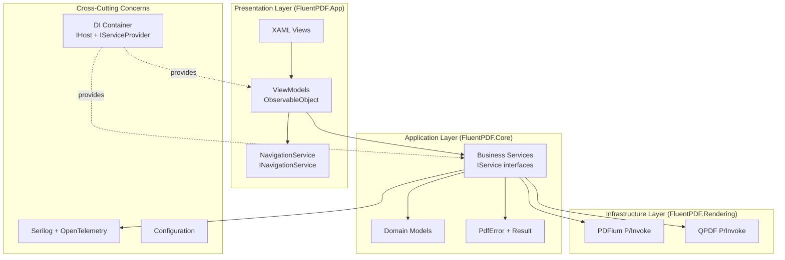
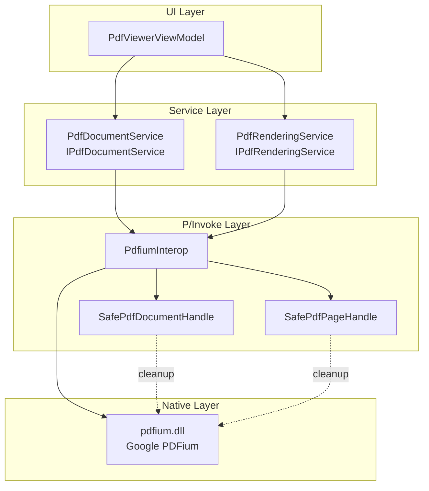
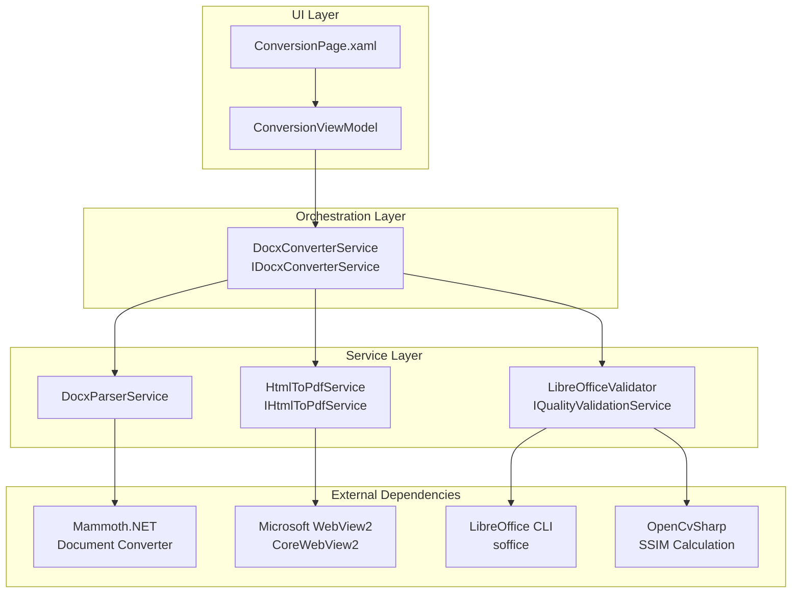
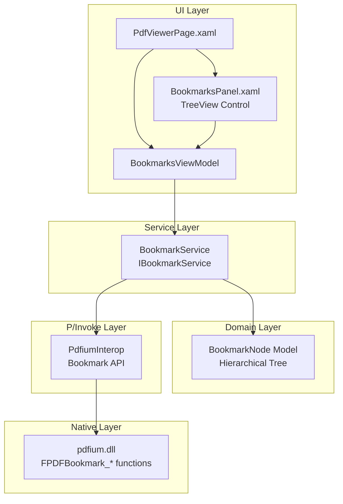

# FluentPDF Architecture

This document describes the architectural design of FluentPDF, including system overview, design decisions, and implementation patterns.

## Table of Contents

- [System Overview](#system-overview)
- [Layer Architecture](#layer-architecture)
- [Design Decisions](#design-decisions)
- [Error Handling Strategy](#error-handling-strategy)
- [Observability Infrastructure](#observability-infrastructure)
- [MVVM Pattern Implementation](#mvvm-pattern-implementation)
- [Dependency Injection](#dependency-injection)
- [Testing Strategy](#testing-strategy)
- [PDF Rendering Architecture](#pdf-rendering-architecture)
- [Office Document Conversion Architecture](#office-document-conversion-architecture)
- [Bookmarks Panel Architecture](#bookmarks-panel-architecture)
- [Build and CI/CD](#build-and-cicd)

## System Overview

FluentPDF is a Windows desktop application built on WinUI 3 that provides enterprise-grade PDF viewing and manipulation capabilities. The architecture follows clean architecture principles with strict layer separation and testability as core requirements.

### High-Level Architecture Diagram



## Layer Architecture

### FluentPDF.App (Presentation Layer)

**Purpose**: WinUI 3 user interface layer implementing MVVM pattern.

**Dependencies**:
- FluentPDF.Core
- FluentPDF.Rendering
- CommunityToolkit.Mvvm
- Microsoft.Extensions.Hosting

**Key Components**:
- **Views**: XAML pages and controls with data binding
- **ViewModels**: Observable view models using source generators
- **Services**: UI-specific services (navigation, window management)
- **App.xaml.cs**: Application entry point with DI container and global exception handlers

**Rules**:
- ViewModels must inherit from `ObservableObject`
- ViewModels must end with "ViewModel" suffix
- No business logic in code-behind (only view logic)
- All navigation through `INavigationService` abstraction

### FluentPDF.Core (Application Layer)

**Purpose**: Business logic and domain models - completely UI-agnostic and headless testable.

**Dependencies**:
- FluentResults
- Serilog
- Microsoft.Extensions.Logging

**Key Components**:
- **ErrorHandling**: `PdfError`, `ErrorCategory`, `ErrorSeverity` types
- **Logging**: `SerilogConfiguration` for structured logging setup
- **Services**: Domain service interfaces (`ITelemetryService`, etc.)
- **Models**: Domain entities and value objects

**Rules**:
- ZERO UI dependencies (no `Microsoft.UI.Xaml` references)
- Must be headless testable (can run on Linux/CI without Windows runtime)
- All services must implement `I*Service` interfaces
- Use `Result<T>` pattern for error handling (no exceptions for expected failures)

### FluentPDF.Rendering (Infrastructure Layer)

**Purpose**: PDF rendering and manipulation using native libraries (PDFium, QPDF).

**Dependencies**:
- FluentPDF.Core
- PDFium (native)
- QPDF (native)

**Key Components**:
- **P/Invoke**: Native interop declarations
- **Rendering**: High-level rendering services
- **Operations**: PDF manipulation operations

**Rules**:
- Wraps native library calls with safe managed wrappers
- Returns `Result<T>` for all operations
- Must handle native memory management correctly
- Should reference Core abstractions, not implement business logic

## Design Decisions

### Decision 1: WinUI 3 over WPF

**Rationale**: WinUI 3 provides modern Fluent Design, better performance, and is Microsoft's recommended UI framework for new Windows applications.

**Alternatives Considered**:
- WPF: Mature but legacy technology, limited modern UI support
- Avalonia: Cross-platform but less native Windows integration

**Trade-offs**:
- ✅ Modern UI, better performance, official Microsoft support
- ❌ Windows-only, smaller community compared to WPF

### Decision 2: FluentResults over Exception-based Error Handling

**Rationale**: Expected failures (file not found, invalid PDF) should be handled explicitly with `Result<T>` pattern. Exceptions reserved for truly exceptional cases.

**Benefits**:
- Compiler-enforced error handling
- Rich error context with `PdfError` metadata
- AI-analyzable error patterns (structured metadata)
- Better testability (no try-catch in tests)

**Pattern**:
```csharp
public Result<PdfDocument> LoadDocument(string path)
{
    if (!File.Exists(path))
    {
        return Result.Fail(new PdfError(
            "PDF_FILE_NOT_FOUND",
            ErrorCategory.IO,
            ErrorSeverity.Error
        ).WithContext("FilePath", path));
    }

    // Success case
    return Result.Ok(document);
}
```

### Decision 3: Serilog + OpenTelemetry for Observability

**Rationale**: Structured logging with JSON format enables AI-powered log analysis and correlation across operations.

**Architecture**:
- **File Sink**: Async JSON logs to ApplicationData.LocalFolder (MSIX-compatible)
- **OTLP Sink**: Real-time telemetry to .NET Aspire Dashboard (development)
- **Enrichers**: Machine name, environment, correlation IDs, version

**Benefits**:
- AI can parse structured JSON logs for pattern detection
- Correlation IDs link related operations
- OTLP integration enables distributed tracing (future)

### Decision 4: ArchUnitNET for Architecture Enforcement

**Rationale**: Architecture tests prevent erosion of layer boundaries and naming conventions over time.

**Enforced Rules**:
- Core cannot depend on App or Rendering
- ViewModels must inherit from `ObservableObject`
- Services must implement `I*Service` interfaces
- Naming conventions (ViewModels end with "ViewModel", interfaces start with "I")

**Benefits**:
- Automated validation in CI/CD
- Prevents accidental violations
- Self-documenting architecture rules

### Decision 5: CommunityToolkit.Mvvm Source Generators

**Rationale**: Reduces boilerplate code by 70-80% compared to manual `INotifyPropertyChanged` implementation.

**Pattern**:
```csharp
// Before (manual):
private string _title;
public string Title
{
    get => _title;
    set => SetProperty(ref _title, value);
}

// After (source generators):
[ObservableProperty]
private string _title;
// Generated: public string Title property with change notification
```

**Benefits**:
- Less code to maintain
- Compile-time safety
- Consistent implementation across all ViewModels

### Decision 6: vcpkg for Native Library Management

**Rationale**: Reproducible builds of PDFium and QPDF across developer machines and CI/CD.

**Architecture**:
- `tools/build-libs.ps1`: Automated bootstrap and build script
- Binary caching for faster CI builds
- Support for x64-windows and arm64-windows

**Benefits**:
- No manual DLL management
- Reproducible builds
- Easy to update library versions

## Error Handling Strategy

FluentPDF uses a multi-layered error handling approach:

### Layer 1: Result Pattern (Expected Failures)

Used for domain-level expected failures:
- File not found
- Invalid PDF structure
- Permission denied
- Unsupported features

**Implementation**: `Result<T>` from FluentResults with custom `PdfError` type.

### Layer 2: Global Exception Handlers (Unhandled Exceptions)

Three exception handlers provide complete coverage:

1. **UI Thread Handler** (`Application.UnhandledException`):
   - Catches unhandled exceptions in UI event handlers
   - Shows user-friendly error dialog with correlation ID
   - Logs with full stack trace
   - Attempts to keep app running (`e.Handled = true`)

2. **Background Task Handler** (`TaskScheduler.UnobservedTaskException`):
   - Catches unobserved task exceptions
   - Logs with correlation ID
   - Prevents app crash (`e.SetObserved()`)

3. **AppDomain Handler** (`AppDomain.UnhandledException`):
   - Final safety net for non-UI thread exceptions
   - Logs exception before termination
   - Cannot prevent crash, but ensures logging

### Error Context and Correlation

All errors include:
- **Correlation ID**: Unique GUID for linking related operations
- **Category**: Error classification (IO, Rendering, Validation, etc.)
- **Severity**: Error severity (Critical, Error, Warning, Info)
- **Context Dictionary**: Arbitrary metadata (file path, page number, etc.)
- **Timestamp**: When error occurred
- **Stack Trace**: For debugging (in logs, not shown to user)

## Observability Infrastructure

### Structured Logging with Serilog

**Configuration** (`SerilogConfiguration.CreateLogger()`):

```csharp
Log.Logger = new LoggerConfiguration()
    .MinimumLevel.Debug()
    .Enrich.FromLogContext()              // Correlation IDs
    .Enrich.WithProperty("Application", "FluentPDF")
    .Enrich.WithProperty("Version", version)
    .Enrich.WithMachineName()
    .Enrich.WithEnvironmentName()
    .WriteTo.Async(a => a.File(
        new JsonFormatter(),
        path: ApplicationData.Current.LocalFolder.Path + "/logs/log-.json",
        rollingInterval: RollingInterval.Day,
        retainedFileCountLimit: 7
    ))
    .WriteTo.OpenTelemetry(opts => {
        opts.Endpoint = "http://localhost:4317";
        opts.Protocol = OtlpProtocol.Grpc;
        opts.ResourceAttributes = new Dictionary<string, object>
        {
            ["service.name"] = "FluentPDF.Desktop",
            ["service.version"] = version
        };
    })
    .CreateLogger();
```

### Log Correlation

**Correlation IDs** link related operations:

```csharp
using (LogContext.PushProperty("CorrelationId", Guid.NewGuid()))
{
    _logger.LogInformation("Loading document {FilePath}", path);
    // All logs in this scope include CorrelationId
}
```

### OpenTelemetry Integration

Development setup:
```bash
docker run --rm -it -p 18888:18888 -p 4317:4317 \
  mcr.microsoft.com/dotnet/aspire-dashboard:8.0
```

Dashboard: http://localhost:18888

## MVVM Pattern Implementation

### ViewModel Structure

```csharp
public partial class MainViewModel : ObservableObject
{
    // Observable properties (source generator)
    [ObservableProperty]
    private string _title = "FluentPDF";

    [ObservableProperty]
    private bool _isLoading;

    // Commands (source generator)
    [RelayCommand]
    private async Task LoadDocumentAsync()
    {
        IsLoading = true;
        // Load document
        IsLoading = false;
    }

    [RelayCommand(CanExecute = nameof(CanSave))]
    private void Save()
    {
        // Save logic
    }

    private bool CanSave() => !IsLoading;

    // Constructor with DI
    public MainViewModel(ILogger<MainViewModel> logger)
    {
        _logger = logger;
    }
}
```

### View Binding

```xml
<Page x:Name="RootPage">
    <Page.DataContext>
        <!-- Set in code-behind via DI -->
    </Page.DataContext>

    <StackPanel>
        <TextBlock Text="{Binding Title}" />
        <Button Command="{Binding LoadDocumentCommand}"
                Content="Load Document" />
        <Button Command="{Binding SaveCommand}"
                Content="Save"
                IsEnabled="{Binding SaveCommand.CanExecute}" />
    </StackPanel>
</Page>
```

## Dependency Injection

### Container Configuration (App.xaml.cs)

```csharp
private readonly IHost _host;

public App()
{
    InitializeComponent();

    _host = Host.CreateDefaultBuilder()
        .ConfigureServices((context, services) =>
        {
            // ViewModels (transient - new instance per request)
            services.AddTransient<MainViewModel>();

            // Services (singleton - shared across app)
            services.AddSingleton<INavigationService, NavigationService>();
            services.AddSingleton<ITelemetryService, TelemetryService>();

            // Logging
            services.AddLogging(builder => builder.AddSerilog(dispose: true));
        })
        .Build();
}

public T GetService<T>() where T : class
    => _host.Services.GetRequiredService<T>();
```

### Service Resolution

```csharp
// In Window or Page code-behind
var viewModel = ((App)Application.Current).GetService<MainViewModel>();
RootPage.DataContext = viewModel;
```

## Testing Strategy

### Test Project Structure

```
tests/
├── FluentPDF.Architecture.Tests/  # ArchUnitNET rules
│   ├── LayerTests.cs              # Dependency rules
│   ├── NamingTests.cs             # Naming conventions
│   └── InterfaceTests.cs          # Interface patterns
├── FluentPDF.Core.Tests/          # Unit tests (headless)
│   ├── ErrorHandling/             # PdfError tests
│   ├── Logging/                   # Logging config tests
│   └── ViewModels/                # ViewModel tests (headless)
└── FluentPDF.App.Tests/           # UI tests
    └── Views/                     # FlaUI automation tests
```

### Testing Principles

1. **Core is Headless Testable**: Core.Tests must run on Linux without WinUI runtime
2. **Architecture Tests in CI**: ArchUnitNET tests run on every PR
3. **High Coverage**: 80% minimum, 90% for critical paths
4. **Fast Feedback**: Unit tests complete in < 5 seconds

### Architecture Test Example

```csharp
[Fact]
public void CoreLayer_ShouldNot_DependOn_AppLayer()
{
    var rule = Classes()
        .That().ResideInNamespace("FluentPDF.Core")
        .Should().NotDependOnAny(Classes().That().ResideInNamespace("FluentPDF.App"))
        .Because("Core must be UI-agnostic for testability");

    rule.Check(Architecture);
}
```

## PDF Rendering Architecture

The PDF rendering subsystem integrates PDFium (Google's PDF rendering engine) through a carefully designed P/Invoke layer with enterprise-grade error handling and resource management.

### PDFium Integration Overview



### Component Breakdown

#### 1. PdfiumInterop (Low-Level P/Invoke)

**Location**: `FluentPDF.Rendering/Interop/PdfiumInterop.cs`

**Responsibilities**:
- DllImport declarations for PDFium C API
- Library initialization and shutdown
- Error code translation
- Safe handle management

**Key Methods**:
```csharp
public class PdfiumInterop
{
    public bool Initialize();                                    // FPDF_InitLibrary
    public void Shutdown();                                      // FPDF_DestroyLibrary
    public SafePdfDocumentHandle LoadDocument(string path);      // FPDF_LoadDocument
    public int GetPageCount(SafePdfDocumentHandle doc);          // FPDF_GetPageCount
    public SafePdfPageHandle LoadPage(SafePdfDocumentHandle doc, int index);
    public double GetPageWidth(SafePdfPageHandle page);          // FPDF_GetPageWidth
    public double GetPageHeight(SafePdfPageHandle page);         // FPDF_GetPageHeight
    public IntPtr CreateBitmap(int width, int height);           // FPDFBitmap_Create
    public void RenderPageBitmap(IntPtr bitmap, SafePdfPageHandle page, ...);
}
```

**Design Patterns**:
- **SafeHandle Pattern**: All native pointers wrapped in `SafeHandleZeroOrMinusOneIsInvalid`
- **Singleton Initialization**: PDFium initialized once per app lifetime
- **Deterministic Cleanup**: Automatic handle release via `ReleaseHandle()`

#### 2. SafeHandle Types

**SafePdfDocumentHandle**:
```csharp
public class SafePdfDocumentHandle : SafeHandleZeroOrMinusOneIsInvalid
{
    protected override bool ReleaseHandle()
    {
        FPDF_CloseDocument(handle);  // Called by GC or explicit Dispose
        return true;
    }
}
```

**SafePdfPageHandle**: Similar pattern for page handles.

**Benefits**:
- Prevents handle leaks (automatic cleanup)
- Exception-safe (cleanup even during unwinding)
- Interop-safe (P/Invoke recognizes SafeHandle)

#### 3. PdfDocumentService (Business Logic)

**Location**: `FluentPDF.Rendering/Services/PdfDocumentService.cs`

**Responsibilities**:
- PDF file validation and loading
- Document metadata extraction (page count, file size)
- Error handling with `Result<T>` pattern
- Structured logging with correlation IDs

**Error Codes**:
- `PDF_FILE_NOT_FOUND`: File path does not exist
- `PDF_INVALID_FORMAT`: Not a valid PDF file
- `PDF_CORRUPTED`: Damaged PDF structure
- `PDF_REQUIRES_PASSWORD`: Password-protected PDF
- `PDF_LOAD_FAILED`: Generic loading failure

**Example Flow**:
```
User -> ViewModel.OpenDocumentAsync()
  -> DocumentService.LoadDocumentAsync(path)
    -> Validate file exists
    -> PdfiumInterop.LoadDocument(path)
      -> FPDF_LoadDocument (native call)
    <- SafePdfDocumentHandle
    -> Get page count, file size
  <- Result<PdfDocument>
```

#### 4. PdfRenderingService (Rendering Pipeline)

**Location**: `FluentPDF.Rendering/Services/PdfRenderingService.cs`

**Responsibilities**:
- Page rendering at specified zoom/DPI
- Bitmap creation and conversion to BitmapImage
- Performance monitoring (log warnings for slow renders)
- Memory management (immediate bitmap disposal)

**Rendering Pipeline**:
```
1. Validate page number
2. Load page handle (FPDF_LoadPage)
3. Get page dimensions
4. Calculate output size: (width * dpi/72 * zoom, height * dpi/72 * zoom)
5. Create bitmap (FPDFBitmap_Create)
6. Render page to bitmap (FPDF_RenderPageBitmap with antialiasing)
7. Convert bitmap to BitmapImage (Windows.Graphics.Imaging)
8. Dispose bitmap handle
9. Close page handle
10. Return Result<BitmapImage>
```

**Performance Thresholds**:
- Warning logged if rendering > 2 seconds
- Error logged if rendering > 5 seconds

#### 5. PdfViewerViewModel (Presentation Logic)

**Location**: `FluentPDF.App/ViewModels/PdfViewerViewModel.cs`

**Responsibilities**:
- UI state management (current page, zoom level, loading state)
- Command implementation (OpenDocument, NextPage, ZoomIn, etc.)
- Data binding support via `INotifyPropertyChanged`
- Error presentation to user

**Observable Properties**:
- `CurrentPageImage: BitmapImage?`
- `CurrentPageNumber: int`
- `TotalPages: int`
- `ZoomLevel: double`
- `IsLoading: bool`
- `StatusMessage: string`

**Commands with CanExecute Logic**:
- `OpenDocumentCommand`: Always enabled
- `GoToNextPageCommand`: Enabled if CurrentPage < TotalPages && !IsLoading
- `GoToPreviousPageCommand`: Enabled if CurrentPage > 1 && !IsLoading
- `ZoomInCommand`: Enabled if ZoomLevel < 2.0 && !IsLoading
- `ZoomOutCommand`: Enabled if ZoomLevel > 0.5 && !IsLoading

### Memory Management Strategy

**Problem**: PDFium uses unmanaged memory for documents, pages, and bitmaps. Leaks cause OOM.

**Solution**:
1. **SafeHandle for Documents and Pages**: Automatic cleanup via finalizer
2. **Immediate Bitmap Disposal**: Bitmaps disposed immediately after conversion to BitmapImage
3. **Explicit Document Disposal**: ViewModel implements `IDisposable` to close document on navigation away
4. **GC.SuppressFinalize**: After explicit disposal to prevent double-cleanup

**Memory Lifecycle**:
```
LoadDocument -> SafePdfDocumentHandle created
  RenderPage -> SafePdfPageHandle created
               -> Bitmap created
               -> Convert to BitmapImage
               -> Bitmap.Dispose() [IMMEDIATE]
               -> PageHandle.Dispose() [IMMEDIATE]
  CloseDocument -> DocumentHandle.Dispose()
                -> FPDF_CloseDocument(native handle)
                -> GC.SuppressFinalize(this)
```

### Error Handling Layers

**Layer 1: Native Error Codes**
- PDFium returns error codes via `FPDF_GetLastError()`
- PdfiumInterop translates to PdfError with error category

**Layer 2: Result Pattern**
- Services return `Result<T>` instead of throwing exceptions
- Errors include context (file path, page number, correlation ID)

**Layer 3: ViewModel Error Presentation**
- Failed Results logged with correlation ID
- User sees friendly message in UI
- StatusMessage updated (e.g., "Failed to render page")

**Layer 4: Global Exception Handlers**
- Catch unhandled exceptions in rendering pipeline
- Log to Serilog with full stack trace
- Show error dialog to user

### Performance Optimizations

1. **Async Rendering**: All PDFium calls on background threads via `Task.Run`
2. **Bitmap Caching**: (Future) Cache rendered bitmaps for recently viewed pages
3. **Progressive Rendering**: (Future) Render low-res preview first, then high-res
4. **Double Buffering**: WinUI handles bitmap display optimization

### Architecture Rules (ArchUnitNET)

```csharp
// Rule 1: P/Invoke only in Rendering.Interop namespace
[Fact]
public void PInvoke_ShouldOnly_ExistIn_RenderingNamespace()
{
    var rule = Methods()
        .That().HaveAttribute<DllImportAttribute>()
        .Should().ResideInNamespace("FluentPDF.Rendering.Interop")
        .Because("P/Invoke must be isolated for security and testability");

    rule.Check(Architecture);
}

// Rule 2: ViewModels must not directly reference PDFium
[Fact]
public void ViewModels_ShouldNot_Reference_Pdfium()
{
    var rule = Classes()
        .That().HaveNameEndingWith("ViewModel")
        .Should().NotDependOnAny(Classes().That().ResideInNamespace("FluentPDF.Rendering.Interop"))
        .Because("ViewModels should use service interfaces, not direct PDFium access");

    rule.Check(Architecture);
}

// Rule 3: Core must not reference Rendering infrastructure
[Fact]
public void CoreLayer_ShouldNot_Reference_PdfiumInterop()
{
    var rule = Classes()
        .That().ResideInNamespace("FluentPDF.Core")
        .Should().NotDependOnAny(Classes().That().ResideInNamespace("FluentPDF.Rendering.Interop"))
        .Because("Core must remain independent of Rendering infrastructure");

    rule.Check(Architecture);
}
```

### Dependency Injection Registration

**Location**: `FluentPDF.App/App.xaml.cs`

```csharp
// Singleton: PDFium initialized once
services.AddSingleton<PdfiumInterop>(sp =>
{
    var logger = sp.GetRequiredService<ILogger<App>>();
    var interop = new PdfiumInterop();
    if (!interop.Initialize())
    {
        logger.LogCritical("Failed to initialize PDFium library");
        throw new InvalidOperationException("Failed to initialize PDFium");
    }
    logger.LogInformation("PDFium initialized successfully");
    return interop;
});

// Services
services.AddSingleton<IPdfDocumentService, PdfDocumentService>();
services.AddSingleton<IPdfRenderingService, PdfRenderingService>();

// ViewModels (transient for each page instance)
services.AddTransient<PdfViewerViewModel>();
```

**Shutdown**:
```csharp
protected override void OnExit(ExitEventArgs e)
{
    var interop = _host.Services.GetService<PdfiumInterop>();
    interop?.Shutdown();  // FPDF_DestroyLibrary
    Log.CloseAndFlush();
    base.OnExit(e);
}
```

### Testing Strategy

**Unit Tests**:
- Mock `PdfiumInterop` to test service logic
- Verify error handling for all failure scenarios
- Test CanExecute logic for commands
- Validate Result<T> error codes

**Integration Tests**:
- Use real PDFium with sample PDF files
- Test full workflow: load → render → navigate → zoom
- Verify memory cleanup (no handle leaks)
- Test performance thresholds

**Architecture Tests**:
- Enforce P/Invoke isolation
- Verify SafeHandle usage
- Prevent ViewModel → Interop dependencies

## Office Document Conversion Architecture

FluentPDF provides high-quality conversion of Microsoft Word (.docx) documents to PDF format using a lightweight, semantic conversion pipeline. This feature integrates Mammoth.NET for DOCX parsing and WebView2 for Chromium-based PDF generation.

### Conversion Pipeline Overview



### Conversion Workflow

```
User Selects DOCX
       ↓
DocxConverterService.ConvertAsync()
       ↓
1. Validate Input File
   - File exists
   - Valid DOCX format (Office Open XML)
   - Not password-protected
       ↓
2. Parse DOCX to HTML
   DocxParserService → Mammoth.NET
   - Extract document structure
   - Preserve formatting (bold, italic, headings)
   - Embed images as base64 data URIs
       ↓
3. Render HTML to PDF
   HtmlToPdfService → WebView2
   - Initialize CoreWebView2 environment (singleton)
   - Load HTML with NavigateToString
   - Call PrintToPdfAsync with optimized settings
   - Queue concurrent conversions
       ↓
4. Quality Validation (Optional)
   LibreOfficeValidator
   - Convert DOCX to PDF via LibreOffice CLI
   - Render both PDFs to images
   - Calculate SSIM score
   - Save comparison images if score < threshold
       ↓
5. Cleanup and Return
   - Delete temporary HTML/image files
   - Log conversion metrics (time, size, quality)
   - Return Result<ConversionResult>
```

### Component Breakdown

#### 1. DocxParserService

**Location**: `FluentPDF.Rendering/Services/DocxParserService.cs`

**Responsibilities**:
- Parse DOCX files to clean semantic HTML
- Preserve document structure and formatting
- Embed images as base64 data URIs
- Handle parsing errors gracefully

**Dependencies**:
- Mammoth.NET: `IDocumentConverter` interface

**Key Methods**:
```csharp
public class DocxParserService
{
    public async Task<Result<string>> ParseToHtmlAsync(string docxPath);
    // Returns HTML string with embedded images
}
```

**Error Codes**:
- `DOCX_PARSE_FAILED`: Mammoth failed to parse DOCX
- `DOCX_CORRUPTED`: DOCX file structure is invalid
- `FILE_NOT_FOUND`: Input file does not exist

#### 2. HtmlToPdfService

**Location**: `FluentPDF.Rendering/Services/HtmlToPdfService.cs`

**Responsibilities**:
- Convert HTML to PDF using Chromium rendering engine
- Initialize and manage WebView2 environment
- Queue concurrent conversions to prevent resource contention
- Handle missing WebView2 runtime

**Design Patterns**:
- **Singleton WebView2 Environment**: Initialized once per app lifetime
- **Queue Pattern**: Serialize conversions to prevent resource conflicts
- **Async Operations**: All WebView2 calls on background threads

**Key Methods**:
```csharp
public class HtmlToPdfService : IHtmlToPdfService
{
    public async Task<Result> ConvertHtmlToPdfAsync(
        string htmlContent,
        string outputPath,
        CancellationToken cancellationToken = default);
}
```

**WebView2 Print Settings**:
```csharp
var settings = new CoreWebView2PrintSettings
{
    PrintBackgrounds = true,              // Include CSS backgrounds
    ShouldPrintBackgrounds = true,
    MarginTop = 0.5,                      // 0.5 inch margins
    MarginBottom = 0.5,
    MarginLeft = 0.5,
    MarginRight = 0.5,
    ScaleFactor = 1.0,                    // 100% scale
    PageWidth = 8.5,                      // US Letter
    PageHeight = 11.0
};
```

**Error Codes**:
- `WEBVIEW2_NOT_FOUND`: WebView2 runtime not installed
- `PDF_GENERATION_FAILED`: Chromium rendering failed
- `CONVERSION_TIMEOUT`: Exceeded timeout (default: 60s)

#### 3. DocxConverterService (Orchestrator)

**Location**: `FluentPDF.Rendering/Services/DocxConverterService.cs`

**Responsibilities**:
- Orchestrate complete DOCX → PDF conversion pipeline
- Validate input files and options
- Manage temporary file cleanup
- Log conversion metrics

**Key Methods**:
```csharp
public class DocxConverterService : IDocxConverterService
{
    public async Task<Result<ConversionResult>> ConvertAsync(
        ConversionOptions options,
        CancellationToken cancellationToken = default);
}
```

**ConversionOptions**:
```csharp
public class ConversionOptions
{
    public string InputPath { get; set; }       // DOCX file path
    public string OutputPath { get; set; }      // PDF output path
    public bool ValidateQuality { get; set; }   // Enable LibreOffice comparison
    public int TimeoutSeconds { get; set; }     // Default: 60
}
```

**ConversionResult**:
```csharp
public class ConversionResult
{
    public string OutputPath { get; set; }
    public long OutputSizeBytes { get; set; }
    public int PageCount { get; set; }
    public long DurationMs { get; set; }
    public double? QualityScore { get; set; }   // SSIM score if validated
}
```

#### 4. LibreOfficeValidator (Quality Assurance)

**Location**: `FluentPDF.Rendering/Services/LibreOfficeValidator.cs`

**Responsibilities**:
- Compare conversion output against LibreOffice baseline
- Calculate SSIM (Structural Similarity Index) metrics
- Save comparison images for manual review
- Gracefully handle LibreOffice not installed

**Validation Process**:
1. Check if LibreOffice is installed (`soffice --version`)
2. Convert DOCX to PDF via LibreOffice CLI
3. Render both PDFs to images (first page, 300 DPI)
4. Calculate SSIM score using OpenCvSharp
5. Compare against threshold (default: 0.85)
6. Save comparison images if score < threshold

**SSIM Score Interpretation**:
- **0.95-1.0**: Excellent (near-identical)
- **0.85-0.95**: Good (acceptable differences)
- **0.70-0.85**: Fair (noticeable differences)
- **< 0.70**: Poor (significant quality issues)

**Error Codes**:
- `LIBREOFFICE_NOT_FOUND`: LibreOffice not installed (validation skipped)
- `QUALITY_VALIDATION_FAILED`: SSIM score below threshold
- `LIBREOFFICE_CONVERSION_FAILED`: LibreOffice failed to convert

#### 5. ConversionViewModel

**Location**: `FluentPDF.App/ViewModels/ConversionViewModel.cs`

**Responsibilities**:
- UI state management (file paths, progress, results)
- Command implementation (SelectDocxFile, Convert, OpenPdf)
- Progress reporting during conversion
- Error presentation to user

**Observable Properties**:
```csharp
[ObservableProperty] private string _docxFilePath;
[ObservableProperty] private string _outputPath;
[ObservableProperty] private bool _isConverting;
[ObservableProperty] private double _progress;
[ObservableProperty] private string _statusMessage;
[ObservableProperty] private ConversionResult? _result;
[ObservableProperty] private bool _validateQuality;
```

**Commands**:
```csharp
[RelayCommand] private async Task SelectDocxFileAsync();
[RelayCommand] private async Task SelectOutputPathAsync();
[RelayCommand(CanExecute = nameof(CanConvert))]
private async Task ConvertAsync();
[RelayCommand(CanExecute = nameof(CanOpenPdf))]
private async Task OpenPdfAsync();
```

### Memory Management Strategy

**Problem**: WebView2 uses significant memory (~200-500MB) during conversion. Large documents with images can spike to 1GB.

**Solution**:
1. **Singleton WebView2 Environment**: Reuse across conversions
2. **Conversion Queueing**: Serialize conversions to limit concurrent memory usage
3. **Immediate Temp File Cleanup**: Delete HTML/images immediately after conversion
4. **Timeout Handling**: Abort conversions exceeding 60 seconds (configurable)
5. **Dispose Pattern**: Properly dispose WebView2 resources

**Memory Lifecycle**:
```
Initialize WebView2 Environment (singleton, ~50MB)
  Convert Document
    -> Load DOCX (Mammoth.NET, ~10-50MB)
    -> Generate HTML (~5-20MB)
    -> WebView2 Render (peak ~200-500MB)
    -> Generate PDF (~output file size)
    -> Cleanup temp files [IMMEDIATE]
  <- Memory returns to baseline (~50MB)
```

### Error Handling Layers

**Layer 1: Service-Level Results**
- All services return `Result<T>` with structured error codes
- Errors include context (file path, operation, correlation ID)

**Layer 2: Orchestrator Composition**
- DocxConverterService chains results and adds context
- Failed parse → cleanup and return error (no PDF generation)
- Failed render → cleanup and return error

**Layer 3: ViewModel Error Presentation**
- Log errors with correlation ID
- Show user-friendly messages
- Offer troubleshooting guidance

**Layer 4: Global Exception Handlers**
- Catch unhandled WebView2 exceptions
- Log with full stack trace
- Show error dialog with correlation ID

### Performance Characteristics

**Typical Conversion Times** (Intel i7, 16GB RAM):
- Simple text (10 pages): 2-3 seconds
- With images (10 pages): 3-5 seconds
- Complex formatting (10 pages): 5-8 seconds
- Large document (100 pages): 30-60 seconds

**Performance Thresholds**:
- Warning logged if conversion > 30 seconds
- Error logged if conversion > 60 seconds (timeout)

**Memory Usage**:
- Baseline: < 50MB when idle
- During conversion: 200-500MB (typical)
- Peak: Up to 1GB for image-heavy documents

### Architecture Rules (ArchUnitNET)

```csharp
// Rule 1: Conversion services must implement interfaces
[Fact]
public void ConversionServices_Must_ImplementInterfaces()
{
    var rule = Classes()
        .That().HaveNameEndingWith("Service")
        .And().ResideInNamespace("FluentPDF.Rendering.Services")
        .And().HaveNameContaining("Docx", "HtmlToPdf", "Validator")
        .Should().ImplementInterface("IDocxConverterService")
            .Or().ImplementInterface("IHtmlToPdfService")
            .Or().ImplementInterface("IQualityValidationService")
        .Because("Conversion services must depend on abstractions");

    rule.Check(Architecture);
}

// Rule 2: Core must not depend on Mammoth or WebView2
[Fact]
public void CoreLayer_ShouldNot_DependOn_ConversionLibraries()
{
    var rule = Classes()
        .That().ResideInNamespace("FluentPDF.Core")
        .Should().NotDependOnAny(
            Types().That().ResideInNamespace("Mammoth"),
            Types().That().ResideInNamespace("Microsoft.Web.WebView2"))
        .Because("Core must remain independent of conversion implementations");

    rule.Check(Architecture);
}

// Rule 3: ViewModels must not reference conversion implementations
[Fact]
public void ViewModels_ShouldNot_Reference_ConversionImplementations()
{
    var rule = Classes()
        .That().HaveNameEndingWith("ViewModel")
        .Should().NotDependOnAny(
            Classes().That().HaveNameMatching("DocxParserService"),
            Classes().That().HaveNameMatching("HtmlToPdfService"))
        .Because("ViewModels should use IDocxConverterService abstraction");

    rule.Check(Architecture);
}

// Rule 4: Services must return Result<T> for operations
[Fact]
public void ConversionServices_Must_ReturnResultType()
{
    var rule = Methods()
        .That().ArePublic()
        .And().AreDeclaredIn(
            Classes().That().HaveNameEndingWith("Service")
            .And().ResideInNamespace("FluentPDF.Rendering.Services"))
        .Should().HaveReturnType(typeof(Task<>).MakeGenericType(typeof(Result<>)))
            .Or().HaveReturnType(typeof(Result<>))
        .Because("Services must use Result<T> pattern for error handling");

    rule.Check(Architecture);
}
```

### Dependency Injection Registration

**Location**: `FluentPDF.App/App.xaml.cs`

```csharp
// Mammoth.NET document converter (singleton)
services.AddSingleton<IDocumentConverter>(sp =>
    new DocumentConverter());

// Conversion services
services.AddSingleton<IHtmlToPdfService, HtmlToPdfService>(sp =>
{
    var logger = sp.GetRequiredService<ILogger<HtmlToPdfService>>();
    var service = new HtmlToPdfService(logger);
    // Initialize WebView2 environment asynchronously
    _ = service.InitializeAsync();
    return service;
});

services.AddSingleton<IQualityValidationService, LibreOfficeValidator>();
services.AddSingleton<IDocxConverterService, DocxConverterService>();

// ViewModels (transient for each page instance)
services.AddTransient<ConversionViewModel>();
```

**WebView2 Environment Initialization**:
```csharp
// In HtmlToPdfService
public async Task InitializeAsync()
{
    if (_webViewEnvironment == null)
    {
        var userDataFolder = Path.Combine(
            Environment.GetFolderPath(Environment.SpecialFolder.LocalApplicationData),
            "FluentPDF", "WebView2");

        _webViewEnvironment = await CoreWebView2Environment
            .CreateAsync(null, userDataFolder);

        _logger.LogInformation("WebView2 environment initialized");
    }
}
```

### Testing Strategy

**Unit Tests**:
- Mock `IDocumentConverter` (Mammoth) to test DocxParserService
- Mock `IHtmlToPdfService` to test DocxConverterService orchestration
- Mock `IPdfRenderingService` to test LibreOfficeValidator
- Verify error handling for all failure scenarios
- Test CanExecute logic for ViewModel commands

**Integration Tests** (Category="Integration"):
- Use real Mammoth.NET with sample DOCX files
- Use real WebView2 for HTML-to-PDF conversion
- Test end-to-end workflow: DOCX → HTML → PDF
- Verify PDF output is valid (page count, file size)
- Test quality validation with LibreOffice (if installed)
- Verify resource cleanup (no file handle leaks)

**Architecture Tests**:
- Enforce service interface implementation
- Verify Core independence from Mammoth/WebView2
- Prevent ViewModel → implementation dependencies
- Validate Result<T> return types

**Sample Integration Test**:
```csharp
[Fact]
[Trait("Category", "Integration")]
public async Task ConvertDocxToPdf_WithRealLibraries_ShouldSucceed()
{
    // Arrange
    var docxPath = "Fixtures/sample.docx";
    var pdfPath = Path.GetTempFileName() + ".pdf";
    var options = new ConversionOptions
    {
        InputPath = docxPath,
        OutputPath = pdfPath,
        ValidateQuality = false,
        TimeoutSeconds = 30
    };

    // Act
    var result = await _converter.ConvertAsync(options);

    // Assert
    result.Should().BeSuccess();
    File.Exists(pdfPath).Should().BeTrue();
    result.Value.PageCount.Should().BeGreaterThan(0);

    // Cleanup
    File.Delete(pdfPath);
}
```

### CI/CD Integration

**WebView2 Runtime Installation** (`.github/workflows/test.yml`):
```yaml
- name: Install WebView2 Runtime
  shell: pwsh
  run: |
    $installerUrl = "https://go.microsoft.com/fwlink/p/?LinkId=2124703"
    $installerPath = "$env:TEMP\MicrosoftEdgeWebview2Setup.exe"
    Invoke-WebRequest -Uri $installerUrl -OutFile $installerPath
    Start-Process -FilePath $installerPath -ArgumentList "/silent /install" -Wait

- name: Verify WebView2 Runtime
  shell: pwsh
  run: |
    # Check installation paths and set WEBVIEW2_AVAILABLE=true
```

**Conditional Test Execution**:
```yaml
- name: Run Integration Tests
  shell: pwsh
  run: |
    if ($env:WEBVIEW2_AVAILABLE -eq "true") {
      dotnet test --filter "Category=Integration"
    } else {
      Write-Warning "WebView2 not available - skipping conversion tests"
    }
```

**Artifact Upload**:
```yaml
- name: Upload conversion test outputs
  uses: actions/upload-artifact@v4
  with:
    name: conversion-test-outputs
    path: |
      **/TestResults/**/*.pdf
      **/TestResults/**/*.png
      **/TestResults/**/comparison-*.jpg
```

### Security Considerations

**Input Validation**:
- Validate DOCX file format (Office Open XML structure)
- Check file size limits (reject > 100MB)
- Scan for password-protected documents

**Sandboxing**:
- WebView2 runs in isolated process with restricted permissions
- HTML content from Mammoth is trusted (not user-generated)
- Temporary files stored in secure directory with unique GUIDs

**Cleanup**:
- All temporary files deleted on completion or error
- No sensitive data persisted (DOCX content is temporary)

### Future Enhancements

1. **Batch Conversion**: UI support for converting multiple DOCX files
2. **Custom CSS**: Allow custom CSS for HTML-to-PDF styling
3. **Progress Callbacks**: Fine-grained progress (parsing, rendering phases)
4. **PDF/A Output**: Generate ISO-compliant archival PDFs
5. **Cloud Integration**: Upload converted PDFs to OneDrive/SharePoint
6. **Template Support**: Custom headers/footers for converted PDFs
7. **Diff Visualization**: Generate visual diff images in quality validation

### References

- **Mammoth.NET**: https://github.com/mwilliamson/dotnet-mammoth
- **WebView2 Documentation**: https://developer.microsoft.com/microsoft-edge/webview2/
- **SSIM Algorithm**: https://en.wikipedia.org/wiki/Structural_similarity
- **Conversion Feature Docs**: [CONVERSION.md](./CONVERSION.md)

## Bookmarks Panel Architecture

FluentPDF provides hierarchical PDF bookmark navigation through a dedicated side panel integrated with the main PDF viewer. This feature extracts bookmarks from PDF documents using PDFium's bookmark API and presents them in a TreeView control with click-to-navigate functionality.

### Bookmarks Panel Overview



### Bookmark Extraction Workflow

```
User Opens PDF Document
       ↓
PdfViewerViewModel.OpenDocumentAsync()
       ↓
BookmarksViewModel.LoadBookmarksAsync(document)
       ↓
BookmarkService.ExtractBookmarksAsync(document)
       ↓
1. Get First Root Bookmark
   PdfiumInterop.GetFirstChildBookmark(document, IntPtr.Zero)
       ↓
2. Iterative Tree Traversal (Stack-based Algorithm)
   - Initialize Stack<(IntPtr handle, BookmarkNode parent, int depth)>
   - Push first bookmark to stack
   - While stack not empty:
     a. Pop current bookmark
     b. Get bookmark title (UTF-16LE decoding)
     c. Get destination (page number + coordinates)
     d. Create BookmarkNode
     e. Push next sibling to stack
     f. Push first child to stack (depth + 1)
     g. Limit depth to 20 (prevent infinite loops)
       ↓
3. Return Result<List<BookmarkNode>>
   - Root bookmarks with hierarchical children
   - Empty list if no bookmarks (not an error)
       ↓
BookmarksViewModel Updates UI
   - Populate TreeView with bookmark hierarchy
   - Show/hide empty state
```

### Component Breakdown

#### 1. BookmarkNode (Domain Model)

**Location**: `FluentPDF.Core/Models/BookmarkNode.cs`

**Responsibilities**:
- Immutable hierarchical bookmark data structure
- Represents single bookmark with title, destination, and children
- Provides helper methods for tree operations

**Design Pattern**: Composite Pattern (tree structure with uniform node interface)

**Model Structure**:
```csharp
public class BookmarkNode
{
    public required string Title { get; init; }          // Bookmark text (required)
    public int? PageNumber { get; init; }                // 1-based page index (null if no dest)
    public float? X { get; init; }                       // X coordinate on page (optional)
    public float? Y { get; init; }                       // Y coordinate on page (optional)
    public List<BookmarkNode> Children { get; init; } = new();  // Child bookmarks

    public int GetTotalNodeCount()                       // Count all nodes in subtree
    {
        int count = 1;
        foreach (var child in Children)
        {
            count += child.GetTotalNodeCount();
        }
        return count;
    }
}
```

**Design Principles**:
- **Immutability**: Init-only properties prevent mutation after creation
- **Required Properties**: Title is required (non-null enforcement)
- **Self-Initialization**: Children list initialized to empty (never null)
- **No Infrastructure Dependencies**: Pure domain model with no service references

#### 2. PdfiumInterop Bookmark Extensions

**Location**: `FluentPDF.Rendering/Interop/PdfiumInterop.cs`

**Responsibilities**:
- P/Invoke declarations for PDFium bookmark API
- UTF-16LE string decoding for bookmark titles
- Safe handle management (bookmarks don't need SafeHandle - temporary pointers)

**Key P/Invoke Functions**:
```csharp
[DllImport("pdfium.dll", CallingConvention = CallingConvention.Cdecl)]
internal static extern IntPtr FPDFBookmark_GetFirstChild(
    SafePdfDocumentHandle document,
    IntPtr parentBookmark);  // IntPtr.Zero for root bookmarks

[DllImport("pdfium.dll", CallingConvention = CallingConvention.Cdecl)]
internal static extern IntPtr FPDFBookmark_GetNextSibling(
    SafePdfDocumentHandle document,
    IntPtr bookmark);

[DllImport("pdfium.dll", CallingConvention = CallingConvention.Cdecl)]
internal static extern uint FPDFBookmark_GetTitle(
    IntPtr bookmark,
    byte[] buffer,
    uint bufferLength);  // Returns bytes needed (including null terminator)

[DllImport("pdfium.dll", CallingConvention = CallingConvention.Cdecl)]
internal static extern IntPtr FPDFBookmark_GetDest(
    SafePdfDocumentHandle document,
    IntPtr bookmark);

[DllImport("pdfium.dll", CallingConvention = CallingConvention.Cdecl)]
internal static extern uint FPDFDest_GetDestPageIndex(
    SafePdfDocumentHandle document,
    IntPtr dest);  // Returns 0-based page index

[DllImport("pdfium.dll", CallingConvention = CallingConvention.Cdecl)]
internal static extern bool FPDFDest_GetLocationInPage(
    IntPtr dest,
    out int hasX, out int hasY, out int hasZoom,
    out float x, out float y, out float zoom);
```

**UTF-16LE Title Decoding**:
```csharp
public static string GetBookmarkTitle(IntPtr bookmark)
{
    // Get title length (in bytes, including null terminator)
    var length = FPDFBookmark_GetTitle(bookmark, null, 0);
    if (length == 0) return "(Untitled)";

    // Allocate buffer and get title bytes
    var buffer = new byte[length];
    FPDFBookmark_GetTitle(bookmark, buffer, length);

    // Decode UTF-16LE to C# string, trimming null terminators
    return Encoding.Unicode.GetString(buffer).TrimEnd('\0');
}
```

**Design Decisions**:
- **No SafeHandle for Bookmarks**: Bookmark handles are temporary pointers that don't need cleanup (unlike document/page handles)
- **UTF-16LE Encoding**: PDFium returns titles in UTF-16LE (Windows native encoding)
- **Two-Pass Title Retrieval**: First call gets length, second call gets data (standard PDFium pattern)

#### 3. BookmarkService (Extraction Logic)

**Location**: `FluentPDF.Rendering/Services/BookmarkService.cs`

**Responsibilities**:
- Extract hierarchical bookmark tree from PDF documents
- Iterative depth-first traversal (avoid recursion for deep trees)
- Error handling with structured logging
- Performance monitoring

**Design Pattern**: Iterative Tree Traversal (Stack-based DFS)

**Extraction Algorithm**:
```csharp
public async Task<Result<List<BookmarkNode>>> ExtractBookmarksAsync(PdfDocument document)
{
    return await Task.Run(() =>
    {
        var rootBookmarks = new List<BookmarkNode>();
        var firstBookmark = PdfiumInterop.GetFirstChildBookmark(documentHandle, IntPtr.Zero);

        if (firstBookmark == IntPtr.Zero)
        {
            return Result.Ok(rootBookmarks);  // Empty list (not an error)
        }

        ExtractBookmarksIterative(documentHandle, firstBookmark, rootBookmarks, correlationId);
        return Result.Ok(rootBookmarks);
    });
}

private void ExtractBookmarksIterative(
    SafePdfDocumentHandle documentHandle,
    IntPtr firstBookmark,
    List<BookmarkNode> rootBookmarks,
    Guid correlationId)
{
    // Stack item: (bookmark handle, parent's children list, depth)
    var stack = new Stack<(IntPtr handle, List<BookmarkNode> parentList, int depth)>();
    stack.Push((firstBookmark, rootBookmarks, 0));

    while (stack.Count > 0)
    {
        var (currentHandle, parentList, depth) = stack.Pop();

        if (currentHandle == IntPtr.Zero) continue;

        // Prevent infinite loops from malformed PDFs
        if (depth >= MaxDepth)
        {
            _logger.LogWarning("Max bookmark depth reached: {Depth}", depth);
            continue;
        }

        // Extract bookmark data
        var title = PdfiumInterop.GetBookmarkTitle(currentHandle);
        var dest = PdfiumInterop.GetBookmarkDest(documentHandle, currentHandle);

        int? pageNumber = null;
        float? x = null, y = null;

        if (dest != IntPtr.Zero)
        {
            var pageIndex = PdfiumInterop.GetDestPageIndex(documentHandle, dest);
            if (pageIndex >= 0)
            {
                pageNumber = pageIndex + 1;  // Convert 0-based to 1-based

                // Try to get coordinates (optional)
                if (PdfiumInterop.GetDestLocationInPage(dest, out var hasX, out var hasY, out _, out var xCoord, out var yCoord, out _))
                {
                    if (hasX != 0) x = xCoord;
                    if (hasY != 0) y = yCoord;
                }
            }
        }

        // Create bookmark node
        var bookmarkNode = new BookmarkNode
        {
            Title = title,
            PageNumber = pageNumber,
            X = x,
            Y = y
        };

        parentList.Add(bookmarkNode);

        // Push next sibling (processed after children due to stack LIFO)
        var nextSibling = PdfiumInterop.GetNextSiblingBookmark(documentHandle, currentHandle);
        if (nextSibling != IntPtr.Zero)
        {
            stack.Push((nextSibling, parentList, depth));
        }

        // Push first child (processed before siblings due to stack LIFO)
        var firstChild = PdfiumInterop.GetFirstChildBookmark(documentHandle, currentHandle);
        if (firstChild != IntPtr.Zero)
        {
            stack.Push((firstChild, bookmarkNode.Children, depth + 1));
        }
    }
}
```

**Algorithm Characteristics**:
- **Iterative (not Recursive)**: Uses explicit stack to avoid call stack overflow
- **Depth-First Search**: Children processed before siblings
- **Depth Limit**: 20 levels maximum (prevents infinite loops from circular references)
- **Performance**: O(N) where N = total bookmark count
- **Memory**: O(D) where D = maximum depth (stack size)

**Error Codes**:
- `BOOKMARK_INVALID_HANDLE`: Document handle is invalid
- `BOOKMARK_EXTRACTION_FAILED`: Exception during extraction

#### 4. BookmarksViewModel (Presentation Logic)

**Location**: `FluentPDF.App/ViewModels/BookmarksViewModel.cs`

**Responsibilities**:
- Manage bookmarks panel UI state
- Load bookmarks when document opens
- Handle bookmark navigation commands
- Persist panel visibility and width
- Integrate with PdfViewerViewModel for navigation

**Observable Properties**:
```csharp
[ObservableProperty] private List<BookmarkNode>? _bookmarks;
[ObservableProperty] private bool _isPanelVisible = true;
[ObservableProperty] private double _panelWidth = 250;
[ObservableProperty] private bool _isLoading;
[ObservableProperty] private string _emptyMessage = "No bookmarks in this document";
[ObservableProperty] private BookmarkNode? _selectedBookmark;
```

**Commands**:
```csharp
[RelayCommand]
private async Task LoadBookmarksAsync(PdfDocument document)
{
    IsLoading = true;
    var result = await _bookmarkService.ExtractBookmarksAsync(document);
    if (result.IsSuccess)
    {
        Bookmarks = result.Value;
        _logger.LogInformation("Loaded {Count} root bookmarks ({Total} total)",
            Bookmarks.Count,
            Bookmarks.Sum(b => b.GetTotalNodeCount()));
    }
    else
    {
        _logger.LogWarning("Failed to load bookmarks: {Errors}", result.Errors);
        Bookmarks = new List<BookmarkNode>();  // Show empty state
    }
    IsLoading = false;
}

[RelayCommand]
private void TogglePanel()
{
    IsPanelVisible = !IsPanelVisible;
    SavePanelState();  // Persist to ApplicationData.LocalSettings
}

[RelayCommand]
private async Task NavigateToBookmarkAsync(BookmarkNode bookmark)
{
    if (bookmark.PageNumber.HasValue)
    {
        await _pdfViewerViewModel.GoToPageAsync(bookmark.PageNumber.Value);
        SelectedBookmark = bookmark;
    }
}
```

**State Persistence**:
```csharp
private void SavePanelState()
{
    var settings = ApplicationData.Current.LocalSettings;
    settings.Values["BookmarksPanelVisible"] = IsPanelVisible;
    settings.Values["BookmarksPanelWidth"] = PanelWidth;
}

private void LoadPanelState()
{
    var settings = ApplicationData.Current.LocalSettings;
    if (settings.Values.TryGetValue("BookmarksPanelVisible", out var visible))
        IsPanelVisible = (bool)visible;
    if (settings.Values.TryGetValue("BookmarksPanelWidth", out var width))
    {
        var w = (double)width;
        PanelWidth = Math.Clamp(w, 150, 600);  // Validate range
    }
}
```

#### 5. BookmarksPanel (UI Control)

**Location**: `FluentPDF.App/Controls/BookmarksPanel.xaml`

**Responsibilities**:
- Display hierarchical bookmarks in TreeView
- Show empty state when no bookmarks
- Show loading indicator during extraction
- Support keyboard navigation
- Handle bookmark selection and navigation

**XAML Structure**:
```xml
<UserControl x:Name="RootControl">
    <Grid>
        <!-- Empty state (visible when Bookmarks.Count == 0) -->
        <TextBlock Text="{Binding EmptyMessage}"
                   HorizontalAlignment="Center"
                   VerticalAlignment="Center"
                   Style="{StaticResource SubtitleTextBlockStyle}"
                   Visibility="{Binding Bookmarks.Count, Converter={StaticResource CountToVisibilityConverter}}"/>

        <!-- Loading indicator -->
        <ProgressRing IsActive="{Binding IsLoading}" Width="60" Height="60"/>

        <!-- TreeView (visible when Bookmarks.Count > 0) -->
        <TreeView ItemsSource="{Binding Bookmarks}"
                  SelectedItem="{Binding SelectedBookmark, Mode=TwoWay}">
            <TreeView.ItemTemplate>
                <DataTemplate x:DataType="models:BookmarkNode">
                    <TreeViewItem ItemsSource="{x:Bind Children}">
                        <StackPanel Orientation="Horizontal" Spacing="8">
                            <FontIcon Glyph="&#xE8A5;" FontSize="14"/>
                            <TextBlock Text="{x:Bind Title}"
                                      ToolTipService.ToolTip="{x:Bind Title}"
                                      TextTrimming="CharacterEllipsis"
                                      MaxWidth="200"/>
                        </StackPanel>
                        <!-- Tapped event bound to NavigateToBookmarkCommand -->
                    </TreeViewItem>
                </DataTemplate>
            </TreeView.ItemTemplate>
        </TreeView>
    </Grid>
</UserControl>
```

**Data Binding Strategy**:
- **ItemsSource**: Root-level bookmarks (Children property provides nested hierarchy)
- **Hierarchical DataTemplate**: TreeViewItem bound to Children property (recursive binding)
- **x:Bind**: Compile-time binding for better performance
- **Converters**: CountToVisibilityConverter for empty state visibility

#### 6. PdfViewerPage Integration

**Location**: `FluentPDF.App/Views/PdfViewerPage.xaml`

**Responsibilities**:
- Host BookmarksPanel in SplitView pane
- Provide toggle button in toolbar
- Bind panel state to BookmarksViewModel

**Layout Structure**:
```xml
<SplitView IsPaneOpen="{Binding BookmarksViewModel.IsPanelVisible, Mode=TwoWay}"
           OpenPaneLength="{Binding BookmarksViewModel.PanelWidth, Mode=TwoWay}"
           DisplayMode="Inline"
           PaneBackground="{ThemeResource LayerFillColorDefaultBrush}">
    <SplitView.Pane>
        <controls:BookmarksPanel/>
    </SplitView.Pane>
    <SplitView.Content>
        <!-- Existing PDF viewer content (toolbar + page display) -->
        <Grid>
            <Grid.RowDefinitions>
                <RowDefinition Height="Auto"/>  <!-- Toolbar -->
                <RowDefinition Height="*"/>      <!-- PDF content -->
            </Grid.RowDefinitions>

            <!-- Toolbar with bookmark toggle button -->
            <CommandBar Grid.Row="0">
                <AppBarButton Icon="AlignLeft"
                             Label="Bookmarks"
                             Command="{Binding BookmarksViewModel.TogglePanelCommand}">
                    <AppBarButton.KeyboardAccelerators>
                        <KeyboardAccelerator Key="B" Modifiers="Control"/>
                    </AppBarButton.KeyboardAccelerators>
                </AppBarButton>
                <!-- Other toolbar buttons -->
            </CommandBar>

            <!-- PDF page display -->
            <ScrollViewer Grid.Row="1">
                <Image Source="{Binding CurrentPageImage}"/>
            </ScrollViewer>
        </Grid>
    </SplitView.Content>
</SplitView>
```

**Integration Points**:
- **SplitView**: Side-by-side layout with resizable pane
- **Keyboard Shortcut**: Ctrl+B toggles panel visibility
- **State Persistence**: Panel visibility and width saved to LocalSettings
- **Two-Way Binding**: Panel width can be adjusted via SplitView drag handle

### Memory Management Strategy

**Problem**: Bookmark extraction creates many small objects (BookmarkNode instances, string titles, child lists).

**Solution**:
1. **Immutable Objects**: BookmarkNode instances never mutated (no memory leaks from references)
2. **Flat Storage**: BookmarksViewModel holds List<BookmarkNode> (root bookmarks only in observable property)
3. **TreeView Virtualization**: WinUI TreeView virtualizes items (only visible nodes in visual tree)
4. **Immediate Extraction**: Bookmarks extracted once on document load (not re-extracted on navigation)
5. **Disposal**: ViewModel clears Bookmarks list when document closes (allows GC)

**Memory Lifecycle**:
```
LoadDocument
  -> ExtractBookmarksAsync
    -> Create BookmarkNode hierarchy (~1KB per 100 bookmarks)
    -> Store in BookmarksViewModel.Bookmarks
  -> TreeView binds to Bookmarks
    -> Virtualizes visible items (~10-20 TreeViewItems in memory)
CloseDocument
  -> ViewModel.Bookmarks = null
  -> GC collects BookmarkNode tree
```

**Performance Characteristics**:
- Extraction Time: ~5-50ms for typical documents (10-100 bookmarks)
- Memory Usage: ~10 bytes per bookmark (typical)
- TreeView Rendering: < 16ms (60 FPS)

### Error Handling Layers

**Layer 1: P/Invoke Error Detection**
- PDFium returns IntPtr.Zero for invalid bookmarks
- PdfiumInterop checks for zero handles and returns null/empty

**Layer 2: Service Result Pattern**
- BookmarkService returns `Result<List<BookmarkNode>>`
- Empty list (no bookmarks) is success, not failure
- Exceptions wrapped in PdfError with context

**Layer 3: ViewModel Error Presentation**
- Failed extraction logs warning with correlation ID
- UI shows empty state (not error dialog)
- User sees "No bookmarks in this document" message

**Layer 4: Global Exception Handlers**
- Catch unhandled exceptions during extraction
- Log with full stack trace
- Show error dialog to user

### Architecture Rules (ArchUnitNET)

**Location**: `tests/FluentPDF.Architecture.Tests/BookmarksArchitectureTests.cs`

```csharp
// Rule 1: BookmarkService must implement IBookmarkService
[Fact]
public void BookmarkService_Should_ImplementInterface()
{
    var rule = Classes()
        .That().HaveFullName("FluentPDF.Rendering.Services.BookmarkService")
        .Should().ImplementInterface("FluentPDF.Core.Services.IBookmarkService")
        .Because("BookmarkService must be abstracted for DI and testing");

    rule.Check(Architecture);
}

// Rule 2: BookmarksViewModel must not reference PDFium
[Fact]
public void BookmarksViewModel_ShouldNot_Reference_Pdfium()
{
    var rule = Classes()
        .That().HaveFullName("FluentPDF.App.ViewModels.BookmarksViewModel")
        .Should().NotDependOnAny(Types()
            .That().ResideInNamespace("FluentPDF.Rendering.Interop"))
        .Because("ViewModels should use service abstractions, not PDFium directly");

    rule.Check(Architecture);
}

// Rule 3: BookmarkNode must have no infrastructure dependencies
[Fact]
public void BookmarkNode_Should_HaveNoDependencies()
{
    var rule = Classes()
        .That().HaveFullName("FluentPDF.Core.Models.BookmarkNode")
        .Should().NotDependOnAny(Types()
            .That().ResideInNamespace("FluentPDF.Rendering", useRegularExpressions: true))
        .AndShould().NotDependOnAny(Types()
            .That().ResideInNamespace("FluentPDF.App", useRegularExpressions: true))
        .Because("Domain models should have no infrastructure dependencies");

    rule.Check(Architecture);
}

// Rule 4: IBookmarkService must reside in Core.Services
[Fact]
public void IBookmarkService_Should_ResideIn_CoreServices()
{
    var rule = Interfaces()
        .That().HaveName("IBookmarkService")
        .Should().ResideInNamespace("FluentPDF.Core.Services")
        .Because("Service interfaces belong in Core layer");

    rule.Check(Architecture);
}

// Rule 5: BookmarkService must be sealed
[Fact]
public void BookmarkService_Should_BeSealed()
{
    var rule = Classes()
        .That().HaveFullName("FluentPDF.Rendering.Services.BookmarkService")
        .Should().BeSealed()
        .Because("Services should be sealed unless designed for inheritance");

    rule.Check(Architecture);
}
```

### Dependency Injection Registration

**Location**: `FluentPDF.App/App.xaml.cs`

```csharp
// Register bookmark service (singleton - stateless)
services.AddSingleton<IBookmarkService, BookmarkService>();

// Register ViewModels (transient - per page instance)
services.AddTransient<BookmarksViewModel>();
```

**Service Lifetimes**:
- **BookmarkService**: Singleton (stateless, thread-safe)
- **BookmarksViewModel**: Transient (one per page instance)

### Testing Strategy

**Unit Tests** (`FluentPDF.Core.Tests/Models/BookmarkNodeTests.cs`):
- Test BookmarkNode creation with required properties
- Test Children list initialization
- Test GetTotalNodeCount for flat and hierarchical structures
- Test immutability (init-only properties)

**Unit Tests** (`FluentPDF.Rendering.Tests/Services/BookmarkServiceTests.cs`):
- Mock PdfiumInterop to test extraction logic
- Test empty bookmark list (no bookmarks in PDF)
- Test hierarchical extraction preserves structure
- Test depth limit (20 levels maximum)
- Test error handling (invalid handles, exceptions)

**Unit Tests** (`FluentPDF.App.Tests/ViewModels/BookmarksViewModelTests.cs`):
- Mock IBookmarkService to test ViewModel logic
- Test LoadBookmarksCommand populates Bookmarks
- Test NavigateToBookmarkCommand calls PdfViewerViewModel.GoToPageAsync
- Test TogglePanelCommand changes IsPanelVisible
- Test SavePanelState/LoadPanelState persistence

**Integration Tests** (`FluentPDF.Rendering.Tests/Integration/BookmarkIntegrationTests.cs`):
- Use real PDFium with sample PDF files
- Test hierarchical bookmark extraction
- Test flat bookmark extraction
- Test PDFs with no bookmarks
- Test UTF-16LE title decoding
- Test page number conversion (0-based to 1-based)
- Test coordinate extraction (X, Y positions)

**Architecture Tests** (`FluentPDF.Architecture.Tests/BookmarksArchitectureTests.cs`):
- Enforce service interface implementation
- Prevent ViewModel → PDFium dependencies
- Verify domain model independence
- Validate namespace organization

### Performance Optimizations

1. **Async Extraction**: All PDFium calls on background thread (`Task.Run`)
2. **Iterative Algorithm**: No recursion (prevents stack overflow)
3. **Depth Limit**: Prevent infinite loops from circular references
4. **Immediate Storage**: Extract once, cache in ViewModel
5. **TreeView Virtualization**: Only render visible bookmarks

### Future Enhancements

1. **Bookmark Search**: Filter bookmarks by text search
2. **Bookmark Editing**: Create, rename, delete bookmarks (requires QPDF)
3. **Drag-and-Drop Reordering**: Change bookmark hierarchy
4. **Bookmark Export**: Export bookmarks to JSON/XML
5. **Page Thumbnails**: Show page preview on hover
6. **Bookmark Icons**: Custom icons per bookmark
7. **Auto-Expand**: Expand to currently visible page

### References

- **PDFium Bookmark API**: https://pdfium.googlesource.com/pdfium/+/refs/heads/main/public/fpdf_doc.h
- **TreeView Control**: https://learn.microsoft.com/windows/windows-app-sdk/api/winrt/microsoft.ui.xaml.controls.treeview
- **Bookmark Feature Spec**: [.spec-workflow/specs/bookmarks-panel/](../.spec-workflow/specs/bookmarks-panel/)

## Build and CI/CD

### vcpkg Build Automation

Native library build process:
1. Clone vcpkg (if not exists)
2. Bootstrap vcpkg
3. Install PDFium and QPDF
4. Copy DLLs to `libs/{arch}/bin/`
5. Copy headers to `libs/{arch}/include/`

### GitHub Actions Workflows

**build.yml**:
- Builds native libraries with vcpkg caching
- Compiles solution (Release configuration)
- Uploads artifacts

**test.yml**:
- Runs architecture tests
- Runs unit tests
- Uploads TRX files
- Publishes test results in PR

**quality-analysis.yml**:
- Placeholder for AI-powered TRX analysis
- Future: AI agent analyzes test failures

### vcpkg Binary Caching

CI/CD uses GitHub Actions cache to avoid rebuilding PDFium/QPDF on every run:
- First build: ~30 minutes
- Cached builds: ~2 minutes

## Future Architectural Considerations

### Planned Enhancements

1. **Visual Regression Testing**: Win2D headless rendering with SSIM comparison
2. **AI Quality Analysis**: Automated TRX analysis and failure pattern detection
3. **Performance Monitoring**: BenchmarkDotNet integration for rendering performance
4. **Distributed Tracing**: Full OpenTelemetry span instrumentation
5. **Plugin Architecture**: MEF-based plugin system for extensibility

### Scalability Considerations

- **Large PDF Handling**: Streaming rendering for documents > 1000 pages
- **Memory Management**: Aggressive bitmap disposal and GC hints
- **Async Operations**: All I/O operations async to prevent UI blocking
- **Background Rendering**: Render pipeline on background threads

## References

- [Steering Documents](../.spec-workflow/steering/)
  - [Product Vision](../.spec-workflow/steering/product.md)
  - [Technical Standards](../.spec-workflow/steering/tech.md)
  - [Project Structure](../.spec-workflow/steering/structure.md)
- [Specification](../.spec-workflow/specs/project-foundation/)
  - [Requirements](../.spec-workflow/specs/project-foundation/requirements.md)
  - [Design](../.spec-workflow/specs/project-foundation/design.md)
  - [Tasks](../.spec-workflow/specs/project-foundation/tasks.md)
- [Testing Strategy](./TESTING.md)

## Glossary

- **DI**: Dependency Injection
- **MVVM**: Model-View-ViewModel pattern
- **OTLP**: OpenTelemetry Protocol
- **P/Invoke**: Platform Invocation Services (native interop)
- **SSIM**: Structural Similarity Index (image comparison metric)
- **vcpkg**: Microsoft's C/C++ package manager
