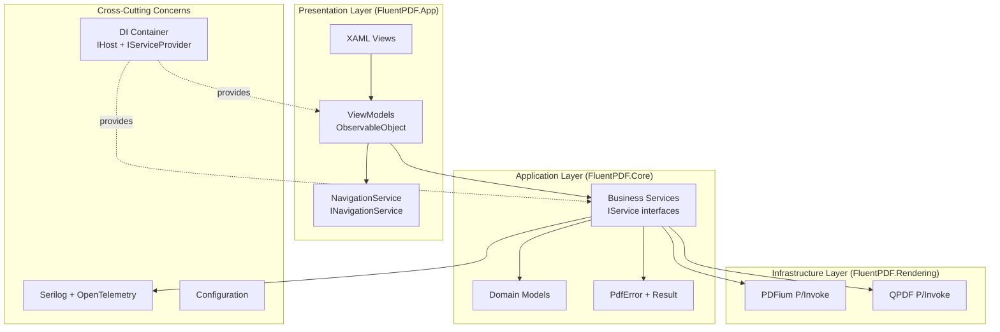
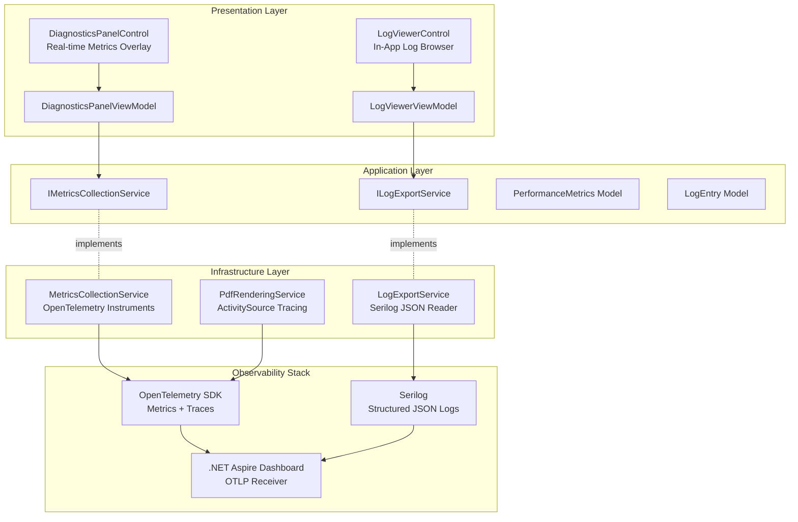
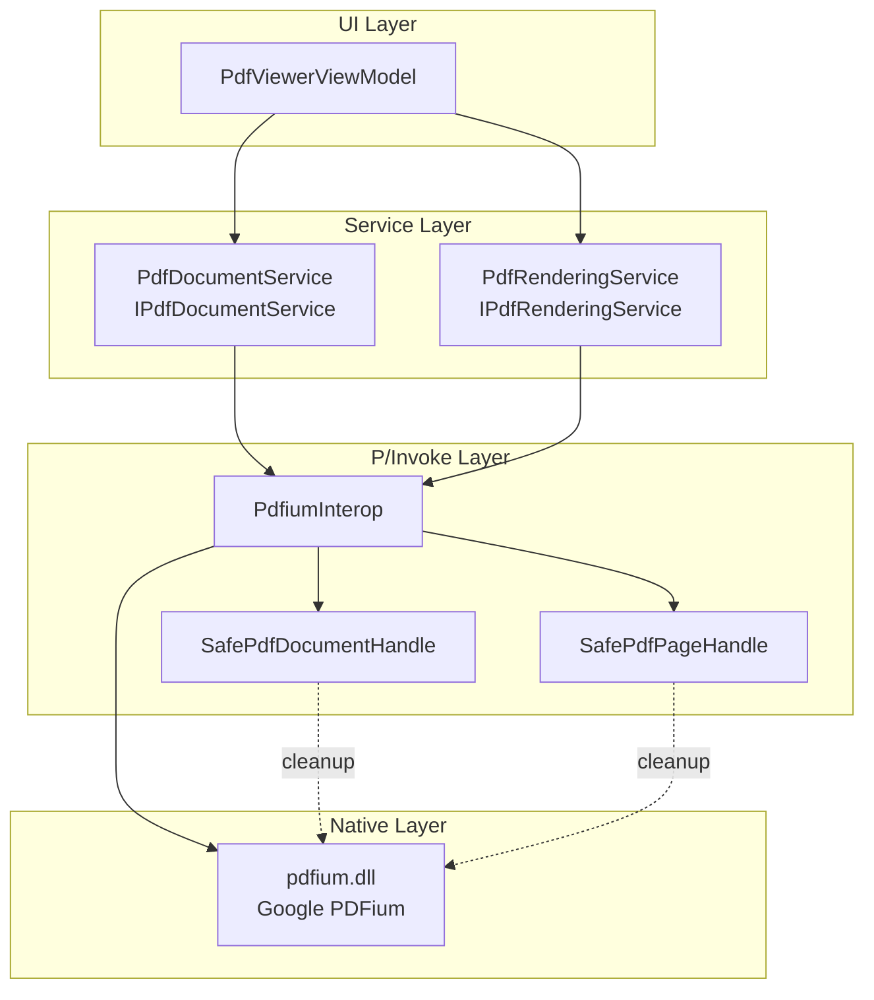
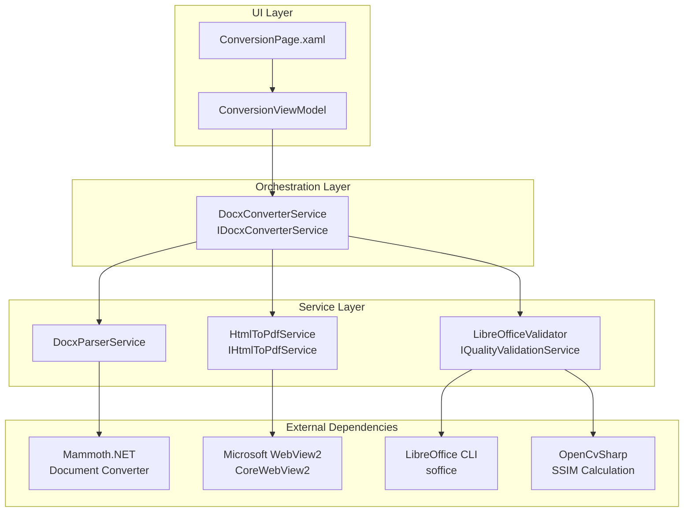
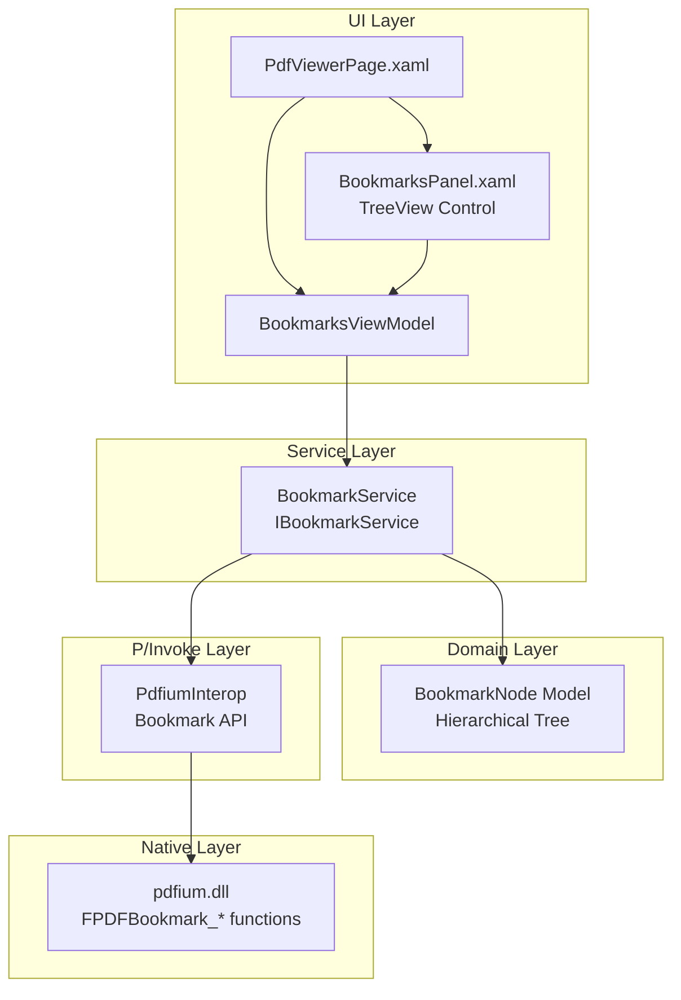
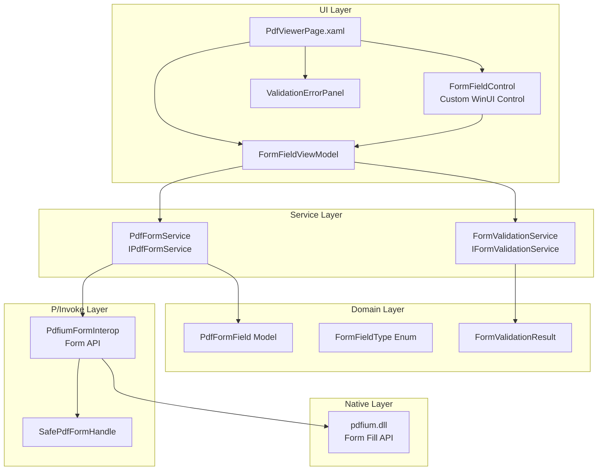
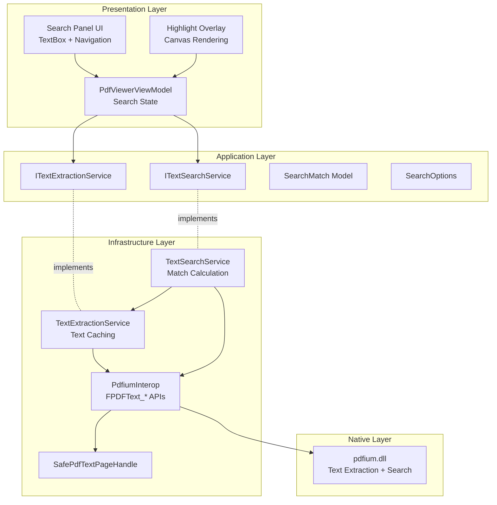
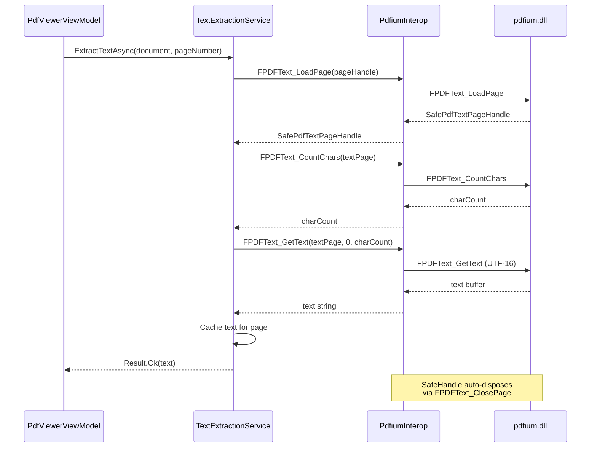
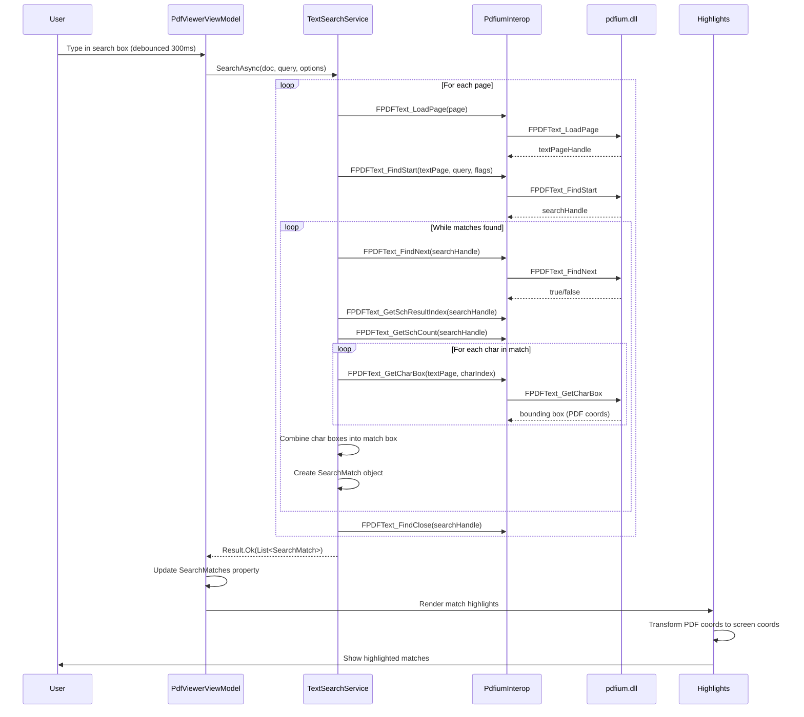
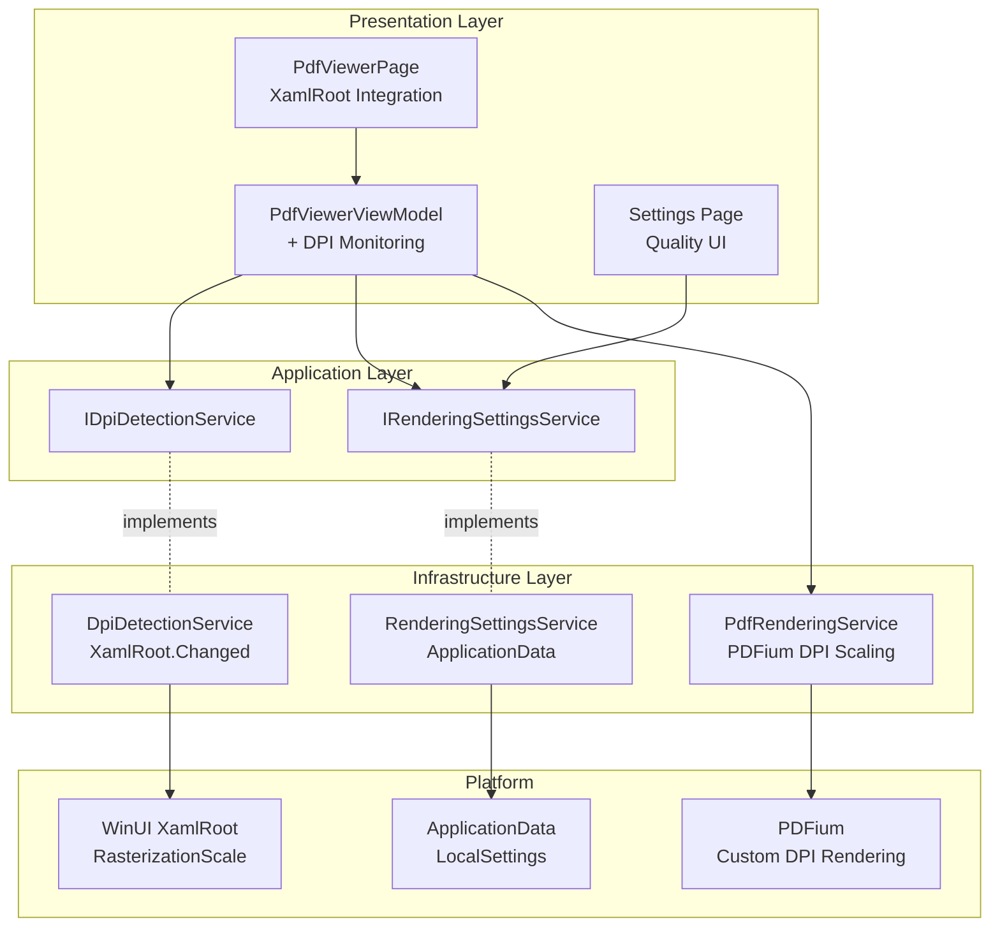

# FluentPDF Architecture

This document describes the architectural design of FluentPDF, including system overview, design decisions, and implementation patterns.

## Table of Contents

- [System Overview](#system-overview)
- [Layer Architecture](#layer-architecture)
- [Design Decisions](#design-decisions)
- [Error Handling Strategy](#error-handling-strategy)
- [Observability Infrastructure](#observability-infrastructure)
- [MVVM Pattern Implementation](#mvvm-pattern-implementation)
- [Dependency Injection](#dependency-injection)
- [Testing Strategy](#testing-strategy)
- [PDF Rendering Architecture](#pdf-rendering-architecture)
- [Office Document Conversion Architecture](#office-document-conversion-architecture)
- [Bookmarks Panel Architecture](#bookmarks-panel-architecture)
- [HiDPI Display Scaling Architecture](#hidpi-display-scaling-architecture)
- [Build and CI/CD](#build-and-cicd)

## System Overview

FluentPDF is a Windows desktop application built on WinUI 3 that provides enterprise-grade PDF viewing and manipulation capabilities. The architecture follows clean architecture principles with strict layer separation and testability as core requirements.

### High-Level Architecture Diagram



## Layer Architecture

### FluentPDF.App (Presentation Layer)

**Purpose**: WinUI 3 user interface layer implementing MVVM pattern.

**Dependencies**:
- FluentPDF.Core
- FluentPDF.Rendering
- CommunityToolkit.Mvvm
- Microsoft.Extensions.Hosting

**Key Components**:
- **Views**: XAML pages and controls with data binding
- **ViewModels**: Observable view models using source generators
- **Services**: UI-specific services (navigation, window management)
- **App.xaml.cs**: Application entry point with DI container and global exception handlers

**Rules**:
- ViewModels must inherit from `ObservableObject`
- ViewModels must end with "ViewModel" suffix
- No business logic in code-behind (only view logic)
- All navigation through `INavigationService` abstraction

### FluentPDF.Core (Application Layer)

**Purpose**: Business logic and domain models - completely UI-agnostic and headless testable.

**Dependencies**:
- FluentResults
- Serilog
- Microsoft.Extensions.Logging

**Key Components**:
- **ErrorHandling**: `PdfError`, `ErrorCategory`, `ErrorSeverity` types
- **Logging**: `SerilogConfiguration` for structured logging setup
- **Services**: Domain service interfaces (`ITelemetryService`, etc.)
- **Models**: Domain entities and value objects

**Rules**:
- ZERO UI dependencies (no `Microsoft.UI.Xaml` references)
- Must be headless testable (can run on Linux/CI without Windows runtime)
- All services must implement `I*Service` interfaces
- Use `Result<T>` pattern for error handling (no exceptions for expected failures)

### FluentPDF.Rendering (Infrastructure Layer)

**Purpose**: PDF rendering and manipulation using native libraries (PDFium, QPDF).

**Dependencies**:
- FluentPDF.Core
- PDFium (native)
- QPDF (native)

**Key Components**:
- **P/Invoke**: Native interop declarations
- **Rendering**: High-level rendering services
- **Operations**: PDF manipulation operations

**Rules**:
- Wraps native library calls with safe managed wrappers
- Returns `Result<T>` for all operations
- Must handle native memory management correctly
- Should reference Core abstractions, not implement business logic

## Design Decisions

### Decision 1: WinUI 3 over WPF

**Rationale**: WinUI 3 provides modern Fluent Design, better performance, and is Microsoft's recommended UI framework for new Windows applications.

**Alternatives Considered**:
- WPF: Mature but legacy technology, limited modern UI support
- Avalonia: Cross-platform but less native Windows integration

**Trade-offs**:
- ✅ Modern UI, better performance, official Microsoft support
- ❌ Windows-only, smaller community compared to WPF

### Decision 2: FluentResults over Exception-based Error Handling

**Rationale**: Expected failures (file not found, invalid PDF) should be handled explicitly with `Result<T>` pattern. Exceptions reserved for truly exceptional cases.

**Benefits**:
- Compiler-enforced error handling
- Rich error context with `PdfError` metadata
- AI-analyzable error patterns (structured metadata)
- Better testability (no try-catch in tests)

**Pattern**:
```csharp
public Result<PdfDocument> LoadDocument(string path)
{
    if (!File.Exists(path))
    {
        return Result.Fail(new PdfError(
            "PDF_FILE_NOT_FOUND",
            ErrorCategory.IO,
            ErrorSeverity.Error
        ).WithContext("FilePath", path));
    }

    // Success case
    return Result.Ok(document);
}
```

### Decision 3: Serilog + OpenTelemetry for Observability

**Rationale**: Structured logging with JSON format enables AI-powered log analysis and correlation across operations.

**Architecture**:
- **File Sink**: Async JSON logs to ApplicationData.LocalFolder (MSIX-compatible)
- **OTLP Sink**: Real-time telemetry to .NET Aspire Dashboard (development)
- **Enrichers**: Machine name, environment, correlation IDs, version

**Benefits**:
- AI can parse structured JSON logs for pattern detection
- Correlation IDs link related operations
- OTLP integration enables distributed tracing (future)

### Decision 4: ArchUnitNET for Architecture Enforcement

**Rationale**: Architecture tests prevent erosion of layer boundaries and naming conventions over time.

**Enforced Rules**:
- Core cannot depend on App or Rendering
- ViewModels must inherit from `ObservableObject`
- Services must implement `I*Service` interfaces
- Naming conventions (ViewModels end with "ViewModel", interfaces start with "I")

**Benefits**:
- Automated validation in CI/CD
- Prevents accidental violations
- Self-documenting architecture rules

### Decision 5: CommunityToolkit.Mvvm Source Generators

**Rationale**: Reduces boilerplate code by 70-80% compared to manual `INotifyPropertyChanged` implementation.

**Pattern**:
```csharp
// Before (manual):
private string _title;
public string Title
{
    get => _title;
    set => SetProperty(ref _title, value);
}

// After (source generators):
[ObservableProperty]
private string _title;
// Generated: public string Title property with change notification
```

**Benefits**:
- Less code to maintain
- Compile-time safety
- Consistent implementation across all ViewModels

### Decision 6: vcpkg for Native Library Management

**Rationale**: Reproducible builds of PDFium and QPDF across developer machines and CI/CD.

**Architecture**:
- `tools/build-libs.ps1`: Automated bootstrap and build script
- Binary caching for faster CI builds
- Support for x64-windows and arm64-windows

**Benefits**:
- No manual DLL management
- Reproducible builds
- Easy to update library versions

## Error Handling Strategy

FluentPDF uses a multi-layered error handling approach:

### Layer 1: Result Pattern (Expected Failures)

Used for domain-level expected failures:
- File not found
- Invalid PDF structure
- Permission denied
- Unsupported features

**Implementation**: `Result<T>` from FluentResults with custom `PdfError` type.

### Layer 2: Global Exception Handlers (Unhandled Exceptions)

Three exception handlers provide complete coverage:

1. **UI Thread Handler** (`Application.UnhandledException`):
   - Catches unhandled exceptions in UI event handlers
   - Shows user-friendly error dialog with correlation ID
   - Logs with full stack trace
   - Attempts to keep app running (`e.Handled = true`)

2. **Background Task Handler** (`TaskScheduler.UnobservedTaskException`):
   - Catches unobserved task exceptions
   - Logs with correlation ID
   - Prevents app crash (`e.SetObserved()`)

3. **AppDomain Handler** (`AppDomain.UnhandledException`):
   - Final safety net for non-UI thread exceptions
   - Logs exception before termination
   - Cannot prevent crash, but ensures logging

### Error Context and Correlation

All errors include:
- **Correlation ID**: Unique GUID for linking related operations
- **Category**: Error classification (IO, Rendering, Validation, etc.)
- **Severity**: Error severity (Critical, Error, Warning, Info)
- **Context Dictionary**: Arbitrary metadata (file path, page number, etc.)
- **Timestamp**: When error occurred
- **Stack Trace**: For debugging (in logs, not shown to user)

## Observability Infrastructure

FluentPDF implements comprehensive observability through three integrated layers: development-time monitoring (.NET Aspire Dashboard), in-app diagnostics (real-time performance overlay), and structured log viewing (in-app log browser). See [OBSERVABILITY.md](OBSERVABILITY.md) for detailed usage guide.

### Architecture Overview



### Structured Logging with Serilog

**Configuration** (`SerilogConfiguration.CreateLogger()`):

```csharp
Log.Logger = new LoggerConfiguration()
    .MinimumLevel.Debug()
    .Enrich.FromLogContext()              // Correlation IDs
    .Enrich.WithProperty("Application", "FluentPDF")
    .Enrich.WithProperty("Version", version)
    .Enrich.WithMachineName()
    .Enrich.WithEnvironmentName()
    .WriteTo.Async(a => a.File(
        new JsonFormatter(),
        path: ApplicationData.Current.LocalFolder.Path + "/logs/log-.json",
        rollingInterval: RollingInterval.Day,
        retainedFileCountLimit: 7
    ))
    .WriteTo.OpenTelemetry(opts => {
        opts.Endpoint = "http://localhost:4317";
        opts.Protocol = OtlpProtocol.Grpc;
        opts.ResourceAttributes = new Dictionary<string, object>
        {
            ["service.name"] = "FluentPDF.Desktop",
            ["service.version"] = version
        };
    })
    .CreateLogger();
```

**Log File Format**: Serilog JSON (newline-delimited JSON objects):
```json
{
  "@t": "2026-01-11T14:32:15.1234567Z",
  "@l": "Information",
  "@mt": "Rendering page {PageNumber} at zoom {ZoomLevel}",
  "PageNumber": 42,
  "ZoomLevel": 1.5,
  "CorrelationId": "3f7b8c9d-e21a-4f5d-a6c8-1b2e3d4a5f6g",
  "Application": "FluentPDF",
  "Version": "1.0.0"
}
```

### OpenTelemetry Metrics Collection

**Metrics Service** (`MetricsCollectionService`):

```csharp
public class MetricsCollectionService : IMetricsCollectionService
{
    private readonly Meter _meter;
    private readonly ObservableGauge<double> _fpsGauge;
    private readonly ObservableGauge<long> _managedMemoryGauge;
    private readonly ObservableGauge<long> _nativeMemoryGauge;
    private readonly Histogram<double> _renderTimeHistogram;

    public MetricsCollectionService(IMeterFactory meterFactory)
    {
        _meter = meterFactory.Create("FluentPDF.Rendering");

        _fpsGauge = _meter.CreateObservableGauge<double>(
            "fluentpdf.rendering.fps",
            () => new Measurement<double>(_currentFPS));

        _renderTimeHistogram = _meter.CreateHistogram<double>(
            "fluentpdf.rendering.render_time",
            unit: "ms");
    }

    public void RecordRenderTime(int pageNumber, double milliseconds)
    {
        _renderTimeHistogram.Record(milliseconds,
            new KeyValuePair<string, object?>("page.number", pageNumber));
    }
}
```

**OpenTelemetry Configuration** (`App.xaml.cs`):

```csharp
services.AddOpenTelemetry()
    .WithMetrics(metrics => metrics
        .AddMeter("FluentPDF.Rendering")
        .AddOtlpExporter(options =>
        {
            options.Endpoint = new Uri("http://localhost:4317");
            options.Protocol = OtlpExportProtocol.Grpc;
        }))
    .WithTracing(tracing => tracing
        .AddSource("FluentPDF.Rendering")
        .SetResourceBuilder(ResourceBuilder.CreateDefault()
            .AddService("FluentPDF.Desktop", serviceVersion: "1.0.0"))
        .AddOtlpExporter());
```

### Distributed Tracing

**Instrumentation** (`PdfRenderingService`):

```csharp
private readonly ActivitySource _activitySource = new("FluentPDF.Rendering");

public async Task<Result<BitmapImage>> RenderPageAsync(int pageNumber, double zoomLevel)
{
    using var activity = _activitySource.StartActivity("RenderPage");
    activity?.SetTag("page.number", pageNumber);
    activity?.SetTag("zoom.level", zoomLevel);

    var correlationId = Guid.NewGuid().ToString();
    activity?.SetTag("correlation.id", correlationId);

    try
    {
        using var loadActivity = _activitySource.StartActivity("LoadPage");
        // ... load page code ...

        using var renderActivity = _activitySource.StartActivity("RenderBitmap");
        // ... render code ...

        using var convertActivity = _activitySource.StartActivity("ConvertToImage");
        // ... convert code ...

        activity?.SetTag("render.time.ms", stopwatch.ElapsedMilliseconds);
        return Result.Ok(image);
    }
    catch (Exception ex)
    {
        activity?.SetStatus(ActivityStatusCode.Error, ex.Message);
        activity?.RecordException(ex);
        throw;
    }
}
```

**Trace Hierarchy**:
```
RenderPage (parent span)
├── LoadPage (child span)
├── RenderBitmap (child span)
└── ConvertToImage (child span)
```

**Span Attributes**:
- `page.number`: Page being rendered
- `zoom.level`: Current zoom factor
- `correlation.id`: Unique operation identifier
- `render.time.ms`: Total render duration

### In-App Diagnostics Panel

**Architecture**:
- **Control**: `DiagnosticsPanelControl.xaml` - Acrylic overlay with metrics display
- **ViewModel**: `DiagnosticsPanelViewModel` - Periodic metrics polling (500ms interval)
- **Service**: `IMetricsCollectionService` - Metrics collection and export

**Keyboard Shortcut**: `Ctrl+Shift+D` toggles diagnostics panel visibility

**Displayed Metrics**:
| Metric | Update Frequency | Color Coding |
|--------|------------------|--------------|
| FPS (Frames Per Second) | 500ms | Green: ≥30, Yellow: 15-30, Red: <15 |
| Memory (Managed + Native) | 500ms | Green: <500MB, Yellow: 500-1000MB, Red: >1000MB |
| Last Render Time | Per render | N/A |
| Current Page Number | Per navigation | N/A |

**Performance Level Calculation**:
```csharp
public enum PerformanceLevel
{
    Good,      // FPS ≥ 30 AND Memory < 500MB
    Warning,   // FPS 15-30 OR Memory 500-1000MB
    Critical   // FPS < 15 OR Memory > 1000MB
}

public static PerformanceLevel CalculateLevel(double fps, long totalMemoryMB)
{
    if (fps < 15 || totalMemoryMB > 1000) return PerformanceLevel.Critical;
    if (fps < 30 || totalMemoryMB > 500) return PerformanceLevel.Warning;
    return PerformanceLevel.Good;
}
```

**Metrics Export**: JSON and CSV formats supported
```json
[
  {
    "CurrentFPS": 60.0,
    "ManagedMemoryMB": 128,
    "NativeMemoryMB": 256,
    "TotalMemoryMB": 384,
    "LastRenderTimeMs": 16.7,
    "CurrentPageNumber": 42,
    "Timestamp": "2026-01-11T14:32:15.1234567Z",
    "Level": "Good"
  }
]
```

### Structured Log Viewer

**Architecture**:
- **Control**: `LogViewerControl.xaml` - ListView with filtering UI
- **ViewModel**: `LogViewerViewModel` - Filter application and log export
- **Service**: `ILogExportService` - Serilog JSON file reading

**Keyboard Shortcut**: `Ctrl+Shift+L` opens log viewer dialog

**Filter Options**:
1. **Severity Level**: Minimum log level (Trace, Debug, Info, Warning, Error, Critical)
2. **Correlation ID**: Exact match for operation tracing
3. **Component**: Prefix match on namespace (e.g., "FluentPDF.Rendering")
4. **Time Range**: Start and end timestamps
5. **Search Text**: Case-insensitive message search (debounced 500ms)

**Log Entry Model**:
```csharp
public class LogEntry
{
    public required DateTime Timestamp { get; init; }
    public required LogLevel Level { get; init; }
    public required string Message { get; init; }
    public string? CorrelationId { get; init; }
    public required string Component { get; init; }
    public Dictionary<string, object> Context { get; init; } = new();
    public string? Exception { get; init; }
    public string? StackTrace { get; init; }
}
```

**Performance Optimizations**:
- **LRU Cache**: Last 10,000 parsed log entries cached in memory
- **Streaming**: Large log files read in chunks (not fully loaded)
- **Virtualization**: ListView only renders visible items
- **Background Filtering**: Filters applied on background thread

### Correlation ID Tracing

**End-to-End Tracing Workflow**:

1. **Generation**: Unique GUID created per rendering operation
2. **Propagation**: Flows through all components:
   - Distributed tracing spans (OpenTelemetry)
   - Structured logs (Serilog)
   - Metrics tags (OpenTelemetry Instruments)
3. **Filtering**:
   - Aspire Dashboard: Filter logs/traces by correlation ID
   - In-app log viewer: Exact match correlation ID filter
4. **Debugging**: Click correlation ID in log viewer → copy to clipboard → paste in Aspire Dashboard

**Example Correlation Flow**:
```
User renders page 42
  ↓
Generate CorrelationId: "3f7b8c9d-e21a-4f5d-a6c8-1b2e3d4a5f6g"
  ↓
OpenTelemetry span: RenderPage
  │ - tag: correlation.id = "3f7b8c9d..."
  ├── span: LoadPage
  ├── span: RenderBitmap
  └── span: ConvertToImage
  ↓
Serilog logs (all include CorrelationId property):
  - "Loading page 42" (Info)
  - "Rendering bitmap at zoom 1.5" (Debug)
  - "Render completed in 16.7ms" (Info)
  ↓
Aspire Dashboard / In-app Log Viewer:
  - Filter by "3f7b8c9d..." to see complete operation trace
```

### .NET Aspire Dashboard Integration

**Development Setup**:
```bash
# Start Aspire Dashboard (docker-compose)
docker-compose -f tools/docker-compose-aspire.yml up -d

# Access dashboard
http://localhost:18888
```

**Dashboard Features**:
- **Metrics View**: Real-time FPS, memory, render times (histograms, gauges)
- **Logs View**: Structured logs with correlation ID, severity, component filtering
- **Traces View**: Distributed traces with span hierarchy and attributes

**Graceful Fallback**: If Aspire not running, OTLP exporter silently drops data. App continues normally with file-based logging.

### Metrics History and Export

**Circular Buffer**: Last 1000 metrics samples retained in memory (O(1) insertion)

**Export Formats**:
- **JSON**: Structured metrics with full metadata (import into analysis tools)
- **CSV**: Tabular format for Excel/Power BI/pandas

**Use Cases**:
- Performance regression testing (compare metrics across versions)
- Capacity planning (analyze memory growth over time)
- SLA reporting (FPS distribution, P95/P99 render times)

## MVVM Pattern Implementation

### ViewModel Structure

```csharp
public partial class MainViewModel : ObservableObject
{
    // Observable properties (source generator)
    [ObservableProperty]
    private string _title = "FluentPDF";

    [ObservableProperty]
    private bool _isLoading;

    // Commands (source generator)
    [RelayCommand]
    private async Task LoadDocumentAsync()
    {
        IsLoading = true;
        // Load document
        IsLoading = false;
    }

    [RelayCommand(CanExecute = nameof(CanSave))]
    private void Save()
    {
        // Save logic
    }

    private bool CanSave() => !IsLoading;

    // Constructor with DI
    public MainViewModel(ILogger<MainViewModel> logger)
    {
        _logger = logger;
    }
}
```

### View Binding

```xml
<Page x:Name="RootPage">
    <Page.DataContext>
        <!-- Set in code-behind via DI -->
    </Page.DataContext>

    <StackPanel>
        <TextBlock Text="{Binding Title}" />
        <Button Command="{Binding LoadDocumentCommand}"
                Content="Load Document" />
        <Button Command="{Binding SaveCommand}"
                Content="Save"
                IsEnabled="{Binding SaveCommand.CanExecute}" />
    </StackPanel>
</Page>
```

## Dependency Injection

### Container Configuration (App.xaml.cs)

```csharp
private readonly IHost _host;

public App()
{
    InitializeComponent();

    _host = Host.CreateDefaultBuilder()
        .ConfigureServices((context, services) =>
        {
            // ViewModels (transient - new instance per request)
            services.AddTransient<MainViewModel>();

            // Services (singleton - shared across app)
            services.AddSingleton<INavigationService, NavigationService>();
            services.AddSingleton<ITelemetryService, TelemetryService>();

            // Logging
            services.AddLogging(builder => builder.AddSerilog(dispose: true));
        })
        .Build();
}

public T GetService<T>() where T : class
    => _host.Services.GetRequiredService<T>();
```

### Service Resolution

```csharp
// In Window or Page code-behind
var viewModel = ((App)Application.Current).GetService<MainViewModel>();
RootPage.DataContext = viewModel;
```

## Multi-Tab and Recent Files Architecture

### Overview

FluentPDF implements a multi-document interface (MDI) using WinUI 3's TabView control, allowing users to work with multiple PDF files simultaneously. The architecture integrates with Windows features including the Jump List for quick access to recent files.

### Key Components

#### 1. TabViewModel (Per-Tab State Management)

```csharp
public class TabViewModel : ObservableObject, IDisposable
{
    private readonly string _filePath;
    private readonly PdfViewerViewModel _viewerViewModel;
    private bool _isActive;

    public string FilePath => _filePath;
    public string FileName => Path.GetFileName(_filePath);
    public PdfViewerViewModel ViewerViewModel => _viewerViewModel;
    public bool IsActive => _isActive;

    public void Activate() => _isActive = true;
    public void Deactivate() => _isActive = false;
}
```

**Responsibilities:**
- Wraps PdfViewerViewModel with tab-specific metadata (file path, name)
- Tracks active/inactive state for tab UI and lifecycle management
- Manages disposal of viewer resources when tab is closed

#### 2. MainViewModel (Tab Orchestration)

```csharp
public partial class MainViewModel : ObservableObject, IDisposable
{
    private readonly IRecentFilesService _recentFilesService;
    private readonly IServiceProvider _serviceProvider;

    public ObservableCollection<TabViewModel> Tabs { get; }

    [ObservableProperty]
    private TabViewModel? _activeTab;

    [RelayCommand]
    private async Task OpenFileInNewTabAsync() { /* ... */ }

    [RelayCommand]
    private async Task OpenRecentFileAsync(string filePath) { /* ... */ }

    [RelayCommand]
    private void CloseTab(TabViewModel tab) { /* ... */ }
}
```

**Responsibilities:**
- Manages collection of open tabs (ObservableCollection<TabViewModel>)
- Handles tab activation, switching, and closing logic
- Prevents duplicate tabs for the same file (activates existing tab)
- Integrates with RecentFilesService to update recent files list
- Provides commands for UI binding (open, close, recent files)

#### 3. RecentFilesService (Persistence and MRU Management)

```csharp
public sealed class RecentFilesService : IRecentFilesService, IDisposable
{
    private const int MaxRecentFiles = 10;
    private readonly List<RecentFileEntry> _recentFiles;
    private readonly ApplicationDataContainer _settings;

    public IReadOnlyList<RecentFileEntry> GetRecentFiles();
    public void AddRecentFile(string filePath);
    public void RemoveRecentFile(string filePath);
    public void ClearRecentFiles();
}
```

**Responsibilities:**
- Persists recent files to Windows.Storage.ApplicationData.LocalSettings
- Maintains MRU (Most Recently Used) ordering
- Enforces 10-item limit per Windows guidelines
- Validates file existence on load (removes deleted files)
- Case-insensitive duplicate detection

**Persistence Format:**
```json
{
  "RecentFiles": "[
    {\"FilePath\":\"C:\\\\Docs\\\\file.pdf\",\"LastAccessed\":\"2026-01-11T00:00:00Z\"},
    {\"FilePath\":\"C:\\\\Docs\\\\other.pdf\",\"LastAccessed\":\"2026-01-10T23:00:00Z\"}
  ]"
}
```

#### 4. JumpListService (Windows Taskbar Integration)

```csharp
public sealed class JumpListService
{
    private const int MaxJumpListItems = 10;

    public async Task UpdateJumpListAsync(IReadOnlyList<RecentFileEntry> recentFiles);
    public async Task ClearJumpListAsync();
}
```

**Responsibilities:**
- Updates Windows Jump List with recent files
- Creates jump list items with file paths as launch arguments
- Groups items under "Recent" category
- Handles errors gracefully to prevent UI disruption

**Windows Integration:**
```csharp
var item = JumpListItem.CreateWithArguments(
    file.FilePath,           // Launch argument
    file.DisplayName);       // Display text

item.Description = file.FilePath;
item.GroupName = "Recent";
jumpList.Items.Add(item);
await jumpList.SaveAsync();
```

### Data Flow

#### Opening a File in New Tab

```
User clicks "Open File"
  ↓
MainViewModel.OpenFileInNewTabAsync()
  ↓
Check if file already open → Activate existing tab (early return)
  ↓
Create PdfViewerViewModel (via DI)
  ↓
Create TabViewModel(filePath, viewerViewModel)
  ↓
Add to Tabs collection → UI updates (TabView)
  ↓
Activate tab (sets ActiveTab property)
  ↓
Load document → viewerViewModel.OpenDocumentAsync()
  ↓
Update recent files → _recentFilesService.AddRecentFile(filePath)
  ↓
Recent files persisted → ApplicationData.LocalSettings
  ↓
Update Jump List → JumpListService.UpdateJumpListAsync()
```

#### Opening from Recent Files / Jump List

```
User clicks recent file (menu or Jump List)
  ↓
MainViewModel.OpenRecentFileAsync(filePath)
  ↓
Validate file exists → Remove from recent if deleted
  ↓
Call OpenFileInTabAsync(filePath)
  ↓
(Same flow as "Opening a File in New Tab")
```

#### Closing a Tab

```
User clicks tab close button
  ↓
MainViewModel.CloseTabCommand.Execute(tab)
  ↓
Deactivate tab if active
  ↓
Activate next/previous tab (if available)
  ↓
Remove from Tabs collection
  ↓
Dispose tab → tab.Dispose()
  ↓
Dispose viewer → viewerViewModel.Dispose()
  ↓
Release PDF document resources
```

### UI Architecture

#### MainWindow.xaml TabView Binding

```xml
<TabView
    TabItemsSource="{x:Bind ViewModel.Tabs, Mode=OneWay}"
    SelectedItem="{x:Bind ViewModel.ActiveTab, Mode=TwoWay}"
    TabCloseRequested="OnTabCloseRequested">

    <TabView.TabItemTemplate>
        <DataTemplate x:DataType="viewmodels:TabViewModel">
            <TabViewItem Header="{x:Bind FileName, Mode=OneWay}">
                <controls:PdfViewerControl
                    ViewerViewModel="{x:Bind ViewerViewModel, Mode=OneWay}" />
            </TabViewItem>
        </DataTemplate>
    </TabView.TabItemTemplate>
</TabView>
```

#### Recent Files Menu (Dynamic)

```csharp
// MainWindow.xaml.cs - Loaded event
private void UpdateRecentFilesMenu()
{
    RecentFilesSubMenu.Items.Clear();

    var recentFiles = ViewModel.GetRecentFiles();
    foreach (var file in recentFiles)
    {
        var item = new MenuFlyoutItem
        {
            Text = file.DisplayName,
            Command = ViewModel.OpenRecentFileCommand,
            CommandParameter = file.FilePath
        };
        RecentFilesSubMenu.Items.Add(item);
    }
}
```

### Memory Management

#### Tab Lifecycle

1. **Tab Creation**: PdfViewerViewModel created via DI with fresh dependencies
2. **Tab Active**: Document loaded, rendering pipeline active
3. **Tab Inactive**: Document remains loaded but not rendering
4. **Tab Close**: Explicit disposal chain:
   - TabViewModel.Dispose() → PdfViewerViewModel.Dispose()
   - PdfViewerViewModel.Dispose() → DocumentService.CloseDocument()
   - DocumentService.CloseDocument() → SafePdfDocumentHandle.Dispose()
   - SafeHandle releases native PDFium resources

#### Preventing Memory Leaks

- **ObservableCollection**: Tabs collection cleared on MainViewModel.Dispose()
- **Event Handlers**: TabView bindings use x:Bind (compiled, weak references)
- **IDisposable Pattern**: All ViewModels implement IDisposable for explicit cleanup
- **SafeHandles**: PDFium resources wrapped in SafeHandles for deterministic release

### Error Handling

#### File Opening Errors

```csharp
private async Task OpenFileInTabAsync(string filePath)
{
    try
    {
        var viewerViewModel = _serviceProvider.GetRequiredService<PdfViewerViewModel>();
        var tabViewModel = new TabViewModel(filePath, viewerViewModel, _tabLogger);

        Tabs.Add(tabViewModel);
        ActivateTab(tabViewModel);

        await viewerViewModel.OpenDocumentAsync();
        _recentFilesService.AddRecentFile(filePath);
    }
    catch (Exception ex)
    {
        _logger.LogError(ex, "Failed to open file in tab: {FilePath}", filePath);
        throw; // UI layer shows error dialog
    }
}
```

#### Jump List Errors

```csharp
public async Task UpdateJumpListAsync(IReadOnlyList<RecentFileEntry> recentFiles)
{
    try
    {
        var jumpList = await JumpList.LoadCurrentAsync();
        jumpList.Items.Clear();

        foreach (var file in recentFiles.Take(MaxJumpListItems))
        {
            try
            {
                var item = JumpListItem.CreateWithArguments(file.FilePath, file.DisplayName);
                jumpList.Items.Add(item);
            }
            catch (Exception ex)
            {
                _logger.LogWarning(ex, "Failed to add Jump List item: {FilePath}", file.FilePath);
                // Continue with remaining items
            }
        }

        await jumpList.SaveAsync();
    }
    catch (Exception ex)
    {
        _logger.LogError(ex, "Failed to update Jump List");
        // Do not throw - Jump List is optional feature
    }
}
```

### Testing Strategy

#### Unit Tests

**TabViewModel Tests** (`tests/FluentPDF.App.Tests/ViewModels/TabViewModelTests.cs`):
- Initialization with file path and viewer
- Activation/deactivation state transitions
- Disposal of viewer resources

**MainViewModel Tests** (`tests/FluentPDF.App.Tests/ViewModels/MainViewModelTests.cs`):
- Tab creation and activation
- Closing tabs with proper activation logic
- Recent files integration
- Disposal of all tabs

**RecentFilesService Tests** (`tests/FluentPDF.App.Tests/Services/RecentFilesServiceTests.cs`):
- MRU ordering with timestamps
- Persistence to ApplicationData.LocalSettings
- 10-item limit enforcement
- Case-insensitive duplicate detection
- Validation of file existence on load

**JumpListService Tests** (`tests/FluentPDF.App.Tests/Services/JumpListServiceTests.cs`):
- Jump List creation with recent files
- 10-item limit enforcement
- Error handling for malformed data

#### Integration Tests

**TabManagementIntegrationTests** (`tests/FluentPDF.App.Tests/Integration/TabManagementIntegrationTests.cs`):
- Opening multiple files creates multiple tabs
- Opening same file twice activates existing tab
- Closing active tab activates next tab
- Recent files persist across service instances
- Jump List updates with recent files
- End-to-end workflow (open, close, persist, restore)

### Architecture Rules (ArchUnitNET)

```csharp
[Fact]
public void TabViewModel_ShouldNotDependOn_Services()
{
    var rule = Classes()
        .That().Are(typeof(TabViewModel))
        .Should().NotDependOnAny(
            Classes().That().ResideInNamespace("FluentPDF.Core.Services"))
        .Because("TabViewModel is a lightweight wrapper, services are injected into MainViewModel");

    rule.Check(Architecture);
}

[Fact]
public void RecentFilesService_ShouldNotDependOn_ViewModels()
{
    var rule = Classes()
        .That().Are(typeof(RecentFilesService))
        .Should().NotDependOnAny(
            Classes().That().ResideInNamespace("FluentPDF.App.ViewModels"))
        .Because("Services must be UI-agnostic for reusability");

    rule.Check(Architecture);
}
```

### Dependency Injection Registration

```csharp
// App.xaml.cs
services.AddSingleton<IRecentFilesService, RecentFilesService>();
services.AddSingleton<JumpListService>();
services.AddTransient<MainViewModel>();
services.AddTransient<TabViewModel>(); // Factory pattern via MainViewModel
services.AddTransient<PdfViewerViewModel>();
```

### Performance Characteristics

- **Tab Switching**: O(1) - Direct property assignment, no document reload
- **Recent Files Lookup**: O(n) where n ≤ 10 - Linear search acceptable
- **Jump List Update**: Async operation, does not block UI
- **Tab Close**: Synchronous disposal, < 100ms for document cleanup

### Future Enhancements

1. **Tab Drag & Drop**: Reorder tabs, drag out to new window
2. **Tab Groups**: Group related documents (e.g., by folder)
3. **Session Restore**: Reopen tabs from last session on app launch
4. **Tab Previews**: Thumbnail previews on hover
5. **Keyboard Shortcuts**: Ctrl+Tab (next tab), Ctrl+Shift+Tab (previous tab)

### References

- [WinUI 3 TabView Documentation](https://learn.microsoft.com/en-us/windows/apps/design/controls/tab-view)
- [Windows Jump Lists](https://learn.microsoft.com/en-us/windows/apps/design/shell/tiles-and-notifications/jump-lists)
- [ApplicationData.LocalSettings](https://learn.microsoft.com/en-us/uwp/api/windows.storage.applicationdata.localsettings)

## Testing Strategy

### Test Project Structure

```
tests/
├── FluentPDF.Architecture.Tests/  # ArchUnitNET rules
│   ├── LayerTests.cs              # Dependency rules
│   ├── NamingTests.cs             # Naming conventions
│   └── InterfaceTests.cs          # Interface patterns
├── FluentPDF.Core.Tests/          # Unit tests (headless)
│   ├── ErrorHandling/             # PdfError tests
│   ├── Logging/                   # Logging config tests
│   └── ViewModels/                # ViewModel tests (headless)
└── FluentPDF.App.Tests/           # UI tests
    └── Views/                     # FlaUI automation tests
```

### Testing Principles

1. **Core is Headless Testable**: Core.Tests must run on Linux without WinUI runtime
2. **Architecture Tests in CI**: ArchUnitNET tests run on every PR
3. **High Coverage**: 80% minimum, 90% for critical paths
4. **Fast Feedback**: Unit tests complete in < 5 seconds

### Architecture Test Example

```csharp
[Fact]
public void CoreLayer_ShouldNot_DependOn_AppLayer()
{
    var rule = Classes()
        .That().ResideInNamespace("FluentPDF.Core")
        .Should().NotDependOnAny(Classes().That().ResideInNamespace("FluentPDF.App"))
        .Because("Core must be UI-agnostic for testability");

    rule.Check(Architecture);
}
```

## PDF Rendering Architecture

The PDF rendering subsystem integrates PDFium (Google's PDF rendering engine) through a carefully designed P/Invoke layer with enterprise-grade error handling and resource management.

### PDFium Integration Overview



### Component Breakdown

#### 1. PdfiumInterop (Low-Level P/Invoke)

**Location**: `FluentPDF.Rendering/Interop/PdfiumInterop.cs`

**Responsibilities**:
- DllImport declarations for PDFium C API
- Library initialization and shutdown
- Error code translation
- Safe handle management

**Key Methods**:
```csharp
public class PdfiumInterop
{
    public bool Initialize();                                    // FPDF_InitLibrary
    public void Shutdown();                                      // FPDF_DestroyLibrary
    public SafePdfDocumentHandle LoadDocument(string path);      // FPDF_LoadDocument
    public int GetPageCount(SafePdfDocumentHandle doc);          // FPDF_GetPageCount
    public SafePdfPageHandle LoadPage(SafePdfDocumentHandle doc, int index);
    public double GetPageWidth(SafePdfPageHandle page);          // FPDF_GetPageWidth
    public double GetPageHeight(SafePdfPageHandle page);         // FPDF_GetPageHeight
    public IntPtr CreateBitmap(int width, int height);           // FPDFBitmap_Create
    public void RenderPageBitmap(IntPtr bitmap, SafePdfPageHandle page, ...);
}
```

**Design Patterns**:
- **SafeHandle Pattern**: All native pointers wrapped in `SafeHandleZeroOrMinusOneIsInvalid`
- **Singleton Initialization**: PDFium initialized once per app lifetime
- **Deterministic Cleanup**: Automatic handle release via `ReleaseHandle()`

#### 2. SafeHandle Types

**SafePdfDocumentHandle**:
```csharp
public class SafePdfDocumentHandle : SafeHandleZeroOrMinusOneIsInvalid
{
    protected override bool ReleaseHandle()
    {
        FPDF_CloseDocument(handle);  // Called by GC or explicit Dispose
        return true;
    }
}
```

**SafePdfPageHandle**: Similar pattern for page handles.

**Benefits**:
- Prevents handle leaks (automatic cleanup)
- Exception-safe (cleanup even during unwinding)
- Interop-safe (P/Invoke recognizes SafeHandle)

#### 3. PdfDocumentService (Business Logic)

**Location**: `FluentPDF.Rendering/Services/PdfDocumentService.cs`

**Responsibilities**:
- PDF file validation and loading
- Document metadata extraction (page count, file size)
- Error handling with `Result<T>` pattern
- Structured logging with correlation IDs

**Error Codes**:
- `PDF_FILE_NOT_FOUND`: File path does not exist
- `PDF_INVALID_FORMAT`: Not a valid PDF file
- `PDF_CORRUPTED`: Damaged PDF structure
- `PDF_REQUIRES_PASSWORD`: Password-protected PDF
- `PDF_LOAD_FAILED`: Generic loading failure

**Example Flow**:
```
User -> ViewModel.OpenDocumentAsync()
  -> DocumentService.LoadDocumentAsync(path)
    -> Validate file exists
    -> PdfiumInterop.LoadDocument(path)
      -> FPDF_LoadDocument (native call)
    <- SafePdfDocumentHandle
    -> Get page count, file size
  <- Result<PdfDocument>
```

#### 4. PdfRenderingService (Rendering Pipeline)

**Location**: `FluentPDF.Rendering/Services/PdfRenderingService.cs`

**Responsibilities**:
- Page rendering at specified zoom/DPI
- Bitmap creation and conversion to BitmapImage
- Performance monitoring (log warnings for slow renders)
- Memory management (immediate bitmap disposal)

**Rendering Pipeline**:
```
1. Validate page number
2. Load page handle (FPDF_LoadPage)
3. Get page dimensions
4. Calculate output size: (width * dpi/72 * zoom, height * dpi/72 * zoom)
5. Create bitmap (FPDFBitmap_Create)
6. Render page to bitmap (FPDF_RenderPageBitmap with antialiasing)
7. Convert bitmap to BitmapImage (Windows.Graphics.Imaging)
8. Dispose bitmap handle
9. Close page handle
10. Return Result<BitmapImage>
```

**Performance Thresholds**:
- Warning logged if rendering > 2 seconds
- Error logged if rendering > 5 seconds

#### 5. PdfViewerViewModel (Presentation Logic)

**Location**: `FluentPDF.App/ViewModels/PdfViewerViewModel.cs`

**Responsibilities**:
- UI state management (current page, zoom level, loading state)
- Command implementation (OpenDocument, NextPage, ZoomIn, etc.)
- Data binding support via `INotifyPropertyChanged`
- Error presentation to user

**Observable Properties**:
- `CurrentPageImage: BitmapImage?`
- `CurrentPageNumber: int`
- `TotalPages: int`
- `ZoomLevel: double`
- `IsLoading: bool`
- `StatusMessage: string`

**Commands with CanExecute Logic**:
- `OpenDocumentCommand`: Always enabled
- `GoToNextPageCommand`: Enabled if CurrentPage < TotalPages && !IsLoading
- `GoToPreviousPageCommand`: Enabled if CurrentPage > 1 && !IsLoading
- `ZoomInCommand`: Enabled if ZoomLevel < 2.0 && !IsLoading
- `ZoomOutCommand`: Enabled if ZoomLevel > 0.5 && !IsLoading

### Memory Management Strategy

**Problem**: PDFium uses unmanaged memory for documents, pages, and bitmaps. Leaks cause OOM.

**Solution**:
1. **SafeHandle for Documents and Pages**: Automatic cleanup via finalizer
2. **Immediate Bitmap Disposal**: Bitmaps disposed immediately after conversion to BitmapImage
3. **Explicit Document Disposal**: ViewModel implements `IDisposable` to close document on navigation away
4. **GC.SuppressFinalize**: After explicit disposal to prevent double-cleanup

**Memory Lifecycle**:
```
LoadDocument -> SafePdfDocumentHandle created
  RenderPage -> SafePdfPageHandle created
               -> Bitmap created
               -> Convert to BitmapImage
               -> Bitmap.Dispose() [IMMEDIATE]
               -> PageHandle.Dispose() [IMMEDIATE]
  CloseDocument -> DocumentHandle.Dispose()
                -> FPDF_CloseDocument(native handle)
                -> GC.SuppressFinalize(this)
```

### Error Handling Layers

**Layer 1: Native Error Codes**
- PDFium returns error codes via `FPDF_GetLastError()`
- PdfiumInterop translates to PdfError with error category

**Layer 2: Result Pattern**
- Services return `Result<T>` instead of throwing exceptions
- Errors include context (file path, page number, correlation ID)

**Layer 3: ViewModel Error Presentation**
- Failed Results logged with correlation ID
- User sees friendly message in UI
- StatusMessage updated (e.g., "Failed to render page")

**Layer 4: Global Exception Handlers**
- Catch unhandled exceptions in rendering pipeline
- Log to Serilog with full stack trace
- Show error dialog to user

### Performance Optimizations

1. **Async Rendering**: All PDFium calls on background threads via `Task.Run`
2. **Bitmap Caching**: (Future) Cache rendered bitmaps for recently viewed pages
3. **Progressive Rendering**: (Future) Render low-res preview first, then high-res
4. **Double Buffering**: WinUI handles bitmap display optimization

### Architecture Rules (ArchUnitNET)

```csharp
// Rule 1: P/Invoke only in Rendering.Interop namespace
[Fact]
public void PInvoke_ShouldOnly_ExistIn_RenderingNamespace()
{
    var rule = Methods()
        .That().HaveAttribute<DllImportAttribute>()
        .Should().ResideInNamespace("FluentPDF.Rendering.Interop")
        .Because("P/Invoke must be isolated for security and testability");

    rule.Check(Architecture);
}

// Rule 2: ViewModels must not directly reference PDFium
[Fact]
public void ViewModels_ShouldNot_Reference_Pdfium()
{
    var rule = Classes()
        .That().HaveNameEndingWith("ViewModel")
        .Should().NotDependOnAny(Classes().That().ResideInNamespace("FluentPDF.Rendering.Interop"))
        .Because("ViewModels should use service interfaces, not direct PDFium access");

    rule.Check(Architecture);
}

// Rule 3: Core must not reference Rendering infrastructure
[Fact]
public void CoreLayer_ShouldNot_Reference_PdfiumInterop()
{
    var rule = Classes()
        .That().ResideInNamespace("FluentPDF.Core")
        .Should().NotDependOnAny(Classes().That().ResideInNamespace("FluentPDF.Rendering.Interop"))
        .Because("Core must remain independent of Rendering infrastructure");

    rule.Check(Architecture);
}
```

### Dependency Injection Registration

**Location**: `FluentPDF.App/App.xaml.cs`

```csharp
// Singleton: PDFium initialized once
services.AddSingleton<PdfiumInterop>(sp =>
{
    var logger = sp.GetRequiredService<ILogger<App>>();
    var interop = new PdfiumInterop();
    if (!interop.Initialize())
    {
        logger.LogCritical("Failed to initialize PDFium library");
        throw new InvalidOperationException("Failed to initialize PDFium");
    }
    logger.LogInformation("PDFium initialized successfully");
    return interop;
});

// Services
services.AddSingleton<IPdfDocumentService, PdfDocumentService>();
services.AddSingleton<IPdfRenderingService, PdfRenderingService>();

// ViewModels (transient for each page instance)
services.AddTransient<PdfViewerViewModel>();
```

**Shutdown**:
```csharp
protected override void OnExit(ExitEventArgs e)
{
    var interop = _host.Services.GetService<PdfiumInterop>();
    interop?.Shutdown();  // FPDF_DestroyLibrary
    Log.CloseAndFlush();
    base.OnExit(e);
}
```

### Testing Strategy

**Unit Tests**:
- Mock `PdfiumInterop` to test service logic
- Verify error handling for all failure scenarios
- Test CanExecute logic for commands
- Validate Result<T> error codes

**Integration Tests**:
- Use real PDFium with sample PDF files
- Test full workflow: load → render → navigate → zoom
- Verify memory cleanup (no handle leaks)
- Test performance thresholds

**Architecture Tests**:
- Enforce P/Invoke isolation
- Verify SafeHandle usage
- Prevent ViewModel → Interop dependencies

## Office Document Conversion Architecture

FluentPDF provides high-quality conversion of Microsoft Word (.docx) documents to PDF format using a lightweight, semantic conversion pipeline. This feature integrates Mammoth.NET for DOCX parsing and WebView2 for Chromium-based PDF generation.

### Conversion Pipeline Overview



### Conversion Workflow

```
User Selects DOCX
       ↓
DocxConverterService.ConvertAsync()
       ↓
1. Validate Input File
   - File exists
   - Valid DOCX format (Office Open XML)
   - Not password-protected
       ↓
2. Parse DOCX to HTML
   DocxParserService → Mammoth.NET
   - Extract document structure
   - Preserve formatting (bold, italic, headings)
   - Embed images as base64 data URIs
       ↓
3. Render HTML to PDF
   HtmlToPdfService → WebView2
   - Initialize CoreWebView2 environment (singleton)
   - Load HTML with NavigateToString
   - Call PrintToPdfAsync with optimized settings
   - Queue concurrent conversions
       ↓
4. Quality Validation (Optional)
   LibreOfficeValidator
   - Convert DOCX to PDF via LibreOffice CLI
   - Render both PDFs to images
   - Calculate SSIM score
   - Save comparison images if score < threshold
       ↓
5. Cleanup and Return
   - Delete temporary HTML/image files
   - Log conversion metrics (time, size, quality)
   - Return Result<ConversionResult>
```

### Component Breakdown

#### 1. DocxParserService

**Location**: `FluentPDF.Rendering/Services/DocxParserService.cs`

**Responsibilities**:
- Parse DOCX files to clean semantic HTML
- Preserve document structure and formatting
- Embed images as base64 data URIs
- Handle parsing errors gracefully

**Dependencies**:
- Mammoth.NET: `IDocumentConverter` interface

**Key Methods**:
```csharp
public class DocxParserService
{
    public async Task<Result<string>> ParseToHtmlAsync(string docxPath);
    // Returns HTML string with embedded images
}
```

**Error Codes**:
- `DOCX_PARSE_FAILED`: Mammoth failed to parse DOCX
- `DOCX_CORRUPTED`: DOCX file structure is invalid
- `FILE_NOT_FOUND`: Input file does not exist

#### 2. HtmlToPdfService

**Location**: `FluentPDF.Rendering/Services/HtmlToPdfService.cs`

**Responsibilities**:
- Convert HTML to PDF using Chromium rendering engine
- Initialize and manage WebView2 environment
- Queue concurrent conversions to prevent resource contention
- Handle missing WebView2 runtime

**Design Patterns**:
- **Singleton WebView2 Environment**: Initialized once per app lifetime
- **Queue Pattern**: Serialize conversions to prevent resource conflicts
- **Async Operations**: All WebView2 calls on background threads

**Key Methods**:
```csharp
public class HtmlToPdfService : IHtmlToPdfService
{
    public async Task<Result> ConvertHtmlToPdfAsync(
        string htmlContent,
        string outputPath,
        CancellationToken cancellationToken = default);
}
```

**WebView2 Print Settings**:
```csharp
var settings = new CoreWebView2PrintSettings
{
    PrintBackgrounds = true,              // Include CSS backgrounds
    ShouldPrintBackgrounds = true,
    MarginTop = 0.5,                      // 0.5 inch margins
    MarginBottom = 0.5,
    MarginLeft = 0.5,
    MarginRight = 0.5,
    ScaleFactor = 1.0,                    // 100% scale
    PageWidth = 8.5,                      // US Letter
    PageHeight = 11.0
};
```

**Error Codes**:
- `WEBVIEW2_NOT_FOUND`: WebView2 runtime not installed
- `PDF_GENERATION_FAILED`: Chromium rendering failed
- `CONVERSION_TIMEOUT`: Exceeded timeout (default: 60s)

#### 3. DocxConverterService (Orchestrator)

**Location**: `FluentPDF.Rendering/Services/DocxConverterService.cs`

**Responsibilities**:
- Orchestrate complete DOCX → PDF conversion pipeline
- Validate input files and options
- Manage temporary file cleanup
- Log conversion metrics

**Key Methods**:
```csharp
public class DocxConverterService : IDocxConverterService
{
    public async Task<Result<ConversionResult>> ConvertAsync(
        ConversionOptions options,
        CancellationToken cancellationToken = default);
}
```

**ConversionOptions**:
```csharp
public class ConversionOptions
{
    public string InputPath { get; set; }       // DOCX file path
    public string OutputPath { get; set; }      // PDF output path
    public bool ValidateQuality { get; set; }   // Enable LibreOffice comparison
    public int TimeoutSeconds { get; set; }     // Default: 60
}
```

**ConversionResult**:
```csharp
public class ConversionResult
{
    public string OutputPath { get; set; }
    public long OutputSizeBytes { get; set; }
    public int PageCount { get; set; }
    public long DurationMs { get; set; }
    public double? QualityScore { get; set; }   // SSIM score if validated
}
```

#### 4. LibreOfficeValidator (Quality Assurance)

**Location**: `FluentPDF.Rendering/Services/LibreOfficeValidator.cs`

**Responsibilities**:
- Compare conversion output against LibreOffice baseline
- Calculate SSIM (Structural Similarity Index) metrics
- Save comparison images for manual review
- Gracefully handle LibreOffice not installed

**Validation Process**:
1. Check if LibreOffice is installed (`soffice --version`)
2. Convert DOCX to PDF via LibreOffice CLI
3. Render both PDFs to images (first page, 300 DPI)
4. Calculate SSIM score using OpenCvSharp
5. Compare against threshold (default: 0.85)
6. Save comparison images if score < threshold

**SSIM Score Interpretation**:
- **0.95-1.0**: Excellent (near-identical)
- **0.85-0.95**: Good (acceptable differences)
- **0.70-0.85**: Fair (noticeable differences)
- **< 0.70**: Poor (significant quality issues)

**Error Codes**:
- `LIBREOFFICE_NOT_FOUND`: LibreOffice not installed (validation skipped)
- `QUALITY_VALIDATION_FAILED`: SSIM score below threshold
- `LIBREOFFICE_CONVERSION_FAILED`: LibreOffice failed to convert

#### 5. ConversionViewModel

**Location**: `FluentPDF.App/ViewModels/ConversionViewModel.cs`

**Responsibilities**:
- UI state management (file paths, progress, results)
- Command implementation (SelectDocxFile, Convert, OpenPdf)
- Progress reporting during conversion
- Error presentation to user

**Observable Properties**:
```csharp
[ObservableProperty] private string _docxFilePath;
[ObservableProperty] private string _outputPath;
[ObservableProperty] private bool _isConverting;
[ObservableProperty] private double _progress;
[ObservableProperty] private string _statusMessage;
[ObservableProperty] private ConversionResult? _result;
[ObservableProperty] private bool _validateQuality;
```

**Commands**:
```csharp
[RelayCommand] private async Task SelectDocxFileAsync();
[RelayCommand] private async Task SelectOutputPathAsync();
[RelayCommand(CanExecute = nameof(CanConvert))]
private async Task ConvertAsync();
[RelayCommand(CanExecute = nameof(CanOpenPdf))]
private async Task OpenPdfAsync();
```

### Memory Management Strategy

**Problem**: WebView2 uses significant memory (~200-500MB) during conversion. Large documents with images can spike to 1GB.

**Solution**:
1. **Singleton WebView2 Environment**: Reuse across conversions
2. **Conversion Queueing**: Serialize conversions to limit concurrent memory usage
3. **Immediate Temp File Cleanup**: Delete HTML/images immediately after conversion
4. **Timeout Handling**: Abort conversions exceeding 60 seconds (configurable)
5. **Dispose Pattern**: Properly dispose WebView2 resources

**Memory Lifecycle**:
```
Initialize WebView2 Environment (singleton, ~50MB)
  Convert Document
    -> Load DOCX (Mammoth.NET, ~10-50MB)
    -> Generate HTML (~5-20MB)
    -> WebView2 Render (peak ~200-500MB)
    -> Generate PDF (~output file size)
    -> Cleanup temp files [IMMEDIATE]
  <- Memory returns to baseline (~50MB)
```

### Error Handling Layers

**Layer 1: Service-Level Results**
- All services return `Result<T>` with structured error codes
- Errors include context (file path, operation, correlation ID)

**Layer 2: Orchestrator Composition**
- DocxConverterService chains results and adds context
- Failed parse → cleanup and return error (no PDF generation)
- Failed render → cleanup and return error

**Layer 3: ViewModel Error Presentation**
- Log errors with correlation ID
- Show user-friendly messages
- Offer troubleshooting guidance

**Layer 4: Global Exception Handlers**
- Catch unhandled WebView2 exceptions
- Log with full stack trace
- Show error dialog with correlation ID

### Performance Characteristics

**Typical Conversion Times** (Intel i7, 16GB RAM):
- Simple text (10 pages): 2-3 seconds
- With images (10 pages): 3-5 seconds
- Complex formatting (10 pages): 5-8 seconds
- Large document (100 pages): 30-60 seconds

**Performance Thresholds**:
- Warning logged if conversion > 30 seconds
- Error logged if conversion > 60 seconds (timeout)

**Memory Usage**:
- Baseline: < 50MB when idle
- During conversion: 200-500MB (typical)
- Peak: Up to 1GB for image-heavy documents

### Architecture Rules (ArchUnitNET)

```csharp
// Rule 1: Conversion services must implement interfaces
[Fact]
public void ConversionServices_Must_ImplementInterfaces()
{
    var rule = Classes()
        .That().HaveNameEndingWith("Service")
        .And().ResideInNamespace("FluentPDF.Rendering.Services")
        .And().HaveNameContaining("Docx", "HtmlToPdf", "Validator")
        .Should().ImplementInterface("IDocxConverterService")
            .Or().ImplementInterface("IHtmlToPdfService")
            .Or().ImplementInterface("IQualityValidationService")
        .Because("Conversion services must depend on abstractions");

    rule.Check(Architecture);
}

// Rule 2: Core must not depend on Mammoth or WebView2
[Fact]
public void CoreLayer_ShouldNot_DependOn_ConversionLibraries()
{
    var rule = Classes()
        .That().ResideInNamespace("FluentPDF.Core")
        .Should().NotDependOnAny(
            Types().That().ResideInNamespace("Mammoth"),
            Types().That().ResideInNamespace("Microsoft.Web.WebView2"))
        .Because("Core must remain independent of conversion implementations");

    rule.Check(Architecture);
}

// Rule 3: ViewModels must not reference conversion implementations
[Fact]
public void ViewModels_ShouldNot_Reference_ConversionImplementations()
{
    var rule = Classes()
        .That().HaveNameEndingWith("ViewModel")
        .Should().NotDependOnAny(
            Classes().That().HaveNameMatching("DocxParserService"),
            Classes().That().HaveNameMatching("HtmlToPdfService"))
        .Because("ViewModels should use IDocxConverterService abstraction");

    rule.Check(Architecture);
}

// Rule 4: Services must return Result<T> for operations
[Fact]
public void ConversionServices_Must_ReturnResultType()
{
    var rule = Methods()
        .That().ArePublic()
        .And().AreDeclaredIn(
            Classes().That().HaveNameEndingWith("Service")
            .And().ResideInNamespace("FluentPDF.Rendering.Services"))
        .Should().HaveReturnType(typeof(Task<>).MakeGenericType(typeof(Result<>)))
            .Or().HaveReturnType(typeof(Result<>))
        .Because("Services must use Result<T> pattern for error handling");

    rule.Check(Architecture);
}
```

### Dependency Injection Registration

**Location**: `FluentPDF.App/App.xaml.cs`

```csharp
// Mammoth.NET document converter (singleton)
services.AddSingleton<IDocumentConverter>(sp =>
    new DocumentConverter());

// Conversion services
services.AddSingleton<IHtmlToPdfService, HtmlToPdfService>(sp =>
{
    var logger = sp.GetRequiredService<ILogger<HtmlToPdfService>>();
    var service = new HtmlToPdfService(logger);
    // Initialize WebView2 environment asynchronously
    _ = service.InitializeAsync();
    return service;
});

services.AddSingleton<IQualityValidationService, LibreOfficeValidator>();
services.AddSingleton<IDocxConverterService, DocxConverterService>();

// ViewModels (transient for each page instance)
services.AddTransient<ConversionViewModel>();
```

**WebView2 Environment Initialization**:
```csharp
// In HtmlToPdfService
public async Task InitializeAsync()
{
    if (_webViewEnvironment == null)
    {
        var userDataFolder = Path.Combine(
            Environment.GetFolderPath(Environment.SpecialFolder.LocalApplicationData),
            "FluentPDF", "WebView2");

        _webViewEnvironment = await CoreWebView2Environment
            .CreateAsync(null, userDataFolder);

        _logger.LogInformation("WebView2 environment initialized");
    }
}
```

### Testing Strategy

**Unit Tests**:
- Mock `IDocumentConverter` (Mammoth) to test DocxParserService
- Mock `IHtmlToPdfService` to test DocxConverterService orchestration
- Mock `IPdfRenderingService` to test LibreOfficeValidator
- Verify error handling for all failure scenarios
- Test CanExecute logic for ViewModel commands

**Integration Tests** (Category="Integration"):
- Use real Mammoth.NET with sample DOCX files
- Use real WebView2 for HTML-to-PDF conversion
- Test end-to-end workflow: DOCX → HTML → PDF
- Verify PDF output is valid (page count, file size)
- Test quality validation with LibreOffice (if installed)
- Verify resource cleanup (no file handle leaks)

**Architecture Tests**:
- Enforce service interface implementation
- Verify Core independence from Mammoth/WebView2
- Prevent ViewModel → implementation dependencies
- Validate Result<T> return types

**Sample Integration Test**:
```csharp
[Fact]
[Trait("Category", "Integration")]
public async Task ConvertDocxToPdf_WithRealLibraries_ShouldSucceed()
{
    // Arrange
    var docxPath = "Fixtures/sample.docx";
    var pdfPath = Path.GetTempFileName() + ".pdf";
    var options = new ConversionOptions
    {
        InputPath = docxPath,
        OutputPath = pdfPath,
        ValidateQuality = false,
        TimeoutSeconds = 30
    };

    // Act
    var result = await _converter.ConvertAsync(options);

    // Assert
    result.Should().BeSuccess();
    File.Exists(pdfPath).Should().BeTrue();
    result.Value.PageCount.Should().BeGreaterThan(0);

    // Cleanup
    File.Delete(pdfPath);
}
```

### CI/CD Integration

**WebView2 Runtime Installation** (`.github/workflows/test.yml`):
```yaml
- name: Install WebView2 Runtime
  shell: pwsh
  run: |
    $installerUrl = "https://go.microsoft.com/fwlink/p/?LinkId=2124703"
    $installerPath = "$env:TEMP\MicrosoftEdgeWebview2Setup.exe"
    Invoke-WebRequest -Uri $installerUrl -OutFile $installerPath
    Start-Process -FilePath $installerPath -ArgumentList "/silent /install" -Wait

- name: Verify WebView2 Runtime
  shell: pwsh
  run: |
    # Check installation paths and set WEBVIEW2_AVAILABLE=true
```

**Conditional Test Execution**:
```yaml
- name: Run Integration Tests
  shell: pwsh
  run: |
    if ($env:WEBVIEW2_AVAILABLE -eq "true") {
      dotnet test --filter "Category=Integration"
    } else {
      Write-Warning "WebView2 not available - skipping conversion tests"
    }
```

**Artifact Upload**:
```yaml
- name: Upload conversion test outputs
  uses: actions/upload-artifact@v4
  with:
    name: conversion-test-outputs
    path: |
      **/TestResults/**/*.pdf
      **/TestResults/**/*.png
      **/TestResults/**/comparison-*.jpg
```

### Security Considerations

**Input Validation**:
- Validate DOCX file format (Office Open XML structure)
- Check file size limits (reject > 100MB)
- Scan for password-protected documents

**Sandboxing**:
- WebView2 runs in isolated process with restricted permissions
- HTML content from Mammoth is trusted (not user-generated)
- Temporary files stored in secure directory with unique GUIDs

**Cleanup**:
- All temporary files deleted on completion or error
- No sensitive data persisted (DOCX content is temporary)

### Future Enhancements

1. **Batch Conversion**: UI support for converting multiple DOCX files
2. **Custom CSS**: Allow custom CSS for HTML-to-PDF styling
3. **Progress Callbacks**: Fine-grained progress (parsing, rendering phases)
4. **PDF/A Output**: Generate ISO-compliant archival PDFs
5. **Cloud Integration**: Upload converted PDFs to OneDrive/SharePoint
6. **Template Support**: Custom headers/footers for converted PDFs
7. **Diff Visualization**: Generate visual diff images in quality validation

### References

- **Mammoth.NET**: https://github.com/mwilliamson/dotnet-mammoth
- **WebView2 Documentation**: https://developer.microsoft.com/microsoft-edge/webview2/
- **SSIM Algorithm**: https://en.wikipedia.org/wiki/Structural_similarity
- **Conversion Feature Docs**: [CONVERSION.md](./CONVERSION.md)

## Bookmarks Panel Architecture

FluentPDF provides hierarchical PDF bookmark navigation through a dedicated side panel integrated with the main PDF viewer. This feature extracts bookmarks from PDF documents using PDFium's bookmark API and presents them in a TreeView control with click-to-navigate functionality.

### Bookmarks Panel Overview



### Bookmark Extraction Workflow

```
User Opens PDF Document
       ↓
PdfViewerViewModel.OpenDocumentAsync()
       ↓
BookmarksViewModel.LoadBookmarksAsync(document)
       ↓
BookmarkService.ExtractBookmarksAsync(document)
       ↓
1. Get First Root Bookmark
   PdfiumInterop.GetFirstChildBookmark(document, IntPtr.Zero)
       ↓
2. Iterative Tree Traversal (Stack-based Algorithm)
   - Initialize Stack<(IntPtr handle, BookmarkNode parent, int depth)>
   - Push first bookmark to stack
   - While stack not empty:
     a. Pop current bookmark
     b. Get bookmark title (UTF-16LE decoding)
     c. Get destination (page number + coordinates)
     d. Create BookmarkNode
     e. Push next sibling to stack
     f. Push first child to stack (depth + 1)
     g. Limit depth to 20 (prevent infinite loops)
       ↓
3. Return Result<List<BookmarkNode>>
   - Root bookmarks with hierarchical children
   - Empty list if no bookmarks (not an error)
       ↓
BookmarksViewModel Updates UI
   - Populate TreeView with bookmark hierarchy
   - Show/hide empty state
```

### Component Breakdown

#### 1. BookmarkNode (Domain Model)

**Location**: `FluentPDF.Core/Models/BookmarkNode.cs`

**Responsibilities**:
- Immutable hierarchical bookmark data structure
- Represents single bookmark with title, destination, and children
- Provides helper methods for tree operations

**Design Pattern**: Composite Pattern (tree structure with uniform node interface)

**Model Structure**:
```csharp
public class BookmarkNode
{
    public required string Title { get; init; }          // Bookmark text (required)
    public int? PageNumber { get; init; }                // 1-based page index (null if no dest)
    public float? X { get; init; }                       // X coordinate on page (optional)
    public float? Y { get; init; }                       // Y coordinate on page (optional)
    public List<BookmarkNode> Children { get; init; } = new();  // Child bookmarks

    public int GetTotalNodeCount()                       // Count all nodes in subtree
    {
        int count = 1;
        foreach (var child in Children)
        {
            count += child.GetTotalNodeCount();
        }
        return count;
    }
}
```

**Design Principles**:
- **Immutability**: Init-only properties prevent mutation after creation
- **Required Properties**: Title is required (non-null enforcement)
- **Self-Initialization**: Children list initialized to empty (never null)
- **No Infrastructure Dependencies**: Pure domain model with no service references

#### 2. PdfiumInterop Bookmark Extensions

**Location**: `FluentPDF.Rendering/Interop/PdfiumInterop.cs`

**Responsibilities**:
- P/Invoke declarations for PDFium bookmark API
- UTF-16LE string decoding for bookmark titles
- Safe handle management (bookmarks don't need SafeHandle - temporary pointers)

**Key P/Invoke Functions**:
```csharp
[DllImport("pdfium.dll", CallingConvention = CallingConvention.Cdecl)]
internal static extern IntPtr FPDFBookmark_GetFirstChild(
    SafePdfDocumentHandle document,
    IntPtr parentBookmark);  // IntPtr.Zero for root bookmarks

[DllImport("pdfium.dll", CallingConvention = CallingConvention.Cdecl)]
internal static extern IntPtr FPDFBookmark_GetNextSibling(
    SafePdfDocumentHandle document,
    IntPtr bookmark);

[DllImport("pdfium.dll", CallingConvention = CallingConvention.Cdecl)]
internal static extern uint FPDFBookmark_GetTitle(
    IntPtr bookmark,
    byte[] buffer,
    uint bufferLength);  // Returns bytes needed (including null terminator)

[DllImport("pdfium.dll", CallingConvention = CallingConvention.Cdecl)]
internal static extern IntPtr FPDFBookmark_GetDest(
    SafePdfDocumentHandle document,
    IntPtr bookmark);

[DllImport("pdfium.dll", CallingConvention = CallingConvention.Cdecl)]
internal static extern uint FPDFDest_GetDestPageIndex(
    SafePdfDocumentHandle document,
    IntPtr dest);  // Returns 0-based page index

[DllImport("pdfium.dll", CallingConvention = CallingConvention.Cdecl)]
internal static extern bool FPDFDest_GetLocationInPage(
    IntPtr dest,
    out int hasX, out int hasY, out int hasZoom,
    out float x, out float y, out float zoom);
```

**UTF-16LE Title Decoding**:
```csharp
public static string GetBookmarkTitle(IntPtr bookmark)
{
    // Get title length (in bytes, including null terminator)
    var length = FPDFBookmark_GetTitle(bookmark, null, 0);
    if (length == 0) return "(Untitled)";

    // Allocate buffer and get title bytes
    var buffer = new byte[length];
    FPDFBookmark_GetTitle(bookmark, buffer, length);

    // Decode UTF-16LE to C# string, trimming null terminators
    return Encoding.Unicode.GetString(buffer).TrimEnd('\0');
}
```

**Design Decisions**:
- **No SafeHandle for Bookmarks**: Bookmark handles are temporary pointers that don't need cleanup (unlike document/page handles)
- **UTF-16LE Encoding**: PDFium returns titles in UTF-16LE (Windows native encoding)
- **Two-Pass Title Retrieval**: First call gets length, second call gets data (standard PDFium pattern)

#### 3. BookmarkService (Extraction Logic)

**Location**: `FluentPDF.Rendering/Services/BookmarkService.cs`

**Responsibilities**:
- Extract hierarchical bookmark tree from PDF documents
- Iterative depth-first traversal (avoid recursion for deep trees)
- Error handling with structured logging
- Performance monitoring

**Design Pattern**: Iterative Tree Traversal (Stack-based DFS)

**Extraction Algorithm**:
```csharp
public async Task<Result<List<BookmarkNode>>> ExtractBookmarksAsync(PdfDocument document)
{
    return await Task.Run(() =>
    {
        var rootBookmarks = new List<BookmarkNode>();
        var firstBookmark = PdfiumInterop.GetFirstChildBookmark(documentHandle, IntPtr.Zero);

        if (firstBookmark == IntPtr.Zero)
        {
            return Result.Ok(rootBookmarks);  // Empty list (not an error)
        }

        ExtractBookmarksIterative(documentHandle, firstBookmark, rootBookmarks, correlationId);
        return Result.Ok(rootBookmarks);
    });
}

private void ExtractBookmarksIterative(
    SafePdfDocumentHandle documentHandle,
    IntPtr firstBookmark,
    List<BookmarkNode> rootBookmarks,
    Guid correlationId)
{
    // Stack item: (bookmark handle, parent's children list, depth)
    var stack = new Stack<(IntPtr handle, List<BookmarkNode> parentList, int depth)>();
    stack.Push((firstBookmark, rootBookmarks, 0));

    while (stack.Count > 0)
    {
        var (currentHandle, parentList, depth) = stack.Pop();

        if (currentHandle == IntPtr.Zero) continue;

        // Prevent infinite loops from malformed PDFs
        if (depth >= MaxDepth)
        {
            _logger.LogWarning("Max bookmark depth reached: {Depth}", depth);
            continue;
        }

        // Extract bookmark data
        var title = PdfiumInterop.GetBookmarkTitle(currentHandle);
        var dest = PdfiumInterop.GetBookmarkDest(documentHandle, currentHandle);

        int? pageNumber = null;
        float? x = null, y = null;

        if (dest != IntPtr.Zero)
        {
            var pageIndex = PdfiumInterop.GetDestPageIndex(documentHandle, dest);
            if (pageIndex >= 0)
            {
                pageNumber = pageIndex + 1;  // Convert 0-based to 1-based

                // Try to get coordinates (optional)
                if (PdfiumInterop.GetDestLocationInPage(dest, out var hasX, out var hasY, out _, out var xCoord, out var yCoord, out _))
                {
                    if (hasX != 0) x = xCoord;
                    if (hasY != 0) y = yCoord;
                }
            }
        }

        // Create bookmark node
        var bookmarkNode = new BookmarkNode
        {
            Title = title,
            PageNumber = pageNumber,
            X = x,
            Y = y
        };

        parentList.Add(bookmarkNode);

        // Push next sibling (processed after children due to stack LIFO)
        var nextSibling = PdfiumInterop.GetNextSiblingBookmark(documentHandle, currentHandle);
        if (nextSibling != IntPtr.Zero)
        {
            stack.Push((nextSibling, parentList, depth));
        }

        // Push first child (processed before siblings due to stack LIFO)
        var firstChild = PdfiumInterop.GetFirstChildBookmark(documentHandle, currentHandle);
        if (firstChild != IntPtr.Zero)
        {
            stack.Push((firstChild, bookmarkNode.Children, depth + 1));
        }
    }
}
```

**Algorithm Characteristics**:
- **Iterative (not Recursive)**: Uses explicit stack to avoid call stack overflow
- **Depth-First Search**: Children processed before siblings
- **Depth Limit**: 20 levels maximum (prevents infinite loops from circular references)
- **Performance**: O(N) where N = total bookmark count
- **Memory**: O(D) where D = maximum depth (stack size)

**Error Codes**:
- `BOOKMARK_INVALID_HANDLE`: Document handle is invalid
- `BOOKMARK_EXTRACTION_FAILED`: Exception during extraction

#### 4. BookmarksViewModel (Presentation Logic)

**Location**: `FluentPDF.App/ViewModels/BookmarksViewModel.cs`

**Responsibilities**:
- Manage bookmarks panel UI state
- Load bookmarks when document opens
- Handle bookmark navigation commands
- Persist panel visibility and width
- Integrate with PdfViewerViewModel for navigation

**Observable Properties**:
```csharp
[ObservableProperty] private List<BookmarkNode>? _bookmarks;
[ObservableProperty] private bool _isPanelVisible = true;
[ObservableProperty] private double _panelWidth = 250;
[ObservableProperty] private bool _isLoading;
[ObservableProperty] private string _emptyMessage = "No bookmarks in this document";
[ObservableProperty] private BookmarkNode? _selectedBookmark;
```

**Commands**:
```csharp
[RelayCommand]
private async Task LoadBookmarksAsync(PdfDocument document)
{
    IsLoading = true;
    var result = await _bookmarkService.ExtractBookmarksAsync(document);
    if (result.IsSuccess)
    {
        Bookmarks = result.Value;
        _logger.LogInformation("Loaded {Count} root bookmarks ({Total} total)",
            Bookmarks.Count,
            Bookmarks.Sum(b => b.GetTotalNodeCount()));
    }
    else
    {
        _logger.LogWarning("Failed to load bookmarks: {Errors}", result.Errors);
        Bookmarks = new List<BookmarkNode>();  // Show empty state
    }
    IsLoading = false;
}

[RelayCommand]
private void TogglePanel()
{
    IsPanelVisible = !IsPanelVisible;
    SavePanelState();  // Persist to ApplicationData.LocalSettings
}

[RelayCommand]
private async Task NavigateToBookmarkAsync(BookmarkNode bookmark)
{
    if (bookmark.PageNumber.HasValue)
    {
        await _pdfViewerViewModel.GoToPageAsync(bookmark.PageNumber.Value);
        SelectedBookmark = bookmark;
    }
}
```

**State Persistence**:
```csharp
private void SavePanelState()
{
    var settings = ApplicationData.Current.LocalSettings;
    settings.Values["BookmarksPanelVisible"] = IsPanelVisible;
    settings.Values["BookmarksPanelWidth"] = PanelWidth;
}

private void LoadPanelState()
{
    var settings = ApplicationData.Current.LocalSettings;
    if (settings.Values.TryGetValue("BookmarksPanelVisible", out var visible))
        IsPanelVisible = (bool)visible;
    if (settings.Values.TryGetValue("BookmarksPanelWidth", out var width))
    {
        var w = (double)width;
        PanelWidth = Math.Clamp(w, 150, 600);  // Validate range
    }
}
```

#### 5. BookmarksPanel (UI Control)

**Location**: `FluentPDF.App/Controls/BookmarksPanel.xaml`

**Responsibilities**:
- Display hierarchical bookmarks in TreeView
- Show empty state when no bookmarks
- Show loading indicator during extraction
- Support keyboard navigation
- Handle bookmark selection and navigation

**XAML Structure**:
```xml
<UserControl x:Name="RootControl">
    <Grid>
        <!-- Empty state (visible when Bookmarks.Count == 0) -->
        <TextBlock Text="{Binding EmptyMessage}"
                   HorizontalAlignment="Center"
                   VerticalAlignment="Center"
                   Style="{StaticResource SubtitleTextBlockStyle}"
                   Visibility="{Binding Bookmarks.Count, Converter={StaticResource CountToVisibilityConverter}}"/>

        <!-- Loading indicator -->
        <ProgressRing IsActive="{Binding IsLoading}" Width="60" Height="60"/>

        <!-- TreeView (visible when Bookmarks.Count > 0) -->
        <TreeView ItemsSource="{Binding Bookmarks}"
                  SelectedItem="{Binding SelectedBookmark, Mode=TwoWay}">
            <TreeView.ItemTemplate>
                <DataTemplate x:DataType="models:BookmarkNode">
                    <TreeViewItem ItemsSource="{x:Bind Children}">
                        <StackPanel Orientation="Horizontal" Spacing="8">
                            <FontIcon Glyph="&#xE8A5;" FontSize="14"/>
                            <TextBlock Text="{x:Bind Title}"
                                      ToolTipService.ToolTip="{x:Bind Title}"
                                      TextTrimming="CharacterEllipsis"
                                      MaxWidth="200"/>
                        </StackPanel>
                        <!-- Tapped event bound to NavigateToBookmarkCommand -->
                    </TreeViewItem>
                </DataTemplate>
            </TreeView.ItemTemplate>
        </TreeView>
    </Grid>
</UserControl>
```

**Data Binding Strategy**:
- **ItemsSource**: Root-level bookmarks (Children property provides nested hierarchy)
- **Hierarchical DataTemplate**: TreeViewItem bound to Children property (recursive binding)
- **x:Bind**: Compile-time binding for better performance
- **Converters**: CountToVisibilityConverter for empty state visibility

#### 6. PdfViewerPage Integration

**Location**: `FluentPDF.App/Views/PdfViewerPage.xaml`

**Responsibilities**:
- Host BookmarksPanel in SplitView pane
- Provide toggle button in toolbar
- Bind panel state to BookmarksViewModel

**Layout Structure**:
```xml
<SplitView IsPaneOpen="{Binding BookmarksViewModel.IsPanelVisible, Mode=TwoWay}"
           OpenPaneLength="{Binding BookmarksViewModel.PanelWidth, Mode=TwoWay}"
           DisplayMode="Inline"
           PaneBackground="{ThemeResource LayerFillColorDefaultBrush}">
    <SplitView.Pane>
        <controls:BookmarksPanel/>
    </SplitView.Pane>
    <SplitView.Content>
        <!-- Existing PDF viewer content (toolbar + page display) -->
        <Grid>
            <Grid.RowDefinitions>
                <RowDefinition Height="Auto"/>  <!-- Toolbar -->
                <RowDefinition Height="*"/>      <!-- PDF content -->
            </Grid.RowDefinitions>

            <!-- Toolbar with bookmark toggle button -->
            <CommandBar Grid.Row="0">
                <AppBarButton Icon="AlignLeft"
                             Label="Bookmarks"
                             Command="{Binding BookmarksViewModel.TogglePanelCommand}">
                    <AppBarButton.KeyboardAccelerators>
                        <KeyboardAccelerator Key="B" Modifiers="Control"/>
                    </AppBarButton.KeyboardAccelerators>
                </AppBarButton>
                <!-- Other toolbar buttons -->
            </CommandBar>

            <!-- PDF page display -->
            <ScrollViewer Grid.Row="1">
                <Image Source="{Binding CurrentPageImage}"/>
            </ScrollViewer>
        </Grid>
    </SplitView.Content>
</SplitView>
```

**Integration Points**:
- **SplitView**: Side-by-side layout with resizable pane
- **Keyboard Shortcut**: Ctrl+B toggles panel visibility
- **State Persistence**: Panel visibility and width saved to LocalSettings
- **Two-Way Binding**: Panel width can be adjusted via SplitView drag handle

### Memory Management Strategy

**Problem**: Bookmark extraction creates many small objects (BookmarkNode instances, string titles, child lists).

**Solution**:
1. **Immutable Objects**: BookmarkNode instances never mutated (no memory leaks from references)
2. **Flat Storage**: BookmarksViewModel holds List<BookmarkNode> (root bookmarks only in observable property)
3. **TreeView Virtualization**: WinUI TreeView virtualizes items (only visible nodes in visual tree)
4. **Immediate Extraction**: Bookmarks extracted once on document load (not re-extracted on navigation)
5. **Disposal**: ViewModel clears Bookmarks list when document closes (allows GC)

**Memory Lifecycle**:
```
LoadDocument
  -> ExtractBookmarksAsync
    -> Create BookmarkNode hierarchy (~1KB per 100 bookmarks)
    -> Store in BookmarksViewModel.Bookmarks
  -> TreeView binds to Bookmarks
    -> Virtualizes visible items (~10-20 TreeViewItems in memory)
CloseDocument
  -> ViewModel.Bookmarks = null
  -> GC collects BookmarkNode tree
```

**Performance Characteristics**:
- Extraction Time: ~5-50ms for typical documents (10-100 bookmarks)
- Memory Usage: ~10 bytes per bookmark (typical)
- TreeView Rendering: < 16ms (60 FPS)

### Error Handling Layers

**Layer 1: P/Invoke Error Detection**
- PDFium returns IntPtr.Zero for invalid bookmarks
- PdfiumInterop checks for zero handles and returns null/empty

**Layer 2: Service Result Pattern**
- BookmarkService returns `Result<List<BookmarkNode>>`
- Empty list (no bookmarks) is success, not failure
- Exceptions wrapped in PdfError with context

**Layer 3: ViewModel Error Presentation**
- Failed extraction logs warning with correlation ID
- UI shows empty state (not error dialog)
- User sees "No bookmarks in this document" message

**Layer 4: Global Exception Handlers**
- Catch unhandled exceptions during extraction
- Log with full stack trace
- Show error dialog to user

### Architecture Rules (ArchUnitNET)

**Location**: `tests/FluentPDF.Architecture.Tests/BookmarksArchitectureTests.cs`

```csharp
// Rule 1: BookmarkService must implement IBookmarkService
[Fact]
public void BookmarkService_Should_ImplementInterface()
{
    var rule = Classes()
        .That().HaveFullName("FluentPDF.Rendering.Services.BookmarkService")
        .Should().ImplementInterface("FluentPDF.Core.Services.IBookmarkService")
        .Because("BookmarkService must be abstracted for DI and testing");

    rule.Check(Architecture);
}

// Rule 2: BookmarksViewModel must not reference PDFium
[Fact]
public void BookmarksViewModel_ShouldNot_Reference_Pdfium()
{
    var rule = Classes()
        .That().HaveFullName("FluentPDF.App.ViewModels.BookmarksViewModel")
        .Should().NotDependOnAny(Types()
            .That().ResideInNamespace("FluentPDF.Rendering.Interop"))
        .Because("ViewModels should use service abstractions, not PDFium directly");

    rule.Check(Architecture);
}

// Rule 3: BookmarkNode must have no infrastructure dependencies
[Fact]
public void BookmarkNode_Should_HaveNoDependencies()
{
    var rule = Classes()
        .That().HaveFullName("FluentPDF.Core.Models.BookmarkNode")
        .Should().NotDependOnAny(Types()
            .That().ResideInNamespace("FluentPDF.Rendering", useRegularExpressions: true))
        .AndShould().NotDependOnAny(Types()
            .That().ResideInNamespace("FluentPDF.App", useRegularExpressions: true))
        .Because("Domain models should have no infrastructure dependencies");

    rule.Check(Architecture);
}

// Rule 4: IBookmarkService must reside in Core.Services
[Fact]
public void IBookmarkService_Should_ResideIn_CoreServices()
{
    var rule = Interfaces()
        .That().HaveName("IBookmarkService")
        .Should().ResideInNamespace("FluentPDF.Core.Services")
        .Because("Service interfaces belong in Core layer");

    rule.Check(Architecture);
}

// Rule 5: BookmarkService must be sealed
[Fact]
public void BookmarkService_Should_BeSealed()
{
    var rule = Classes()
        .That().HaveFullName("FluentPDF.Rendering.Services.BookmarkService")
        .Should().BeSealed()
        .Because("Services should be sealed unless designed for inheritance");

    rule.Check(Architecture);
}
```

### Dependency Injection Registration

**Location**: `FluentPDF.App/App.xaml.cs`

```csharp
// Register bookmark service (singleton - stateless)
services.AddSingleton<IBookmarkService, BookmarkService>();

// Register ViewModels (transient - per page instance)
services.AddTransient<BookmarksViewModel>();
```

**Service Lifetimes**:
- **BookmarkService**: Singleton (stateless, thread-safe)
- **BookmarksViewModel**: Transient (one per page instance)

### Testing Strategy

**Unit Tests** (`FluentPDF.Core.Tests/Models/BookmarkNodeTests.cs`):
- Test BookmarkNode creation with required properties
- Test Children list initialization
- Test GetTotalNodeCount for flat and hierarchical structures
- Test immutability (init-only properties)

**Unit Tests** (`FluentPDF.Rendering.Tests/Services/BookmarkServiceTests.cs`):
- Mock PdfiumInterop to test extraction logic
- Test empty bookmark list (no bookmarks in PDF)
- Test hierarchical extraction preserves structure
- Test depth limit (20 levels maximum)
- Test error handling (invalid handles, exceptions)

**Unit Tests** (`FluentPDF.App.Tests/ViewModels/BookmarksViewModelTests.cs`):
- Mock IBookmarkService to test ViewModel logic
- Test LoadBookmarksCommand populates Bookmarks
- Test NavigateToBookmarkCommand calls PdfViewerViewModel.GoToPageAsync
- Test TogglePanelCommand changes IsPanelVisible
- Test SavePanelState/LoadPanelState persistence

**Integration Tests** (`FluentPDF.Rendering.Tests/Integration/BookmarkIntegrationTests.cs`):
- Use real PDFium with sample PDF files
- Test hierarchical bookmark extraction
- Test flat bookmark extraction
- Test PDFs with no bookmarks
- Test UTF-16LE title decoding
- Test page number conversion (0-based to 1-based)
- Test coordinate extraction (X, Y positions)

**Architecture Tests** (`FluentPDF.Architecture.Tests/BookmarksArchitectureTests.cs`):
- Enforce service interface implementation
- Prevent ViewModel → PDFium dependencies
- Verify domain model independence
- Validate namespace organization

### Performance Optimizations

1. **Async Extraction**: All PDFium calls on background thread (`Task.Run`)
2. **Iterative Algorithm**: No recursion (prevents stack overflow)
3. **Depth Limit**: Prevent infinite loops from circular references
4. **Immediate Storage**: Extract once, cache in ViewModel
5. **TreeView Virtualization**: Only render visible bookmarks

### Future Enhancements

1. **Bookmark Search**: Filter bookmarks by text search
2. **Bookmark Editing**: Create, rename, delete bookmarks (requires QPDF)
3. **Drag-and-Drop Reordering**: Change bookmark hierarchy
4. **Bookmark Export**: Export bookmarks to JSON/XML
5. **Page Thumbnails**: Show page preview on hover
6. **Bookmark Icons**: Custom icons per bookmark
7. **Auto-Expand**: Expand to currently visible page

### References

- **PDFium Bookmark API**: https://pdfium.googlesource.com/pdfium/+/refs/heads/main/public/fpdf_doc.h
- **TreeView Control**: https://learn.microsoft.com/windows/windows-app-sdk/api/winrt/microsoft.ui.xaml.controls.treeview
- **Bookmark Feature Spec**: [.spec-workflow/specs/bookmarks-panel/](../.spec-workflow/specs/bookmarks-panel/)

## PDF Form Filling Architecture

FluentPDF provides comprehensive PDF form filling capabilities through interactive overlay controls integrated with the PDF viewer. This feature enables users to detect, fill, and persist form field data using PDFium's form API with full keyboard navigation and validation support.

### Form Filling Overview



### Form Filling Workflow

```
User Opens PDF with Forms
       ↓
FormFieldViewModel.LoadFormFieldsAsync(pageNumber)
       ↓
PdfFormService.GetFormFieldsAsync(document, pageNumber)
       ↓
1. Initialize Form Environment
   PdfiumFormInterop.FPDFDOC_InitFormFillEnvironment()
   - Create form handle (SafePdfFormHandle)
   - Set callbacks for page invalidation
       ↓
2. Enumerate Form Fields on Page
   For each field:
     - FPDFPage_GetFormFieldCount()
     - FPDFPage_GetFormFieldAtIndex()
     - FPDFFormField_GetType()
     - FPDFFormField_GetName()
     - FPDFFormField_GetRect()
     - FPDFFormField_GetValue()
     - Extract all metadata
       ↓
3. Create PdfFormField Models
   - Convert native types to domain models
   - Calculate bounds from PDFium coordinates
   - Extract current values and states
       ↓
4. Return Result<List<PdfFormField>>
       ↓
FormFieldViewModel Populates UI
   - Create FormFieldControl for each field
   - Position overlays based on zoom level
   - Wire up ValueChanged events
       ↓
User Interacts with Form
   - Tab/Shift+Tab navigation
   - Fill text fields
   - Check/uncheck checkboxes
   - Select radio buttons
       ↓
User Saves Form
   - Validate all fields
   - Update field values via PDFium
   - Save PDF with FPDF_SaveAsCopy
```

### Component Breakdown

#### 1. PdfiumFormInterop (P/Invoke Layer)

**Location**: `FluentPDF.Rendering/Interop/PdfiumFormInterop.cs`

**Responsibilities**:
- P/Invoke declarations for PDFium form API
- SafeHandle management for form environment
- Error code translation
- Form field metadata extraction

**Key P/Invoke Functions**:
```csharp
[DllImport("pdfium.dll")]
internal static extern IntPtr FPDFDOC_InitFormFillEnvironment(
    SafePdfDocumentHandle document,
    ref FPDF_FORMFILLINFO formInfo);

[DllImport("pdfium.dll")]
internal static extern void FPDFDOC_ExitFormFillEnvironment(
    IntPtr formHandle);

[DllImport("pdfium.dll")]
internal static extern int FPDFPage_HasFormFieldAtPoint(
    IntPtr formHandle,
    SafePdfPageHandle page,
    double pageX,
    double pageY);

[DllImport("pdfium.dll")]
internal static extern int FPDFPage_FormFieldZOrderAtPoint(
    IntPtr formHandle,
    SafePdfPageHandle page,
    double pageX,
    double pageY);

[DllImport("pdfium.dll")]
internal static extern IntPtr FPDFFormObj_CountObjects(
    SafePdfPageHandle page);

[DllImport("pdfium.dll")]
internal static extern int FORM_GetSelectedIndex(
    IntPtr formHandle,
    SafePdfPageHandle page,
    IntPtr formObject);
```

**SafePdfFormHandle**:
```csharp
public class SafePdfFormHandle : SafeHandleZeroOrMinusOneIsInvalid
{
    protected override bool ReleaseHandle()
    {
        FPDFDOC_ExitFormFillEnvironment(handle);
        return true;
    }
}
```

#### 2. PdfFormField (Domain Model)

**Location**: `FluentPDF.Core/Models/PdfFormField.cs`

**Responsibilities**:
- Immutable form field metadata
- Field type enumeration
- Value and state storage

**Model Structure**:
```csharp
public class PdfFormField
{
    public required string Name { get; init; }
    public required FormFieldType Type { get; init; }
    public required int PageNumber { get; init; }
    public required PdfRectangle Bounds { get; init; }
    public required int TabOrder { get; init; }

    // Mutable properties for user input
    public string? Value { get; set; }
    public bool IsChecked { get; set; }

    // Metadata
    public bool IsRequired { get; init; }
    public bool IsReadOnly { get; init; }
    public int? MaxLength { get; init; }
    public string? FormatMask { get; init; }
    public string? GroupName { get; init; }

    // Internal handle for PDFium
    public IntPtr NativeHandle { get; init; }
}

public enum FormFieldType
{
    Unknown = 0,
    Text = 1,
    Checkbox = 2,
    RadioButton = 3,
    ComboBox = 4,
    ListBox = 5,
    Signature = 6
}

public record PdfRectangle(float Left, float Top, float Right, float Bottom)
{
    public float Width => Right - Left;
    public float Height => Bottom - Top;
}
```

#### 3. PdfFormService (Business Logic)

**Location**: `FluentPDF.Rendering/Services/PdfFormService.cs`

**Responsibilities**:
- Form field detection and enumeration
- Form field value manipulation
- Form data persistence
- Tab order calculation
- Error handling with Result<T>

**Key Methods**:
```csharp
public class PdfFormService : IPdfFormService
{
    Task<Result<List<PdfFormField>>> GetFormFieldsAsync(
        PdfDocument document,
        int pageNumber);

    Task<Result<PdfFormField?>> GetFormFieldAtPointAsync(
        PdfDocument document,
        int pageNumber,
        double x,
        double y);

    Task<Result> SetFieldValueAsync(
        PdfFormField field,
        string value);

    Task<Result> SetCheckboxStateAsync(
        PdfFormField field,
        bool isChecked);

    Task<Result> SaveFormDataAsync(
        PdfDocument document,
        string outputPath);

    Task<Result<List<PdfFormField>>> GetFieldsInTabOrder(
        List<PdfFormField> fields);
}
```

**Error Codes**:
- `FORM_NO_FIELDS`: No form fields on page
- `FORM_FIELD_NOT_FOUND`: Field not found at coordinates
- `FORM_INVALID_VALUE`: Value exceeds max length or fails format
- `FORM_SAVE_FAILED`: Failed to save form data
- `FORM_READONLY_FIELD`: Attempted to modify read-only field

#### 4. FormValidationService (Validation Logic)

**Location**: `FluentPDF.Rendering/Services/FormValidationService.cs`

**Responsibilities**:
- Single field validation
- Form-wide validation
- Validation rule enforcement
- Error message generation

**Validation Rules**:
1. **Required Field**: Value cannot be null/empty
2. **Max Length**: Value length ≤ MaxLength
3. **Format Mask**: Value matches regex pattern
4. **Read-Only**: Field cannot be modified

**Key Methods**:
```csharp
public class FormValidationService : IFormValidationService
{
    Task<Result<FieldValidationError?>> ValidateFieldAsync(
        PdfFormField field);

    Task<Result<FormValidationResult>> ValidateAllFieldsAsync(
        List<PdfFormField> fields);
}

public class FormValidationResult
{
    public bool IsValid { get; init; }
    public List<FieldValidationError> Errors { get; init; } = new();
}

public class FieldValidationError
{
    public required string FieldName { get; init; }
    public required ValidationErrorType ErrorType { get; init; }
    public required string Message { get; init; }
}

public enum ValidationErrorType
{
    RequiredFieldEmpty,
    MaxLengthExceeded,
    InvalidFormat,
    ReadOnlyModified
}
```

#### 5. FormFieldControl (WinUI Custom Control)

**Location**: `FluentPDF.App/Controls/FormFieldControl.xaml`

**Responsibilities**:
- Overlay UI control for form fields
- Control templates for different field types
- Visual state management
- Event handling

**Control Templates**:
```xml
<ControlTemplate TargetType="local:FormFieldControl" x:Key="TextFieldTemplate">
    <TextBox Text="{Binding Value, Mode=TwoWay}"
             MaxLength="{Binding MaxLength}"
             IsReadOnly="{Binding IsReadOnly}"
             BorderBrush="{Binding IsInErrorState,
                          Converter={StaticResource ErrorBrushConverter}}"/>
</ControlTemplate>

<ControlTemplate TargetType="local:FormFieldControl" x:Key="CheckboxTemplate">
    <CheckBox IsChecked="{Binding IsChecked, Mode=TwoWay}"
              IsEnabled="{Binding IsReadOnly, Converter={StaticResource InverseBoolConverter}}"/>
</ControlTemplate>

<ControlTemplate TargetType="local:FormFieldControl" x:Key="RadioButtonTemplate">
    <RadioButton IsChecked="{Binding IsChecked, Mode=TwoWay}"
                 GroupName="{Binding GroupName}"
                 IsEnabled="{Binding IsReadOnly, Converter={StaticResource InverseBoolConverter}}"/>
</ControlTemplate>
```

**Visual States**:
- Normal: Default appearance
- Hover: Mouse over field
- Focused: Field has keyboard focus
- Error: Validation failed
- ReadOnly: Field is read-only

**Dependency Properties**:
```csharp
public class FormFieldControl : Control
{
    public static readonly DependencyProperty FieldProperty =
        DependencyProperty.Register(nameof(Field), typeof(PdfFormField),
            typeof(FormFieldControl), new PropertyMetadata(null));

    public static readonly DependencyProperty ZoomLevelProperty =
        DependencyProperty.Register(nameof(ZoomLevel), typeof(double),
            typeof(FormFieldControl), new PropertyMetadata(1.0, OnZoomChanged));

    public static readonly DependencyProperty IsInErrorStateProperty =
        DependencyProperty.Register(nameof(IsInErrorState), typeof(bool),
            typeof(FormFieldControl), new PropertyMetadata(false));

    public PdfFormField Field { get; set; }
    public double ZoomLevel { get; set; }
    public bool IsInErrorState { get; set; }

    // Events
    public event EventHandler<string>? ValueChanged;
    public event EventHandler? FocusChanged;
}
```

#### 6. FormFieldViewModel (Presentation Logic)

**Location**: `FluentPDF.App/ViewModels/FormFieldViewModel.cs`

**Responsibilities**:
- Form field UI state management
- Command implementation
- Tab order navigation
- Dirty tracking
- Validation coordination

**Observable Properties**:
```csharp
[ObservableProperty] private List<PdfFormField> _formFields = new();
[ObservableProperty] private PdfFormField? _focusedField;
[ObservableProperty] private bool _hasFormFields;
[ObservableProperty] private bool _isModified;
[ObservableProperty] private string? _validationMessage;
```

**Commands**:
```csharp
[RelayCommand]
private async Task LoadFormFieldsAsync(int pageNumber)
{
    var result = await _formService.GetFormFieldsAsync(_document, pageNumber);
    if (result.IsSuccess)
    {
        FormFields = result.Value;
        HasFormFields = FormFields.Count > 0;
    }
}

[RelayCommand]
private async Task UpdateFieldValueAsync(PdfFormField field, string value)
{
    field.Value = value;
    IsModified = true;

    var validationResult = await _validationService.ValidateFieldAsync(field);
    if (validationResult.IsSuccess && validationResult.Value != null)
    {
        ValidationMessage = validationResult.Value.Message;
    }
}

[RelayCommand]
private async Task SaveFormAsync()
{
    var validationResult = await _validationService.ValidateAllFieldsAsync(FormFields);
    if (!validationResult.IsSuccess || !validationResult.Value.IsValid)
    {
        ValidationMessage = string.Join(", ",
            validationResult.Value.Errors.Select(e => e.Message));
        return;
    }

    var saveResult = await _formService.SaveFormDataAsync(_document, _outputPath);
    if (saveResult.IsSuccess)
    {
        IsModified = false;
        ValidationMessage = null;
    }
}

[RelayCommand]
private void FocusNextField()
{
    var orderedFields = FormFields.OrderBy(f => f.TabOrder).ToList();
    var currentIndex = FocusedField != null
        ? orderedFields.IndexOf(FocusedField)
        : -1;

    if (currentIndex < orderedFields.Count - 1)
    {
        FocusedField = orderedFields[currentIndex + 1];
    }
}

[RelayCommand]
private void FocusPreviousField()
{
    var orderedFields = FormFields.OrderBy(f => f.TabOrder).ToList();
    var currentIndex = FocusedField != null
        ? orderedFields.IndexOf(FocusedField)
        : orderedFields.Count;

    if (currentIndex > 0)
    {
        FocusedField = orderedFields[currentIndex - 1];
    }
}
```

#### 7. PdfViewerPage Integration

**Location**: `FluentPDF.App/Views/PdfViewerPage.xaml`

**XAML Structure**:
```xml
<Grid>
    <!-- InfoBar for validation errors -->
    <InfoBar Grid.Row="0"
             IsOpen="{Binding FormFieldViewModel.ValidationMessage,
                     Converter={StaticResource StringToBoolConverter}}"
             Severity="Error"
             Message="{Binding FormFieldViewModel.ValidationMessage}"/>

    <!-- PDF viewer content -->
    <ScrollViewer Grid.Row="1">
        <Grid>
            <!-- PDF page image -->
            <Image Source="{Binding CurrentPageImage}"/>

            <!-- Form field overlay canvas -->
            <Canvas x:Name="FormFieldCanvas">
                <ItemsControl ItemsSource="{Binding FormFieldViewModel.FormFields}">
                    <ItemsControl.ItemTemplate>
                        <DataTemplate>
                            <controls:FormFieldControl
                                Field="{Binding}"
                                ZoomLevel="{Binding ElementName=RootPage,
                                           Path=DataContext.ZoomLevel}"
                                Canvas.Left="{Binding Bounds.Left,
                                             Converter={StaticResource BoundsToCanvasConverter}}"
                                Canvas.Top="{Binding Bounds.Top,
                                            Converter={StaticResource BoundsToCanvasConverter}}"/>
                        </DataTemplate>
                    </ItemsControl.ItemTemplate>
                </ItemsControl>
            </Canvas>
        </Grid>
    </ScrollViewer>
</Grid>
```

**Code-Behind Tab Handling**:
```csharp
private void PdfViewerPage_KeyDown(object sender, KeyRoutedEventArgs e)
{
    if (e.Key == VirtualKey.Tab)
    {
        var formVM = ((PdfViewerViewModel)DataContext).FormFieldViewModel;

        if (Window.Current.CoreWindow.GetKeyState(VirtualKey.Shift)
            .HasFlag(CoreVirtualKeyStates.Down))
        {
            formVM.FocusPreviousFieldCommand.Execute(null);
        }
        else
        {
            formVM.FocusNextFieldCommand.Execute(null);
        }

        e.Handled = true;
    }
}
```

### Memory Management Strategy

**Problem**: Form environment uses unmanaged memory. Multiple fields create many native handles.

**Solution**:
1. **SafeHandle for Form Environment**: Automatic cleanup via SafePdfFormHandle
2. **Field Handle Lifecycle**: Field handles valid only during document lifetime
3. **Overlay Control Pooling**: WinUI virtualizes offscreen controls
4. **Immediate Disposal**: Form environment disposed when document closes

**Memory Lifecycle**:
```
LoadDocument
  -> InitFormFillEnvironment (SafePdfFormHandle created)
    -> GetFormFields (field handles extracted)
      -> Create FormFieldControl overlays
      -> User interacts with fields
    -> SaveFormData (update values via handles)
  -> CloseDocument
    -> SafePdfFormHandle.Dispose()
      -> FPDFDOC_ExitFormFillEnvironment(handle)
```

### Error Handling Layers

**Layer 1: PDFium Error Codes**
- PDFium returns error codes for invalid operations
- PdfiumFormInterop translates to PdfError with context

**Layer 2: Service Result Pattern**
- All form operations return Result<T>
- Errors include field name, operation, correlation ID

**Layer 3: Validation Layer**
- Field-level validation before PDFium calls
- User-friendly error messages

**Layer 4: ViewModel Error Presentation**
- Validation errors shown in InfoBar
- Failed operations logged with correlation ID

### Architecture Rules (ArchUnitNET)

**Location**: `tests/FluentPDF.Architecture.Tests/FormArchitectureTests.cs`

```csharp
[Fact]
public void FormPInvoke_ShouldOnly_ExistIn_RenderingInterop()
{
    var rule = Methods()
        .That().HaveAttribute<DllImportAttribute>()
        .And().HaveNameContaining("FPDF", "FORM_")
        .Should().ResideInNamespace("FluentPDF.Rendering.Interop")
        .Because("Form P/Invoke must be isolated in Interop layer");

    rule.Check(Architecture);
}

[Fact]
public void ViewModels_ShouldNot_Reference_FormInterop()
{
    var rule = Classes()
        .That().HaveNameEndingWith("ViewModel")
        .Should().NotDependOnAny(Types()
            .That().HaveName("PdfiumFormInterop"))
        .Because("ViewModels should use IPdfFormService abstraction");

    rule.Check(Architecture);
}

[Fact]
public void FormServices_Should_ImplementInterfaces()
{
    var rule = Classes()
        .That().HaveNameMatching(".*FormService")
        .Should().ImplementInterface("I.*FormService")
        .Because("All form services must have interface abstractions");

    rule.Check(Architecture);
}
```

### Dependency Injection Registration

**Location**: `FluentPDF.App/App.xaml.cs`

```csharp
// Form services (singleton)
services.AddSingleton<IPdfFormService, PdfFormService>();
services.AddSingleton<IFormValidationService, FormValidationService>();

// ViewModels (transient)
services.AddTransient<FormFieldViewModel>();
```

### Testing Strategy

**Unit Tests**:
- Mock IPdfFormService to test FormFieldViewModel
- Mock IFormValidationService to test validation logic
- Test tab order navigation
- Test dirty tracking
- Verify command CanExecute logic

**Integration Tests**:
- Use real PDFium with sample form PDFs
- Test form field detection
- Test text field filling and persistence
- Test checkbox/radio button state
- Test validation with required fields
- Verify save and reload workflow
- Test memory cleanup (no handle leaks)

**E2E Tests with FlaUI**:
- Complete workflow: open → fill → validate → save → reopen
- Tab navigation through fields
- Keyboard shortcuts
- Validation error display

**Architecture Tests**:
- Enforce P/Invoke isolation
- Verify SafeHandle usage
- Prevent ViewModel → Interop dependencies

### Performance Characteristics

**Form Field Detection**:
- Simple forms (< 10 fields): < 50ms
- Complex forms (50-100 fields): 100-300ms
- Very complex forms (> 100 fields): 300-1000ms

**Memory Usage**:
- Form environment: ~5MB overhead
- Per field: ~500 bytes (model + control)
- 100 fields: ~5.5MB total

**Validation Performance**:
- Single field: < 1ms
- All fields (100 fields): < 10ms

### Security Considerations

**Input Validation**:
- Max length enforcement
- Format mask validation
- XSS prevention (no HTML rendering)

**Read-Only Protection**:
- UI disables read-only fields
- Service layer enforces read-only check

**Data Persistence**:
- Form data saved to new file (original unchanged)
- No temporary files with sensitive data

### Future Enhancements

1. **Digital Signatures**: Sign form fields with certificates
2. **Auto-Fill**: Populate fields from user profile
3. **Form Templates**: Save/load form data as FDF
4. **Combo Box/List Box**: Support dropdown fields
5. **Field Calculation**: JavaScript formula evaluation
6. **Rich Text Fields**: Formatted text input
7. **File Attachment Fields**: Upload files to PDF

### References

- **PDFium Form API**: https://pdfium.googlesource.com/pdfium/+/refs/heads/main/public/fpdf_formfill.h
- **Form Filling Spec**: [.spec-workflow/specs/form-filling/](../.spec-workflow/specs/form-filling/)

## Text Extraction and Search Architecture

### Text Extraction and Search Overview

The Text Extraction and Search feature provides comprehensive text handling capabilities using PDFium's text APIs. It enables users to extract text from PDF pages, search for content within documents with visual highlighting, and copy text to the clipboard.

**Architecture Diagram**:



**Key Capabilities**:
- Extract text from individual pages or entire documents
- Case-sensitive and case-insensitive search
- Visual match highlighting with bounding boxes
- Text selection with mouse drag and clipboard copy
- Performance logging for slow operations (>2s extraction, >10s search)
- Cancellation support for long-running operations

### Text Extraction and Search Workflow

**Text Extraction Flow**:



**Search Flow**:



### Component Breakdown

#### 1. SafePdfTextPageHandle (Memory Safety)

**Purpose**: Automatic lifetime management for PDFium text page handles.

**Location**: `src/FluentPDF.Rendering/Interop/SafePdfTextPageHandle.cs`

**Implementation**:
```csharp
public sealed class SafePdfTextPageHandle : SafeHandleZeroOrMinusOneIsInvalid
{
    private SafePdfTextPageHandle() : base(true) { }

    protected override bool ReleaseHandle()
    {
        if (!IsInvalid)
        {
            PdfiumInterop.FPDFText_ClosePage(handle);
        }
        return true;
    }
}
```

**Memory Safety Guarantees**:
- Automatically calls `FPDFText_ClosePage` when disposed
- Works with `using` statements for deterministic cleanup
- Prevents handle leaks even when exceptions occur
- Thread-safe reference counting via SafeHandle base class

**Architecture Rules**:
```csharp
[Fact]
public void TextServices_MustUseSafeHandleForTextPages()
{
    var rule = Types()
        .That().ResideInNamespace("FluentPDF.Rendering.Services")
        .Should().FollowCustomCondition(type =>
            !UsesIntPtrForTextPageHandles(type),
            "Use SafePdfTextPageHandle instead of IntPtr");

    rule.Check(Architecture);
}
```

#### 2. PdfiumInterop Text Extensions (P/Invoke Layer)

**Purpose**: P/Invoke declarations for PDFium text extraction and search APIs.

**Location**: `src/FluentPDF.Rendering/Interop/PdfiumInterop.cs` (extends existing partial class)

**Text Extraction APIs**:
```csharp
[DllImport(DllName, CallingConvention = CallingConvention.Cdecl)]
internal static extern SafePdfTextPageHandle FPDFText_LoadPage(SafePdfPageHandle page);

[DllImport(DllName, CallingConvention = CallingConvention.Cdecl)]
internal static extern void FPDFText_ClosePage(IntPtr text_page);

[DllImport(DllName, CallingConvention = CallingConvention.Cdecl)]
internal static extern int FPDFText_CountChars(SafePdfTextPageHandle text_page);

[DllImport(DllName, CallingConvention = CallingConvention.Cdecl)]
internal static extern int FPDFText_GetText(
    SafePdfTextPageHandle text_page,
    int start_index,
    int count,
    [Out] byte[] result);

[DllImport(DllName, CallingConvention = CallingConvention.Cdecl)]
internal static extern int FPDFText_GetCharBox(
    SafePdfTextPageHandle text_page,
    int index,
    out double left,
    out double right,
    out double bottom,
    out double top);
```

**Search APIs**:
```csharp
[DllImport(DllName, CallingConvention = CallingConvention.Cdecl)]
internal static extern IntPtr FPDFText_FindStart(
    SafePdfTextPageHandle text_page,
    [MarshalAs(UnmanagedType.LPWStr)] string findwhat,
    uint flags,
    int start_index);

[DllImport(DllName, CallingConvention = CallingConvention.Cdecl)]
[return: MarshalAs(UnmanagedType.Bool)]
internal static extern bool FPDFText_FindNext(IntPtr search_handle);

[DllImport(DllName, CallingConvention = CallingConvention.Cdecl)]
internal static extern int FPDFText_GetSchResultIndex(IntPtr search_handle);

[DllImport(DllName, CallingConvention = CallingConvention.Cdecl)]
internal static extern int FPDFText_GetSchCount(IntPtr search_handle);

[DllImport(DllName, CallingConvention = CallingConvention.Cdecl)]
internal static extern void FPDFText_FindClose(IntPtr search_handle);
```

**Search Flags**:
```csharp
internal const uint FPDF_MATCHCASE = 0x00000001;
internal const uint FPDF_MATCHWHOLEWORD = 0x00000002;
```

**UTF-16 Encoding**: PDFium returns text in UTF-16LE format. The interop layer handles conversion:
```csharp
public static string GetTextFromPage(SafePdfTextPageHandle textPage, int startIndex, int count)
{
    var bufferSize = (count + 1) * 2; // UTF-16 = 2 bytes per char
    var buffer = new byte[bufferSize];
    var written = FPDFText_GetText(textPage, startIndex, count, buffer);
    return Encoding.Unicode.GetString(buffer, 0, (written - 1) * 2); // -1 to exclude null terminator
}
```

#### 3. SearchMatch and SearchOptions (Domain Models)

**Purpose**: Represent search results and search configuration.

**Location**:
- `src/FluentPDF.Core/Models/SearchMatch.cs`
- `src/FluentPDF.Core/Models/SearchOptions.cs`

**SearchMatch Model**:
```csharp
public class SearchMatch
{
    public required int PageNumber { get; init; }
    public required int CharIndex { get; init; }
    public required int Length { get; init; }
    public required string Text { get; init; }
    public required Rect BoundingBox { get; init; } // PDF coordinates (points)
}
```

**SearchOptions Model**:
```csharp
public class SearchOptions
{
    public bool CaseSensitive { get; init; } = false;
    public bool WholeWord { get; init; } = false;
}
```

**Coordinate System**: `BoundingBox` uses PDF coordinate space (points, origin bottom-left). UI layer transforms to screen coordinates.

#### 4. ITextExtractionService (Application Interface)

**Purpose**: Contract for text extraction operations.

**Location**: `src/FluentPDF.Core/Services/ITextExtractionService.cs`

**Interface Definition**:
```csharp
public interface ITextExtractionService
{
    Task<Result<string>> ExtractTextAsync(PdfDocument document, int pageNumber);

    Task<Result<Dictionary<int, string>>> ExtractAllTextAsync(
        PdfDocument document,
        CancellationToken cancellationToken = default);
}
```

**Result Error Codes**:
- `TEXT_PAGE_LOAD_FAILED`: Failed to create text page handle
- `TEXT_EXTRACTION_FAILED`: Extraction operation error
- `NO_TEXT_FOUND`: Page has no text (informational, not error)

#### 5. TextExtractionService (Implementation)

**Purpose**: Implements text extraction with caching and performance monitoring.

**Location**: `src/FluentPDF.Rendering/Services/TextExtractionService.cs`

**Dependencies**:
```csharp
public class TextExtractionService : ITextExtractionService
{
    private readonly ILogger<TextExtractionService> _logger;
    private readonly ConcurrentDictionary<string, string> _textCache;

    public TextExtractionService(ILogger<TextExtractionService> logger)
    {
        _logger = logger;
        _textCache = new ConcurrentDictionary<string, string>();
    }
}
```

**Extraction Pipeline**:
1. Check cache for existing text using `$"{documentPath}:{pageNumber}"` key
2. Load PDF page via existing page loading mechanism
3. Call `FPDFText_LoadPage` to get text page handle
4. Call `FPDFText_CountChars` to get character count
5. Allocate buffer for UTF-16 text (2 bytes per char + null terminator)
6. Call `FPDFText_GetText` to extract text
7. Convert UTF-16 byte array to .NET string
8. Cache result for future requests
9. SafeHandle automatically disposes text page via `FPDFText_ClosePage`

**Performance Monitoring**:
```csharp
var sw = Stopwatch.StartNew();
var text = await ExtractTextInternalAsync(document, pageNumber);
sw.Stop();

if (sw.ElapsedMilliseconds > 2000)
{
    _logger.LogWarning("Slow text extraction on page {PageNumber}: {ElapsedMs}ms",
        pageNumber, sw.ElapsedMilliseconds);
}

_logger.LogInformation("Text extracted from page {PageNumber} in {ElapsedMs}ms",
    pageNumber, sw.ElapsedMilliseconds);
```

**Error Handling**:
```csharp
if (textPageHandle.IsInvalid)
{
    return Result.Fail(new PdfError(
        "TEXT_PAGE_LOAD_FAILED",
        $"Failed to load text page {pageNumber}",
        ErrorCategory.Rendering,
        ErrorSeverity.Error));
}
```

#### 6. ITextSearchService (Application Interface)

**Purpose**: Contract for text search operations.

**Location**: `src/FluentPDF.Core/Services/ITextSearchService.cs`

**Interface Definition**:
```csharp
public interface ITextSearchService
{
    Task<Result<List<SearchMatch>>> SearchAsync(
        PdfDocument document,
        string query,
        SearchOptions? options = null,
        CancellationToken cancellationToken = default);

    Task<Result<List<SearchMatch>>> SearchPageAsync(
        PdfDocument document,
        int pageNumber,
        string query,
        SearchOptions? options = null);
}
```

**Result Error Codes**:
- `SEARCH_QUERY_EMPTY`: Validation error for empty query
- `SEARCH_FAILED`: Search operation error

#### 7. TextSearchService (Implementation)

**Purpose**: Implements search using PDFium search APIs with bounding box calculation.

**Location**: `src/FluentPDF.Rendering/Services/TextSearchService.cs`

**Dependencies**:
```csharp
public class TextSearchService : ITextSearchService
{
    private readonly ILogger<TextSearchService> _logger;

    public TextSearchService(ILogger<TextSearchService> logger)
    {
        _logger = logger;
    }
}
```

**Search Algorithm**:
1. Validate query is not empty
2. Convert `SearchOptions` to PDFium flags:
   - `CaseSensitive=true` → `FPDF_MATCHCASE`
   - `WholeWord=true` → `FPDF_MATCHWHOLEWORD`
3. For each page in document (with cancellation checks):
   - Load text page via `FPDFText_LoadPage`
   - Call `FPDFText_FindStart(textPage, query, flags, 0)`
   - Loop while `FPDFText_FindNext(searchHandle)` returns true:
     - Get match position: `FPDFText_GetSchResultIndex(searchHandle)`
     - Get match length: `FPDFText_GetSchCount(searchHandle)`
     - Calculate bounding box by combining character boxes:
       ```csharp
       var boundingBox = Rect.Empty;
       for (int i = 0; i < matchLength; i++)
       {
           FPDFText_GetCharBox(textPage, matchIndex + i,
               out var left, out var right, out var bottom, out var top);
           var charBox = new Rect(left, bottom, right - left, top - bottom);
           boundingBox = boundingBox.IsEmpty ? charBox : boundingBox.Union(charBox);
       }
       ```
     - Extract match text using `FPDFText_GetText`
     - Create `SearchMatch` object
   - Close search handle: `FPDFText_FindClose(searchHandle)`
4. Return all matches

**Performance Monitoring**:
```csharp
var sw = Stopwatch.StartNew();
var matches = await SearchInternalAsync(document, query, options, cancellationToken);
sw.Stop();

_logger.LogInformation("Search completed: {MatchCount} matches found in {ElapsedMs}ms",
    matches.Count, sw.ElapsedMilliseconds);

if (sw.ElapsedMilliseconds > 10000)
{
    _logger.LogWarning("Slow search operation: {ElapsedMs}ms", sw.ElapsedMilliseconds);
}
```

#### 8. PdfViewerViewModel Search Extensions (Presentation Logic)

**Purpose**: Add search state and commands to existing PDF viewer ViewModel.

**Location**: `src/FluentPDF.App/ViewModels/PdfViewerViewModel.cs` (partial class extension)

**New Observable Properties**:
```csharp
[ObservableProperty] private bool _isSearchPanelVisible;
[ObservableProperty] private string _searchQuery = string.Empty;
[ObservableProperty] private List<SearchMatch> _searchMatches = new();
[ObservableProperty] private int _currentMatchIndex = -1;
[ObservableProperty] private bool _isSearching;
[ObservableProperty] private bool _caseSensitive;
```

**New Commands**:
```csharp
[RelayCommand]
private void ToggleSearchPanel()
{
    IsSearchPanelVisible = !IsSearchPanelVisible;
    if (IsSearchPanelVisible)
    {
        // Focus will be set in XAML via FocusManager
    }
    else
    {
        SearchQuery = string.Empty;
        SearchMatches.Clear();
        CurrentMatchIndex = -1;
    }
}

[RelayCommand]
private async Task SearchAsync()
{
    if (string.IsNullOrWhiteSpace(SearchQuery) || CurrentDocument == null)
    {
        SearchMatches.Clear();
        CurrentMatchIndex = -1;
        return;
    }

    IsSearching = true;
    try
    {
        var options = new SearchOptions { CaseSensitive = CaseSensitive };
        var result = await _textSearchService.SearchAsync(
            CurrentDocument, SearchQuery, options, _searchCancellationTokenSource.Token);

        if (result.IsSuccess)
        {
            SearchMatches = result.Value;
            CurrentMatchIndex = SearchMatches.Count > 0 ? 0 : -1;

            if (CurrentMatchIndex >= 0)
            {
                await NavigateToMatchAsync(CurrentMatchIndex);
            }
        }
    }
    finally
    {
        IsSearching = false;
    }
}

[RelayCommand(CanExecute = nameof(CanGoToNextMatch))]
private async Task GoToNextMatchAsync()
{
    if (CurrentMatchIndex < SearchMatches.Count - 1)
    {
        CurrentMatchIndex++;
        await NavigateToMatchAsync(CurrentMatchIndex);
    }
}

[RelayCommand(CanExecute = nameof(CanGoToPreviousMatch))]
private async Task GoToPreviousMatchAsync()
{
    if (CurrentMatchIndex > 0)
    {
        CurrentMatchIndex--;
        await NavigateToMatchAsync(CurrentMatchIndex);
    }
}

private bool CanGoToNextMatch() => SearchMatches.Count > 0 && CurrentMatchIndex < SearchMatches.Count - 1;
private bool CanGoToPreviousMatch() => SearchMatches.Count > 0 && CurrentMatchIndex > 0;
```

**Debounced Search**: Property change handler debounces search by 300ms:
```csharp
partial void OnSearchQueryChanged(string value)
{
    _searchDebounceTimer?.Cancel();
    _searchDebounceTimer = new CancellationTokenSource();

    Task.Delay(300, _searchDebounceTimer.Token)
        .ContinueWith(_ => SearchCommand.ExecuteAsync(null),
            TaskScheduler.FromCurrentSynchronizationContext());
}
```

**Match Navigation**: Scrolls page to ensure match is visible:
```csharp
private async Task NavigateToMatchAsync(int matchIndex)
{
    var match = SearchMatches[matchIndex];

    // Navigate to page if different
    if (CurrentPageNumber != match.PageNumber)
    {
        await NavigateToPageAsync(match.PageNumber);
    }

    // Transform PDF coordinates to screen coordinates
    var screenRect = TransformPdfToScreen(match.BoundingBox, ZoomLevel);

    // Scroll to ensure match is visible
    ScrollToRectangle(screenRect);
}
```

#### 9. Search Panel UI (View Layer)

**Purpose**: Search input and navigation controls integrated into PDF viewer.

**Location**: `src/FluentPDF.App/Views/PdfViewerPage.xaml`

**XAML Implementation**:
```xml
<!-- Search Panel (collapsed by default) -->
<Grid x:Name="SearchPanel"
      Grid.Row="1"
      Height="48"
      Background="{ThemeResource LayerFillColorDefaultBrush}"
      BorderBrush="{ThemeResource DividerStrokeColorDefaultBrush}"
      BorderThickness="0,0,0,1"
      Padding="12,8"
      Visibility="{x:Bind ViewModel.IsSearchPanelVisible, Mode=OneWay, Converter={StaticResource BoolToVisibilityConverter}}">

    <Grid.ColumnDefinitions>
        <ColumnDefinition Width="*"/>
        <ColumnDefinition Width="Auto"/>
        <ColumnDefinition Width="Auto"/>
        <ColumnDefinition Width="Auto"/>
        <ColumnDefinition Width="Auto"/>
        <ColumnDefinition Width="Auto"/>
    </Grid.ColumnDefinitions>

    <!-- Search Input -->
    <TextBox x:Name="SearchBox"
             Grid.Column="0"
             PlaceholderText="Search in document..."
             Text="{x:Bind ViewModel.SearchQuery, Mode=TwoWay, UpdateSourceTrigger=PropertyChanged}"
             MinWidth="200"
             VerticalAlignment="Center"/>

    <!-- Previous Match Button -->
    <Button Grid.Column="1"
            Command="{x:Bind ViewModel.GoToPreviousMatchCommand}"
            ToolTipService.ToolTip="Previous match (Shift+F3)"
            Margin="8,0,0,0">
        <FontIcon Glyph="&#xE70E;"/> <!-- ChevronUp -->
    </Button>

    <!-- Next Match Button -->
    <Button Grid.Column="2"
            Command="{x:Bind ViewModel.GoToNextMatchCommand}"
            ToolTipService.ToolTip="Next match (F3)"
            Margin="4,0,0,0">
        <FontIcon Glyph="&#xE70D;"/> <!-- ChevronDown -->
    </Button>

    <!-- Match Counter -->
    <TextBlock Grid.Column="3"
               VerticalAlignment="Center"
               Margin="12,0,0,0"
               Text="{x:Bind ViewModel.CurrentMatchIndex + 1, Mode=OneWay} of {x:Bind ViewModel.SearchMatches.Count, Mode=OneWay}"
               Visibility="{x:Bind ViewModel.SearchMatches.Count, Mode=OneWay, Converter={StaticResource IntToVisibilityConverter}}"/>

    <!-- Case Sensitive Toggle -->
    <CheckBox Grid.Column="4"
              Content="Aa"
              IsChecked="{x:Bind ViewModel.CaseSensitive, Mode=TwoWay}"
              ToolTipService.ToolTip="Match case"
              Margin="12,0,0,0"
              VerticalAlignment="Center"/>

    <!-- Close Button -->
    <Button Grid.Column="5"
            Command="{x:Bind ViewModel.ToggleSearchPanelCommand}"
            ToolTipService.ToolTip="Close search (Esc)"
            Margin="8,0,0,0">
        <FontIcon Glyph="&#xE711;"/> <!-- Cancel -->
    </Button>
</Grid>
```

**Keyboard Accelerators**:
```xml
<Page.KeyboardAccelerators>
    <!-- Open Search -->
    <KeyboardAccelerator Key="F" Modifiers="Control"
                         Invoked="OnSearchAcceleratorInvoked"/>

    <!-- Next Match -->
    <KeyboardAccelerator Key="F3"
                         Invoked="OnNextMatchAcceleratorInvoked"/>

    <!-- Previous Match -->
    <KeyboardAccelerator Key="F3" Modifiers="Shift"
                         Invoked="OnPreviousMatchAcceleratorInvoked"/>

    <!-- Close Search -->
    <KeyboardAccelerator Key="Escape"
                         Invoked="OnEscapeAcceleratorInvoked"/>
</Page.KeyboardAccelerators>
```

**Code-Behind (View Logic Only)**:
```csharp
private void OnSearchAcceleratorInvoked(KeyboardAccelerator sender, KeyboardAcceleratorInvokedEventArgs args)
{
    ViewModel.ToggleSearchPanelCommand.Execute(null);
    if (ViewModel.IsSearchPanelVisible)
    {
        SearchBox.Focus(FocusState.Keyboard);
    }
    args.Handled = true;
}

private void OnNextMatchAcceleratorInvoked(KeyboardAccelerator sender, KeyboardAcceleratorInvokedEventArgs args)
{
    ViewModel.GoToNextMatchCommand.Execute(null);
    args.Handled = true;
}
```

#### 10. Highlight Overlay (Visual Feedback)

**Purpose**: Render semi-transparent rectangles over search matches on PDF pages.

**Location**: `src/FluentPDF.App/Views/PdfViewerPage.xaml` (Canvas overlay)

**XAML Structure**:
```xml
<!-- PDF Content with Highlight Overlay -->
<Grid Grid.Row="2">
    <!-- PDF Image -->
    <Image x:Name="PdfImage"
           Source="{x:Bind ViewModel.CurrentPageBitmap, Mode=OneWay}"
           Stretch="Uniform"/>

    <!-- Highlight Overlay Canvas -->
    <Canvas x:Name="HighlightCanvas"
            Background="Transparent"/>
</Grid>
```

**Highlight Rendering** (in code-behind or attached behavior):
```csharp
private void UpdateHighlights()
{
    HighlightCanvas.Children.Clear();

    if (ViewModel.SearchMatches == null || ViewModel.SearchMatches.Count == 0)
        return;

    var currentPageMatches = ViewModel.SearchMatches
        .Where(m => m.PageNumber == ViewModel.CurrentPageNumber)
        .ToList();

    foreach (var match in currentPageMatches)
    {
        var isCurrent = ViewModel.SearchMatches.IndexOf(match) == ViewModel.CurrentMatchIndex;
        var screenRect = TransformPdfToScreen(match.BoundingBox, ViewModel.ZoomLevel);

        var rectangle = new Rectangle
        {
            Width = screenRect.Width,
            Height = screenRect.Height,
            Fill = new SolidColorBrush(isCurrent
                ? Color.FromArgb(100, 255, 235, 59)  // Yellow for current match
                : Color.FromArgb(100, 33, 150, 243)), // Blue for other matches
            Stroke = new SolidColorBrush(isCurrent
                ? Colors.Orange
                : Colors.Blue),
            StrokeThickness = 2
        };

        Canvas.SetLeft(rectangle, screenRect.X);
        Canvas.SetTop(rectangle, screenRect.Y);
        HighlightCanvas.Children.Add(rectangle);
    }
}
```

**Coordinate Transformation**:
```csharp
private Rect TransformPdfToScreen(Rect pdfRect, double zoomLevel)
{
    const double DPI = 96.0;
    const double PDF_POINTS_PER_INCH = 72.0;
    var scaleFactor = (DPI / PDF_POINTS_PER_INCH) * zoomLevel;

    // PDF coordinate system: origin bottom-left
    // Screen coordinate system: origin top-left
    var pageHeight = ViewModel.CurrentPageHeight; // in PDF points

    return new Rect(
        pdfRect.X * scaleFactor,
        (pageHeight - pdfRect.Y - pdfRect.Height) * scaleFactor, // Flip Y-axis
        pdfRect.Width * scaleFactor,
        pdfRect.Height * scaleFactor
    );
}
```

**Property Change Handlers**: Update highlights when zoom, page, or matches change:
```csharp
private void OnViewModelPropertyChanged(object sender, PropertyChangedEventArgs e)
{
    if (e.PropertyName is nameof(ViewModel.SearchMatches)
                        or nameof(ViewModel.CurrentMatchIndex)
                        or nameof(ViewModel.CurrentPageNumber)
                        or nameof(ViewModel.ZoomLevel))
    {
        UpdateHighlights();
    }
}
```

### Memory Management Strategy

**Text Page Handle Lifecycle**:
1. `FPDFText_LoadPage` creates text page handle (allocated in PDFium heap)
2. `SafePdfTextPageHandle` wraps handle with reference counting
3. When last reference dropped, SafeHandle calls `FPDFText_ClosePage`
4. PDFium frees text page memory

**Text Caching Strategy**:
```csharp
private readonly ConcurrentDictionary<string, string> _textCache = new();

private string GetCacheKey(PdfDocument document, int pageNumber)
    => $"{document.FilePath}:{pageNumber}";

public async Task<Result<string>> ExtractTextAsync(PdfDocument document, int pageNumber)
{
    var cacheKey = GetCacheKey(document, pageNumber);

    if (_textCache.TryGetValue(cacheKey, out var cachedText))
    {
        _logger.LogDebug("Text cache hit for page {PageNumber}", pageNumber);
        return Result.Ok(cachedText);
    }

    var result = await ExtractTextInternalAsync(document, pageNumber);

    if (result.IsSuccess)
    {
        _textCache[cacheKey] = result.Value;
    }

    return result;
}
```

**Cache Invalidation**: Clear cache when document closes:
```csharp
public void ClearCacheForDocument(PdfDocument document)
{
    var keysToRemove = _textCache.Keys
        .Where(k => k.StartsWith($"{document.FilePath}:"))
        .ToList();

    foreach (var key in keysToRemove)
    {
        _textCache.TryRemove(key, out _);
    }
}
```

**Memory Limits**: Text cache bounded by document lifetime, not global limit. Large documents may cache significant text (estimate: 2KB per page = 200KB for 100-page document).

### Error Handling Layers

**Layer 1: P/Invoke Validation** (PdfiumInterop)
```csharp
internal static Result<SafePdfTextPageHandle> LoadTextPage(SafePdfPageHandle page)
{
    var handle = FPDFText_LoadPage(page);

    if (handle.IsInvalid)
    {
        return Result.Fail(new PdfError(
            "TEXT_PAGE_LOAD_FAILED",
            "Failed to load text page from PDFium",
            ErrorCategory.Rendering,
            ErrorSeverity.Error));
    }

    return Result.Ok(handle);
}
```

**Layer 2: Service Validation** (TextSearchService)
```csharp
public async Task<Result<List<SearchMatch>>> SearchAsync(
    PdfDocument document,
    string query,
    SearchOptions? options = null,
    CancellationToken cancellationToken = default)
{
    if (string.IsNullOrWhiteSpace(query))
    {
        return Result.Fail(new PdfError(
            "SEARCH_QUERY_EMPTY",
            "Search query cannot be empty",
            ErrorCategory.Validation,
            ErrorSeverity.Warning));
    }

    // ... search implementation
}
```

**Layer 3: Presentation Error Display** (PdfViewerViewModel)
```csharp
private async Task SearchAsync()
{
    var result = await _textSearchService.SearchAsync(CurrentDocument, SearchQuery, options);

    if (result.IsFailed)
    {
        var error = result.Errors.First();
        StatusMessage = $"Search failed: {error.Message}";
        _logger.LogWarning("Search failed: {Error}", error);
        return;
    }

    SearchMatches = result.Value;
}
```

### Architecture Rules (ArchUnitNET)

**Text Service Architecture Tests** (`tests/FluentPDF.Architecture.Tests/TextArchitectureTests.cs`):

```csharp
public class TextArchitectureTests
{
    private static readonly Architecture Architecture =
        new ArchLoader().LoadAssemblies(
            typeof(ITextExtractionService).Assembly,     // FluentPDF.Core
            typeof(TextExtractionService).Assembly,       // FluentPDF.Rendering
            typeof(PdfViewerViewModel).Assembly           // FluentPDF.App
        ).Build();

    [Fact]
    public void TextServices_ShouldImplementInterfaces()
    {
        var rule = Types()
            .That().ResideInNamespace("FluentPDF.Rendering.Services")
            .And().HaveNameEndingWith("Service")
            .And().AreNotAbstract()
            .Should().ImplementInterface("FluentPDF.Core.Services.I.*");

        rule.Check(Architecture);
    }

    [Fact]
    public void CoreLayer_ShouldNotDependOnPdfiumInterop()
    {
        var rule = Types()
            .That().ResideInNamespace("FluentPDF.Core")
            .Should().NotDependOnAny(Types()
                .That().ResideInNamespace("FluentPDF.Rendering.Interop"));

        rule.Check(Architecture);
    }

    [Fact]
    public void TextServices_MustUseSafeHandleForTextPages()
    {
        var rule = Types()
            .That().ResideInNamespace("FluentPDF.Rendering.Services")
            .And().HaveNameContaining("Text")
            .Should().FollowCustomCondition(type =>
                !UsesIntPtrForTextPageHandles(type),
                "Text services must use SafePdfTextPageHandle instead of IntPtr");

        rule.Check(Architecture);
    }

    [Fact]
    public void TextExtractionService_MustHaveCaching()
    {
        var service = typeof(TextExtractionService);
        var hasCacheField = service.GetFields(BindingFlags.NonPublic | BindingFlags.Instance)
            .Any(f => f.FieldType.IsGenericType
                   && f.FieldType.GetGenericTypeDefinition() == typeof(ConcurrentDictionary<,>));

        Assert.True(hasCacheField, "TextExtractionService must have a ConcurrentDictionary for caching");
    }
}
```

### Dependency Injection Registration

**App.xaml.cs ConfigureServices**:
```csharp
private void ConfigureServices(IServiceCollection services)
{
    // ... existing registrations

    // Text extraction and search services
    services.AddSingleton<ITextExtractionService, TextExtractionService>();
    services.AddSingleton<ITextSearchService, TextSearchService>();

    // ViewModels (PdfViewerViewModel already registered, now uses text services)
    services.AddTransient<PdfViewerViewModel>();
}
```

**Service Lifetimes**:
- `TextExtractionService`: **Singleton** - Manages text cache across application lifetime
- `TextSearchService`: **Singleton** - Stateless, shared across all document instances

**Dependency Graph**:
```
PdfViewerViewModel
├── ITextExtractionService (TextExtractionService)
│   └── ILogger<TextExtractionService>
└── ITextSearchService (TextSearchService)
    └── ILogger<TextSearchService>
```

### Testing Strategy

**Unit Tests**:

1. **TextExtractionServiceTests** (`tests/FluentPDF.Rendering.Tests/Services/TextExtractionServiceTests.cs`):
   - Mock PdfiumInterop with test text page handles
   - Verify text caching works correctly
   - Test Unicode text handling (emoji, CJK characters)
   - Test empty page returns empty string (not error)
   - Test error handling for invalid text pages

2. **TextSearchServiceTests** (`tests/FluentPDF.Rendering.Tests/Services/TextSearchServiceTests.cs`):
   - Mock PdfiumInterop search APIs
   - Test case-sensitive and case-insensitive search
   - Test whole word matching
   - Verify bounding box calculation logic
   - Test multi-page search results
   - Test search cancellation via CancellationToken

3. **PdfViewerViewModelSearchTests** (`tests/FluentPDF.App.Tests/ViewModels/PdfViewerViewModelSearchTests.cs`):
   - Mock ITextSearchService
   - Test search command debouncing (300ms delay)
   - Test match navigation (next/previous)
   - Test search panel visibility toggle
   - Test case sensitivity toggle

**Integration Tests**:

1. **TextExtractionIntegrationTests** (`tests/FluentPDF.Rendering.Tests/Integration/TextExtractionIntegrationTests.cs`):
   - Use real PDFium with sample PDFs
   - Verify text extraction accuracy with known content
   - Test Unicode handling (sample PDF with emoji, Arabic, CJK)
   - Test multi-column layout extraction order
   - Benchmark extraction performance (< 500ms per page)

2. **TextSearchIntegrationTests** (`tests/FluentPDF.Rendering.Tests/Integration/TextSearchIntegrationTests.cs`):
   - Use real PDFium with test PDFs containing known text
   - Verify search finds all expected matches
   - Verify bounding boxes have correct coordinates
   - Test performance with large documents (100+ pages)

**Architecture Tests**:
- See "Architecture Rules (ArchUnitNET)" section above

### Performance Characteristics

**Text Extraction Benchmarks**:
- Typical page (400 words): **< 100ms**
- Large page (2000 words): **< 500ms**
- Empty page: **< 10ms**
- Performance warning threshold: **2000ms**

**Search Performance Benchmarks**:
- 10-page document: **< 500ms**
- 100-page document: **< 5s**
- 1000-page document: **< 60s** (with progress indicator)
- Performance warning threshold: **10s**

**Memory Usage**:
- Text cache per page: **~2KB average**
- 100-page document cached: **~200KB**
- Search match objects: **~100 bytes per match**
- 100 matches: **~10KB**

**Optimization Strategies**:
1. **Text Caching**: Avoid re-extraction of same page
2. **Debounced Search**: Wait 300ms after typing stops
3. **Lazy Highlighting**: Only render highlights for visible area
4. **Cancellation**: Support canceling long-running searches

### Future Enhancements

1. **Advanced Search Features**:
   - Regular expression search
   - Fuzzy matching for typos
   - Search within selection
   - Search result export to CSV

2. **Text Analysis**:
   - Word frequency analysis
   - Extract table of contents
   - Extract metadata (title, author)

3. **Performance Improvements**:
   - Incremental search (search first N pages, continue in background)
   - Index-based search for large documents
   - Parallel page text extraction

4. **Export Options**:
   - Export all text to .txt file
   - Export page range text
   - CLI for batch text extraction

### References

- **PDFium Text API**: https://pdfium.googlesource.com/pdfium/+/refs/heads/main/public/fpdf_text.h
- **Text Extraction Spec**: [.spec-workflow/specs/text-extraction-search/](../.spec-workflow/specs/text-extraction-search/)
- **TEXT-SEARCH.md**: [User-facing text extraction and search documentation](TEXT-SEARCH.md)

## HiDPI Display Scaling Architecture

### Overview

The HiDPI Display Scaling feature ensures FluentPDF renders PDF documents with pixel-perfect clarity on high-resolution displays (4K monitors, Surface devices). The architecture integrates WinUI 3's `RasterizationScale` API with PDFium's DPI-aware rendering to provide sharp, crisp PDF display at any display scaling level (100%-300%).

**Key Capabilities**:
- **Automatic DPI Detection**: Detects display DPI and scaling factor at runtime using WinUI XamlRoot
- **Dynamic Adaptation**: Adjusts rendering quality when display settings change or window moves between monitors
- **User-Controlled Quality**: Settings UI for manual quality override (Auto, Low, Medium, High, Ultra)
- **Performance Optimization**: Balances quality and performance based on device capabilities

### Architecture Diagram



### Core Components

#### 1. DisplayInfo Model

**Location**: `src/FluentPDF.Core/Models/DisplayInfo.cs`

```csharp
public class DisplayInfo
{
    public required double RasterizationScale { get; init; }  // From XamlRoot
    public required double EffectiveDpi { get; init; }         // 96 * RasterizationScale
    public required bool IsHighDpi { get; init; }              // RasterizationScale > 1.0
    public required DateTime DetectedAt { get; init; }
}
```

**Purpose**: Immutable value object containing display DPI and scaling information.

#### 2. RenderingQuality Enum

**Location**: `src/FluentPDF.Core/Models/RenderingQuality.cs`

```csharp
public enum RenderingQuality
{
    Auto = 0,    // Use detected DPI (default)
    Low = 1,     // 96 DPI (100% scaling)
    Medium = 2,  // 144 DPI (150% scaling)
    High = 3,    // 192 DPI (200% scaling)
    Ultra = 4    // 288 DPI (300% scaling)
}
```

**Purpose**: User-selectable rendering quality presets.

#### 3. IDpiDetectionService

**Location**: `src/FluentPDF.Core/Services/IDpiDetectionService.cs`

**Interface**:
```csharp
public interface IDpiDetectionService
{
    Result<DisplayInfo> GetCurrentDisplayInfo(XamlRoot xamlRoot);
    IObservable<DisplayInfo> MonitorDpiChanges(XamlRoot xamlRoot);
    double CalculateEffectiveDpi(DisplayInfo displayInfo, double zoomLevel, RenderingQuality quality);
}
```

**Responsibilities**:
- Detect current display DPI from `XamlRoot.RasterizationScale`
- Monitor `XamlRoot.Changed` events for DPI changes
- Calculate effective rendering DPI based on display, zoom, and quality settings

#### 4. DpiDetectionService

**Location**: `src/FluentPDF.Rendering/Services/DpiDetectionService.cs`

**Implementation Highlights**:

```csharp
public Result<DisplayInfo> GetCurrentDisplayInfo(XamlRoot xamlRoot)
{
    if (xamlRoot == null)
        return Result.Fail(new PdfError("XAMLROOT_NULL", ...));

    var scale = xamlRoot.RasterizationScale;
    var effectiveDpi = 96.0 * scale;

    return Result.Ok(new DisplayInfo
    {
        RasterizationScale = scale,
        EffectiveDpi = effectiveDpi,
        IsHighDpi = scale > 1.0,
        DetectedAt = DateTime.UtcNow
    });
}

public IObservable<DisplayInfo> MonitorDpiChanges(XamlRoot xamlRoot)
{
    return Observable
        .FromEventPattern<TypedEventHandler<XamlRoot, XamlRootChangedEventArgs>,
                          XamlRootChangedEventArgs>(
            h => xamlRoot.Changed += h,
            h => xamlRoot.Changed -= h)
        .Throttle(TimeSpan.FromMilliseconds(500))  // Debounce rapid changes
        .Select(_ => GetCurrentDisplayInfo(xamlRoot))
        .Where(result => result.IsSuccess)
        .Select(result => result.Value);
}

public double CalculateEffectiveDpi(DisplayInfo displayInfo, double zoomLevel,
                                     RenderingQuality quality)
{
    var baseDpi = quality switch
    {
        RenderingQuality.Auto => displayInfo.EffectiveDpi,
        RenderingQuality.Low => 96.0,
        RenderingQuality.Medium => 144.0,
        RenderingQuality.High => 192.0,
        RenderingQuality.Ultra => 288.0,
        _ => displayInfo.EffectiveDpi
    };

    var effectiveDpi = baseDpi * zoomLevel;
    return Math.Clamp(effectiveDpi, 50, 576);  // Bounds protection
}
```

**Key Design Decisions**:
- **Observable Pattern**: Uses `System.Reactive` for event handling
- **Throttling**: 500ms debounce prevents excessive re-renders during rapid DPI changes
- **DPI Clamping**: Enforces 50-576 DPI bounds to prevent out-of-memory conditions
- **Null Safety**: Returns `Result<T>` for null XamlRoot scenarios

#### 5. IRenderingSettingsService

**Location**: `src/FluentPDF.Core/Services/IRenderingSettingsService.cs`

**Interface**:
```csharp
public interface IRenderingSettingsService
{
    Task<Result<RenderingQuality>> GetQualityAsync();
    Task<Result> SetQualityAsync(RenderingQuality quality);
    IObservable<RenderingQuality> ObserveQualityChanges();
}
```

**Responsibilities**:
- Persist rendering quality settings
- Provide observable notifications for quality changes
- Default to `RenderingQuality.Auto`

#### 6. RenderingSettingsService

**Location**: `src/FluentPDF.App/Services/RenderingSettingsService.cs`

**Implementation Highlights**:
- **Storage**: Uses `ApplicationData.LocalSettings` for persistence
- **Observable**: Uses `Subject<RenderingQuality>` for change notifications
- **Default Value**: Returns `RenderingQuality.Auto` if no setting stored

#### 7. PdfRenderingService DPI Extension

**Location**: `src/FluentPDF.Rendering/Services/PdfRenderingService.cs`

**Modified Rendering Logic**:
```csharp
public async Task<Result<BitmapImage>> RenderPageAsync(
    PdfDocument document,
    int pageNumber,
    double zoomLevel,
    double effectiveDpi = 96)
{
    // Calculate output dimensions based on effective DPI
    var scaleFactor = effectiveDpi / 72.0;  // PDF points to pixels
    var outputWidth = (int)(pageWidth * scaleFactor);
    var outputHeight = (int)(pageHeight * scaleFactor);

    // PDFium rendering with custom DPI
    FPDF_RenderPageBitmap(bitmap, page, 0, 0, outputWidth, outputHeight, ...);
}
```

**Performance Optimizations**:
- **Out-of-Memory Handling**: Catches OOM exceptions and retries at lower DPI
- **Performance Logging**: Logs render time for high-DPI renders (> 144 DPI)

#### 8. PdfViewerViewModel DPI Integration

**Location**: `src/FluentPDF.App/ViewModels/PdfViewerViewModel.cs`

**New Observable Properties**:
```csharp
[ObservableProperty] private DisplayInfo? _currentDisplayInfo;
[ObservableProperty] private RenderingQuality _renderingQuality = RenderingQuality.Auto;
[ObservableProperty] private bool _isAdjustingQuality;
```

**DPI Monitoring Logic**:
```csharp
private IDisposable? _dpiMonitorSubscription;

public void StartDpiMonitoring(XamlRoot xamlRoot)
{
    // Get initial display info
    var displayInfoResult = _dpiDetectionService.GetCurrentDisplayInfo(xamlRoot);
    if (displayInfoResult.IsSuccess)
        CurrentDisplayInfo = displayInfoResult.Value;

    // Subscribe to DPI changes
    _dpiMonitorSubscription = _dpiDetectionService
        .MonitorDpiChanges(xamlRoot)
        .Subscribe(async displayInfo =>
        {
            var oldDpi = CurrentDisplayInfo?.EffectiveDpi ?? 96;
            var newDpi = displayInfo.EffectiveDpi;

            // Only re-render if significant change (> 10%)
            if (Math.Abs(newDpi - oldDpi) / oldDpi > 0.1)
            {
                CurrentDisplayInfo = displayInfo;
                IsAdjustingQuality = true;
                await RenderCurrentPageAsync();
                IsAdjustingQuality = false;
            }
        });
}

protected override void Dispose(bool disposing)
{
    if (disposing)
        _dpiMonitorSubscription?.Dispose();
    base.Dispose(disposing);
}
```

**Key Features**:
- **10% Threshold**: Only re-renders on significant DPI changes to avoid unnecessary work
- **Visual Feedback**: `IsAdjustingQuality` flag shows "Adjusting quality..." overlay
- **Proper Disposal**: Unsubscribes from DPI changes when ViewModel disposed

#### 9. PdfViewerPage Integration

**Location**: `src/FluentPDF.App/Views/PdfViewerPage.xaml.cs`

**Lifecycle Integration**:
```csharp
private void PdfViewerPage_Loaded(object sender, RoutedEventArgs e)
{
    if (ViewModel != null)
        ViewModel.StartDpiMonitoring(this.XamlRoot);
}
```

**XAML Overlay**:
```xml
<Grid>
    <!-- PDF viewer content -->

    <!-- Quality adjustment overlay -->
    <Border Visibility="{x:Bind ViewModel.IsAdjustingQuality, Mode=OneWay}"
            Background="{ThemeResource AcrylicBackgroundFillColorDefaultBrush}">
        <StackPanel HorizontalAlignment="Center" VerticalAlignment="Center">
            <ProgressRing IsActive="True"/>
            <TextBlock Text="Adjusting quality..."/>
        </StackPanel>
    </Border>
</Grid>
```

### Data Flow

#### Startup Flow

1. **App Launch**:
   - DI container registers `IDpiDetectionService` → `DpiDetectionService`
   - DI container registers `IRenderingSettingsService` → `RenderingSettingsService`

2. **Page Load**:
   - `PdfViewerPage.Loaded` fires
   - Calls `ViewModel.StartDpiMonitoring(this.XamlRoot)`
   - Gets initial `DisplayInfo` from `XamlRoot.RasterizationScale`
   - Subscribes to `XamlRoot.Changed` events

3. **First Render**:
   - User opens PDF
   - ViewModel calls `CalculateEffectiveDpi(displayInfo, zoomLevel, quality)`
   - Passes `effectiveDpi` to `PdfRenderingService.RenderPageAsync()`
   - PDFium renders at calculated DPI

#### DPI Change Flow

1. **Trigger**: User moves window to different monitor OR changes Windows display settings
2. **Detection**: `XamlRoot.Changed` event fires
3. **Throttling**: Observable throttles event (500ms delay)
4. **Evaluation**: Compares new DPI to current DPI
5. **Re-render Decision**:
   - If change < 10%: Ignore (avoid unnecessary work)
   - If change ≥ 10%: Trigger re-render
6. **Re-render**:
   - Set `IsAdjustingQuality = true` (shows overlay)
   - Call `RenderCurrentPageAsync()` with new DPI
   - Set `IsAdjustingQuality = false` (hides overlay)

#### Quality Setting Change Flow

1. **User Action**: User changes quality in Settings page
2. **Persistence**: `RenderingSettingsService.SetQualityAsync()` saves to `ApplicationData.LocalSettings`
3. **Notification**: Service publishes change via `Subject<RenderingQuality>`
4. **ViewModel Update**: ViewModel receives new quality via observable subscription
5. **Re-render**: Immediate re-render of current page with new quality

### Error Handling

#### Error Scenarios

| Scenario | Handling | User Impact |
|----------|----------|-------------|
| **XamlRoot Null** | Return `Result.Fail(PdfError)`, use 96 DPI default | No visual feedback, standard DPI |
| **High DPI Out of Memory** | Catch `OutOfMemoryException`, retry at lower DPI | Warning: "Rendering at reduced quality" |
| **DPI Change During Render** | Cancel current render, start new render | Brief flicker, then correct quality |
| **Settings Persistence Failure** | Log error, use default `Auto` quality | Quality not saved, but app continues |

**Error Recovery Strategy**:
- **Graceful Degradation**: Reduce quality rather than crash
- **Logging**: All errors logged with structured metadata
- **User Feedback**: Clear messages for quality reductions

### Performance Characteristics

#### Memory Scaling

| DPI | Scale Factor | Memory Multiplier | Example (10MB baseline) |
|-----|--------------|-------------------|-------------------------|
| 96  | 1.0x         | 1x                | 10 MB                   |
| 144 | 1.5x         | 2.25x             | 22.5 MB                 |
| 192 | 2.0x         | 4x                | 40 MB                   |
| 288 | 3.0x         | 9x                | 90 MB                   |

**Memory Multiplier**: `(scale)^2` due to 2D rendering (width × height)

#### Render Time (Benchmark Results)

Measured on Intel i7-1165G7, 16GB RAM, standard document:

| DPI | Mean Render Time | Memory Allocated |
|-----|------------------|------------------|
| 96  | 245 ms           | 8.2 MB           |
| 144 | 512 ms           | 18.5 MB          |
| 192 | 891 ms           | 32.8 MB          |
| 288 | 1,987 ms         | 73.9 MB          |

**Performance Target**: < 2 seconds at 2x DPI (192 DPI) - ✓ Achieved

#### DPI Change Response Time

- **Detection Latency**: < 50ms (WinUI event propagation)
- **Throttle Delay**: 500ms (debounce)
- **Render Initiation**: < 100ms (ViewModel logic)
- **Total Response Time**: ~650ms + render time

### Testing Strategy

#### Unit Tests

**DpiDetectionServiceTests.cs** (`tests/FluentPDF.Rendering.Tests/Services/`):
- Mock `XamlRoot` with various `RasterizationScale` values (1.0, 1.5, 2.0, 3.0)
- Test `CalculateEffectiveDpi` with different quality levels
- Test DPI clamping (min 50, max 576)
- Test null `XamlRoot` error handling

**RenderingSettingsServiceTests.cs** (`tests/FluentPDF.App.Tests/Services/`):
- Test quality persistence to `ApplicationData.LocalSettings`
- Test observable change notifications
- Test default value handling (Auto)

#### Integration Tests

**HiDpiRenderingIntegrationTests.cs** (`tests/FluentPDF.Rendering.Tests/Integration/`):
- Render at various DPI levels (96, 144, 192, 288)
- Verify output image dimensions match expected size
- Test memory usage at different DPI levels
- Test fallback on out-of-memory

#### Performance Benchmarks

**HiDpiPerformanceBenchmarks.cs** (`tests/FluentPDF.Rendering.Tests/Performance/`):
- BenchmarkDotNet benchmarks for rendering at different DPIs
- Measure render time and memory for 96, 144, 192, 288 DPI
- Document baseline performance metrics

**Run Benchmarks**:
```bash
dotnet run -c Release --project tests/FluentPDF.Rendering.Tests/FluentPDF.Rendering.Tests.csproj -- --filter *HiDpiPerformanceBenchmarks*
```

### Dependency Injection Configuration

**App.xaml.cs**:
```csharp
private static IServiceProvider ConfigureServices()
{
    var services = new ServiceCollection();

    // HiDPI services
    services.AddSingleton<IDpiDetectionService, DpiDetectionService>();
    services.AddSingleton<IRenderingSettingsService, RenderingSettingsService>();

    // Existing services...
    services.AddSingleton<IPdfRenderingService, PdfRenderingService>();
    services.AddTransient<PdfViewerViewModel>();

    return services.BuildServiceProvider();
}
```

**Service Lifetimes**:
- `IDpiDetectionService`: **Singleton** (stateless, shared across app)
- `IRenderingSettingsService`: **Singleton** (manages shared settings state)
- `PdfViewerViewModel`: **Transient** (one per tab)

### Future Enhancements

1. **Adaptive Quality**: Automatically reduce quality on battery power
2. **Per-Monitor Settings**: Remember quality settings per display configuration
3. **Progressive Rendering**: Low-res preview, then high-res for better perceived performance
4. **Viewport-Only HiDPI**: Render only visible area at high DPI, off-screen at low DPI
5. **GPU Acceleration**: DirectX integration for faster high-DPI rendering

### References

- **WinUI XamlRoot API**: https://learn.microsoft.com/en-us/windows/windows-app-sdk/api/winrt/microsoft.ui.xaml.xamlroot
- **PDFium DPI Rendering**: Custom DPI scaling in `FPDF_RenderPageBitmap`
- **HiDPI Spec**: [.spec-workflow/specs/hidpi-display-scaling/](../.spec-workflow/specs/hidpi-display-scaling/)
- **Performance Benchmarks**: `tests/FluentPDF.Rendering.Tests/Performance/HiDpiPerformanceBenchmarks.cs`

## Build and CI/CD

### vcpkg Build Automation

Native library build process:
1. Clone vcpkg (if not exists)
2. Bootstrap vcpkg
3. Install PDFium and QPDF
4. Copy DLLs to `libs/{arch}/bin/`
5. Copy headers to `libs/{arch}/include/`

### GitHub Actions Workflows

**build.yml**:
- Builds native libraries with vcpkg caching
- Compiles solution (Release configuration)
- Uploads artifacts

**test.yml**:
- Runs architecture tests
- Runs unit tests
- Uploads TRX files
- Publishes test results in PR

**quality-analysis.yml**:
- Placeholder for AI-powered TRX analysis
- Future: AI agent analyzes test failures

### vcpkg Binary Caching

CI/CD uses GitHub Actions cache to avoid rebuilding PDFium/QPDF on every run:
- First build: ~30 minutes
- Cached builds: ~2 minutes

## Future Architectural Considerations

### Planned Enhancements

1. **Visual Regression Testing**: Win2D headless rendering with SSIM comparison
2. **AI Quality Analysis**: Automated TRX analysis and failure pattern detection
3. **Performance Monitoring**: BenchmarkDotNet integration for rendering performance
4. **Distributed Tracing**: Full OpenTelemetry span instrumentation
5. **Plugin Architecture**: MEF-based plugin system for extensibility

### Scalability Considerations

- **Large PDF Handling**: Streaming rendering for documents > 1000 pages
- **Memory Management**: Aggressive bitmap disposal and GC hints
- **Async Operations**: All I/O operations async to prevent UI blocking
- **Background Rendering**: Render pipeline on background threads

## References

- [Steering Documents](../.spec-workflow/steering/)
  - [Product Vision](../.spec-workflow/steering/product.md)
  - [Technical Standards](../.spec-workflow/steering/tech.md)
  - [Project Structure](../.spec-workflow/steering/structure.md)
- [Specification](../.spec-workflow/specs/project-foundation/)
  - [Requirements](../.spec-workflow/specs/project-foundation/requirements.md)
  - [Design](../.spec-workflow/specs/project-foundation/design.md)
  - [Tasks](../.spec-workflow/specs/project-foundation/tasks.md)
- [Testing Strategy](./TESTING.md)

## Glossary

- **DI**: Dependency Injection
- **MVVM**: Model-View-ViewModel pattern
- **OTLP**: OpenTelemetry Protocol
- **P/Invoke**: Platform Invocation Services (native interop)
- **SSIM**: Structural Similarity Index (image comparison metric)
- **vcpkg**: Microsoft's C/C++ package manager
