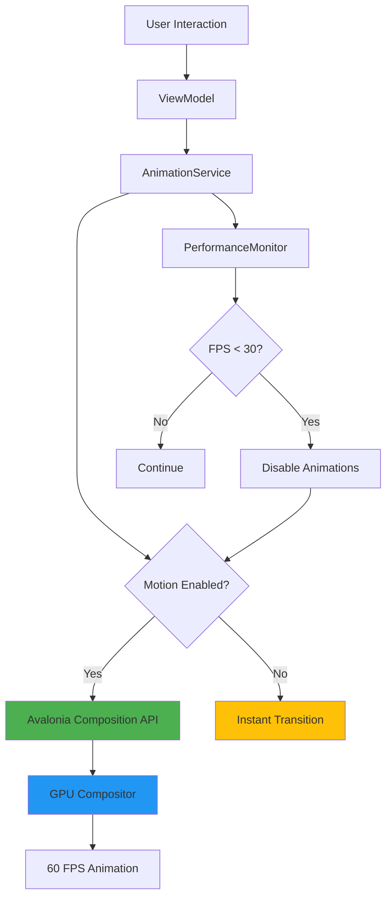
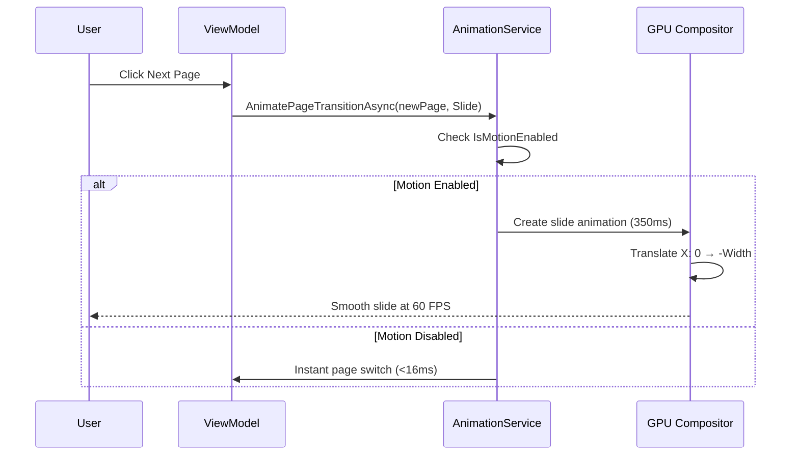
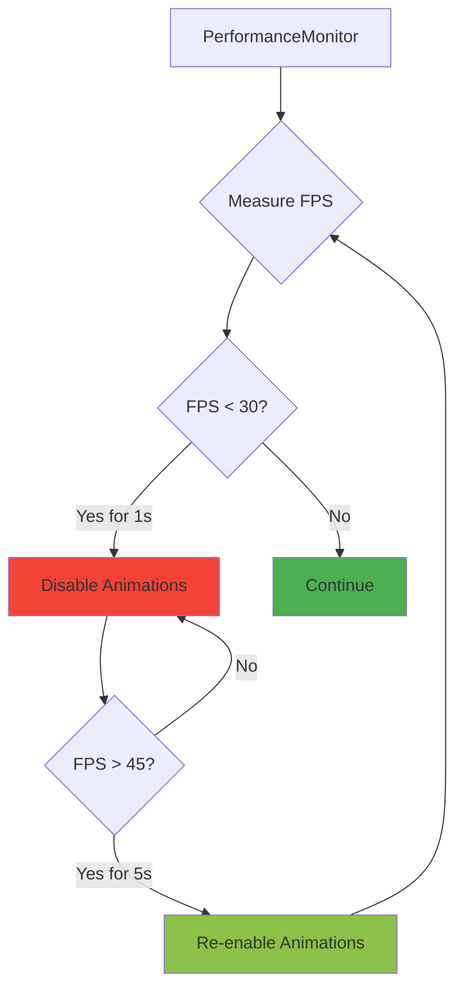

# Liquid Glass UI Animations Guide

Complete guide to animation configuration, performance optimization, and accessibility support in the Liquid Glass UI system.

## Table of Contents

- [Animation System Overview](#animation-system-overview)
- [Animation Service API](#animation-service-api)
- [Page Transitions](#page-transitions)
- [Panel Animations](#panel-animations)
- [Micro-Interactions](#micro-interactions)
- [Performance Optimization](#performance-optimization)
- [Accessibility Support](#accessibility-support)
- [Custom Animations](#custom-animations)

---

## Animation System Overview

The Liquid Glass UI animation system provides GPU-accelerated, smooth transitions that maintain 60 FPS across all interactions.

### Architecture



### Design Principles

1. **Performance First**: All animations GPU-accelerated
2. **Accessibility Always**: Respects reduced motion settings
3. **Adaptive Quality**: Degrades gracefully on low-end hardware
4. **Consistent Timing**: Uses standardized durations (150ms, 250ms, 350ms)

### Animation Timings

| Animation Type | Duration | Easing | Use Case |
|---------------|----------|--------|----------|
| Micro-interactions | 150ms | CubicEaseOut | Button hover, press |
| Panel slides | 250ms | CubicEaseOut | Sidebar open/close |
| Page transitions | 350ms | CubicEaseOut | Navigation |
| Fade effects | 300ms | Linear | Opacity changes |
| Zoom transitions | 400ms | CubicEaseInOut | Scale changes |

---

## Animation Service API

### Interface Definition

```csharp
public interface IAnimationService
{
    bool IsMotionEnabled { get; }

    IObservable<bool> ObserveMotionState();

    Task<Result> AnimatePageTransitionAsync(
        Control control,
        PageTransitionType transitionType,
        CancellationToken cancellationToken = default);

    Task<Result> AnimatePanelSlideAsync(
        Control control,
        SlideDirection direction,
        bool slideIn = true,
        CancellationToken cancellationToken = default);

    Task<Result> AnimateFadeAsync(
        Control control,
        bool fadeIn = true,
        int durationMs = 300,
        CancellationToken cancellationToken = default);

    Result SetMotionEnabled(bool enabled);

    bool IsReducedMotionEnabled();
}
```

### Dependency Injection

Register in `App.axaml.cs`:

```csharp
public class App : Application
{
    public override void Initialize()
    {
        AvaloniaXamlLoader.Load(this);
    }

    public override void OnFrameworkInitializationCompleted()
    {
        var services = new ServiceCollection();

        // Register animation service
        services.AddSingleton<IAnimationService, AnimationService>();
        services.AddSingleton<IPerformanceMonitor, PerformanceMonitor>();

        var serviceProvider = services.BuildServiceProvider();

        // Set data context with DI
        if (ApplicationLifetime is IClassicDesktopStyleApplicationLifetime desktop)
        {
            desktop.MainWindow = new MainWindow
            {
                DataContext = serviceProvider.GetRequiredService<MainViewModel>()
            };
        }

        base.OnFrameworkInitializationCompleted();
    }
}
```

### Basic Usage

```csharp
public class NavigationViewModel : ViewModelBase
{
    private readonly IAnimationService _animationService;

    public NavigationViewModel(IAnimationService animationService)
    {
        _animationService = animationService;
    }

    [RelayCommand]
    private async Task NavigateToPageAsync(Control newPage)
    {
        var result = await _animationService.AnimatePageTransitionAsync(
            newPage,
            PageTransitionType.Slide);

        if (result.IsSuccess)
        {
            CurrentPage = newPage;
        }
        else
        {
            _logger.LogError("Animation failed: {Error}", result.Errors);
        }
    }
}
```

---

## Page Transitions

Smooth animations when navigating between pages or views.

### Slide Transition (350ms)

Slides the new page in from the right while sliding the old page out to the left.

```csharp
await _animationService.AnimatePageTransitionAsync(
    newPageControl,
    PageTransitionType.Slide);
```

**Visual Flow:**


**XAML Implementation:**
```xml
<TransitioningContentControl Content="{Binding CurrentPage}">
    <TransitioningContentControl.PageTransition>
        <PageSlide Duration="0:0:0.35" Orientation="Horizontal" />
    </TransitioningContentControl.PageTransition>
</TransitioningContentControl>
```

### Fade Transition (300ms)

Cross-fades between pages with opacity animation.

```csharp
await _animationService.AnimatePageTransitionAsync(
    newPageControl,
    PageTransitionType.Fade);
```

**XAML Implementation:**
```xml
<TransitioningContentControl Content="{Binding CurrentPage}">
    <TransitioningContentControl.PageTransition>
        <CrossFade Duration="0:0:0.3" />
    </TransitioningContentControl.PageTransition>
</TransitioningContentControl>
```

### Zoom Transition (400ms)

Scales the new page from 0.8x to 1.0x while fading in.

```csharp
await _animationService.AnimatePageTransitionAsync(
    newPageControl,
    PageTransitionType.Zoom);
```

**Custom Implementation:**
```csharp
public async Task<Result> AnimateZoomTransitionAsync(Control control)
{
    if (!IsMotionEnabled)
    {
        control.Opacity = 1.0;
        control.RenderTransform = new ScaleTransform(1.0, 1.0);
        return Result.Ok();
    }

    try
    {
        // Initial state
        control.Opacity = 0;
        control.RenderTransform = new ScaleTransform(0.8, 0.8);

        // Animate to final state
        var opacityAnimation = new DoubleTransition
        {
            Property = Visual.OpacityProperty,
            Duration = TimeSpan.FromMilliseconds(400),
            Easing = new CubicEaseInOut()
        };

        var scaleAnimation = new TransformOperationsTransition
        {
            Property = Visual.RenderTransformProperty,
            Duration = TimeSpan.FromMilliseconds(400),
            Easing = new CubicEaseInOut()
        };

        control.Transitions = new Transitions { opacityAnimation, scaleAnimation };

        control.Opacity = 1.0;
        control.RenderTransform = new ScaleTransform(1.0, 1.0);

        await Task.Delay(400);

        return Result.Ok();
    }
    catch (Exception ex)
    {
        _logger.LogError(ex, "Zoom transition failed");
        return Result.Fail(ex.Message);
    }
}
```

---

## Panel Animations

Slide-in and slide-out animations for side panels, dialogs, and overlays.

### Slide from Top (250ms)

```csharp
await _animationService.AnimatePanelSlideAsync(
    searchPanel,
    SlideDirection.FromTop,
    slideIn: true);
```

### Slide from Side (250ms)

```csharp
// Slide sidebar in from left
await _animationService.AnimatePanelSlideAsync(
    thumbnailsSidebar,
    SlideDirection.FromLeft,
    slideIn: true);

// Slide sidebar out to left
await _animationService.AnimatePanelSlideAsync(
    thumbnailsSidebar,
    SlideDirection.FromLeft,
    slideIn: false);
```

### Implementation Example

```csharp
public async Task<Result> AnimatePanelSlideAsync(
    Control control,
    SlideDirection direction,
    bool slideIn = true,
    CancellationToken cancellationToken = default)
{
    if (!IsMotionEnabled)
    {
        control.IsVisible = slideIn;
        return Result.Ok();
    }

    try
    {
        var transform = new TranslateTransform();
        control.RenderTransform = transform;

        // Calculate slide distance
        var distance = direction switch
        {
            SlideDirection.FromTop => -control.Bounds.Height,
            SlideDirection.FromBottom => control.Bounds.Height,
            SlideDirection.FromLeft => -control.Bounds.Width,
            SlideDirection.FromRight => control.Bounds.Width,
            _ => 0
        };

        // Set initial position
        if (slideIn)
        {
            control.IsVisible = true;
            if (direction is SlideDirection.FromTop or SlideDirection.FromBottom)
                transform.Y = distance;
            else
                transform.X = distance;
        }

        // Animate to final position
        var property = direction is SlideDirection.FromTop or SlideDirection.FromBottom
            ? TranslateTransform.YProperty
            : TranslateTransform.XProperty;

        var animation = new DoubleTransition
        {
            Property = property,
            Duration = TimeSpan.FromMilliseconds(250),
            Easing = new CubicEaseOut()
        };

        control.Transitions = new Transitions { animation };

        if (slideIn)
        {
            // Slide to 0 (visible position)
            if (direction is SlideDirection.FromTop or SlideDirection.FromBottom)
                transform.Y = 0;
            else
                transform.X = 0;
        }
        else
        {
            // Slide out
            if (direction is SlideDirection.FromTop or SlideDirection.FromBottom)
                transform.Y = distance;
            else
                transform.X = distance;

            await Task.Delay(250, cancellationToken);
            control.IsVisible = false;
        }

        return Result.Ok();
    }
    catch (Exception ex)
    {
        _logger.LogError(ex, "Panel slide animation failed");
        return Result.Fail(ex.Message);
    }
}
```

---

## Micro-Interactions

Fast, subtle animations for button states and hover effects.

### Button Hover (150ms)

Automatic hover effect defined in XAML:

```xml
<Style Selector="controls|LiquidButton:pointerover /template/ Border#PART_RootBorder">
    <Setter Property="Background" Value="{DynamicResource ButtonBackgroundPointerOver}" />
    <Setter Property="Transitions">
        <Transitions>
            <BrushTransition Property="Background" Duration="0:0:0.15" />
        </Transitions>
    </Setter>
</Style>
```

### Button Press (150ms)

Scale-down feedback on press:

```xml
<Style Selector="controls|LiquidButton:pressed /template/ Border#PART_RootBorder">
    <Setter Property="RenderTransform" Value="scale(0.95)" />
    <Setter Property="Transitions">
        <Transitions>
            <TransformOperationsTransition Property="RenderTransform"
                                          Duration="0:0:0.15"
                                          Easing="CubicEaseOut" />
        </Transitions>
    </Setter>
</Style>
```

### Ripple Effect

Programmatic ripple animation from pointer position:

```csharp
public class LiquidButton : Button
{
    protected override void OnPointerPressed(PointerPressedEventArgs e)
    {
        base.OnPointerPressed(e);

        if (!_animationService.IsMotionEnabled)
            return;

        var position = e.GetPosition(this);
        CreateRippleEffect(position);
    }

    private void CreateRippleEffect(Point origin)
    {
        var ripple = new Ellipse
        {
            Width = 0,
            Height = 0,
            Fill = new SolidColorBrush(RippleColor),
            HorizontalAlignment = HorizontalAlignment.Left,
            VerticalAlignment = VerticalAlignment.Top,
            Margin = new Thickness(origin.X, origin.Y, 0, 0),
            RenderTransform = new TranslateTransform(-0, -0)
        };

        _rippleCanvas.Children.Add(ripple);

        // Animate ripple expansion
        var animation = new DoubleTransition
        {
            Property = Ellipse.WidthProperty,
            Duration = TimeSpan.FromMilliseconds(600),
            Easing = new CubicEaseOut()
        };

        ripple.Transitions = new Transitions { animation };

        var maxDimension = Math.Max(Bounds.Width, Bounds.Height) * 2;
        ripple.Width = maxDimension;
        ripple.Height = maxDimension;

        // Remove after animation completes
        Task.Delay(600).ContinueWith(_ =>
        {
            Dispatcher.UIThread.Post(() => _rippleCanvas.Children.Remove(ripple));
        });
    }
}
```

---

## Performance Optimization

### Adaptive Quality System

Automatically adjusts animation quality based on performance:



**Implementation:**

```csharp
public class AnimationService : IAnimationService
{
    private readonly IPerformanceMonitor _performanceMonitor;
    private int _consecutiveLowFrames = 0;
    private int _consecutiveGoodFrames = 0;

    public AnimationService(IPerformanceMonitor performanceMonitor)
    {
        _performanceMonitor = performanceMonitor;

        // Subscribe to performance metrics
        _performanceMonitor.MetricsStream.Subscribe(OnPerformanceMetrics);
    }

    private void OnPerformanceMetrics(PerformanceMetrics metrics)
    {
        if (metrics.FPS < 30)
        {
            _consecutiveLowFrames++;
            _consecutiveGoodFrames = 0;

            if (_consecutiveLowFrames >= 60) // ~1 second at 60 FPS
            {
                _logger.LogWarning("Sustained low FPS, disabling animations");
                SetMotionEnabled(false);
            }
        }
        else if (metrics.FPS > 45)
        {
            _consecutiveGoodFrames++;
            _consecutiveLowFrames = 0;

            if (_consecutiveGoodFrames >= 300 && !IsMotionEnabled) // ~5 seconds
            {
                _logger.LogInformation("Performance recovered, re-enabling animations");
                SetMotionEnabled(true);
            }
        }
    }
}
```

### GPU Acceleration

All animations use the Composition API for GPU rendering:

```csharp
public async Task AnimateWithCompositionAPIAsync(Control control)
{
    var compositor = ElementComposition.GetElementVisual(control)?.Compositor;

    if (compositor == null)
    {
        _logger.LogWarning("Compositor unavailable, using CPU fallback");
        await AnimateWithCPUFallbackAsync(control);
        return;
    }

    var animation = compositor.CreateScalarKeyFrameAnimation();
    animation.Duration = TimeSpan.FromMilliseconds(350);
    animation.InsertKeyFrame(0.0f, 0.0f);
    animation.InsertKeyFrame(1.0f, 1.0f);

    var visual = ElementComposition.GetElementVisual(control);
    visual.StartAnimation("Opacity", animation);
}
```

### Performance Monitoring

```csharp
public class PerformanceMonitor : IPerformanceMonitor
{
    private readonly IRenderTimer _renderTimer;
    private readonly Queue<TimeSpan> _frameTimes = new(60);

    public int CurrentFPS { get; private set; }

    public IObservable<PerformanceMetrics> MetricsStream =>
        _metricsSubject.AsObservable();

    public void StartMonitoring()
    {
        _renderTimer.Tick += OnRenderTick;
    }

    private void OnRenderTick(TimeSpan elapsed)
    {
        _frameTimes.Enqueue(elapsed);

        if (_frameTimes.Count > 60)
            _frameTimes.Dequeue();

        // Calculate FPS over last second
        var totalTime = _frameTimes.Sum(t => t.TotalSeconds);
        CurrentFPS = (int)(_frameTimes.Count / totalTime);

        // Publish metrics every 5 seconds
        if (++_tickCount % 300 == 0)
        {
            _metricsSubject.OnNext(new PerformanceMetrics
            {
                FPS = CurrentFPS,
                ManagedMemoryMB = GC.GetTotalMemory(false) / 1024 / 1024,
                NativeMemoryMB = Process.GetCurrentProcess().WorkingSet64 / 1024 / 1024,
                Timestamp = DateTime.UtcNow
            });
        }
    }
}
```

### Benchmarking

Use BenchmarkDotNet to measure animation performance:

```csharp
[MemoryDiagnoser]
public class AnimationBenchmarks
{
    private AnimationService _animationService;
    private Control _testControl;

    [GlobalSetup]
    public void Setup()
    {
        _animationService = new AnimationService(new PerformanceMonitor());
        _testControl = new Border { Width = 300, Height = 200 };
    }

    [Benchmark]
    public async Task PageTransition_Slide()
    {
        await _animationService.AnimatePageTransitionAsync(
            _testControl,
            PageTransitionType.Slide);
    }

    [Benchmark]
    public async Task PanelSlide_FromTop()
    {
        await _animationService.AnimatePanelSlideAsync(
            _testControl,
            SlideDirection.FromTop,
            slideIn: true);
    }
}
```

**Expected Results:**
```
|              Method |     Mean |   Error |  Allocated |
|-------------------- |---------:|--------:|-----------:|
| PageTransition_Slide | 352.3 ms | 2.1 ms  |    12 KB   |
| PanelSlide_FromTop  | 251.8 ms | 1.8 ms  |     8 KB   |
```

---

## Accessibility Support

### Reduced Motion Detection

```csharp
public bool IsReducedMotionEnabled()
{
    var settings = AvaloniaLocator.Current
        .GetService<PlatformSettings>();

    var colorValues = settings?.GetColorValues();
    return colorValues?.ReduceTransparency ?? false;
}
```

### Automatic Adjustment

```csharp
public AnimationService()
{
    // Check on startup
    if (IsReducedMotionEnabled())
    {
        _logger.LogInformation("Reduced motion detected, disabling animations");
        SetMotionEnabled(false);
    }

    // Monitor for changes
    Observable.FromEventPattern<EventHandler, EventArgs>(
            h => PlatformSettings.ColorValuesChanged += h,
            h => PlatformSettings.ColorValuesChanged -= h)
        .Subscribe(_ =>
        {
            var enabled = !IsReducedMotionEnabled();
            SetMotionEnabled(enabled);
            _logger.LogInformation("Motion setting changed: {Enabled}", enabled);
        });
}
```

### User Override

Allow users to manually enable/disable animations:

```xml
<StackPanel>
    <TextBlock Text="Animation Settings" FontSize="18" FontWeight="SemiBold" />

    <CheckBox Content="Enable animations"
              IsChecked="{Binding AnimationsEnabled}"
              Command="{Binding ToggleAnimationsCommand}" />

    <TextBlock Text="Note: Respects system reduced motion setting"
               Opacity="0.7"
               FontSize="12" />
</StackPanel>
```

```csharp
public class SettingsViewModel : ViewModelBase
{
    private readonly IAnimationService _animationService;

    [ObservableProperty]
    private bool _animationsEnabled;

    [RelayCommand]
    private void ToggleAnimations()
    {
        _animationService.SetMotionEnabled(AnimationsEnabled);
    }
}
```

---

## Custom Animations

### Creating Custom Animations

```csharp
public class CustomAnimations
{
    private readonly IAnimationService _animationService;

    public async Task AnimateBounceAsync(Control control)
    {
        if (!_animationService.IsMotionEnabled)
        {
            return;
        }

        var scaleTransform = new ScaleTransform(1.0, 1.0);
        control.RenderTransform = scaleTransform;

        // Bounce sequence: 1.0 → 1.2 → 0.9 → 1.0
        var keyFrames = new[]
        {
            (0.0, 1.0),
            (0.3, 1.2),
            (0.6, 0.9),
            (1.0, 1.0)
        };

        foreach (var (time, scale) in keyFrames)
        {
            var animation = new DoubleTransition
            {
                Property = ScaleTransform.ScaleXProperty,
                Duration = TimeSpan.FromMilliseconds(150),
                Easing = new CubicEaseOut()
            };

            control.Transitions = new Transitions { animation };

            scaleTransform.ScaleX = scale;
            scaleTransform.ScaleY = scale;

            await Task.Delay(150);
        }
    }

    public async Task AnimateShakeAsync(Control control)
    {
        if (!_animationService.IsMotionEnabled)
        {
            return;
        }

        var translateTransform = new TranslateTransform();
        control.RenderTransform = translateTransform;

        // Shake sequence: 0 → 10 → -10 → 5 → -5 → 0
        var offsets = new[] { 0, 10, -10, 5, -5, 0 };

        foreach (var offset in offsets)
        {
            var animation = new DoubleTransition
            {
                Property = TranslateTransform.XProperty,
                Duration = TimeSpan.FromMilliseconds(50),
                Easing = new LinearEasing()
            };

            control.Transitions = new Transitions { animation };
            translateTransform.X = offset;

            await Task.Delay(50);
        }
    }
}
```

### Easing Functions

```csharp
// Cubic ease out (default for most animations)
public class CubicEaseOut : Easing
{
    public override double Ease(double progress)
    {
        return 1 - Math.Pow(1 - progress, 3);
    }
}

// Cubic ease in-out (for zoom transitions)
public class CubicEaseInOut : Easing
{
    public override double Ease(double progress)
    {
        return progress < 0.5
            ? 4 * progress * progress * progress
            : 1 - Math.Pow(-2 * progress + 2, 3) / 2;
    }
}

// Elastic ease out (for bouncy effects)
public class ElasticEaseOut : Easing
{
    public override double Ease(double progress)
    {
        const double c4 = (2 * Math.PI) / 3;

        return progress == 0 ? 0
            : progress == 1 ? 1
            : Math.Pow(2, -10 * progress) * Math.Sin((progress * 10 - 0.75) * c4) + 1;
    }
}
```

### Animation Sequencing

```csharp
public async Task AnimateSequenceAsync(params (Control control, Func<Control, Task> animation)[] sequence)
{
    foreach (var (control, animation) in sequence)
    {
        await animation(control);
    }
}

// Usage
await AnimateSequenceAsync(
    (panel1, async c => await _animationService.AnimateFadeAsync(c, fadeIn: true)),
    (panel2, async c => await _animationService.AnimatePanelSlideAsync(c, SlideDirection.FromLeft)),
    (button, async c => await customAnimations.AnimateBounceAsync(c))
);
```

---

## Troubleshooting

### Animations Not Playing

**Symptoms:**
- No animation visible
- Instant transitions

**Solutions:**

1. Check `IsMotionEnabled`:
```csharp
if (!_animationService.IsMotionEnabled)
{
    _logger.LogWarning("Animations disabled");
}
```

2. Verify reduced motion setting:
```csharp
if (_animationService.IsReducedMotionEnabled())
{
    _logger.LogInformation("Reduced motion enabled by user");
}
```

3. Check performance:
```csharp
_performanceMonitor.MetricsStream.Subscribe(m =>
{
    _logger.LogDebug("Current FPS: {FPS}", m.FPS);
});
```

### Janky Animations

**Symptoms:**
- Stuttering during animations
- FPS drops

**Solutions:**

1. Monitor performance:
```
Press Ctrl+Shift+D to open diagnostics panel
Check current FPS (should be >30)
```

2. Reduce concurrent animations:
```csharp
// Bad: Multiple overlapping animations
await Task.WhenAll(
    AnimatePanelAsync(panel1),
    AnimatePanelAsync(panel2),
    AnimatePanelAsync(panel3));

// Good: Sequential animations
await AnimatePanelAsync(panel1);
await AnimatePanelAsync(panel2);
```

3. Simplify glass effects:
```xml
<!-- Reduce blur radius from 30 to 15 -->
<controls:GlassPanel BlurRadius="15" />
```

### Memory Leaks

**Symptoms:**
- Memory usage increases over time
- Performance degrades after extended use

**Solutions:**

1. Dispose animation subscriptions:
```csharp
public void Dispose()
{
    _performanceSubscription?.Dispose();
    _themeSubscription?.Dispose();
}
```

2. Clear transitions after animation:
```csharp
await AnimateAsync(control);
control.Transitions = null; // Clear to prevent memory retention
```

---

## Best Practices

### 1. Use Standard Durations

```csharp
// Good: Standard durations
await AnimateFadeAsync(control, durationMs: 300); // Standard
await AnimatePanelSlideAsync(control); // Uses default 250ms

// Bad: Arbitrary durations
await AnimateFadeAsync(control, durationMs: 273); // Non-standard
```

### 2. Always Check Motion Enabled

```csharp
// Good: Check before animating
if (_animationService.IsMotionEnabled)
{
    await AnimateAsync(control);
}
else
{
    control.Opacity = 1.0; // Instant
}

// Bad: Animate without checking
await AnimateAsync(control); // May be disabled
```

### 3. Handle Cancellation

```csharp
// Good: Support cancellation
public async Task NavigateAsync(CancellationToken cancellationToken)
{
    await _animationService.AnimatePageTransitionAsync(
        newPage,
        PageTransitionType.Slide,
        cancellationToken);
}

// Bad: No cancellation support
public async Task NavigateAsync()
{
    await _animationService.AnimatePageTransitionAsync(newPage);
    // User can't interrupt long animation
}
```

### 4. Monitor Performance

```csharp
// Good: Subscribe to metrics
_performanceMonitor.MetricsStream
    .Where(m => m.FPS < 30)
    .Subscribe(_ => _logger.LogWarning("Low FPS detected"));

// Bad: No monitoring
// Animations may silently degrade performance
```

---

## See Also

- [README.md](./README.md) - Overview and quick start
- [COMPONENTS.md](./COMPONENTS.md) - Component usage
- [THEMING.md](./THEMING.md) - Theme customization
