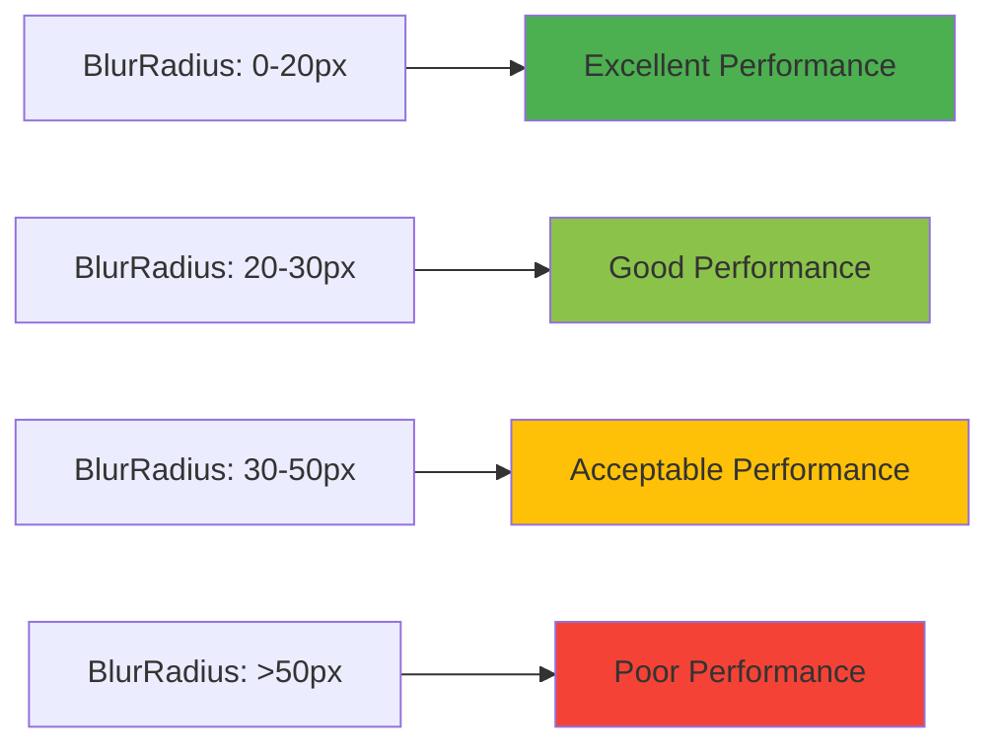
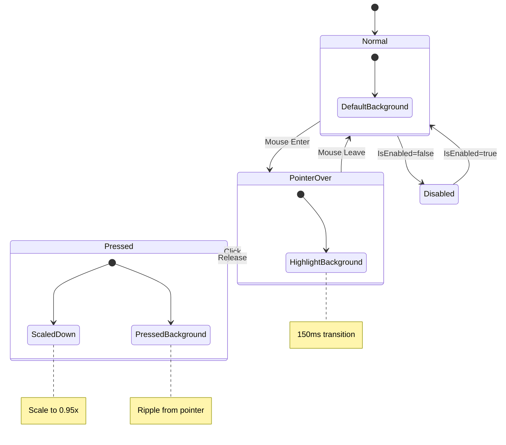
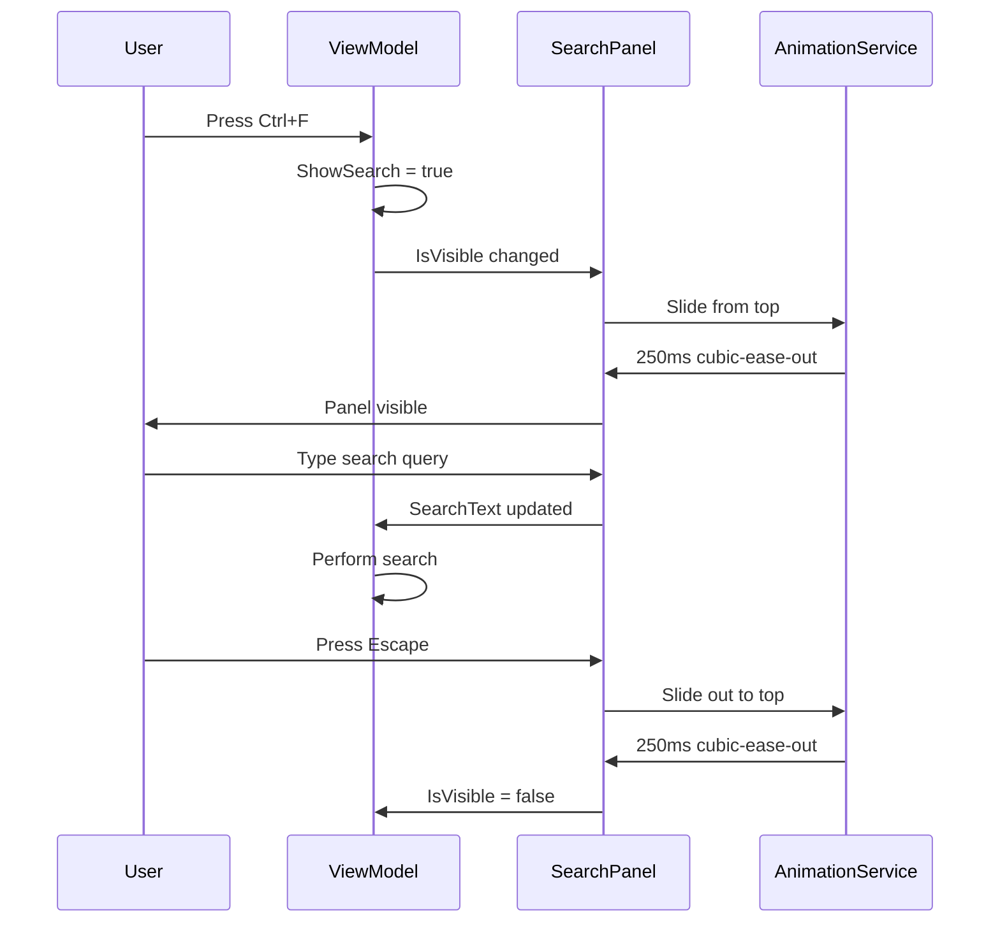
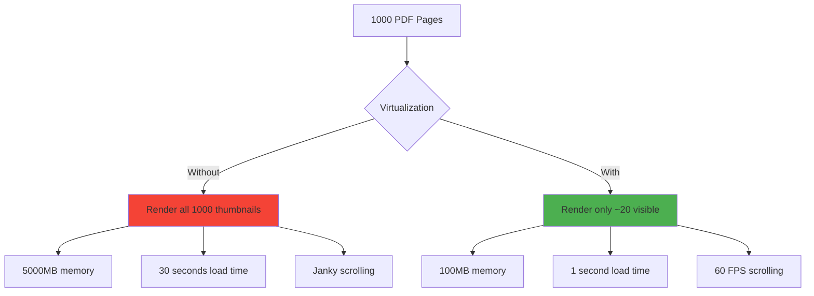
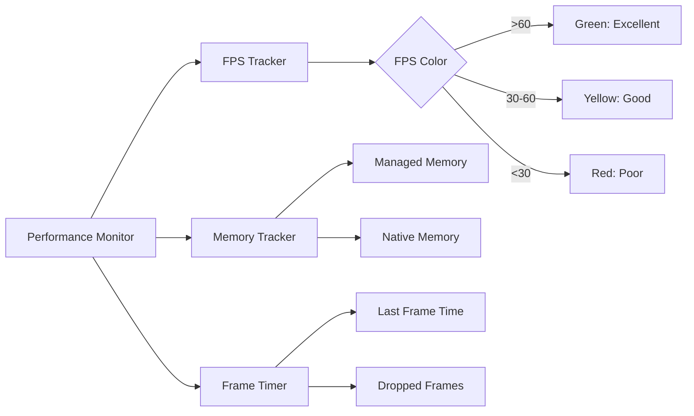

# Liquid Glass UI Components Reference

Complete API reference and usage examples for all Liquid Glass UI components.

## Table of Contents

- [GlassPanel](#glasspanel)
- [LiquidButton](#liquidbutton)
- [Enhanced SearchPanel](#enhanced-searchpanel)
- [Enhanced ThumbnailsSidebar](#enhanced-thumbnailssidebar)
- [Enhanced BookmarksPanel](#enhanced-bookmarkspanel)
- [DiagnosticsPanel](#diagnosticspanel)

---

## GlassPanel

A frosted glass container control with GPU-accelerated backdrop blur and elevation shadows.

### API Reference

```csharp
namespace FluentPDF.Avalonia.Controls;

public class GlassPanel : UserControl
{
    // Dependency Properties
    public static readonly StyledProperty<double> BlurRadiusProperty;
    public static readonly StyledProperty<double> TintOpacityProperty;
    public static readonly StyledProperty<double> ElevationProperty;
    public static readonly StyledProperty<CornerRadius> GlassCornerRadiusProperty;
    public static readonly StyledProperty<ExperimentalAcrylicMaterial> AcrylicMaterialProperty;

    // Properties
    public double BlurRadius { get; set; }        // Default: 20px
    public double TintOpacity { get; set; }       // Default: 0.6
    public double Elevation { get; set; }         // Default: 0dp
    public CornerRadius GlassCornerRadius { get; set; } // Default: 8px
}
```

### Properties

| Property | Type | Default | Description |
|----------|------|---------|-------------|
| `BlurRadius` | `double` | `20` | Backdrop blur intensity in pixels. Higher values create stronger blur. Range: 0-50. |
| `TintOpacity` | `double` | `0.6` | Opacity of the tint overlay. Range: 0.0-1.0. |
| `Elevation` | `double` | `0` | Drop shadow depth in density-independent pixels. Common values: 0dp, 8dp, 16dp, 24dp, 32dp. |
| `GlassCornerRadius` | `CornerRadius` | `8` | Corner radius for rounded corners. Use `0` for sharp corners. |

### Usage Examples

#### Basic Glass Panel

```xml
<controls:GlassPanel>
    <TextBlock Text="Simple frosted glass panel" />
</controls:GlassPanel>
```

#### High Elevation Card

```xml
<controls:GlassPanel BlurRadius="30"
                     TintOpacity="0.7"
                     Elevation="16"
                     GlassCornerRadius="12"
                     Padding="24">
    <StackPanel Spacing="12">
        <TextBlock Text="Elevated Card"
                   FontSize="18"
                   FontWeight="SemiBold" />
        <TextBlock Text="With strong glass effect and high shadow"
                   Opacity="0.8" />
        <controls:LiquidButton Content="Action"
                               Classes="primary" />
    </StackPanel>
</controls:GlassPanel>
```

#### Subtle Toolbar Panel

```xml
<controls:GlassPanel BlurRadius="15"
                     TintOpacity="0.5"
                     Elevation="4"
                     GlassCornerRadius="0">
    <StackPanel Orientation="Horizontal"
                Spacing="8"
                Padding="12,8">
        <controls:LiquidButton Content="Open" />
        <controls:LiquidButton Content="Save" />
        <controls:LiquidButton Content="Print" />
    </StackPanel>
</controls:GlassPanel>
```

#### Dialog Container

```xml
<controls:GlassPanel BlurRadius="40"
                     TintOpacity="0.8"
                     Elevation="32"
                     GlassCornerRadius="16"
                     Padding="32"
                     Width="400"
                     Height="300">
    <StackPanel Spacing="16"
                VerticalAlignment="Center">
        <TextBlock Text="Confirm Action"
                   FontSize="24"
                   FontWeight="Bold"
                   HorizontalAlignment="Center" />
        <TextBlock Text="Are you sure you want to proceed?"
                   TextWrapping="Wrap"
                   HorizontalAlignment="Center" />
        <StackPanel Orientation="Horizontal"
                    Spacing="12"
                    HorizontalAlignment="Center">
            <controls:LiquidButton Content="Cancel" />
            <controls:LiquidButton Content="Confirm"
                                   Classes="primary" />
        </StackPanel>
    </StackPanel>
</controls:GlassPanel>
```

### Performance Considerations



**Recommendations:**
- Use `BlurRadius="20"` for most cases
- Increase to `30-40` only for prominent UI elements (dialogs, overlays)
- Avoid blur radius >50 as it degrades performance
- Monitor FPS with DiagnosticsPanel when using multiple glass panels

### Code-Behind Example

```csharp
using FluentPDF.Avalonia.Controls;

public class CustomPanel : UserControl
{
    private GlassPanel _glassPanel;

    public CustomPanel()
    {
        _glassPanel = new GlassPanel
        {
            BlurRadius = 25,
            TintOpacity = 0.65,
            Elevation = 12,
            GlassCornerRadius = new CornerRadius(10),
            Content = new TextBlock { Text = "Dynamic glass panel" }
        };

        Content = _glassPanel;
    }

    // Dynamically adjust glass effect based on focus
    public void OnFocusChanged(bool hasFocus)
    {
        _glassPanel.Elevation = hasFocus ? 16 : 8;
        _glassPanel.TintOpacity = hasFocus ? 0.7 : 0.6;
    }
}
```

---

## LiquidButton

An enhanced button control with pointer-origin ripple effect and scale-down press feedback.

### API Reference

```csharp
namespace FluentPDF.Avalonia.Controls;

public class LiquidButton : Button
{
    // Dependency Properties
    public static readonly StyledProperty<Color> RippleColorProperty;
    public static readonly StyledProperty<double> ScaleFactorProperty;
    public static readonly StyledProperty<TimeSpan> AnimationDurationProperty;

    // Properties
    public Color RippleColor { get; set; }          // Default: #40FFFFFF
    public double ScaleFactor { get; set; }         // Default: 0.95
    public TimeSpan AnimationDuration { get; set; } // Default: 150ms
}
```

### Properties

| Property | Type | Default | Description |
|----------|------|---------|-------------|
| `RippleColor` | `Color` | `#40FFFFFF` | Color of the ripple effect. Use semi-transparent colors (alpha channel). |
| `ScaleFactor` | `double` | `0.95` | Scale multiplier when pressed. 0.95 = 95% of original size. Range: 0.9-1.0. |
| `AnimationDuration` | `TimeSpan` | `150ms` | Duration of hover, press, and ripple animations. |

### Usage Examples

#### Default Button

```xml
<controls:LiquidButton Content="Click Me" />
```

#### Primary Action Button

```xml
<controls:LiquidButton Content="Save Changes"
                       Classes="primary" />
```

#### Custom Styled Button

```xml
<controls:LiquidButton Content="Delete"
                       RippleColor="#40FF0000"
                       ScaleFactor="0.92"
                       AnimationDuration="0:0:0.2"
                       Background="#F44336"
                       Foreground="White" />
```

#### Icon + Text Button

```xml
<controls:LiquidButton Padding="16,8">
    <StackPanel Orientation="Horizontal" Spacing="8">
        <PathIcon Data="{StaticResource SaveIcon}" />
        <TextBlock Text="Save" />
    </StackPanel>
</controls:LiquidButton>
```

#### Button with Tooltip

```xml
<controls:LiquidButton Content="Upload"
                       ToolTip.Tip="Upload document to cloud"
                       Classes="primary" />
```

### Visual States



### Styling Variants

#### Primary Button (Accent Color)

```xml
<Style Selector="controls|LiquidButton.primary">
    <Setter Property="Background" Value="{DynamicResource SystemAccentColor}" />
    <Setter Property="Foreground" Value="White" />
    <Setter Property="BorderBrush" Value="{DynamicResource SystemAccentColorDark1}" />
</Style>
```

**Usage:**
```xml
<controls:LiquidButton Content="Primary" Classes="primary" />
```

#### Custom Variant (Create Your Own)

```xml
<Style Selector="controls|LiquidButton.danger">
    <Setter Property="Background" Value="#F44336" />
    <Setter Property="Foreground" Value="White" />
    <Setter Property="RippleColor" Value="#40FFFFFF" />
</Style>
```

**Usage:**
```xml
<controls:LiquidButton Content="Delete" Classes="danger" />
```

### Code-Behind Example

```csharp
using FluentPDF.Avalonia.Controls;

public class ButtonDemoViewModel : ViewModelBase
{
    [RelayCommand]
    private async Task HandleButtonClickAsync()
    {
        // Button automatically shows ripple effect
        await DoSomeWorkAsync();
    }

    // Dynamically create buttons
    public Control CreateDynamicButton(string text)
    {
        return new LiquidButton
        {
            Content = text,
            Classes = { "primary" },
            Command = HandleButtonClickCommand
        };
    }
}
```

### Accessibility

LiquidButton automatically supports:

- **Keyboard Navigation**: Tab to focus, Enter/Space to activate
- **Screen Readers**: Uses `AutomationProperties.Name` from Content
- **High Contrast Mode**: Ripple effect disabled, border enhanced
- **Reduced Motion**: Scale and ripple animations disabled

```xml
<!-- Explicit accessibility properties -->
<controls:LiquidButton Content="Save"
                       AutomationProperties.Name="Save document"
                       AutomationProperties.HelpText="Saves the current document to disk"
                       AccessKey="S" />
```

---

## Enhanced SearchPanel

Search interface with frosted glass backdrop and slide-in/out animations.

### API Reference

```csharp
namespace FluentPDF.Avalonia.Controls;

public class SearchPanel : UserControl
{
    public static readonly StyledProperty<bool> IsVisibleProperty;
    public static readonly StyledProperty<string> SearchTextProperty;

    public bool IsVisible { get; set; }
    public string SearchText { get; set; }

    public event EventHandler<string> SearchRequested;
    public event EventHandler CloseRequested;
}
```

### Usage Examples

#### Basic Search Panel

```xml
<controls:SearchPanel IsVisible="{Binding ShowSearch}"
                      SearchText="{Binding SearchQuery, Mode=TwoWay}"
                      SearchRequested="OnSearchRequested"
                      CloseRequested="OnSearchClosed" />
```

#### With ViewModel Binding

```csharp
public class PdfViewerViewModel : ViewModelBase
{
    [ObservableProperty]
    private bool _showSearch;

    [ObservableProperty]
    private string _searchQuery;

    [RelayCommand]
    private void OpenSearch()
    {
        ShowSearch = true;
        // Panel automatically slides in with 250ms animation
    }

    [RelayCommand]
    private async Task PerformSearchAsync()
    {
        var results = await _searchService.SearchAsync(SearchQuery);
        // Update UI with results
    }
}
```

### Animation Behavior



### Keyboard Shortcuts

| Shortcut | Action |
|----------|--------|
| `Ctrl+F` | Open search panel |
| `Escape` | Close search panel |
| `Enter` | Execute search |
| `F3` | Find next |
| `Shift+F3` | Find previous |

---

## Enhanced ThumbnailsSidebar

Virtualized thumbnail panel with glass styling and efficient rendering for 1000+ pages.

### API Reference

```csharp
namespace FluentPDF.Avalonia.Controls;

public class ThumbnailsSidebar : UserControl
{
    public static readonly StyledProperty<ObservableCollection<ThumbnailItem>> ThumbnailsProperty;
    public static readonly StyledProperty<int> SelectedIndexProperty;

    public ObservableCollection<ThumbnailItem> Thumbnails { get; set; }
    public int SelectedIndex { get; set; }

    public event EventHandler<int> ThumbnailClicked;
}
```

### Usage Examples

#### Basic Thumbnails Sidebar

```xml
<controls:ThumbnailsSidebar Thumbnails="{Binding ThumbnailItems}"
                            SelectedIndex="{Binding CurrentPageIndex}"
                            ThumbnailClicked="OnThumbnailClicked"
                            Width="200" />
```

#### With Lazy Loading

```csharp
public class ThumbnailsViewModel : ViewModelBase
{
    private readonly IPdfRenderService _renderService;

    [ObservableProperty]
    private ObservableCollection<ThumbnailItem> _thumbnailItems;

    public async Task LoadThumbnailsAsync(string pdfPath)
    {
        var pageCount = await _renderService.GetPageCountAsync(pdfPath);

        // Initialize with placeholders
        ThumbnailItems = new ObservableCollection<ThumbnailItem>(
            Enumerable.Range(0, pageCount)
                      .Select(i => new ThumbnailItem
                      {
                          PageIndex = i,
                          IsLoading = true // Show shimmer
                      }));

        // Render visible thumbnails on-demand
        // VirtualizingStackPanel automatically requests as user scrolls
    }
}
```

### Virtualization Performance



**Performance Metrics:**
- **Memory Usage**: ~5MB per 100 thumbnails (visible only)
- **Scroll Performance**: 60 FPS sustained
- **Load Time**: <1 second for initial visible thumbnails

---

## Enhanced BookmarksPanel

Bookmark navigation panel with glass styling and smooth expand/collapse animations.

### API Reference

```csharp
namespace FluentPDF.Avalonia.Controls;

public class BookmarksPanel : UserControl
{
    public static readonly StyledProperty<ObservableCollection<BookmarkNode>> BookmarksProperty;

    public ObservableCollection<BookmarkNode> Bookmarks { get; set; }

    public event EventHandler<BookmarkNode> BookmarkClicked;
}
```

### Usage Examples

#### Basic Bookmarks Panel

```xml
<controls:BookmarksPanel Bookmarks="{Binding BookmarkTree}"
                         BookmarkClicked="OnBookmarkClicked"
                         Width="250" />
```

#### With Hierarchical Data

```csharp
public class BookmarksViewModel : ViewModelBase
{
    [ObservableProperty]
    private ObservableCollection<BookmarkNode> _bookmarkTree;

    public async Task LoadBookmarksAsync(string pdfPath)
    {
        var bookmarks = await _bookmarkService.GetBookmarksAsync(pdfPath);

        BookmarkTree = new ObservableCollection<BookmarkNode>(
            BuildHierarchy(bookmarks));
    }

    private IEnumerable<BookmarkNode> BuildHierarchy(IEnumerable<Bookmark> flat)
    {
        // Build tree structure for nested bookmarks
        // TreeView automatically handles expand/collapse with animations
    }
}
```

### Expand/Collapse Animation

Each tree node animates with:
- **Opacity**: 0 → 1 (200ms ease-out)
- **ScaleY**: 0 → 1 (200ms CubicEase)

```xml
<TreeView.ItemTemplate>
    <TreeDataTemplate ItemsSource="{Binding Children}">
        <TextBlock Text="{Binding Title}">
            <TextBlock.Transitions>
                <Transitions>
                    <DoubleTransition Property="Opacity" Duration="0:0:0.2" />
                    <TransformOperationsTransition Property="RenderTransform" Duration="0:0:0.2" Easing="CubicEaseOut" />
                </Transitions>
            </TextBlock.Transitions>
        </TextBlock>
    </TreeDataTemplate>
</TreeView.ItemTemplate>
```

---

## DiagnosticsPanel

Developer diagnostics overlay showing real-time performance metrics.

### API Reference

```csharp
namespace FluentPDF.Avalonia.ViewModels;

public class DiagnosticsPanelViewModel : ViewModelBase
{
    [ObservableProperty]
    private int _currentFps;

    [ObservableProperty]
    private long _managedMemoryMB;

    [ObservableProperty]
    private long _nativeMemoryMB;

    [ObservableProperty]
    private string _fpsStatus; // "Excellent", "Good", "Poor"
}
```

### Usage

**Toggle with Keyboard:**
```
Press Ctrl+Shift+D to show/hide diagnostics panel
```

**XAML Integration:**
```xml
<Window>
    <Grid>
        <!-- Your main content -->
        <YourContent />

        <!-- Diagnostics overlay -->
        <controls:DiagnosticsPanel IsVisible="{Binding ShowDiagnostics}"
                                   VerticalAlignment="Top"
                                   HorizontalAlignment="Right"
                                   Margin="16" />
    </Grid>
</Window>
```

### Metrics Display



**Example Display:**
```
┌─────────────────────────┐
│ 🎯 Performance          │
├─────────────────────────┤
│ FPS: 60 (Excellent) ✓   │
│ Managed: 45 MB          │
│ Native: 12 MB           │
│ Frame: 16.6 ms          │
│ Dropped: 0              │
└─────────────────────────┘
```

### Code Example

```csharp
public class MainViewModel : ViewModelBase
{
    private readonly IPerformanceMonitor _performanceMonitor;

    [ObservableProperty]
    private bool _showDiagnostics;

    public MainViewModel(IPerformanceMonitor performanceMonitor)
    {
        _performanceMonitor = performanceMonitor;

        // Subscribe to metrics
        _performanceMonitor.MetricsStream.Subscribe(metrics =>
        {
            CurrentFps = metrics.FPS;
            ManagedMemoryMB = metrics.ManagedMemoryMB;

            if (metrics.FPS < 30)
            {
                _logger.LogWarning("Low FPS detected: {FPS}", metrics.FPS);
            }
        });
    }

    [RelayCommand]
    private void ToggleDiagnostics()
    {
        ShowDiagnostics = !ShowDiagnostics;
    }
}
```

---

## Complete Integration Example

### Putting It All Together

```xml
<Window xmlns:controls="using:FluentPDF.Avalonia.Controls">
    <Grid>
        <!-- Main glass panel container -->
        <controls:GlassPanel Elevation="8">
            <Grid>
                <Grid.RowDefinitions>
                    <RowDefinition Height="Auto" /> <!-- Toolbar -->
                    <RowDefinition Height="*" />    <!-- Content -->
                </Grid.RowDefinitions>

                <!-- Toolbar with liquid buttons -->
                <controls:GlassPanel Grid.Row="0"
                                     Elevation="4"
                                     GlassCornerRadius="0">
                    <StackPanel Orientation="Horizontal"
                                Spacing="8"
                                Padding="12,8">
                        <controls:LiquidButton Content="Open" Command="{Binding OpenCommand}" />
                        <controls:LiquidButton Content="Save" Classes="primary" Command="{Binding SaveCommand}" />
                        <controls:LiquidButton Content="Search" Command="{Binding SearchCommand}" />
                    </StackPanel>
                </controls:GlassPanel>

                <!-- Main content area -->
                <Grid Grid.Row="1">
                    <Grid.ColumnDefinitions>
                        <ColumnDefinition Width="200" />
                        <ColumnDefinition Width="*" />
                    </Grid.ColumnDefinitions>

                    <!-- Thumbnails sidebar -->
                    <controls:ThumbnailsSidebar Grid.Column="0"
                                                Thumbnails="{Binding Thumbnails}"
                                                SelectedIndex="{Binding CurrentPage}" />

                    <!-- PDF viewer -->
                    <controls:PdfViewerControl Grid.Column="1"
                                               Source="{Binding CurrentDocument}" />

                    <!-- Search panel overlay -->
                    <controls:SearchPanel Grid.Column="1"
                                          IsVisible="{Binding ShowSearch}"
                                          SearchText="{Binding SearchQuery}" />
                </Grid>
            </Grid>
        </controls:GlassPanel>

        <!-- Diagnostics overlay -->
        <controls:DiagnosticsPanel IsVisible="{Binding ShowDiagnostics}"
                                   VerticalAlignment="Top"
                                   HorizontalAlignment="Right"
                                   Margin="16" />
    </Grid>
</Window>
```

## Performance Best Practices

### 1. Limit Concurrent Glass Panels

```csharp
// Good: Single glass container
<controls:GlassPanel>
    <StackPanel>
        <Panel>...</Panel>
        <Panel>...</Panel>
    </StackPanel>
</controls:GlassPanel>

// Bad: Nested glass panels (high GPU cost)
<controls:GlassPanel>
    <controls:GlassPanel>
        <controls:GlassPanel>
            ...
        </controls:GlassPanel>
    </controls:GlassPanel>
</controls:GlassPanel>
```

### 2. Use Virtualization for Large Lists

```xml
<!-- Always use VirtualizingStackPanel for >50 items -->
<ItemsControl ItemsSource="{Binding Items}">
    <ItemsControl.ItemsPanel>
        <ItemsPanelTemplate>
            <VirtualizingStackPanel />
        </ItemsPanelTemplate>
    </ItemsControl.ItemsPanel>
</ItemsControl>
```

### 3. Monitor Performance

```csharp
// Subscribe to performance metrics
_performanceMonitor.MetricsStream
    .Where(m => m.FPS < 30)
    .Subscribe(_ => SimplifyUI());
```

## See Also

- [README.md](./README.md) - Overview and quick start guide
- [THEMING.md](./THEMING.md) - Theme customization
- [ANIMATIONS.md](./ANIMATIONS.md) - Animation configuration
