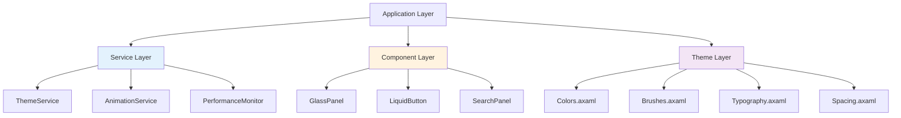
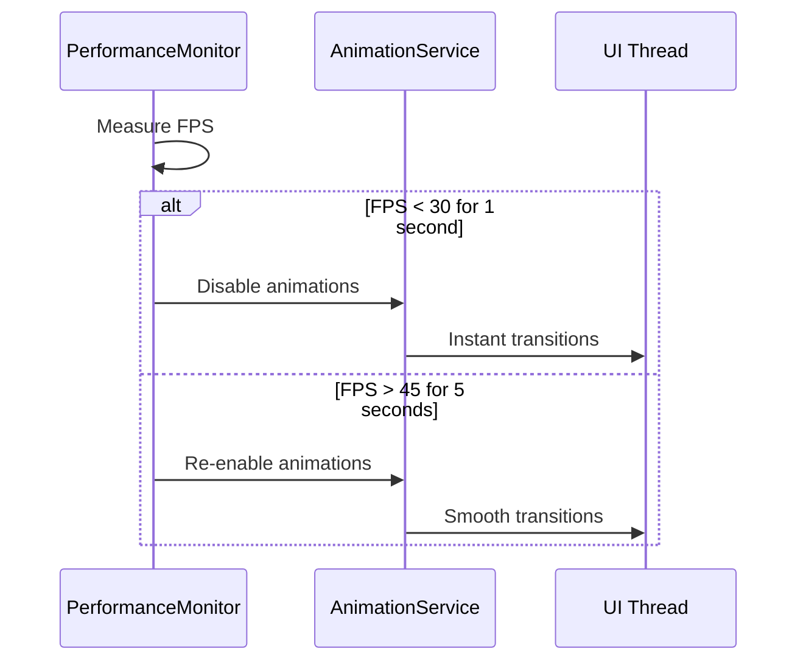

# Liquid Glass UI System

A comprehensive UI enhancement system for FluentPDF featuring frosted glass effects, fluid animations, and modern design patterns built on Avalonia UI.

## Overview

The Liquid Glass UI system transforms FluentPDF into a premium, visually stunning PDF viewer with:

- **Frosted Glass Effects**: GPU-accelerated acrylic materials with backdrop blur
- **Fluid Animations**: Smooth transitions and micro-interactions at 60 FPS
- **Modular Architecture**: Clean separation between theme, components, and animations
- **Accessibility First**: Full WCAG 2.1 Level AA compliance with reduced motion support
- **Performance Optimized**: Adaptive quality degradation on low-end hardware

This system provides a cohesive design language that elevates FluentPDF to match the polish of premium applications like Apple Preview while maintaining enterprise-grade functionality.

## Quick Start

### 1. Using Glass Components

The simplest way to get started is using the pre-built glass components:

```xml
<!-- Add glass effect to any panel -->
<controls:GlassPanel BlurRadius="20"
                     TintOpacity="0.6"
                     Elevation="8"
                     CornerRadius="8">
    <StackPanel Margin="16">
        <TextBlock Text="Frosted Glass Panel" FontSize="18" />
        <TextBlock Text="Content with beautiful backdrop blur" />
    </StackPanel>
</controls:GlassPanel>
```

### 2. Using Animated Buttons

Replace standard buttons with LiquidButton for ripple effects:

```xml
<!-- Default button with ripple effect -->
<controls:LiquidButton Content="Click Me" />

<!-- Primary accent button -->
<controls:LiquidButton Content="Save Changes"
                       Classes="primary" />
```

### 3. Applying Theme Switching

Inject `IThemeService` into your ViewModels:

```csharp
public class SettingsViewModel : ViewModelBase
{
    private readonly IThemeService _themeService;

    public SettingsViewModel(IThemeService themeService)
    {
        _themeService = themeService;
    }

    public void ToggleTheme()
    {
        var newTheme = _themeService.CurrentTheme == ThemeVariant.Light
            ? ThemeVariant.Dark
            : ThemeVariant.Light;

        _themeService.SetTheme(newTheme);
    }
}
```

### 4. Adding Page Transitions

Inject `IAnimationService` for smooth page transitions:

```csharp
public class NavigationViewModel : ViewModelBase
{
    private readonly IAnimationService _animationService;

    [ObservableProperty]
    private Control _currentPage;

    public async Task NavigateToPageAsync(Control newPage)
    {
        await _animationService.AnimatePageTransitionAsync(
            newPage,
            PageTransitionType.Slide);

        CurrentPage = newPage;
    }
}
```

## Architecture Overview

The system follows a three-layer architecture:



### Layer Responsibilities

**Theme Layer** (`Styles/Theme/`)
- Color palettes for Light/Dark/HighContrast modes
- Acrylic brush definitions with blur parameters
- Typography scale (Segoe UI Variable font family)
- Spacing system based on 4px grid

**Component Layer** (`Controls/`, `Styles/Components/`)
- Reusable UI controls (GlassPanel, LiquidButton)
- Component-specific styles and templates
- Visual state management and transitions

**Service Layer** (`Services/`)
- Theme management with hot-reload (`ThemeService`)
- Animation orchestration (`AnimationService`)
- Performance monitoring (`PerformanceMonitor`)

## Design Principles

### 1. Single Responsibility
Each component has one clear purpose:
- `GlassPanel` → Provides frosted glass container
- `LiquidButton` → Adds ripple animations to buttons
- `ThemeService` → Manages theme switching

### 2. Modular Resources
All visual properties are defined in resource dictionaries:

```xml
<!-- Reference theme resources in components -->
<Border Background="{DynamicResource SystemChromeMediumColor}"
        CornerRadius="{StaticResource ControlCornerRadiusMedium}"
        Padding="{StaticResource PaddingMedium}" />
```

### 3. Accessibility First
All features respect system accessibility settings:

```csharp
// Animations automatically disabled with reduced motion
if (_animationService.IsReducedMotionEnabled())
{
    // Instant transition instead of animation
    CurrentPage = newPage;
}
else
{
    // Smooth animated transition
    await _animationService.AnimatePageTransitionAsync(newPage, ...);
}
```

### 4. Performance by Default
GPU acceleration and adaptive quality ensure smooth performance:

```csharp
// Performance monitor detects low FPS
_performanceMonitor.MetricsStream.Subscribe(metrics =>
{
    if (metrics.FPS < 30)
    {
        // Automatically simplify animations
        _animationService.SetMotionEnabled(false);
    }
});
```

## Component Gallery

### GlassPanel
Frosted glass container with adjustable blur and elevation.

**Properties:**
- `BlurRadius` (double, default: 20px) - Backdrop blur intensity
- `TintOpacity` (double, default: 0.6) - Tint overlay opacity
- `Elevation` (double, default: 0dp) - Drop shadow depth
- `GlassCornerRadius` (CornerRadius, default: 8px) - Corner rounding

**Usage Example:**
```xml
<controls:GlassPanel BlurRadius="30" Elevation="16">
    <TextBlock Text="High elevation glass panel" />
</controls:GlassPanel>
```

### LiquidButton
Button with pointer-origin ripple effect and press feedback.

**Features:**
- Ripple animation from pointer position
- 0.95x scale on press
- 150ms smooth transitions
- Works with mouse, touch, and pen

**Usage Example:**
```xml
<controls:LiquidButton Content="Primary Action" Classes="primary" />
<controls:LiquidButton Content="Secondary" />
```

### SearchPanel (Enhanced)
Search interface with glass backdrop and slide animations.

**Features:**
- Slides in from top with 250ms animation
- Glass background with 20px blur
- Preserves all search functionality

### ThumbnailsSidebar (Enhanced)
Virtualized thumbnail panel with glass styling.

**Features:**
- Efficient rendering for 1000+ pages
- Shimmer loading placeholders
- Glass panel container
- 60 FPS scrolling performance

## Theme System

### Supported Themes

**Light Theme**
- Light acrylic with subtle gray tints
- High contrast text (4.5:1 ratio)
- System accent color integration

**Dark Theme**
- Dark acrylic with deep charcoal tints
- Reduced eye strain for extended use
- Enhanced focus indicators

**High Contrast Mode**
- Solid colors replace acrylic effects
- Enhanced borders and outlines
- 7:1+ contrast ratios

### Switching Themes

**Via Service:**
```csharp
_themeService.SetTheme(ThemeVariant.Dark);
_themeService.UseSystemTheme(); // Follow system preference
```

**Via UI:**
```xml
<controls:LiquidButton Content="Toggle Theme"
                       Command="{Binding ToggleThemeCommand}" />
```

## Animation System

### Transition Types

**Page Transitions** (350ms slide)
```csharp
await _animationService.AnimatePageTransitionAsync(
    newPage,
    PageTransitionType.Slide);
```

**Panel Slides** (250ms)
```csharp
await _animationService.AnimatePanelSlideAsync(
    searchPanel,
    SlideDirection.FromTop,
    slideIn: true);
```

**Fade Effects** (300ms)
```csharp
await _animationService.AnimateFadeAsync(
    dialog,
    fadeIn: true,
    durationMs: 300);
```

### Accessibility Support

The animation service automatically detects reduced motion:

```csharp
public bool IsReducedMotionEnabled()
{
    var settings = AvaloniaLocator.Current
        .GetService<PlatformSettings>();
    return settings?.GetColorValues()
        .ReduceTransparency ?? false;
}
```

When reduced motion is enabled:
- All animations complete instantly (<16ms)
- Visual effects (acrylic) remain active
- No perceived delay in interactions

## Performance Monitoring

### Real-Time Metrics

The `PerformanceMonitor` service tracks:

```csharp
public record PerformanceMetrics
{
    public int FPS { get; init; }              // Current frames per second
    public long ManagedMemoryMB { get; init; } // Managed heap usage
    public long NativeMemoryMB { get; init; }  // Native memory usage
    public TimeSpan LastFrameTime { get; init; }
    public int DroppedFrames { get; init; }
}
```

### Adaptive Quality

Performance degrades gracefully on low-end hardware:



### Developer Diagnostics

Press `Ctrl+Shift+D` to open diagnostics panel:

```xml
<DiagnosticsPanel IsVisible="{Binding ShowDiagnostics}">
    <!-- Shows:
         - Current FPS (color-coded: green >60, yellow 30-60, red <30)
         - Memory usage (managed + native)
         - Frame timing graph
         - Render pipeline metrics
    -->
</DiagnosticsPanel>
```

## Integration Guide

### 1. Add to Existing Page

Wrap your existing content in GlassPanel:

```xml
<!-- Before -->
<Border Background="{DynamicResource CardBackgroundFillColorDefault}">
    <StackPanel>
        <!-- Content -->
    </StackPanel>
</Border>

<!-- After -->
<controls:GlassPanel Elevation="8">
    <StackPanel>
        <!-- Same content -->
    </StackPanel>
</controls:GlassPanel>
```

### 2. Add to Existing Button

Replace Button with LiquidButton:

```xml
<!-- Before -->
<Button Content="Save" Command="{Binding SaveCommand}" />

<!-- After -->
<controls:LiquidButton Content="Save"
                       Classes="primary"
                       Command="{Binding SaveCommand}" />
```

### 3. Add Page Transitions

Inject `IAnimationService` into ViewModel:

```csharp
// Constructor injection
public MyViewModel(IAnimationService animationService)
{
    _animationService = animationService;
}

// Add transitions to navigation
private async Task NavigateToNextPageAsync()
{
    var result = await _animationService.AnimatePageTransitionAsync(
        NextPageControl,
        PageTransitionType.Slide);

    if (result.IsSuccess)
    {
        CurrentPage = NextPageControl;
    }
}
```

## Troubleshooting

### Glass effects not rendering

**Cause:** GPU compositor unavailable
**Solution:** Check hardware acceleration:

```csharp
var compositor = ElementComposition.GetElementVisual(this)?.Compositor;
if (compositor == null)
{
    // Fallback to solid colors
    UseSimpleBackground();
}
```

### Animations are janky

**Cause:** Low frame rate
**Solution:** Check diagnostics panel (`Ctrl+Shift+D`):

```
If FPS < 30:
  - Disable complex animations
  - Reduce blur radius
  - Check for memory leaks
```

### Theme not switching

**Cause:** Resources not loaded
**Solution:** Verify resource dictionary merge order in `App.axaml`:

```xml
<Application.Resources>
    <ResourceDictionary>
        <ResourceDictionary.MergedDictionaries>
            <!-- Theme must be loaded first -->
            <ResourceInclude Source="/Styles/Theme/Colors.axaml"/>
            <ResourceInclude Source="/Styles/Theme/Brushes.axaml"/>
            <!-- Then components -->
            <ResourceInclude Source="/Styles/Components/ButtonStyles.axaml"/>
        </ResourceDictionary.MergedDictionaries>
    </ResourceDictionary>
</Application.Resources>
```

### High contrast mode shows glass effects

**Cause:** Theme service not detecting high contrast
**Solution:** Ensure theme service checks system settings:

```csharp
var isHighContrast = PlatformSettings?
    .GetColorValues()
    .HighContrast ?? false;

if (isHighContrast)
{
    // Use solid colors, disable acrylic
}
```

## Best Practices

### 1. Use Semantic Resource Names

```xml
<!-- Good: Semantic naming -->
<Border Background="{DynamicResource CardBackground}" />

<!-- Bad: Direct values -->
<Border Background="#80FFFFFF" />
```

### 2. Respect Accessibility Settings

```csharp
// Always check before animating
if (_animationService.IsMotionEnabled)
{
    await AnimateAsync();
}
else
{
    ApplyInstantly();
}
```

### 3. Monitor Performance

```csharp
// Subscribe to performance metrics
_performanceMonitor.MetricsStream.Subscribe(metrics =>
{
    if (metrics.FPS < 30)
    {
        _logger.LogWarning("Low FPS detected: {FPS}", metrics.FPS);
    }
});
```

### 4. Handle Errors Gracefully

```csharp
var result = await _animationService.AnimateFadeAsync(control);

if (result.IsFailed)
{
    _logger.LogError("Animation failed: {Error}", result.Errors);
    // Fall back to instant transition
    control.Opacity = 1.0;
}
```

## See Also

- [COMPONENTS.md](./COMPONENTS.md) - Detailed component usage and API reference
- [THEMING.md](./THEMING.md) - Theme customization and creating new themes
- [ANIMATIONS.md](./ANIMATIONS.md) - Animation configuration and performance optimization

## License

Part of FluentPDF - See project root LICENSE file.
