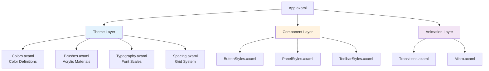

# Liquid Glass UI Theming Guide

Complete guide to customizing the Liquid Glass UI theme system, creating new themes, and understanding the color architecture.

## Table of Contents

- [Theme Architecture](#theme-architecture)
- [Built-in Themes](#built-in-themes)
- [Theme Customization](#theme-customization)
- [Creating Custom Themes](#creating-custom-themes)
- [Dynamic Theme Switching](#dynamic-theme-switching)
- [Accessibility Compliance](#accessibility-compliance)

---

## Theme Architecture

The theme system follows a layered resource architecture:



### Resource Loading Order

Critical: Resources must be loaded in this specific order:

```xml
<Application.Resources>
    <ResourceDictionary>
        <ResourceDictionary.MergedDictionaries>
            <!-- 1. Theme foundation (must be first) -->
            <ResourceInclude Source="/Styles/Theme/Colors.axaml"/>
            <ResourceInclude Source="/Styles/Theme/Brushes.axaml"/>
            <ResourceInclude Source="/Styles/Theme/Typography.axaml"/>
            <ResourceInclude Source="/Styles/Theme/Spacing.axaml"/>

            <!-- 2. Component styles (reference theme) -->
            <ResourceInclude Source="/Styles/Components/ButtonStyles.axaml"/>
            <ResourceInclude Source="/Styles/Components/PanelStyles.axaml"/>

            <!-- 3. Animations (reference components) -->
            <ResourceInclude Source="/Styles/Animations/Transitions.axaml"/>
        </ResourceDictionary.MergedDictionaries>
    </ResourceDictionary>
</Application.Resources>
```

---

## Built-in Themes

FluentPDF includes three complete themes out of the box.

### Light Theme

Modern, clean interface for daytime use.

**Color Palette:**
```xml
<!-- Light theme colors (Colors.axaml) -->
<Color x:Key="SystemChromeMediumColor">#F3F3F3</Color>
<Color x:Key="SystemChromeMediumLowColor">#E0E0E0</Color>
<Color x:Key="SystemBaseMediumColor">#666666</Color>
<Color x:Key="SystemBaseHighColor">#000000</Color>
<Color x:Key="SystemAltHighColor">#FFFFFF</Color>
<Color x:Key="SystemAccentColor">#0078D4</Color>
```

**Characteristics:**
- Background: Light gray (`#F3F3F3`)
- Foreground: Dark text (`#000000`)
- Acrylic tint: Subtle gray with 60% opacity
- Contrast ratio: 4.5:1 (WCAG AA compliant)

**Best for:**
- Bright environments
- Extended reading sessions
- Professional presentations

### Dark Theme

Eye-friendly interface for low-light environments.

**Color Palette:**
```xml
<!-- Dark theme colors -->
<Color x:Key="SystemChromeMediumColor">#1E1E1E</Color>
<Color x:Key="SystemChromeMediumLowColor">#2D2D2D</Color>
<Color x:Key="SystemBaseMediumColor">#999999</Color>
<Color x:Key="SystemBaseHighColor">#FFFFFF</Color>
<Color x:Key="SystemAltHighColor">#000000</Color>
<Color x:Key="SystemAccentColor">#60CDFF</Color>
```

**Characteristics:**
- Background: Dark charcoal (`#1E1E1E`)
- Foreground: White text (`#FFFFFF`)
- Acrylic tint: Deep charcoal with 70% opacity
- Contrast ratio: 15:1 (Exceeds WCAG AAA)

**Best for:**
- Night-time use
- Reducing eye strain
- Battery saving (OLED displays)

### High Contrast Theme

Maximum readability for visual accessibility.

**Color Palette:**
```xml
<!-- High contrast theme -->
<Color x:Key="SystemChromeMediumColor">#000000</Color>
<Color x:Key="SystemChromeMediumLowColor">#FFFFFF</Color>
<Color x:Key="SystemBaseMediumColor">#FFFFFF</Color>
<Color x:Key="SystemBaseHighColor">#FFFFFF</Color>
<Color x:Key="SystemAltHighColor">#000000</Color>
<Color x:Key="SystemAccentColor">#FFFF00</Color>
```

**Characteristics:**
- Background: Pure black (`#000000`)
- Foreground: Pure white (`#FFFFFF`)
- **No acrylic effects** (replaced with solid colors)
- Contrast ratio: 21:1 (Maximum possible)
- Enhanced borders and outlines

**Best for:**
- Users with low vision
- High ambient light environments
- Accessibility compliance

---

## Theme Customization

### Customizing Colors

Edit `Styles/Theme/Colors.axaml` to change theme colors:

```xml
<!-- Custom brand colors -->
<Color x:Key="SystemAccentColor">#FF6B35</Color>          <!-- Custom orange accent -->
<Color x:Key="SystemChromeMediumColor">#2C3E50</Color>    <!-- Custom dark blue background -->
<Color x:Key="SystemBaseHighColor">#ECF0F1</Color>        <!-- Custom light text -->
```

**Apply changes:**
1. Edit `Colors.axaml`
2. Save file (XAML Hot Reload applies instantly)
3. If hot reload fails, rebuild application

### Customizing Acrylic Effects

Edit `Styles/Theme/Brushes.axaml` to adjust glass properties:

```xml
<!-- Custom acrylic material -->
<ExperimentalAcrylicMaterial x:Key="CustomAcrylicBrush"
                             BackgroundSource="Digger"
                             TintColor="{DynamicResource SystemChromeMediumColor}"
                             TintOpacity="0.75"               <!-- Increase opacity for stronger tint -->
                             MaterialOpacity="0.95"           <!-- Increase for less transparency -->
                             FallbackColor="{DynamicResource SystemChromeMediumColor}"
                             PlatformTransparencyCompensationLevel="1.2" />
```

**Acrylic Property Reference:**

| Property | Range | Effect |
|----------|-------|--------|
| `TintOpacity` | 0.0-1.0 | Higher = stronger color tint |
| `MaterialOpacity` | 0.0-1.0 | Higher = less transparency |
| `PlatformTransparencyCompensationLevel` | 0.0-2.0 | Higher = more blur compensation |

### Customizing Typography

Edit `Styles/Theme/Typography.axaml` to change font sizes:

```xml
<!-- Custom type scale -->
<FontFamily x:Key="FontFamilyDefault">Segoe UI Variable</FontFamily>

<x:Double x:Key="FontSizeCaption">10</x:Double>
<x:Double x:Key="FontSizeBody">14</x:Double>        <!-- Increase for better readability -->
<x:Double x:Key="FontSizeBodyStrong">16</x:Double>
<x:Double x:Key="FontSizeSubtitle">20</x:Double>
<x:Double x:Key="FontSizeTitle">28</x:Double>

<FontWeight x:Key="FontWeightRegular">Normal</FontWeight>
<FontWeight x:Key="FontWeightSemiBold">SemiBold</FontWeight>
<FontWeight x:Key="FontWeightBold">Bold</FontWeight>
```

### Customizing Spacing

Edit `Styles/Theme/Spacing.axaml` to adjust layout spacing:

```xml
<!-- Custom spacing scale (4px grid) -->
<x:Double x:Key="SpacingXXS">4</x:Double>
<x:Double x:Key="SpacingXS">8</x:Double>
<x:Double x:Key="SpacingS">12</x:Double>
<x:Double x:Key="SpacingM">16</x:Double>
<x:Double x:Key="SpacingL">24</x:Double>
<x:Double x:Key="SpacingXL">32</x:Double>
<x:Double x:Key="SpacingXXL">48</x:Double>

<!-- Thickness resources -->
<Thickness x:Key="PaddingSmall">8</Thickness>
<Thickness x:Key="PaddingMedium">16</Thickness>
<Thickness x:Key="PaddingLarge">24</Thickness>

<!-- Corner radius -->
<CornerRadius x:Key="ControlCornerRadiusSmall">4</CornerRadius>
<CornerRadius x:Key="ControlCornerRadiusMedium">8</CornerRadius>
<CornerRadius x:Key="ControlCornerRadiusLarge">12</CornerRadius>
```

---

## Creating Custom Themes

### Step 1: Create Theme Resource Dictionary

Create `Styles/Theme/CustomTheme.axaml`:

```xml
<ResourceDictionary xmlns="https://github.com/avaloniaui"
                    xmlns:x="http://schemas.microsoft.com/winfx/2006/xaml">

    <!-- Custom theme name -->
    <x:String x:Key="ThemeName">Sunset</x:String>

    <!-- Color palette -->
    <Color x:Key="SystemChromeMediumColor">#FF6B35</Color>      <!-- Warm orange -->
    <Color x:Key="SystemChromeMediumLowColor">#F7931E</Color>   <!-- Light orange -->
    <Color x:Key="SystemBaseMediumColor">#FFFFFF</Color>        <!-- White text -->
    <Color x:Key="SystemBaseHighColor">#FFFFFF</Color>
    <Color x:Key="SystemAltHighColor">#1A1A1A</Color>           <!-- Dark contrast -->
    <Color x:Key="SystemAccentColor">#FFD700</Color>            <!-- Gold accent -->

    <!-- Acrylic materials -->
    <ExperimentalAcrylicMaterial x:Key="AcrylicBackgroundBrush"
                                 BackgroundSource="Digger"
                                 TintColor="{DynamicResource SystemChromeMediumColor}"
                                 TintOpacity="0.8"
                                 MaterialOpacity="0.9"
                                 FallbackColor="{DynamicResource SystemChromeMediumColor}" />

    <!-- Button colors -->
    <SolidColorBrush x:Key="ButtonBackground" Color="{DynamicResource SystemChromeMediumColor}" Opacity="0.5" />
    <SolidColorBrush x:Key="ButtonBackgroundPointerOver" Color="{DynamicResource SystemChromeMediumLowColor}" />
    <SolidColorBrush x:Key="ButtonBackgroundPressed" Color="{DynamicResource SystemAccentColor}" />

</ResourceDictionary>
```

### Step 2: Register Theme

Add to `App.axaml`:

```xml
<Application.Resources>
    <ResourceDictionary>
        <ResourceDictionary.MergedDictionaries>
            <!-- Load custom theme -->
            <ResourceInclude Source="/Styles/Theme/CustomTheme.axaml"/>

            <!-- Continue with standard loading order -->
            <ResourceInclude Source="/Styles/Theme/Brushes.axaml"/>
            <!-- ... -->
        </ResourceDictionary.MergedDictionaries>
    </ResourceDictionary>
</Application.Resources>
```

### Step 3: Apply via ThemeService

```csharp
public class CustomThemeService : IThemeService
{
    public Result ApplyCustomTheme(string themeName)
    {
        try
        {
            var themeDict = new ResourceInclude(new Uri(
                $"avares://FluentPDF.Avalonia/Styles/Theme/{themeName}.axaml"));

            Application.Current.Resources.MergedDictionaries.Clear();
            Application.Current.Resources.MergedDictionaries.Add(themeDict);

            return Result.Ok();
        }
        catch (Exception ex)
        {
            _logger.LogError(ex, "Failed to apply custom theme: {ThemeName}", themeName);
            return Result.Fail($"Theme load failed: {ex.Message}");
        }
    }
}
```

### Step 4: Test Theme Accessibility

Ensure WCAG AA compliance:

```csharp
public class ColorContrastValidator
{
    public bool ValidateContrast(Color foreground, Color background)
    {
        var luminance1 = CalculateRelativeLuminance(foreground);
        var luminance2 = CalculateRelativeLuminance(background);

        var contrast = (Math.Max(luminance1, luminance2) + 0.05) /
                       (Math.Min(luminance1, luminance2) + 0.05);

        // WCAG AA requires 4.5:1 for normal text
        return contrast >= 4.5;
    }

    private double CalculateRelativeLuminance(Color color)
    {
        var r = color.R / 255.0;
        var g = color.G / 255.0;
        var b = color.B / 255.0;

        r = r <= 0.03928 ? r / 12.92 : Math.Pow((r + 0.055) / 1.055, 2.4);
        g = g <= 0.03928 ? g / 12.92 : Math.Pow((g + 0.055) / 1.055, 2.4);
        b = b <= 0.03928 ? b / 12.92 : Math.Pow((b + 0.055) / 1.055, 2.4);

        return 0.2126 * r + 0.7152 * g + 0.0722 * b;
    }
}
```

---

## Dynamic Theme Switching

### Using ThemeService

The `ThemeService` provides runtime theme switching without application restart.

```csharp
public class ThemeViewModel : ViewModelBase
{
    private readonly IThemeService _themeService;

    [ObservableProperty]
    private ThemeVariant _currentTheme;

    public ThemeViewModel(IThemeService themeService)
    {
        _themeService = themeService;

        // Subscribe to theme changes
        _themeService.ObserveThemeChanges()
            .Subscribe(theme =>
            {
                CurrentTheme = theme;
                _logger.LogInformation("Theme changed to: {Theme}", theme);
            });
    }

    [RelayCommand]
    private void SetLightTheme()
    {
        var result = _themeService.SetTheme(ThemeVariant.Light);
        if (result.IsFailed)
        {
            ShowError("Failed to apply light theme");
        }
    }

    [RelayCommand]
    private void SetDarkTheme()
    {
        var result = _themeService.SetTheme(ThemeVariant.Dark);
        if (result.IsFailed)
        {
            ShowError("Failed to apply dark theme");
        }
    }

    [RelayCommand]
    private void UseSystemTheme()
    {
        var result = _themeService.UseSystemTheme();
        // App will now follow system light/dark mode changes
    }
}
```

### Theme Switching UI

```xml
<StackPanel Spacing="12">
    <TextBlock Text="Theme Selection"
               FontSize="{StaticResource FontSizeSubtitle}"
               FontWeight="SemiBold" />

    <RadioButton Content="Light"
                 IsChecked="{Binding IsLightTheme}"
                 Command="{Binding SetLightThemeCommand}" />

    <RadioButton Content="Dark"
                 IsChecked="{Binding IsDarkTheme}"
                 Command="{Binding SetDarkThemeCommand}" />

    <RadioButton Content="Follow System"
                 IsChecked="{Binding IsSystemTheme}"
                 Command="{Binding UseSystemThemeCommand}" />
</StackPanel>
```

### Detecting System Theme Changes

```csharp
public class ThemeService : IThemeService
{
    private readonly IDisposable _systemThemeSubscription;

    public ThemeService()
    {
        // Monitor system theme changes
        _systemThemeSubscription = Observable
            .FromEventPattern<EventHandler, EventArgs>(
                h => Application.Current.ActualThemeVariantChanged += h,
                h => Application.Current.ActualThemeVariantChanged -= h)
            .Subscribe(_ =>
            {
                var systemTheme = Application.Current.ActualThemeVariant;
                _logger.LogInformation("System theme changed: {Theme}", systemTheme);
                _themeChangedSubject.OnNext(systemTheme);
            });
    }
}
```

### Persisting Theme Preference

```csharp
public class ThemeService : IThemeService
{
    private readonly ISettingsService _settingsService;

    public Result SetTheme(ThemeVariant theme)
    {
        // Apply theme
        Application.Current.RequestedThemeVariant = theme;

        // Persist preference
        _settingsService.Set("Theme", theme.ToString());

        return Result.Ok();
    }

    public void RestoreSavedTheme()
    {
        var savedTheme = _settingsService.Get<string>("Theme");
        if (Enum.TryParse<ThemeVariant>(savedTheme, out var theme))
        {
            SetTheme(theme);
        }
        else
        {
            UseSystemTheme(); // Default to system theme
        }
    }
}
```

---

## Accessibility Compliance

### WCAG 2.1 Level AA Requirements

**Text Contrast:**
- Normal text: ≥4.5:1
- Large text (18pt+): ≥3.0:1

**UI Component Contrast:**
- Interactive elements: ≥3.0:1
- Focus indicators: ≥3.0:1

**Color Independence:**
- Information not conveyed by color alone
- Visual indicators in addition to color

### High Contrast Mode Detection

```csharp
public class AccessibilityService
{
    public bool IsHighContrastEnabled()
    {
        var settings = AvaloniaLocator.Current
            .GetService<PlatformSettings>();

        return settings?.GetColorValues().HighContrast ?? false;
    }

    public void ApplyAccessibilityTheme()
    {
        if (IsHighContrastEnabled())
        {
            // Disable acrylic effects
            var brushes = Application.Current.Resources
                .MergedDictionaries
                .FirstOrDefault(d => d.ContainsKey("AcrylicBackgroundBrush"));

            if (brushes != null)
            {
                // Replace acrylic with solid color
                brushes["AcrylicBackgroundBrush"] = new SolidColorBrush(Colors.Black);
            }

            // Enhance borders
            Application.Current.Resources["BorderThicknessThin"] = new Thickness(2);
        }
    }
}
```

### Reduced Transparency Support

```csharp
public bool ShouldReduceTransparency()
{
    var settings = AvaloniaLocator.Current
        .GetService<PlatformSettings>();

    return settings?.GetColorValues().ReduceTransparency ?? false;
}

public void ApplyReducedTransparency()
{
    if (ShouldReduceTransparency())
    {
        // Reduce acrylic opacity
        var acrylicMaterial = Application.Current.Resources["AcrylicBackgroundBrush"]
            as ExperimentalAcrylicMaterial;

        if (acrylicMaterial != null)
        {
            acrylicMaterial.TintOpacity = 0.95; // Nearly opaque
            acrylicMaterial.MaterialOpacity = 1.0; // Fully opaque
        }
    }
}
```

### Testing Accessibility

```csharp
[Fact]
public void LightTheme_TextContrast_MeetsWCAGAA()
{
    var foreground = Color.Parse("#000000");
    var background = Color.Parse("#F3F3F3");

    var contrast = CalculateContrastRatio(foreground, background);

    Assert.True(contrast >= 4.5, $"Contrast ratio {contrast:F2} is below WCAG AA minimum");
}

[Fact]
public void HighContrastMode_DisablesAcrylic()
{
    // Simulate high contrast mode
    _accessibilityService.ApplyAccessibilityTheme();

    var brush = Application.Current.Resources["AcrylicBackgroundBrush"];

    Assert.IsType<SolidColorBrush>(brush);
}
```

---

## Theme Troubleshooting

### Issue: Theme not applying

**Symptoms:**
- Colors don't change when switching themes
- UI shows default gray colors

**Solutions:**

1. Check resource loading order:
```xml
<!-- Colors.axaml MUST be loaded before components -->
<ResourceInclude Source="/Styles/Theme/Colors.axaml"/>
<ResourceInclude Source="/Styles/Components/ButtonStyles.axaml"/>
```

2. Verify DynamicResource usage:
```xml
<!-- Correct: Uses DynamicResource for theme switching -->
<Border Background="{DynamicResource SystemChromeMediumColor}" />

<!-- Wrong: StaticResource won't update on theme change -->
<Border Background="{StaticResource SystemChromeMediumColor}" />
```

### Issue: Acrylic effects not showing

**Symptoms:**
- Panels show solid colors instead of frosted glass
- Blur effect not visible

**Solutions:**

1. Check GPU compositor availability:
```csharp
var compositor = ElementComposition.GetElementVisual(this)?.Compositor;
if (compositor == null)
{
    _logger.LogWarning("GPU compositor unavailable, acrylic disabled");
}
```

2. Verify ExperimentalAcrylicMaterial properties:
```xml
<ExperimentalAcrylicMaterial BackgroundSource="Digger"  <!-- Must be Digger for backdrop blur -->
                             TintOpacity="0.6"
                             MaterialOpacity="0.9" />
```

### Issue: Poor performance with glass effects

**Symptoms:**
- Low FPS when glass panels visible
- Laggy animations

**Solutions:**

1. Reduce blur radius:
```xml
<!-- Reduce from 30 to 20 -->
<controls:GlassPanel BlurRadius="20" />
```

2. Limit concurrent glass panels:
```csharp
// Good: One container panel
<controls:GlassPanel>
    <StackPanel>
        <Panel>...</Panel>
        <Panel>...</Panel>
    </StackPanel>
</controls:GlassPanel>

// Bad: Multiple nested panels
<controls:GlassPanel>
    <controls:GlassPanel>  <!-- Avoid nesting -->
        ...
    </controls:GlassPanel>
</controls:GlassPanel>
```

3. Monitor performance:
```csharp
_performanceMonitor.MetricsStream
    .Where(m => m.FPS < 30)
    .Subscribe(_ =>
    {
        // Simplify glass effects
        _glassPanel.BlurRadius = 10;
    });
```

---

## Advanced Theming Techniques

### Per-Control Theme Overrides

```xml
<!-- Override theme color for specific control -->
<controls:GlassPanel>
    <controls:GlassPanel.Resources>
        <ResourceDictionary>
            <Color x:Key="SystemChromeMediumColor">#FF6B35</Color>
        </ResourceDictionary>
    </controls:GlassPanel.Resources>

    <!-- This panel uses custom color, rest of app uses theme color -->
</controls:GlassPanel>
```

### Theme-Aware Converters

```csharp
public class ThemeAwareColorConverter : IValueConverter
{
    public object Convert(object value, Type targetType, object parameter, CultureInfo culture)
    {
        var currentTheme = Application.Current.ActualThemeVariant;

        return currentTheme == ThemeVariant.Dark
            ? Colors.White
            : Colors.Black;
    }
}
```

### Dynamic Accent Color

```csharp
public class AccentColorService
{
    public async Task<Color> GetSystemAccentColorAsync()
    {
        if (OperatingSystem.IsWindows())
        {
            // Read Windows accent color from registry
            var accentColor = await ReadAccentColorFromRegistryAsync();
            return accentColor;
        }

        return Colors.Blue; // Fallback
    }

    public void ApplySystemAccentColor()
    {
        var accentColor = GetSystemAccentColorAsync().Result;

        Application.Current.Resources["SystemAccentColor"] = accentColor;
    }
}
```

## See Also

- [README.md](./README.md) - Overview and quick start
- [COMPONENTS.md](./COMPONENTS.md) - Component usage examples
- [ANIMATIONS.md](./ANIMATIONS.md) - Animation configuration
