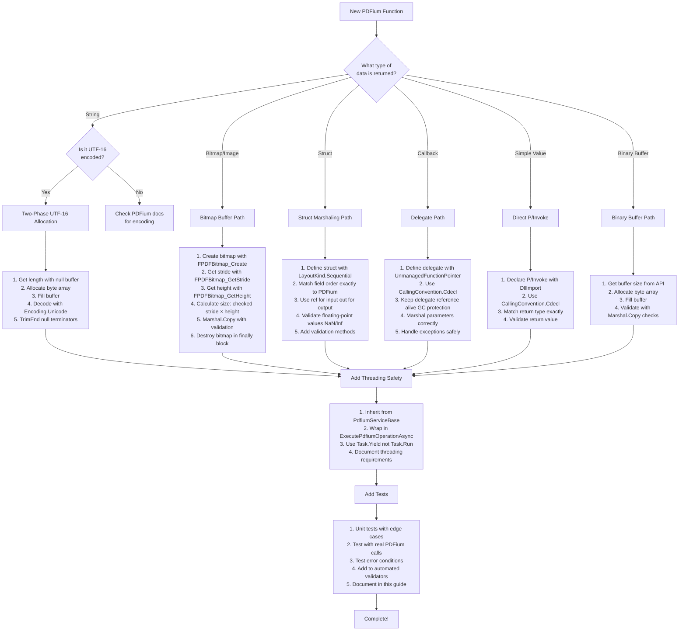

# Marshaling Decision Tree

This document provides a flowchart and decision guide for choosing the correct marshaling approach when adding new PDFium P/Invoke functionality.

## Table of Contents

- [Quick Decision Flowchart](#quick-decision-flowchart)
- [Detailed Decision Guide](#detailed-decision-guide)
- [Common Scenarios](#common-scenarios)
- [Implementation Templates](#implementation-templates)

---

## Quick Decision Flowchart



---

## Detailed Decision Guide

### Question 1: What type of data does the PDFium function return?

| Return Type | Go To |
|-------------|-------|
| String (text, bookmarks, metadata) | [UTF-16 String Path](#utf-16-string-path) |
| Bitmap/Image data | [Bitmap Buffer Path](#bitmap-buffer-path) |
| Struct (rectangles, points, matrices) | [Struct Marshaling Path](#struct-marshaling-path) |
| Callback/Function pointer | [Delegate Path](#delegate-path) |
| Simple value (int, float, bool, IntPtr) | [Simple P/Invoke Path](#simple-pinvoke-path) |
| Binary buffer (raw bytes) | [Binary Buffer Path](#binary-buffer-path) |

---

### UTF-16 String Path

**When:** PDFium function returns text (bookmarks, form fields, metadata, text content)

**Pattern:** Two-phase allocation with UTF-16LE decoding

#### Decision Points

1. **Does PDFium provide a "get size" function?**
   - ✅ Yes → Use two-phase pattern
   - ❌ No → Check if fixed-size or use alternative method

2. **Is the string null-terminated?**
   - ✅ Yes (typical) → Include null terminator in allocation, trim after decode
   - ❌ No → Use exact length

3. **What encoding does PDFium use?**
   - UTF-16LE → Use `Encoding.Unicode` ✅
   - UTF-8 → Use `Encoding.UTF8`
   - Other → Check PDFium documentation

#### Implementation Checklist

- [ ] Define P/Invoke with `byte[]?` parameter for buffer
- [ ] Call with `null` buffer to get size
- [ ] Allocate `byte[size]` with exact size
- [ ] Call again to fill buffer
- [ ] Decode with `Encoding.Unicode` (for UTF-16LE)
- [ ] Call `.TrimEnd('\0')` to remove null terminators
- [ ] Test with emojis, CJK, diacritics, embedded nulls

**See:** [utf16-encoding.md](./utf16-encoding.md), [safe-patterns.md](./safe-patterns.md#utf-16le-string-marshaling)

---

### Bitmap Buffer Path

**When:** PDFium function renders or manipulates images

**Pattern:** Create bitmap → Get stride → Calculate size with checked arithmetic → Marshal.Copy → Destroy

#### Decision Points

1. **Do you create the bitmap or does PDFium return one?**
   - You create → Use `FPDFBitmap_Create`, remember to destroy
   - PDFium returns → Check if you need to destroy it

2. **What pixel format is used?**
   - BGRA32 (typical) → 4 bytes per pixel
   - Other → Check PDFium docs

3. **Do you need to convert pixel format?**
   - ✅ Yes → Apply conversion after `Marshal.Copy`
   - ❌ No → Use buffer directly

#### Implementation Checklist

- [ ] Create bitmap with `FPDFBitmap_Create` (or get from PDFium)
- [ ] Get stride with `FPDFBitmap_GetStride()` (never calculate manually)
- [ ] Get height with `FPDFBitmap_GetHeight()`
- [ ] Calculate size: `checked(stride * height)`
- [ ] Get buffer pointer with `FPDFBitmap_GetBuffer()`
- [ ] Validate pointer is not `IntPtr.Zero`
- [ ] Allocate managed buffer
- [ ] `Marshal.Copy` with full validation
- [ ] Destroy bitmap in `finally` block with `FPDFBitmap_Destroy`
- [ ] Test with 1×1, 8192×8192, non-power-of-2 dimensions

**See:** [buffer-safety.md](./buffer-safety.md#stride-calculation-for-bitmaps), [safe-patterns.md](./safe-patterns.md#bitmap-buffer-marshaling)

---

### Struct Marshaling Path

**When:** PDFium function uses structs (FS_RECTF, FS_QUADPOINTSF, FS_MATRIX, etc.)

**Pattern:** Sequential layout with validation

#### Decision Points

1. **Is this an input or output struct?**
   - Input → Use `ref` parameter
   - Output → Use `out` parameter
   - Both → Use `ref` parameter

2. **Does the struct contain floating-point values?**
   - ✅ Yes → Add NaN/Infinity validation
   - ❌ No → Basic validation only

3. **Are there logical constraints (e.g., left ≤ right)?**
   - ✅ Yes → Add validation method
   - ❌ No → Basic validation only

#### Implementation Checklist

- [ ] Define struct with `[StructLayout(LayoutKind.Sequential)]`
- [ ] Match field order exactly to PDFium struct
- [ ] Use exact matching types (`float` for `float`, `int` for `int`)
- [ ] Add constructor for convenience
- [ ] Add `IsValid()` method for validation
- [ ] Add `Normalize()` method if applicable (e.g., invert coordinates)
- [ ] Use `ref` for input, `out` for output in P/Invoke
- [ ] Validate before passing to PDFium
- [ ] Test with edge cases (NaN, Infinity, inverted, negative)

**See:** [safe-patterns.md](./safe-patterns.md#struct-marshaling), [pitfalls.md](./pitfalls.md#struct-marshaling)

---

### Delegate Path

**When:** PDFium function takes a callback (progress, custom rendering, file access)

**Pattern:** UnmanagedFunctionPointer with GC protection

#### Decision Points

1. **What calling convention?**
   - Cdecl (typical for PDFium) → `CallingConvention.Cdecl`
   - Stdcall → `CallingConvention.StdCall`

2. **Does callback receive managed objects?**
   - ✅ Yes → Keep references alive (GC protection)
   - ❌ No → Still keep delegate reference

3. **Can callback throw exceptions?**
   - ✅ Yes → Wrap in try/catch, return error code
   - ❌ No → Still wrap for safety

#### Implementation Checklist

- [ ] Define delegate with `[UnmanagedFunctionPointer(CallingConvention.Cdecl)]`
- [ ] Match parameter types exactly
- [ ] Wrap callback body in try/catch
- [ ] Return error code on exception (not throw)
- [ ] Keep delegate instance as field (prevent GC collection)
- [ ] Keep any managed objects referenced by callback alive
- [ ] Test callback invocation
- [ ] Test exception handling

**See:** [safe-patterns.md](./safe-patterns.md) (delegate section if added)

---

### Simple P/Invoke Path

**When:** PDFium function returns simple value (int, float, bool, handle)

**Pattern:** Direct P/Invoke declaration

#### Decision Points

1. **What is the return type?**
   - Handle (IntPtr) → Consider using `SafeHandle`
   - Numeric → Use matching .NET type
   - Boolean → Use `bool` with `MarshalAs` if needed

2. **Are there output parameters?**
   - ✅ Yes → Use `out` keyword
   - ❌ No → Direct parameters

#### Implementation Checklist

- [ ] Define P/Invoke with `[DllImport]`
- [ ] Use `CallingConvention = CallingConvention.Cdecl`
- [ ] Match return type exactly
- [ ] Match parameter types exactly
- [ ] Use `out` for output parameters
- [ ] Validate return value (check for error codes)
- [ ] Use `SafeHandle` for handles if applicable
- [ ] Test with valid and invalid inputs

**See:** [safe-patterns.md](./safe-patterns.md#handle-management)

---

### Binary Buffer Path

**When:** PDFium function returns raw binary data (not text, not image)

**Pattern:** Two-phase allocation for binary data

#### Decision Points

1. **Does PDFium provide size upfront?**
   - ✅ Yes → Allocate and fill
   - ❌ No → Use two-phase (get size, allocate, fill)

2. **Is the data fixed-size or variable-size?**
   - Fixed → Allocate fixed size
   - Variable → Get size from API

#### Implementation Checklist

- [ ] Get buffer size from PDFium API
- [ ] Validate size is positive and reasonable
- [ ] Allocate `byte[]` with exact size
- [ ] Get buffer pointer from PDFium
- [ ] Validate pointer is not `IntPtr.Zero`
- [ ] `Marshal.Copy` with full validation
- [ ] Test with various buffer sizes

**See:** [buffer-safety.md](./buffer-safety.md#marshalcopy-best-practices)

---

## Common Scenarios

### Scenario 1: Extract bookmark titles

**Data Type:** UTF-16 string
**Path:** [UTF-16 String Path](#utf-16-string-path)

```csharp
public static string GetBookmarkTitle(IntPtr bookmark)
{
    // Phase 1: Get length
    var length = FPDFBookmark_GetTitle(bookmark, null, 0);
    if (length == 0) return "(Untitled)";

    // Phase 2: Allocate and fill
    var buffer = new byte[length];
    FPDFBookmark_GetTitle(bookmark, buffer, length);

    // Decode UTF-16LE and trim
    return Encoding.Unicode.GetString(buffer).TrimEnd('\0');
}
```

---

### Scenario 2: Render page to bitmap

**Data Type:** Bitmap buffer
**Path:** [Bitmap Buffer Path](#bitmap-buffer-path)

```csharp
public static byte[] RenderPageBitmap(SafePdfPageHandle page, int width, int height)
{
    var bitmap = PdfiumInterop.CreateBitmap(width, height, hasAlpha: true);
    try
    {
        PdfiumInterop.RenderPageBitmap(bitmap, page, 0, 0, width, height, 0, 0);

        var stride = FPDFBitmap_GetStride(bitmap);
        var bufferSize = checked(stride * height);
        var buffer = new byte[bufferSize];

        Marshal.Copy(FPDFBitmap_GetBuffer(bitmap), buffer, 0, bufferSize);
        return buffer;
    }
    finally
    {
        FPDFBitmap_Destroy(bitmap);
    }
}
```

---

### Scenario 3: Get annotation rectangle

**Data Type:** Struct
**Path:** [Struct Marshaling Path](#struct-marshaling-path)

```csharp
[StructLayout(LayoutKind.Sequential)]
public struct FS_RECTF
{
    public float Left, Top, Right, Bottom;

    public bool IsValid() =>
        !float.IsNaN(Left) && !float.IsNaN(Top) &&
        !float.IsNaN(Right) && !float.IsNaN(Bottom) &&
        Left <= Right && Top <= Bottom;
}

public static FS_RECTF GetAnnotationRect(IntPtr annotation)
{
    FPDFAnnot_GetRect(annotation, out FS_RECTF rect);

    if (!rect.IsValid())
    {
        throw new InvalidDataException("Invalid annotation rectangle");
    }

    return rect;
}
```

---

### Scenario 4: Get page count

**Data Type:** Simple value (int)
**Path:** [Simple P/Invoke Path](#simple-pinvoke-path)

```csharp
[DllImport(DllName, CallingConvention = CallingConvention.Cdecl)]
private static extern int FPDF_GetPageCount(SafePdfDocumentHandle document);

public static int GetPageCount(SafePdfDocumentHandle document)
{
    ArgumentNullException.ThrowIfNull(document);

    if (document.IsInvalid)
    {
        throw new ArgumentException("Invalid document handle", nameof(document));
    }

    var count = FPDF_GetPageCount(document);
    if (count < 0)
    {
        throw new InvalidOperationException("Failed to get page count");
    }

    return count;
}
```

---

## Implementation Templates

### Template 1: UTF-16 String Function

```csharp
/// <summary>
/// Gets [description] from PDFium.
/// </summary>
public static string Get[Name]([parameters])
{
    // Validate inputs
    ArgumentNullException.ThrowIfNull([parameters]);

    // Phase 1: Get required buffer size (includes null terminator)
    var length = FPDF[FunctionName]([args], null, 0);
    if (length == 0)
    {
        return "";  // or default value
    }

    // Phase 2: Allocate buffer and fill
    var buffer = new byte[length];
    FPDF[FunctionName]([args], buffer, length);

    // Decode UTF-16LE and trim null terminators
    return System.Text.Encoding.Unicode.GetString(buffer).TrimEnd('\0');
}

[DllImport(DllName, CallingConvention = CallingConvention.Cdecl)]
private static extern uint FPDF[FunctionName](
    [parameters],
    [Out] byte[]? buffer,
    uint buflen);
```

### Template 2: Bitmap Buffer Function

```csharp
/// <summary>
/// Renders [description] to bitmap buffer.
/// </summary>
public static byte[] Render[Name]([parameters])
{
    // Validate inputs
    ArgumentNullException.ThrowIfNull([parameters]);

    // Create bitmap
    var bitmap = FPDFBitmap_Create(width, height, hasAlpha: true);
    if (bitmap == IntPtr.Zero)
    {
        throw new InvalidOperationException("Failed to create bitmap");
    }

    try
    {
        // Render
        FPDF[RenderFunction]([args]);

        // Get buffer parameters
        var stride = FPDFBitmap_GetStride(bitmap);
        var height = FPDFBitmap_GetHeight(bitmap);
        var buffer = FPDFBitmap_GetBuffer(bitmap);

        if (buffer == IntPtr.Zero)
        {
            throw new InvalidOperationException("Failed to get bitmap buffer");
        }

        // Calculate size with overflow check
        int bufferSize = checked(stride * height);

        // Copy to managed buffer
        var managedBuffer = new byte[bufferSize];
        Marshal.Copy(buffer, managedBuffer, 0, bufferSize);

        return managedBuffer;
    }
    finally
    {
        FPDFBitmap_Destroy(bitmap);
    }
}
```

### Template 3: Struct Marshaling Function

```csharp
/// <summary>
/// [Description] struct for PDFium.
/// </summary>
[StructLayout(LayoutKind.Sequential)]
public struct [StructName]
{
    public [type] [Field1];
    public [type] [Field2];
    // ... more fields in PDFium order

    public [StructName]([constructor parameters])
    {
        [Field1] = [value];
        [Field2] = [value];
        // ... initialize all fields
    }

    /// <summary>
    /// Validates struct values.
    /// </summary>
    public bool IsValid()
    {
        // Add validation logic
        return [validation expression];
    }
}

/// <summary>
/// Gets [description] from PDFium.
/// </summary>
public static [StructName] Get[Name]([parameters])
{
    FPDF[FunctionName]([args], out [StructName] result);

    if (!result.IsValid())
    {
        throw new InvalidDataException($"Invalid {nameof([StructName])}");
    }

    return result;
}

[DllImport(DllName, CallingConvention = CallingConvention.Cdecl)]
private static extern bool FPDF[FunctionName](
    [parameters],
    out [StructName] [outputName]);
```

### Template 4: Async Service Method

```csharp
/// <summary>
/// [Description] asynchronously.
/// </summary>
public async Task<Result<[ReturnType]>> [MethodName]Async([parameters])
{
    return await ExecutePdfiumOperationAsync(() =>
    {
        // Validate inputs
        ArgumentNullException.ThrowIfNull([parameters]);

        // PDFium operations here
        var result = PdfiumInterop.[Operation]([args]);

        // Validate result
        if ([error condition])
        {
            return Result.Fail<[ReturnType]>("Error message");
        }

        return Result.Ok(result);
    });
}
```

---

## Summary Checklist

When implementing new PDFium marshaling:

1. **Identify data type** → Choose path from [Quick Decision Flowchart](#quick-decision-flowchart)
2. **Implement pattern** → Use template from [Implementation Templates](#implementation-templates)
3. **Add threading safety** → Inherit from `PdfiumServiceBase`, use `Task.Yield()`
4. **Validate all inputs** → Null checks, range checks, type checks
5. **Handle errors gracefully** → Return `Result<T>` or throw meaningful exceptions
6. **Add unit tests** → Edge cases, error conditions, real PDFium calls
7. **Add to validators** → Extend automated validation suite
8. **Document** → XML comments, add to this guide if new pattern

---

## Additional Resources

- [safe-patterns.md](./safe-patterns.md) - Proven implementation patterns
- [pitfalls.md](./pitfalls.md) - Common mistakes to avoid
- [utf16-encoding.md](./utf16-encoding.md) - UTF-16LE encoding rules
- [buffer-safety.md](./buffer-safety.md) - Buffer overflow prevention
- [threading-model.md](./threading-model.md) - Threading constraints
- [README.md](./README.md) - Overview and quick start

---

**Remember:** When in doubt, check existing code in `src/FluentPDF.Rendering/Interop/PdfiumInterop.cs` for similar patterns.
